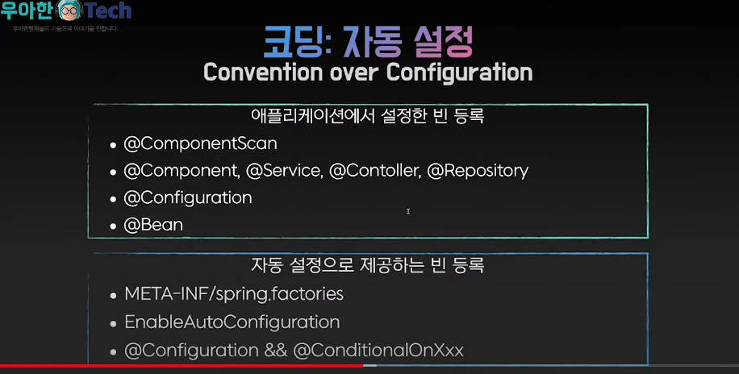
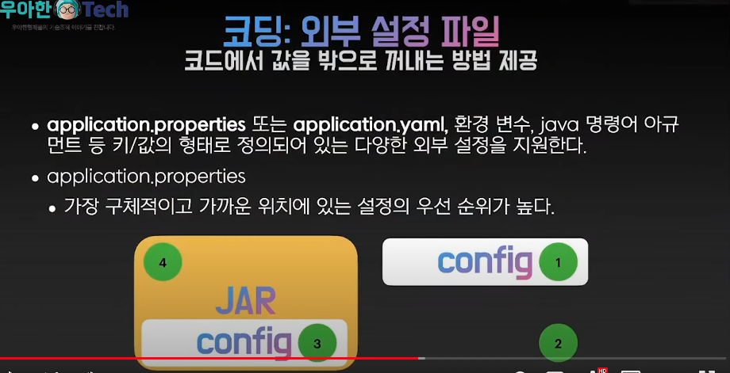

# Spring Boot

- 의문
- 개요

## 의문

- `@Repository`, `@Service`, `@Controller`는 Web에서 주로 사용되는데, `@Component`는 어떤 경우에 사용되는가?
  - `@Component`는 위의 경우 이외의 경우에 사용되나, Meta Annotation으로 구현해서 사용하는게 바람직
- `@Controller`, `@RestController`
  - `@RestController` = `@Controller` + `@ResponseBody`

## 개요

- 개요
  - 스프링을 손쉽게 쓰기 위해 제공해주는 툴
  - c.f) 스프링
    - 자바 엔터프라이즈 애플리케이션 개발을 편리하게 하기위해 개발된 툴
- 스프링 부트가 다루는 영역
  - 애플리케이션 개발 관련 거의 모든 영역
    - 빌드
      - 프로젝트 생성
      - 의존성 관리
        - dependency management
          - `io.spring.dependency-management` 플러그인이 스프링 부트 버전에 맞게 다른 라이브러리의 버전을 기입하지 않아도 적절한 버전으로 싱크해줌
        - starters
          - 필요한 의존성을 공식적으로 쉽고 한번에 프로젝트에 포함시킬 수 있도록 도와줌
          - e.g)
            - `spring-boot-starter-data-jpa`
            - `spring-boot-starter-jdbc`
      - 애플리케이션 패키징 및 실행
    - 코딩
      - 개발 툴 제공
      - 자동 설정(Auto-Configuration)
      - Bean과 DI
        - constructor injection과 `@ComponentScan`을 통한 bean탐색 추천
        - application 클래스를 top package에 위치한 경우
          - `@ComponentScan`을 argument없이 설정 가능 혹은, `@SpringBootApplication`어노테이션을 붙이면 암묵적으로 설정됨
            - `@Component`, `@Service`, `@Repository`, `@Controller` 등이 spring bean으로 등록됨
      - `@SpringBootApplication`어노테이션 사용
        - 기능
          - `@EnableAutoConfiguration`
          - `@ComponentScan`
            - 애플리케이션이 존재하는 패키지의 `@Component`를 스캐닝함
          - `@SpringBootConfiguration`
            - 여분의 bean을 등록하거나, 추가적인 configuration class를 import 할 수 있게 함
      - 실행
        - IDE에서 dependency만 import하면 실행 가능
        - 방법
          - IDE
          - Gradle plugin
            - `gradle bootRun`
          - `java -jar ...`
            - 이렇게 실행하면, production application취급을 함
      - dev-tool
        - auto-restart가능
          - 클래스패스에 존재하는 파일들이 변경되면 자동 restart
        - cache설정을 자동으로 꺼둠
    - 배포 및 관리
      - 내장 컨테이너(톰켓, 제티, 언더토우)
      - 도커 이미지 생성
      - Actuator
      - 스프링 부트 어드민

### 스프링 부트 빌드

- 스프링 부트 버전
  - GA
    - stable버전
  - M4
    - 배포는 됐는데, 아직 stable은 아님
  - SNAPSHOT
    - 개발중
- 프로젝트 메타데이터
  - group, artifact, version의 조합으로 구분 가능
- 스프링 부트에서 알아서 특정 라이브러리의 적절한 버전을 지정 가능(`dependency-management`)

### Best Practices

- default package(package declaration이 없는 클래스)는 사용하지 않는다
- java-based configuration 사용하기(xml (x))
- configuration 클래스를 분리해서 `@Import`하기
- autoconfiguration 사용하기
  - `@Configuration`클래스에 `@EnableAutoConfiguration`어노테이션을 붙이거나, `@SpringBootApplication`을 붙이고, 사용하고자 하는 의존성이 classpath에 존재하면, bean을 자동으로 configure해줌
    - 해당 auto-configured bean을 교체 가능
    - e.g) `DataSource` bean을 재정의
- `gradlew` 사용하기
- JAR 패키징 & java -jar
  - JAR 패키징
    - `gradle bootjar`
      - build 폴더가 생김
  - 실행(예시)
    - `java -jar demo-0.0.1-SNAPSHOT.jar`

### 자동 설정

코딩 자동 설정

- 만약 애플리케이션 빈과 자동 설정으로 제공하는 빈의 id가 중복되면, 빌드가 안되도록 막혀있음
  - 풀어줄 순 있다

### 외부 설정 파일

- 개요
  - 코드에서 값을 밖으로 꺼내는 방법 제공
- 구체적이고 가까운 위치에 있는 설정의 우선 순위가 높음
  - 구체적
    - config라는 디렉터리에 들어있는 설정인지 아닌지
  - 가까운
    - JAR파일 안보다는 커맨드라인 or 파일 시스템에 있는 application properties가 가까움
      - 대신 여기에서는 current working directory랑도 싱크가 맞아야 함(실행하는 working directory에 있는 application.properties)

### 배포
