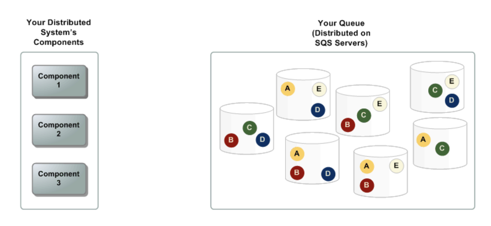
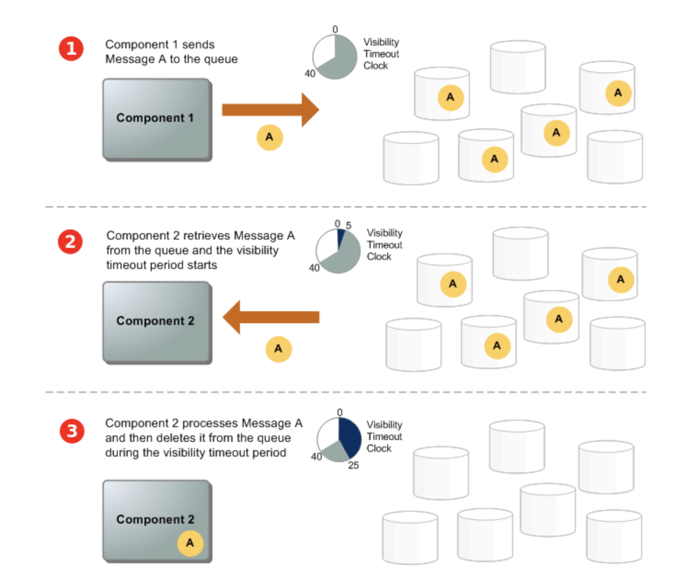
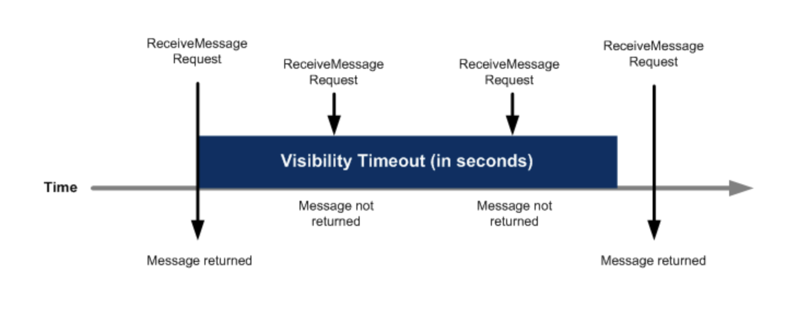
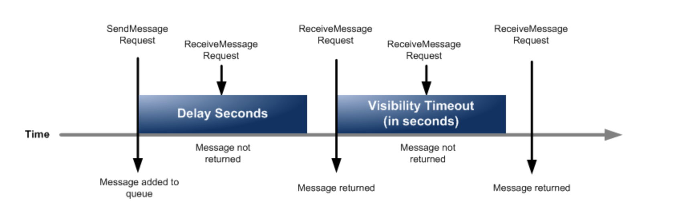

# Spring Cloud AWS

- 의문
- 개요
- SQS

## 의문

## 개요

## SQS

SQS 분산 큐 시스템 구조

- 내 분산 시스템의 컴포넌트
- SQS 분산큐
- 메시지

메시지 라이프 사이클

- proudcer가 메시지를 produce해서 분산 SQS 큐에 메시지 보냄
- consumer가 메시지를 consume함
- consumer가 작업이 끝나고 큐의 메시지를 삭제

---

- 개요
  - 큐를 사용한 point-to-point 커뮤니케이션을 제공하는 AWS 플랫폼
- 특징
  - 오직 String playload만 허락
    - Object는 Spring으로 변환되어야 함
    - Spring Cloud AWS는 java object를 JSON으로 serialize하여 SQS로 전송할 수 있는 추상화 제공
  - 트랜잭션이 없어서, 같은 메시지가 두번 retrieve될 수 있음
    - 애플리케이션은 idemponent하게 작성해서 두번 메시지를 가져와도 될 수 있게 해야 함
  - 하나의 메시지 최대 사이즈는 256kb
    - 그것보다 크면 전송 실패
- 큐의 타입
  - Standard queue
    - 개요
      - 스루풋이 중요할때 사용
    - 특징
      - 무제한 스루풋
        - 거의 무제한 API콜
      - 메시지가 적어도 한번 도달함을 보장
      - 순서를 보장하려고 노력
    - 사용 예시
      - 라이브 유저 요청을 백그라운드 작업과 디커플할때
        - 유저가 미디어를 리사이징하거나 인코딩을 하는동안 미디어를 업로드를 할 수 있도록 함
      - 태스크를 많은 워커노드로 할당할때
        - 신용카드 번호 검증 리퀘스트 작업
      - 미래에 배치 메시지 프로세싱할때
  - FIFO queue
    - 개요
      - 이벤트의 순서가 중요할때 사용
    - 특징
      - 높은 스루풋
        - 초당 300 API콜(한번콜에 10개 메시지 배치)
      - 오직 한번만 프로세싱
        - 메시지 복제가 발생하지 않음
      - FIFO
    - 사용 예시
      - 유저가 입력한 커맨드가 순서대로 동작하는게 중요할 때
      - 가격 수정을 올바른 순서대로 보냄으로써, 올바른 제품 가격을 나타낼 때
      - 계정을 등록하기 전에 과목 등록하는 것을 막을때

Visibility timeout diagram

delay queue diagram

- 기능
  - SQS visibility timeout
    - 개요
      - 컨슈머가 큐로부터 메시지를 받고, 프로세스할때, 그 메시지는 여전히 큐에 남아있음
        - 컨슈머는 작업이 끝나고 명시적으로 해당 메시지를 삭제해야 함
      - 그 남아있는 메시지가 다른 컨슈머들이 또 프로세싱 하지 않게 하기 위해서, SQS는 visibility timeout을 만들어 놓음
        - Amazon SQS가 `ReceiveMessage`리퀘스트를 받으면 바로 타이머 동작 시작
        - 해당 타이머 동작 시작 이후 visibility timeout 시간동안은 작업이 중간에 실패하더라도 retry금지
      - visibility timeout동안에는 다른 컨슈머들이 메시지를 받는것을 금하는 기간
      - default는 30초 최대 12시간 까지 설정 가능
    - 특징
      - 큐 전체 혹은 메시지 하나의 visibility timeout을 바꿀 수 있음
      - 이것으로 15분 딜레이 메시지 한계를 넘어설 수 있음
  - Delay queues
    - 개요
      - 메시지를 소비하지 않아도 처음부터 컨슈머들이 메시지를 받을 수 없음
