# 쿠버네티스

- 의문
- 현장
- 개요
  - 쿠버네티스의 등장인물 & 용어소개
  - 컴포넌트
    - Control Plane Components
    - Node Components
    - Addons
  - 쿠버네티스 API
  - 쿠버네티스 오브젝트(리소스/카인드)
- 워크로드
- 태스크
  - 애플리케이션 실행
    - HPA(HorizontalPodAutoscaler)
- 설정(configuration)
- 스토리지

## 의문

## 현장

- probe
  - 개요
    - 컨테이너에서 kubelet에 의해 주기적으로 수행되는 진단
    - 진단을 수행하기 위해서 kubelet은 컨테이너에 의해서 구현된 핸들러를 호출한다
  - 핸들러 타입
    - ExecAction
      - 컨테이너 내에서 지정된 명령어를 실행하고, 명령어 상태코드가 0으로 종료되면 성공
    - TCPSocketAction
      - 지정된 포트에서 컨테이너의 IP 주소에 대해 TCP 검사를 수행한다. 포트가 활성화되어 있다면 진단이 성공한 것으로 간주
    - HTTPGetAction
      - 지정된 포트 및 경로에서 컨테이너의 IP 주소에 대한 HTTP Get요청을 수행. 응답의 상태코드가 200보다 크고, 400보다 작으면 진단이 성공으로 간주
  - probe 결과
    - Success
      - 컨테이너 진단 통과
        - 실패시, kubelet은 컨테이너를 죽이고, 해당 컨테이너는 재시작 정책의 대상이 됨
    - Failure
      - 컨테이너 진단 실패
    - Unknown
      - 진단 자체가 실패하였으므로 아무런 액션 수행하면 안됨
  - probe 종류
    - livenessProbe
      - 컨테이너가 동작중인지 여부
    - readinessProbe
      - 컨테이너가 요청을 처리할 준비가 되었는지 여부
    - startupProbe
      - 컨테이너 내의 애플리케이션이 시작되었는지를 나타냄

## 개요

- 쿠버네티스
  - 개요
    - 컨테이너화된 서비스들을 다루는 오픈소스 플랫폼
      - 선언적 설정과 자동화
      - desired state를 계속해서 유지하도록 설정파일로 관리
  - 필요성
    - 분산 시스템을 탄력있게 실행하는 프레임워크
      - scaling, failover
      - 까나리 배포
  - 특징
    - 점진적이고 자동 rollout and rollback
      - 배포되는 컨테이너들의 원하는 상태를 기술언어로 기술 가능
    - *서비스 디스커버리와* 로드밸런싱
      - 팟들에게 각자 IP 주소를 부여하고, 팟의 집합에 하나의 DNS 이름을 부여하고 그것들의 로드밸런싱 가능
        - 하나의 DNS 이름으로 inbound 트래픽이 들어오고, 그 트래픽을 로드밸런싱
    - 스토리지 오케스트레이션
      - 다양한 스토리지 마운트해서 사용 가능
    - 시크릿 / 설정 관리
      - 이미지를 다시 빌드하지 않고도 애플리케이션의 설정과 시크릿을 업데이트하고 배포할 수 있음
    - 자동 *bin packing*
      - 컨테이너를 리소스 요청과 노드와 같은 다른 제한에 기반해서 효율적이며 자동적으로 배치
    - 배치 실행(CI도 가능)
    - IPv4/IPv6 둘다 사용가능
    - 수평적 확장
      - 커맨드나 UI 혹은, CPU 사용량에 따른 자동적인 스케일 아웃 가능
    - 자가 치유
      - 컨테이너가 죽으면 재시작시키고, 노드가 죽으면 컨테이너들을 재배치 시키고, 유저가 정의한 헬스체크에 반응하지 않는 컨테이너를 죽이고, 서빙이 준비되기 전까지는 노출시키지 않음
    - 확장성
      - 소스코드를 변경시키지 않고도, 쿠버네티스 클러스터에 기능 추가 가능

### 쿠버네티스의 등장인물 & 용어소개

- 등장인물
  - 컨트롤러
- 그 외 용어
  - 팟
    - Scheduling & Preemption & Eviction
    - Pod Disruption
  - namespace

#### 등장인물

- 컨트롤러
  - 정의
    - **클러스터의 상태를 보고 있다가, 특정 오브젝트를 필요할 때 desired state로 상태 변화를 일으키는 프로그램**
      - *상태변화는 어떤식으로 일으키는 걸까? control plane의 API로 일으키는걸까? 아니면 kubelet같은걸로 직접?*
  - 특징
    - 적어도 하나의 쿠버네티스 리소스 타입(오브젝트)을 트래킹
      - 이러한 오브젝트는 spec필드가 존재하여, desired state를 나타냄
      - 해당 리소스의 컨트롤러는 쿠버네티스에서 desired state로 맞춰주기 위한 역할 담당
    - API server로 유용한 side effect를 발생시킬 수도 있음
    - 컨트롤러는 간단할 수록 좋음
    - 컨트롤러는 언제나 실패할 수 있으므로 그것을 감내하도록 설계해야 함
  - 종류
    - 빌트인 컨트롤러
      - `kube-controller-manager`에서 실행됨
      - 종류
        - Deployment, Job
    - 커스텀 컨트롤러
      - 쿠버네티스 확장을 위해서 컨트롤 플레인 바깥에서 동작하는 컨트롤러
      - 팟 내부에서 동작할 수도 있고, 아예 쿠버네티스 외부에서 동작할수도 있음
  - 컨트롤러 패턴
    - API server를 이용한 제어
      - 예시: Job 컨트롤러
        - 팟을 생성해서 Job을 실행하고 팟을 제거함
        - Job은 쿠버네티스 오브젝트
          - 팟을 실행하거나 여러 팟을 실행해서 하나의 태스크를 실행하고 멈춤
      - Job 컨트롤러는 직접 팟이나 컨테이너를 실행하지 않고, API 서버로 팟을 생성하거나 제거하도록 함
      - Job의 상태 마킹도 함
    - 직접 제어
      - 예시: 충분한 노드를 유지하기위한 컨트롤러
        - desired state를 유지하기 위해서 외부 시스템과 상호작용 후 API 서버로 상태 보고
          - 쿠버네티스 control plane에서 간접적으로 여러 작업을 할 수 있도록 함(IP주소 관리, 스토리지 서비스, 클라우드 관련)

#### 그 외 용어

- 팟
  - Scheduling & Preemption & Eviction
    - Scheduling
      - 팟을 노드에 매칭시켜서, kubelet이 팟을 실행할 수 있도록 하는 것
    - Preemption
      - 높은 우선순위를 갖는 팟을 노드에 스케쥴할 수 있도록 낮은 우선순위를 갖는 팟을 제거하는 것
    - Eviction
      - 팟을 노드에서 제거하는 것
  - Pod Disruption
    - 자발적으로 혹은 비자발적으로 팟이 노드에서 제거되는 것
- namespace
  - 하나의 클러스터에서 오브젝트의 그룹을 격리하는 매커니즘
  - 오브젝트의 name은 namespace속에서 유일해야 함
  - 오직 namespaced object(Deployment, Services 등)에서만 사용가능
    - 클러스터 단위의 오브젝트인 StorageClass, Nodes, PersistentVolumes에서는 사용 불가

### 컴포넌트

쿠버네티스의 컴포넌트


- cluster
  - node의 집합
- node
  - 컨테이너화된 애플리케이션을 실제로 실행하는 워커 머신
  - pod들을 호스팅함
- pod
  - 애플리케이션 컴포넌트들
    - 컨테이너들을 포함
- control plane
  - 클러스터 내부의 워커 노드와 팟들을 관리함

#### Control Plane Components

- 개요
  - 클러스터에 대한 global decision을 내리는 곳(e.g 스케쥴링, 팟의 개수 싱크)
  - 일반적으로 단일 머신에 컴포넌트들을 배치
- 종류
  - `kube-apiserver`
    - Kubernetes API를 노출하는 컴포넌트
      - control plane의 인터페이스
  - `etcd`
    - 쿠버네티스가 사용하는 모든 클러스터 데이터를 저장하는데에 사용되는 key-value 스토어
  - `kube-scheduler`
    - 노드에 아직 할당되지 않은 새로 만들어진 팟들을 보고, 그것이 실행될 노드를 선택함(스케쥴링)
      - *팟이 만들어진다 != 팟이 실행된다?*
      - 다양한 요소를 고려함
        - 개인, 집단 자원 requirements, hardware/software/policy 제한
  - `kube-controller-manager`
    - 개요
      - 컨트롤러 프로세스를 실행하는 컴포넌트
        - c.f) 컨트롤러란, 지속적으로 시스템의 상태를 유지하는 것(e.g 온도조절장치)
          - 클러스터의 상태를 보고 있다가, 필요할 때 desired state로 상태 변화를 일으킴
      - 컨트롤러는 논리적으로는 분리된 프로세스이나, 복잡도를 줄이기 위해서 실제로는 하나의 바이너리에서 싱글 프로세스로 동작함
    - 종류
      - node controller
        - 노드가 죽었을경우, 알아채고 반응하는 역할
      - deployment controller
      - job controller
        - 태스크를 수행하는 잡 오브젝트를 보고, 팟을 만들어 태스크가 끝나기까지 실행
      - endpoints controller
        - *엔드포인트 오브젝트들을 살게 함?*
      - service account & token controllers
        - *default 계정과, 새 namespace를 위한 API 접근 토큰을 생성*
      - HPA(Horizontal Pod Autoscaler) controller
  - `cloud-controller-manager`
    - 클라우드에 특화된 제어 로직을 포함
      - 클라우드 제공자의 API로 클러스터를 링크함
      - 오직 클러스터와 상호작용하는 컴포넌트와 클라우드 플랫폼과 상호작용하는 컴포넌트 분리
    - 종류
      - node controller
        - 응답이 멈춘 뒤에 클라우드에서 노드가 삭제되었는지 판단하는것을 체크하기 위함
      - route controller
        - 클라우드 인프라 내부에서 라우트를 설정하기 위함
      - service controller
        - 클라우드의 로드 밸런서를 생성하고, 갱신하고, 삭제하기위함

#### Node Components

- 개요
  - 노드 각각에서 실행되며, 실행중인 팟들을 관리하고 쿠버네티스 런타임 환경을 제공함
- 종류
  - `kubelet`
    - 클러스터에 있는 각각의 노드위에서 동작
      - 하나의 팟에서 컨테이너들이 실행되도록 함
      - PodSpec의 집합을 받아서 컨테이너들이 PodSpec에 기술된대로 건강하게 실행되는것을 보장
  - `kube-proxy`
    - 클러스터에 있는 각각의 노드위에서 동작하는 네트워크 프록시
    - 노드들사이의 네트워크룰을 유지함
      - 팟들사이의 커뮤니케이션을 가능하게 함
  - `container runtime`
    - 컨테이너를 실행하는 역할을 담당
    - Kubernetes가 서포트하는 종류
      - `containerd`
      - `CRI-O`
      - 그 외의 Kubernetes CRI (Container Runtime Interface)를 만족하는 구현체들

#### Addons

- 개요
  - 클러스터 기능들을 구현하기 위해서 쿠버네티스 자원을 사용
  - 네임스페이스된 애드온의 리소스들은 `kube-system` 네임스페이스속에 포함됨
- 종류
  - DNS(필수)
    - 모든 쿠버네티스 클러스터는 클러스터 DNS를 갖음
    - 쿠버네티스에 의해서 시작된 컨테이너들은 DNS 서칭시(외부와의 통신할때)에, 쿠버네티스 DNS역시 포함함
  - Web UI (대시보드)
    - 쿠버네티스 클러스터를 위한 웹 기반 UI
    - 유저가 애플리케이션을 트러블 슈팅하거나, 클러스터 그 자체를 트러블 슈팅할 수 있게 도와줌
  - Container Resource Monitoring
    - 중앙 DB에 시계얼 컨테이너 메트릭을 저장하고, 데이터 브라우징을 가능하게 함
  - Cluster-level Logging
    - 컨테이너 로그들을 중앙 로그 저장소에 저장하고, search/browsing interface를 확충

### 쿠버네티스 API

- 개요
  - kubernetes의 control plane의 핵심은 HTTP API 서버
    - 엔드유저가, 클러스터의 서로 다른 파트가, 외부 컴포넌트가 서로 커뮤니케이션하도록 함
    - API 오브젝트(Pods, Namespaces, ConfigMaps, Events)들의 상태를 조작하고, 쿼리할 수 있도록 함
  - 대개 `kubectl`이라는 커맨드라인 인터페이스나 `kubeadm`이라는 다른 커맨드라인 툴(둘다 API를 사용)을 사용해서 조작하나, 직접 REST call을 해서 API에 직접 접근도 가능

### 쿠버네티스 오브젝트(리소스/카인드)

yaml파일로 만들어진 object spec(desired state를 기술)의 예시

```yaml
apiVersion: apps/v1 # required: K8s의 API버전
kind: Deployment    # required: 생성하고자 하는 오브젝트의 종류
metadata:           # required: 오브젝트의 유니크 식별자
  name: nginx-deployment
spec:               # required: 원하는 state(e.g 각 팟에 대해서 desired 상태를 기술)
  selector:
    matchLabels:
      app: nginx
  replicas: 2 # tells deployment to run 2 pods matching the template
  template:     # StatefulSet 컨트롤러가 생성하는 팟들을 나타냄
    metadata:
      labels:
        app: nginx
    spec:
      containers:
      - name: nginx
        image: nginx:1.14.2
        ports:
        - containerPort: 80
```

- 개요
  - **팟으로 이루어진 쿠버네티스 시스템의 영속적인 엔티티**
    - 쿠버네티스는 클러스터의 상태를 엔티티로 나타냄
  - 오브젝트 = 리소스 = 카인드
  - *오브젝트의 관리는 컨트롤러로 된다?*
- 오브젝트가 기술되는 방식
  - 어떤 컨테이너화된 애플리케이션이 어떤 노드에서 실행되고 있는지
  - 그러한 애플리케이션이 사용가능한 자원(resource)
  - 애플리케이션이 동작하는 방법에 대한 정책
    - 재시작 정책, 업그레이드, fault-tolerance
- 관리 방법
  - 1 Imperative commands
    - 클러스터에서 실행중인 오브젝트를를 직접 다룸(`kubectl`)
    - 예시
      - `kubectl create deployment nginx --image nginx`
  - 2 Imperative object configuration
    - 파일로 오브젝트의 상태를 설정하는데, 명시적으로 커맨드 작성(CUD)
    - 예시
      - `kubectl create -f nginx.yaml`
      - `kubectl delete -f nginx.yaml -f redis.yaml`
      - `kubectl replace -f nginx`
  - 3 Declarative object configuration
    - 파일로 오브젝트의 상태를 설정하는데, 파일 자체에서 어떤 동작(create/update/delete)을 할것인지 선언적으로 알 수 있음
    - 예시
      - `kubectl apply -f configs/`
- 특징
  - 오브젝트를 만들면, 쿠버네티스 시스템은 지속적으로 해당 오브젝트가 존재하도록 동작함(그것을 관리하는게 컨트롤러)
    - 클러스터의 desired state를 만듬
  - 쿠버네티스 오브젝트를 만들고, 수정하고, 삭제하기 위해서는, 쿠버네티스 API를 사용해야 함
    - `kubectl`등과 같은 툴로도 제어 가능
- Object spec & status
  - 개요
    - 거의 모든 쿠버네티스 오브젝트는 오브젝트의 설정을 제어하는 두개의 네스팅된 오브젝트 필드를 포함함
      - `(object)spec`
      - `(object)status`
      - 선언적으로 desired state를 기술해서 오브젝트를 생성함
    - 쿠버네티스 시스템은 spec을 이용해서 오브젝트를 생성하고, 지속적으로 현재 state를 spec으로 맞춤
    - spec은 일반적으로 yaml파일로 기술
    - 해당 파일을 JSON으로 바꾸고, API 리퀘스트를 보낼 수 있음
      - `kubectl apply -f ~.yaml` 이런식으로도 가능
  - status
    - *오브젝트의 현재 상태?*
      - control plane이 지속적으로 모든 오브젝트의 실제 상태를 desired 상태로 싱크를 맞춰줌
        - *control plane*이 맞는가?
    - 예시
      - 쿠버네티스에서는 하나의 deployment도 클러스터에서 동작하는 애플리케이션을 타나내는 오브젝트임
      - deployment를 만들때, deployment `spec`을 만들어서, 실행할 애플리케이션의 replica를 만듬
      - 쿠버네티스 시스템은 deployment 스펙을 읽고 인스턴스의 개수를 원하는 상태로 맞춤
  - spec
    - 오브젝트의 desired 상태
    - 쿠버네티스 시스템이 계속해서 이 스펙으로 상태를 맞춰줌
- 종류
  - Pods
  - 워크로드 오브젝트(리소스)
    - Deployments
    - ReplicaSet
    - StatefulSets
    - DaemonSet
    - Jobs
    - CronJob

#### Pods

#### Deployments

```yaml
apiVersion: apps/v1
kind: Deployment
metadata:
  name: nginx-deployment
  labels:
    app: nginx
spec:
  replicas: 3 # pod개수
  selector:   # 어떤 팟을 매니징할것인지 찾는 방법 정의
    matchLabels: # 레이블 이름으로 찾음
      app: nginx
  template:
    metadata:
      labels:
        app: nginx # app: nginx로 레이블됨
    spec:
      containers:  # 팟이 하나의 컨테이너 nginx만 실행하도록(desired state)
      - name: nginx
        image: nginx:1.14.2
        ports:
        - containerPort: 80
```

- 개요
  - **상태가 없는 Pods와 ReplicaSets의 선언적 업데이트**를 제공
    - 그렇다면 가장 처음 초기에 아무것도 없을때에도 적용 가능
- 동작
  - Deployment에 desired state를 기술하고, **컨트롤러가** 상태를 desired state로 바꿈(속도 조절 가능)
  - 새로운 ReplicaSets를 생성하거나, 존재하는 Deployments를 지우고 새로운 Deployments에 있는 리소스로 바꿀수도 있음
- 유스케이스
  - ReplicaSet의 rollout
  - 팟의 새 상태를 선언
  - 이전 버전의 Deployment로 롤백
  - 부하를 더 감당하기 위해서 스케일업
  - rollout의 정지

#### ReplicaSet

- 개요
  - replica 팟의 안정적인 집합을 유지하기 위한 것
    - 일반적으로 동일한 팟들의 특정 개수의 가용성을 보장하는데에 사용
- spec
  - selector: 팟을 특정
  - replicas: 유지해야 하는 팟의 개수
  - template: 개수를 유지하는 팟 대상의 정보
- 이것을 직접 사용하지말고, Deployment를 사용하라

#### StatefulSets

- 개요
  - stateful한 애플리케이션을 다루는데에 사용되는 오브젝트
    - 팟의 배포와 스케일링을 관리함
    - 팟의 순서와 유일성을 보장해줌

#### DaemonSet

## 워크로드

### 팟

### 워크로드 리소스

#### 레플리카 셋(ReplicaSet)

- 개요
  - 레플리카 팟 집합을 항상 안정적으로 유지하는 것
    - 명시된 동일 팟 개수에 대한 가용성 보증
- 특징
  - 레플리카 셋 오브젝트를 직접 조작하지말고, 디플로이먼트를 사용하길 권장

## 서비스, 로드밸런싱, 네트워킹

사실상 팟은 가상 호스트!!

- 개요
  - **클러스터의 모든 팟은 고유 IP주소를 갖음**
    - 팟간의 연결을 명시적으로 만들 필요가 없음
    - 컨테이너 포트를 호스트 포트에 매핑할 필요가 거의 없음
    - 팟을 VM또는 물리 호스트 처럼 다룰 수 있는 깔끔하고 하위 호환성을 갖는 모델 제시
  - 팟 별 IP 모델
    - 팟 내의 컨테이너들은 IP주소, MAC 주소를 포함하는 네트워크 네임스페이스 공유
    - **팟 내의 컨테이너들이 각자의 포트에 `localhost`로 접근 가능**
- 네트워크 구현 요구사항(노드 레벨)
  - NAT 없이 노드 상의 모든 팟과 통신 가능
  - 노드 상의 에이전트(시스템 데몬, kubelet)는 해당 노드의 모든 팟과 통신 가능
- 문제 해결
  - 팟 내의 컨테이너는 루프백을 통한 네트워킹을 사용하여 통신
  - 클러스터 네트워킹은 서로 다른 팟 간의 통신 제공
  - 서비스 리소스를 사용하면, 팟에서 실행 중인 애플리케이션을 클러스터 외부에서 접근 가능
  - 서비스를 사용하여, 서비스를 클러스터 내부에서만 사용할 수 있도록 할 수도 있음

### 인그레스(Ingress)

인그레스



- 개요
  - 클러스터내의 서비스에 대한 외부 접근을 관리하는 API 오브젝트이며, 일반적으로 HTTP를 관리함
  - 부하 분산, SSL 종료, 이름 기반 가상 호스팅 제공
  - 라우팅은 리소스에 정의된 규칙에 의해 컨트소스가 컨트롤 됨
- 인그레스 컨트롤러
  - 인그레스 리소스가 동작하기 위한 컨트롤러
    - `kube-controller-manager` 바이너리의 일부로 실행되는 내장 컨트롤러가 아님
  - 종류
    - AWS, GCE, nginx

## 설정(configuration)

### Best practices

- 일반
  - 안정된 최신 API버전 명시
  - 클러스터 적용 전에 버전 컨트롤에 저장되어 있어야 함
    - 재 생성과 복원을 빠르게 해줌
  - YAML로 구성
  - 연관된 오브젝트들은 하나의 파일에 모아놓기
    - e.g) https://github.com/kubernetes/examples/blob/master/guestbook/all-in-one/guestbook-all-in-one.yaml
  - `kubectl`은 디렉터리에 대해 호출 가능
  - 불필요한 기본 값을 명시하지 않는다 - 간단하고 최소한의 설정은 에러를 덜 발생시킨다
- 단독 팟 vs 레플리카셋, 디플로이먼트, 잡
  - 단독 팟(레플리카셋이나 디플로이먼트에 연결되지 않은 팟)을 사용하지 않는것을 권장
    - 노드 장애 이벤트가 발생해도 다시 스케쥴링 되지 않기때문

## 스토리지

### 볼륨

configMap 볼륨

```yaml
# configMap 정의하는 쪽
apiVersion: v1
kind: ConfigMap
metadata:
  name: special-config
  namespace: default
data:
  SPECIAL_LEVEL: very
  SPECIAL_TYPE: charm
---
# 사용하는 쪽
apiVersion: v1
kind: Pod
metadata:
  name: dapi-test-pod
spec:
  containers:
    - name: test-container
      image: k8s.gcr.io/busybox
      command: [ "/bin/sh","-c","cat /etc/config/keys" ]
      volumeMounts:
      - name: config-volume
        mountPath: /etc/config
  volumes:
    - name: config-volume
      configMap:
        name: special-config
        items:
        - key: SPECIAL_LEVEL
          path: keys
  restartPolicy: Never

# 팟이 동작할때, cat /etc/config/keys 를 호출하면 very가 출력됨
```

- 개요
  - 스토리지
- 분류
  - 임시
    - 팟의 수명과 같음
  - 퍼시스턴트
    - 팟의 수명과 관계없이 남음
- 사용
  - `.spec.volumes`에서 팟에 제공할 볼륨 지정
  - `.spec.containers[*].volumeMounts`의 컨테이너에 해당 볼륨을 마운트할 위치를 선언
    - 팟의 각 컨테이너에 대해서, 어디에 마운트할지 정해야 함
  - 볼륨은 다른 볼륨 안에 마운트 될 수 없음
- 유형
  - configMap
    - 구성데이터를 팟에 주입하는 방법 제공
    - 컨피그맵에 저장된 데이터는 configMap 유형의 볼륨에서 참조되고, 컨테이너화된 애플리케이션이 소비
    - 컨비그맵을 사용하려면, 먼저 컨피그맵을 생성해야 함
    - 텍스트 데이터는 UTF-8 문자 인코딩을 사용하는 파일로 노출됨. 다른 문자 인코딩의 경우 `binaryData`를 사용
  - emptyDir
    - 팟이 노드에 할당될 때 처음 생성되며, 노드에서 팟이 실행되는 동안에만 존재

### 애플리케이션 실행

#### HPA(Horizontal Pod Autoscaler)

- 개요
  - 수요에 맞춰서 workload resource(Deployment, StatefulSet)를 자동적으로 업데이트하는 기능
    - 팟을 늘리는 방향(팟의 자원을 높이는 방향이 아님)
  - 로드가 줄어들면 다시 minimum팟 개수로 스케일 다운함
- 커맨드 예시
  - 설정
    - `kubectl autoscale deployment php-apache --cpu-percent=50 --min=1 --max=10`
  - status 보기
    - `kubectl describe hp cm-test`
- 오토스케일링 트리거 메트릭
  - default
    - CPU
    - Memory
