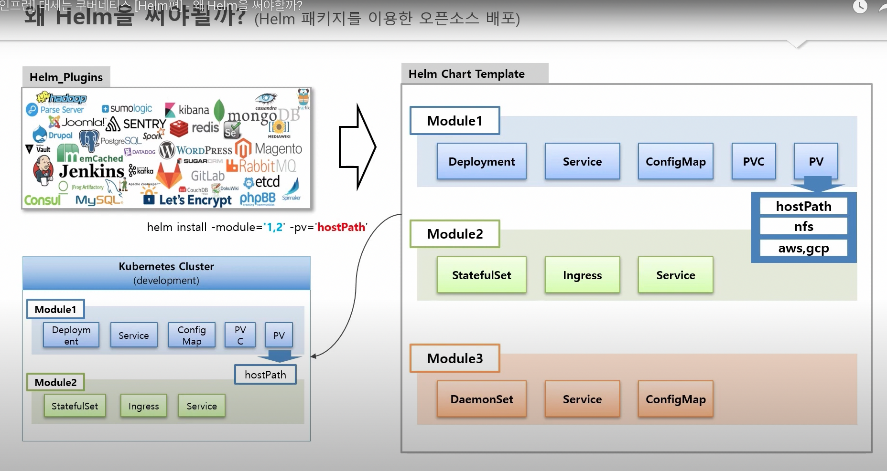

# Helm

- 의문
- 개요

## 의문

## 개요

헬름 차트를 사용해야하는 이유1: 앱별 / 환경별 yaml파일 관리가 쉬워짐


헬름 차트를 사용해야하는 이유2: 오픈소스들을 쉽게 쿠버네티스에 배포 가능



- 개요
  - 쿠버네티스 클러스터 패키지 관리 프로그램
- 장점
  - 앱별 / 환경별 yaml파일 관리가 쉬워짐
    - 단일 yaml템플릿을 만들어서, 변수 부분(앱별 / 환경별 다른 부분)만 명령어등으로 주입해주면 됨
  - 오픈소스들을 쉽게 쿠버네티스에 배포 가능
    - 제품별로 모듈을 나눠서 사용자가 필요한 모듈만 설치하게끔 함

## 템플릿 설정

### Persistent Volumes

```yaml
containers:
- image: "dscr.io/username/mysql"
  volumeMounts:
  - containerPath: /var/lib/mysql
    volume:
      name: mysql-data
      subPath: /mysql
      readOnly: false
volumes:
- name: mysql-data
  size: "5Gi"
```

- 개요
  - 컨테이너와 독립적인 가상장치이며, 컨테이너들로 마운트가 가능한 것
    - 애플리케이션은 stateless로 두는것이 바람직하나, 가끔은 컨테이너 재시작에도 살아남아야하는 디렉터리가 존재
      - e.g) `/var/lib/mysql`
- 적용 방식
  - 1] 해당 컴포넌트 속에 볼륨을 정의
  - 2] 볼륨을 컨테이너로 마운트
- 볼륨 타입
  - Persistent 볼륨
    - emptyDir 볼륨
  - ConfigMap 볼륨
  - Secret 볼륨
