# Ingress

- 의문
- 개요

## 의문

## 개요

인그레스 팬아웃



인그레스 팬아웃 예시 코드

```yaml
apiVersion: networking.k8s.io/v1
kind: Ingress
metadata:
  name: simple-fanout-example
spec:
  rules:
  - host: foo.bar.com
    http:
      paths:
      - path: /foo
        pathType: Prefix
        backend:
          service:
            name: service1
            port:
              number: 4200
      - path: /bar
        pathType: Prefix
        backend:
          service:
            name: service2
            port:
              number: 8080
```

인그레스 이름 기반 가상 호스팅



인그레스 이름 기반 가상 호스팅 코드

```yaml
apiVersion: networking.k8s.io/v1
kind: Ingress
metadata:
  name: name-virtual-host-ingress
spec:
  rules:
  - host: foo.bar.com
    http:
      paths:
      - pathType: Prefix
        path: "/"
        backend:
          service:
            name: service1
            port:
              number: 80
  - host: bar.foo.com
    http:
      paths:
      - pathType: Prefix
        path: "/"
        backend:
          service:
            name: service2
            port:
              number: 80
```

- 정의
  - 클러스터 외부에서 클러스터 내부 서비스로 HTTP, HTTPS 경로를 노출하는 오브젝트
- 특징
  - HTTP / HTTPS 이외의 임의의 포트 또는 프로토콜을 노출시키지 않음
    - 이외의 서비스를 인터넷에 노출할때에는 `Service.Type=NodePort`, `Service.Type=LoadBalancer`를 사용
  - 인그레스 컨트롤러가 반드시 존재해야 함
- rules(규칙)
  - 호스트가 지정되지 않으면, 지정된 IP 주소를 통해 모든 인바운드 HTTP 트래픽에 규칙이 적용
    - 호스트가 지정되면(e.g `foo.bar.com`), 규칙이 해당 호스트에 적용됨
  - 경로 목록(e.g `/testpath`)에는 각각 `service.name`과 `service.port.name`또는 `service.port.number`가 정의되어 있는 관련 백엔드를 가지고 있음
  - 백엔드는 서비스와 포트 이름의 조합
    - 호스트와 규칙 경로가 일치하는 인그레스에 대한 HTTP(와 HTTPS) 요청은 백엔드 목록으로 전송됨
