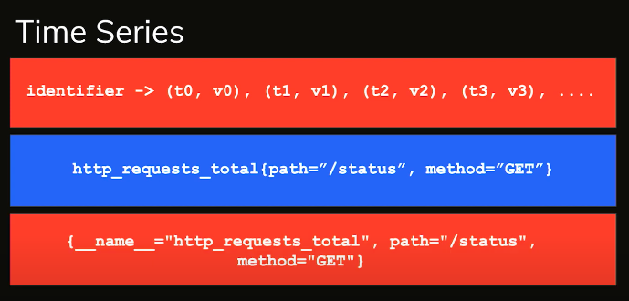
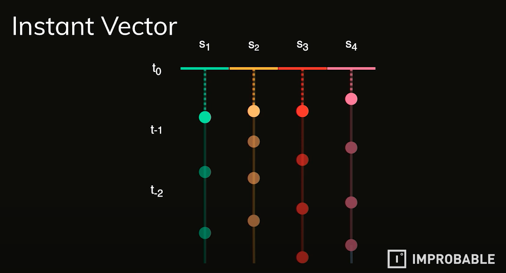
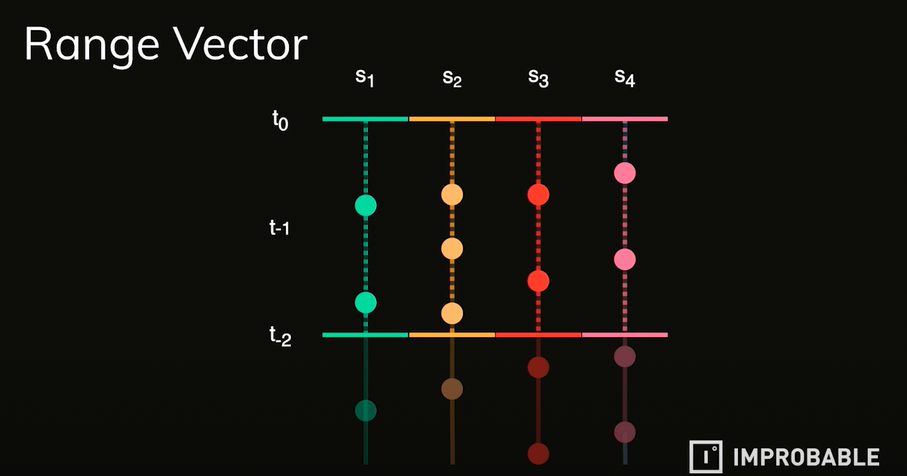

# PromQL

- 의문
- 개요
  - 타임 시리즈
- PromQL 데이터 타입
  - Instant Vectors & Range Vectors
- 카운터와 게이지
- 오퍼레이터
- 함수
- 예시

## 의문

## 개요

자료들

- PromQL 사용처
  - 쿼리
  - 얼럿
  - 대시보드

### 타임 시리즈

타임 시리즈 데이터 타입

- 개요
  - 시간과 값의 페어 스트림
    - `identifier -> (t0, v0), (t1, v1), ..., (tn, vn)`
  - 기본적으로 PromQL에 대해서 생각할때는 time series data model의 관점으로 바라봐야 함

## PromQL 데이터 타입

- 데이터 타입
  - Strings
  - Scalars(float)
  - Instant Vectors
  - Range Vectors

### Instant Vectors & Range Vectors

PromQL 인스턴트 벡터

PromQL 레인지 벡터

PromQL Instant vector / Range vector

- Instant Vector
  - 개요
    - 하나의 시점에 대한 값?
- Range Vector
  - 개요
    - 두 시점사이의 값들?

## 카운터와 게이지

- 카운터
  - 개요
    - 타임시리즈에서의 오직 증가만 하는 값
    - 값을 측정하는 대상이 down되면 다시 0부터 세도록 함
      - **그래서 카운터의 경우 항상 `rate()`를 사용해서 계산하도록 함**
- 게이지
  - 개요
    - 타임시리즈에서의 등락을 반복하는 값

## 오퍼레이터

- Aggregation Operator
  - 개요
    - Instant Vector(input) -> Instant Vector(output)
    - **항상 by를 사용해서 어떤 레이블로 aggregate할지 결정함**
  - 종류
    - `sum()`, `min()`, `max()`, `stddev()`, `stdvar()`
- Binary Operator
  - 종류
    - Arithmetic
      - `+`, `-`, `/`, `*`, `^`, `%`
    - Comparison
      - `!=`, `==`, `<`, `<=`, `>`, `>=`
    - Set
      - `and`, `or`, `unless`
  - 결과
    - `Scalar & Scalar = Scalar`
    - `Scalar & Instant Vector = Instant Vector`
    - `Instant Vector & Instant Vector = Instant Vector (하지만, 주의해야 함)`
  - 주의
    - 바이너리 오퍼레이터를 사용할땐, label을 항상 신경쓰자

## 함수

- 개요
  - Instant Vector -> Instant Vector
  - Range Vector -> Instant Vector
- 가장 많이 쓰는 함수
  - `rate`
    - 개요
      - Range Vector -> Instant Vector
      - 카운터의 per second increase를 계산
        - 카운터에서만 사용됨
    - 특징
      - counter reset을 알아서 잘 다룸(magic)
        - e.g) `[4, 6, 1, 3] -> [4, 6, 7, 9] (보정)`
      - golden rule
        - 적어도 scraping 주기의 4배의 time range를 설정해서 메트릭을 봐야함(스크레이핑이 실패할 수도 있다)
    - 예시
      - `rate(http_requests_total[10m])`

## 예시

- `sum(rate(node_cpu_seconds_total{mode="idle"}[10m])) by (cpu) / sum(rate(node_cpu_seconds_total[10m])) by (cpu)`
