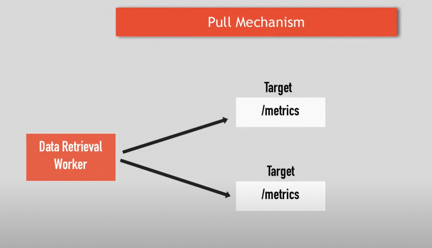
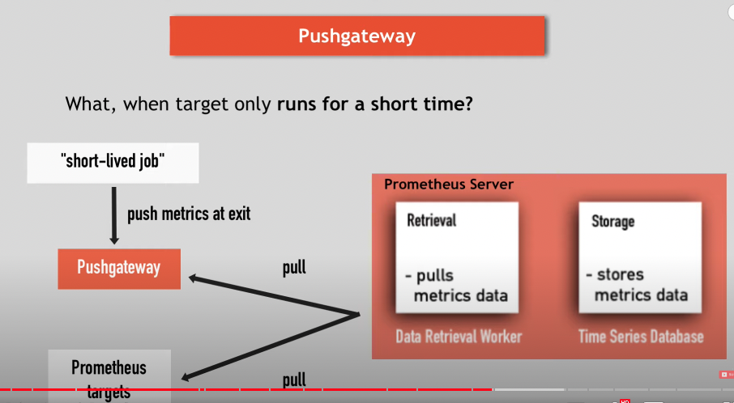
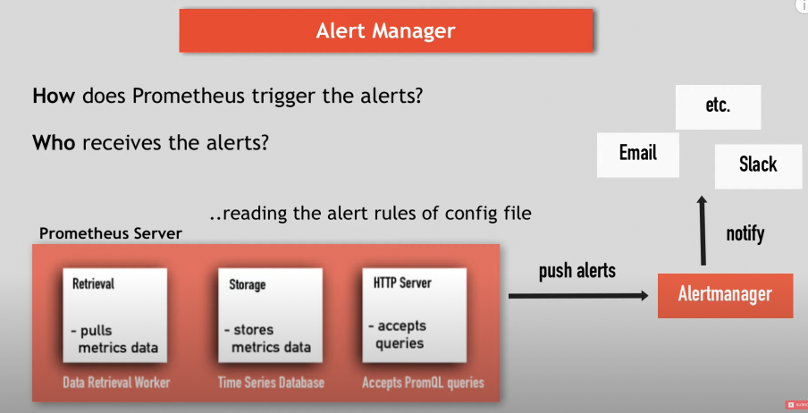
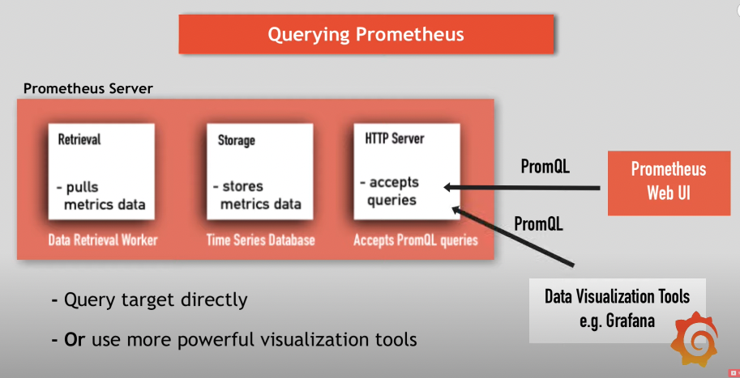

# Prometheus

- 의문
- 개요
- 아키텍처
  - 프로메테우스 서버
    - DB
    - Data Retrieval worker
    - HTTP Server
  - 메트릭을 타겟으로부터 수집하는 법
- 모니터링 대상 & 메트릭
  - 메트릭
- 풀링 매커니즘
- 프로메테우스 설정
- Alert Manager
- PromQL

## 의문

## 개요

- 개요
  - 모니터링 & 얼럿팅 툴
    - 특히 컨테이너나 마이크로서비스 환경에서 주류가 됨
- 장점
  - reliable
    - 다른 시스템이 잘 동작하지 않아도, 진단하기 쉬움
  - stand-alone and self-containing
    - 다른 서비스에 의존하지 않음
  - 구축이 쉬움
  - 쉽게 도커랑 쿠버네티스랑 연동 가능
- 단점
  - 스케일링 하기 힘듬

## 아키텍처

### 프로메테우스 서버

- Storage(DB)
  - local
  - remote(e.g RDB)
- Data Retrieval worker
  - pulling
  - save to storage
- HTTP Server
  - 쿼리를 받아서 데이터 돌려줌
  - PromQL 쿼리를 사용

### 메트릭을 타겟으로부터 수집하는 법

- 개요
  - 타겟으로부터 데이터를 풀링해옴(HTTP엔드 포인트)
- 엔드포인트
  - `hostaddress/metrics`
- 특징
  - 데이터는 반드시 올바른 형태여야 함
- exporter
  - 개요
    - 타겟으로 메트릭을 갖고 오고, 올바른 형태로 변경하고, `/metrics`엔드포인트로 expose하여 프로메테우스가 데이터를 갖고가게 함
    - 프로메테우스가 기본적으로 제공하는 여러 애플리케이션 exporter가 존재
      - e.g) `mysql`, `linux server`
      - 리눅스 서버의 경우
        - node exporter 다운로드
        - 실행
        - 서버의 메트릭을 변경하고
        - `/metrics`엔드포인트를 열어줌
        - 프로메테우스가 수집
      - 도커 이미지로 사용 가능
        - **사이드카 애플리케이션으로 배포 가능**

### 풀링 메커니즘(Data Retrieval worker)

프로메테우스 풀링 메커니즘



- c.f) 푸싱 모니터링 시스템
  - 예시
    - `Amazon Cloud Watch`
    - `New Relic`
  - 단점
    - 데이터 저장 서버에 큰 네트워크 부하를 일으킴
    - 모니터링이 보틀넥이 됨
    - 각 마이크로 서비스에 푸싱하기위한 소프트웨어를 설치하고 관리해야 함
- 풀링 모니터링 시스템
  - 장점
    - 다수의 프로메테우스 인스턴스가 메트릭을 풀링해갈 수 있음
    - 서비스가 동작하는지 더 잘 파악하고 인사이트를 얻을 수 있음

push gateway의 사용



- push gateway
  - 개요
    - 오직 짧은 시간동안에만 동작하는 애플리케이션의 경우 사용됨
      - e.g) 배치잡, 백업 등

## 모니터링 대상 & 메트릭

- 대상
  - 리눅스/윈도우 서버
  - 아파치 서버
  - 애플리케이션
  - 데이터베이스와 같은 미들웨어
- 대상의 메트릭
  - 서버
    - CPU
    - Memory/Disk Space Usage
    - Exception Count
    - Requests Count
    - Request Duration
  - 애플리케이션
    - 리퀘스트 개수
    - 익셉션 개수
    - 서버 리소스가 얼마나 사용됐는지
      - client 라이브러리를 이용해서 `/metrics` 엔드포인트를 열어줄 수 있음

### 메트릭

- 포맷
  - 사람이 읽을 수 있는 텍스트 데이터
- 구성
  - TYPE / HELP 속성
  - TYPE
    - 3가지 메트릭 타입
      - 카운터(얼마나 많이 발생했는지?)
        - 에러의 개수, 리퀘스트의 개수
      - 게이지(현재 값?)
        - 현재 CPU 사용량, 현재 Disk 공간, 일정 기간의 동시 리퀘스트
      - 히스토그램(얼마나 길게 걸렸고, 얼마나 큰지?)
        - 리퀘스트의 크기 등
  - HELP
    - 그 메트릭이 무엇인지 기술

## 프로메테우스 설정

프로메테우스 설정 예시

```yaml
global:
  scrape_interval: 15s
  evaluation_interval: 15s
rule_files:
  - "first.rules"
  - "second.rules"
scrape_configs:
  - job_name: prometheus
    static_configs:
      - targets: ['localhost:8080'] # localhost:8080/metrics
  - job_name: node_exporter
    scrape_interval: 1m
    scrape_timeout: 1m
    static_configs:
      - targets: ['localhost:9100']
```

- 언제 어떤 데이터를 스크레이핑 하는가?
- `prometheus.yaml`

## Alert Manager

Alert manager 구성



## PromQL

PromQL



- 개요
  - query target directly
  - or use grafana
    - 직접 PromQL을 사용해서 데이터를 보여줌
