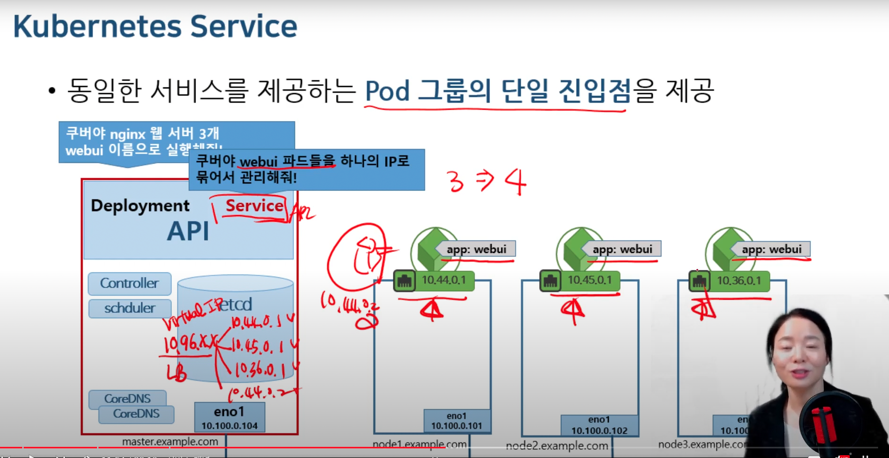
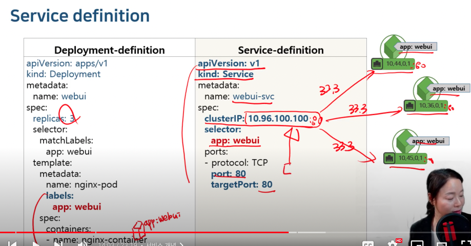
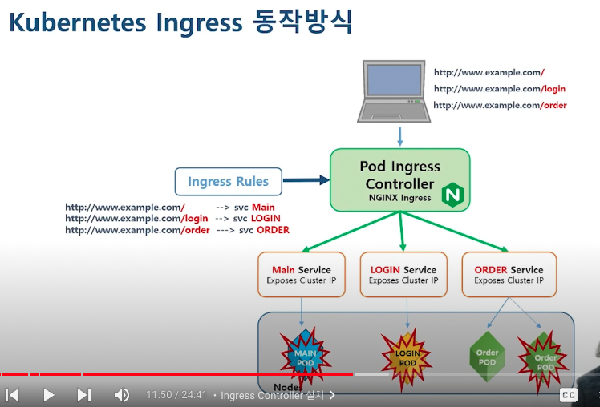

# 쿠버네티스 서비스

- 의문
- 서비스
- 인그레스

## 의문

- 타다의 서비스는 내부적으로 클러스터IP를 사용할때, `gryphon-server-pg:8081` 이런식으로 하는데, 어떻게 IP가 아닌 클러스터의 도메인이름을 지정할 수 있는가?

## 서비스

쿠버네티스 서비스

서비스 정의

- 개요
  - 동일한 서비스를 제공하는 팟(같은 레이블) 그룹의 단일 진입점(virtual ip) 제공 & 로드 밸런싱
    - 각 팟에 ip를 부여함
    - 동일 레이블이 붙은 팟들의 ip를 묶은 virtual ip를 서비스가 할당함
    - virtual ip로 요청이 들어가면 알아서 로드 밸런싱을 수행
- 타입
  - ClusterIP(default)
    - 단일 진입점인 가상 ip생성 후 팟 그룹에 대한 로드밸런싱
    - 클러스터 내부에서만 사용가능
  - NodePort(노드까지 확장)
    - ClusterIP + 각 워커 노드들의 포트가 오픈됨 + (외부)클라이언트 사용자가 오픈된 origin으로 접속하면, 같은 ip 클러스터 중 하나의 팟으로 포워딩 함
    - 클러스터 외부에서 접근할 수 있도록 도움
  - LoadBalancer(LB까지 확장)
    - ClusterIP + NodePort + k8s외부에 LB장비와 연동
    - AWS, Azure, GCP 등에서 LB를 자동으로 프로비전하는 기능 지원
  - ExternalName(DNS기능 지원)
    - 클러스터 내부에서 외부로 나갈 수 있는 도메인 지정
      - etcd의 hosts와 같은 서비스
    - *네이밍 서비스를 클러스터 내부로 끌어들임*

### 헤드리스 서비스

- 개요
  - ClusterIP가 없는 서비스로, 단일 진입점(엔드 포인트)은 존재하나, ClusterIP주소가 없음
  - 대신 coreDNS에 팟의 엔드포인트에 대한 DNS 레코드가 생성됨
    - `[pod-ip-addr].[namespace].pod.cluster.local`
      - e.g) `10-36-0-1.default.pod.cluster.local`
        - *각 팟에 대해서 namespace가 따로 존재하는건지?*
        - *쿠버네티스 네임스페이스 개념?*

### kube-proxy

- 개요
  - 노드단위로 쿠버네티스 서비스를 구현해주는 백엔드 구현 팟
    - iptables에 룰을 만들어서, ClusterIP에 대해서 각 노드에 연결할 수 있도록 함
    - nodePort로의 접근과 Pod 연결을 구현(iptalbes 구성)
- 모드
  - iptables
    - default k8s network mode
    - service API요청(ClusterIP, nodePort, LB)시 iptables rule이 생성
      - nodePort의 경우, 해당 노드 포트를 listen하면서 클라이언트 커넥션을 잡아서 iptables로 연결해서 팟과 통신할 수 있도록 함
    - 클라이언트 연결은 kube-proxy가 받아서 iptables룰을 통해 연결
  - IPVS
    - 리눅스 커널이 지원하는 L4 로드밸런싱 기술 이용
    - 별도의 ipvs 지원 모듈 설정 후 적용 가능

## 인그레스

k8s Ingress 동작방식

- 개요
  - 쿠버네티스가 지원해주는 오브젝트
  - HTTP나 HTTPS를 통해 클러스터 내부의 서비스를 외부로 노출
- 기능
  - Service에 외부 URL을 제공
    - *nodePort나 LB 서비스를 직접 사용하면 되는거 아닌가?*
  - 트래픽 로드 밸런싱
  - TLS 인증서 처리
  - Virtual hosting 지정
    - 도메인 이름을 바꿔서도 룰만 잘 바꾸면 사용 가능
