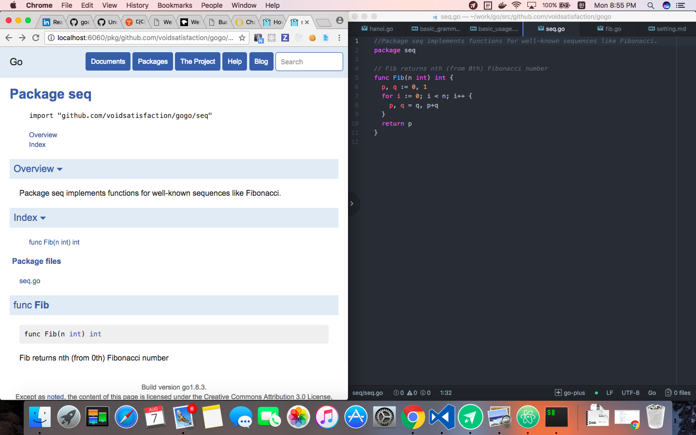

# Basic usage of GO

## Package and Library

package를 통해 코드의 모듈화, 코드의 재사용 기능 제공.

표준 라이브러리는 `GOROOT/pkg`안에 존재한다. Go에 사용하는 표준패키지는 [이곳](https://golang.org/pkg)에 자세히 설명되어 있다.

**Main 패키지**

일반적으로 패키지는 라이브러리로서 사용되지만, "main"이라고 명명된 패키지는 Go Compiler에 의해 특별하게 인식된다. 해당 패키지를 공유 라이브러리가 아닌 실행 프로그램으로 만든다. 그리고 이 main패키지 안의 `main()`함수가 프로그램의 시작점(Entry Point)가 된다. `main()`이 행하는 것이 곧 프로그램이 행하는 것이다.

GOROOT/pkg: 표준 패키지
GOPATH/pkg: 사용자 패키지 / 3rd party패키지

**패키지 Scope**

패키지 내의 함수, 구조체, 인터페이스, 메서드 등의 이름이 첫 문자가 대문자로 시작하면 이는 public으로 사용할 수 있다. 즉, 패키지 외부에서 이들을 호출하거나 사용할 수 있게 된다. 반면, 이름이 소문자로 시작하면 이는 non-public으로 패키지 내부에서만 사용될 수 있다.

**패키지 init함수와 alias**

개발자가 패키지를 작성할 때, 패키지 실행시 처음으로 호출되는 `init()`함수를 작성할 수 있다.

```go
package testlib

var pop map[string]string

func init() {
  pop = make(map[string]string)
}
```

경우에 따라 import하면서 그 패키지 안의 `init()`함수만을 호출하고자 하는 케이스가 있는데, 이때에는 import할 때, `_`라는 alias를 지정한다.

```go
package main

import _ "other/xlib"
```

만일 패키지 이름이 동일하지만, 서로 다른 버전 혹은 서로 다른 위치에서 로딩하고자 할 때는, 패키지 alias를 사용해서 구분할 수 있다.

```go
import (
  mongo "other/mongo/db"
  mysql "other/mysql/db"
)
func main() {
  mondb := mongo.Get()
  mydb := mysql.Get()
}
```

**사용자 정의 패키지 생성**

사용자 정의 라이브러리 패키지는 일반적으로 폴더를 하나 만들고 그 폴더 안에 `.go`파일들을 만들어 구성한다. 하나의 서브 폴더안에 있는 `.go`파일들은 동일한 패키지명을 가지며, 패키지명은 해당 폴더의 이름과 같게 한다. 즉, 해당 폴더에 있는 여러 `*.go`파일들은 하나의 패키지로 묶인다.

사이즈가 큰 복잡한 라이브러리는 `go install` 명령을 사용하여 라이브러리를 컴파일하여 Cache할 수 있다(빌드 타임 감소)

라이브러리 탐색 순서

1. GOROOT
2. GOPATH
3. ~~자기자신이 있는 폴더~~(정확하지 않음)

go tool을 이용할 경우에는 directory하나가 한 패키지가 된다. 한 패키지는 메인 패키지 혹은 라이브러리 패키지가 될 수 있다.

- 메인 패키지로 설치: 실행파일이 bin 아래에 생성
- 라이브러리 패키지로 작성: hanoi package가 됨(hanoi 디렉토리인 경우)
  - 패키지 안에 대문자로 시작하는 함수들: `hanoi.Move`와 같이 접근 가능
  - 소문자로 시작하는 함수들은 패키지의 라이브러리로 접근 불가능
  - 패키지 이름은 간결하게. 패키지 내부의 함수 이름도 간결하게.

package의 예
```go
// src/github.com/voidsatisfaction/gogo/seq
package seq

func Fib(n int) int {
	p, q := 0, 1
	for i := 0; i < n; i++ {
		p, q = q, p+q
	}
	return p
}

```

seq를 부르는 경우
```go
// src/github.com/voidsatisfaction/gogo/seq_call
package main

import (
  "fmt"
  "github.com/voidsatisfaction/gogo/seq"
)

func main() {
  fmt.Println(seq.Fib(6))
}
```

## 도구 사용하기

### 1. Godoc

godoc은 Go프로그램의 문서를 볼 수 있는 도구이다.

**커맨드라인에서 보기**

`godoc fmt`

`godoc -src fmt Printf`

**로컬 웹 서버에서 보기**

`godoc -http=:6060`

그 뒤에 웹 브라우저에

`http://localhost:6060/pkg/github.com/`

를 입력하면 자신이 입력한 라이브러리도 볼 수 있다.

주석을 입력하면 매우 fancy하게 볼 수 있다.



### 2. Oracle

소스 코드에 대해서 여러 가지를 물어볼 수 있는 매우 강력한 도구.

편집기와 연동해서 사용하는 것을 추천

`oracle -pos=src/github.com/username/gogo/seq/seq.go:#134 callers`

### 3. Vet

소스 코드를 검사하기 위한 도구.

`go tool vet github.com/myusername/gogo/seq`

`go tool vet *.go`

### 4. Fix

이미 변경된 옛 API호출 등을 자동으로 고쳐주는 도구.

Go버전이 업그레이드 되면 한 번 실행하여 변경된 점을 확인하면 도움이 된다.

`go tool fix github.com/myusername/gogo/seq`

### 5. Test

테스트를 수행하는 도구.

`go test github.com/myusername/gogo/seq`
