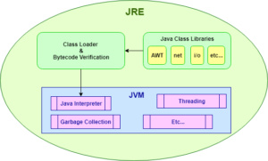
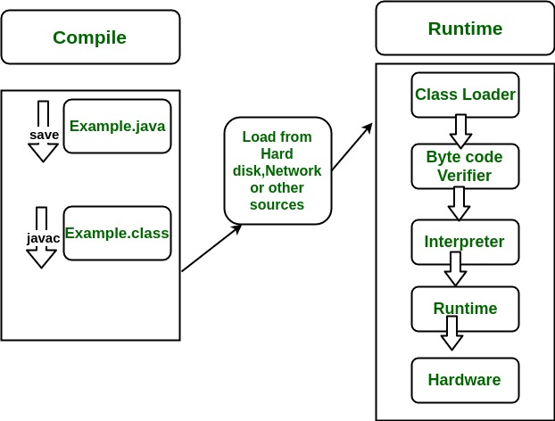
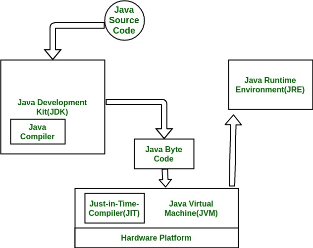

# Java Runtime Environment

JDK, JRE, JVM

## 참고

- [jdk-jre-jvm - geerks for geeks](https://www.geeksforgeeks.org/differences-jdk-jre-jvm/)

## JDK

- 자바 애플리케이션이나 애플릿을 개발하기 위해 사용되는 소프트웨어 개발 환경
- 포함되는 것들
  - JRE
  - Java
    - 인터프리터 / 로더
  - javac
    - 컴파일러
  - jar
    - 압축 프로그램
  - Javadoc
    - 문서 생성기
  - ...

## JRE

### 런타임 환경

- 다른 소프트웨어를 **실행하기 위해** 고안되는 일종의 소프트웨어

### 의미

- 컴퓨터 운영체제 위에서 실행되면서 자바를 위한 부가적인 서비스를 제공하는 소프트웨어 계층
- 다양한 운영체제의 요철을 매끄럽게 다듬어 거의 모든 운영체제에서 수정 없이 실행될 수 있도록 함
- 자바 프로그램을 위한 메타 운영체제
- e.g
  - 자동 메모리 관리
  - 자바 애플리케이션 모니터링(JVM)
- **런타임 환경이므로, 컴파일은 별개임(javac)**

### 구성

- 자바 클래스 라이브러리(java class libraries)
- 자바 클래스 로더(java class loader)
  - 클래스를 로드해서 코어 자바 클래스 라이브러리에 연결
- 자바 가상 머신(java virtual machine)
  - 자바 애플리케이션이 디바이스 또는 클라우드 환경에서 실행되는 데 필요한 리소스를 확보하도록 보장하는 역할을 함
  - **자바 소스코드로부터 컴파일되어 만들어지는 자바 바이트 코드를 읽고 검증하고 실행함**
  - 가상 머신 자체는 운영체제 dependent
    - 하지만 바이너리 코드는 어떠한 가상머신에서도 동작 가능
  - JIT compilation을 도입해서 자주 사용되는 함수 / 클래스에 해당하는 기계어를 캐싱해서 그것을 계속 사용
  - 스칼라는 코드를 컴파일하면 자바 바이트코드가 생성되어 JVM에서 실행할 수 있도록 함

### 자바 메모리

- 힙
  - 변수 내용을 저장
- 스택
  - 함수 실행 및 변수 참조 저장
- 메타스페이스
  - 자바가 클래스 정의와 같이 프로그램에서 변화하지 않는 정보를 저장하는 장소
