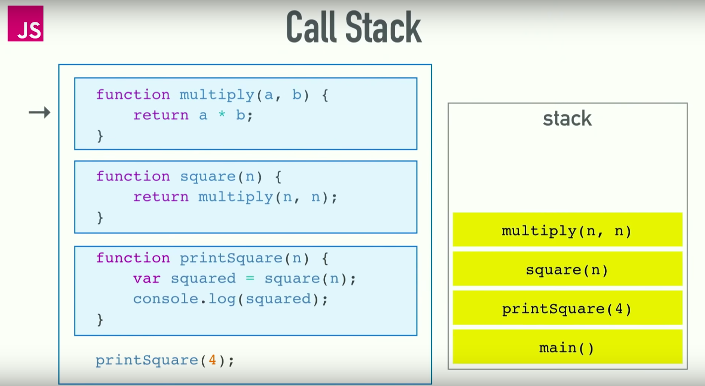
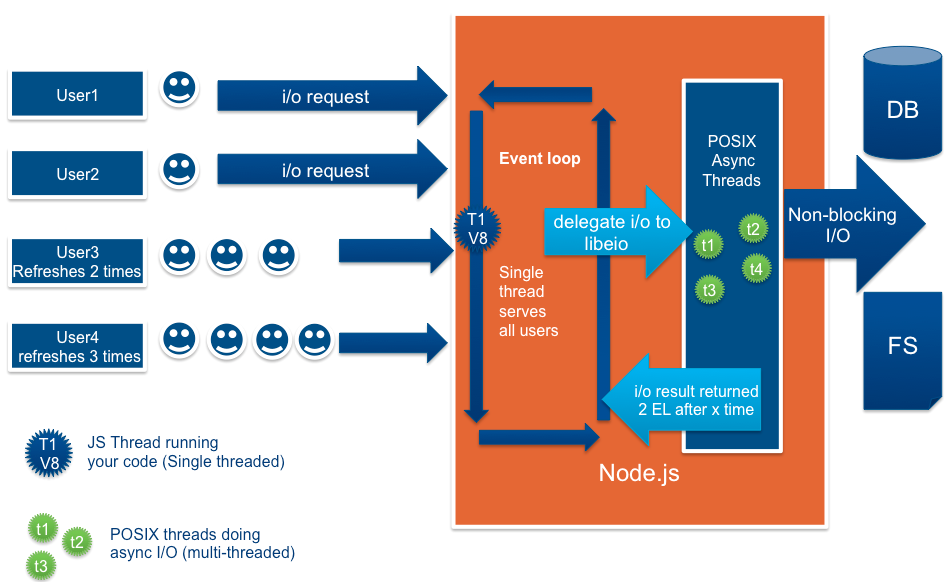
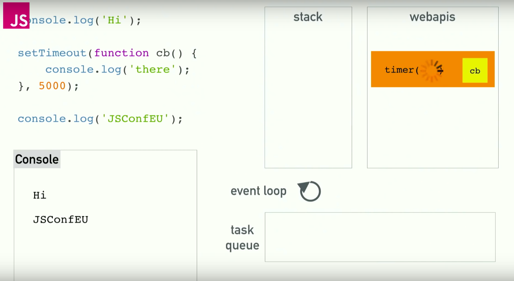
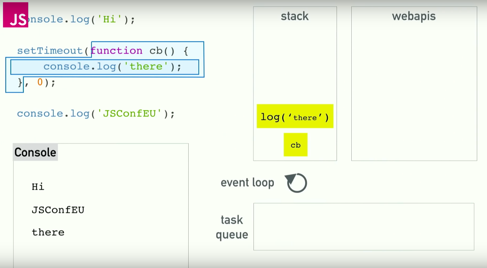
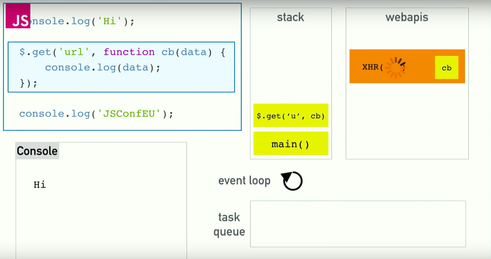

# nodejs에 대하여

- nodejs란
- 역사
- 사전지식
- 아키텍처
  - 등장인물
    - callstack
    - c++ apis / webapis
    - event loop
    - task queue
    - microtask queue
    - render queue
- 장 / 단점
- 싱글 스레드와 멀티스레드의 하이브리드
- 참고

## nodjs란

- os위에 돌아가는 자바스크립트 코드를 실행하는 **런타임 환경**
  - 언어가 아니다.
  - js로 os위에서 개발 하기 위한 추상 레이어

## 역사

- 원래는 브라우저가 js엔진이라는 것을 탑재해서 js코드를 머신 코드로 변환해서 실행
  - 브라우저 마다 다른 엔진이 있었음
  - 브라우저가 js코드의 런타임 환경을 제공
- 2009년 Ryan Dahl이 브라우저 밖에서 js를 실행하는 런타임 환경을 만듬
  - v8엔진을 c++프로그램에 이식해서 node라고 함
  - `document` 오브젝트가 존재하지 않음
  - 대신 `fs`과 `http`를 다룰 수 있는 api존재
  - 브라우저에서 할 수 없는 것을 할 수 있게 함

## 사전 지식

### call stack



- 실행할 컴퓨터 프로그램 코드 정보를 저장하는 스택 자료구조
  - 보통은 함수의 리턴하는 메모리상 어드레스를 이 스택에 저장
- `하나의 스레드 == 하나의 콜스택 == 한번에 하나만 할 수 있음`

### 브라우저상의 blocking 문제

만일 브라우저가 블로킹이라면, `setTimeout`이나 `$.get` 같은 함수들을 전부 하나하나 기다리면서 프로그램 처리를 해야 함

### 비동기 콜백

- 이것이 가능한 이유는 브라우저가 런타임만 있는것이 아니기 떄문
- 런타임은 무조건 한 번에 하나만 실행 가능

## 아키텍처

### 노드 웹 앱



- Non-blocking server
  - 노드의 경우 하나의 스레드가 있어서 IO작업을 하는 도중에는 다른 request가 이 스레드를 사용할 수 있게 함
  - IO작업이 끝나면 event queue에 이벤트 던져주고, 노드가 그것을 확인해서 다시 원래 작업을 하도록 함
  - e.g
    - 외부에서 리퀘스트가 오면 태스크 큐에 리퀘스트를 삽입
    - 태스크 큐의 가장 앞에 있다가 해당 리퀘스트의 차례가 된다면 js런타임으로 실행
    - 실행하다가 db에 접속하는 등의 I/O가 존재하면 그것을 실행(c++ 라이브러리로 새로 스레딩을 해서)
    - 실행이 끝나면 결과와 콜백함수를 태스크 큐에 넣어줌
    - 다시 해당 태스크(콜백실행)가 태스크 큐의 가장 앞으로 오면 그것을 자바스크립트 런타임으로 실행(그 전까지는 다른 리퀘스트를 받을 수 도 있고, 다른 작업을 함)
    - 이를 반복하면서 리스폰스를 돌려줌
- Blocking server
  - 하나의 리퀘스트 당 하나의 스레드를 배정
  - 가능한 스레드가 다 차면 그 다음 리퀘스트는 기다려야 함
  - 스레드 내부에 I/O 작업이 있으면 그냥 그 I/O작업을 기다려야 함

### 등장인물





#### (콜)스택

- 실행할 컴퓨터 프로그램 코드 정보를 저장하는 스택 자료구조

#### c++ apis(nodejs) / webapis(브라우저)



- IO / 타이머 등의 작업을 해주는 api
  - 브라우저나 c++ 라이브러리가 기능을 제공
  - wrapping되어서 js로 사용할 수 있게 만든 것 뿐
- 작업이 끝나면 task queue에 컬백을 푸시해줌
- e.g
  - ajax
  - dom eventListener
    - 그래서 scroll 이벤트에 무엇인가를 걸어놓으면 스크롤 할 때마다 엄청난 callback이 callback queue로 들어가버림

#### event loop

- 콜스택과 task queue를 보면서 call stack이 비어있으면 task queue에 가장 앞에 있는 것을 stack으로 푸시해줌
  - 브라우저나 nodejs 플랫폼은 특정 태스크에 우선순위를 다르게 둘 수 있음

#### task queue

- IO작업으로 인한 콜백들을 저장해주는 장소

#### microtask queue(ES6에서 공식지원)

- 현재 실행중인 js 스크립트 이후에 바로 실행되어야 하는 것들을 위해 스케쥴링 됨
- js stack이 비어있으면 바로 microtasks가 실행이 됨
  - `If the stack of script settings objects is now empty, perform a microtask checkpoint`
  - e.g
    - 태스크 큐에 이미 작업이 있었다고 해도, 마이크로 태스크 큐의 작업이 더 빨리 실행이 됨
- Promise가 settle되거나 이미 settle되었으면 microtask 큐에 그에 기반한 콜백을 삽입
  - Promise callback을 async로 취급해줌
  - `Promise.resolve().then(yay, nay)` 이것은 then이후의 callback이 microtask queue에 바로 삽입됨
- e.g
  - HTML 엘리먼트의 attribute 변경 등의 태스크
  - Promise callback(`then`)
- c.f `async`, `await`은 Promise의 문법설탕

```js
console.log('script start');

setTimeout(function() {
  console.log('setTimeout');
}, 0);

Promise.resolve().then(function() {
  console.log('promise1');
}).then(function() {
  console.log('promise2');
});

// 결과 출력 순서
// script start
// promise1
// promise2
// setTimeout
```

#### render queue(브라우저에서)

- 태스크의 실행이 한 번 다 끝날 때 마다 렌더함
  - 유저의 클릭이나 유저의 다른 동작을 할 수 있는지 없는지 확인
  - 자바스크립트 코드 자체를 실행하고 있을 때는 유저의 행위가 blocking됨

## 장 / 단점

### 장점

- Data-intensive / Realtime application에 적합
- 스레드의 효율적인 사용을 가능하게 함
- 별도로 다중처리 관리를 해줄 필요가 없음

### 단점

- 대신 CPU intensive 서비스에는 이용하면 안됨
  - CPU가 계산을 하는동안 다른 request는 반드시 기다려야 함
- CPU의 코어를 하나만 이용함
  - 만약, quad코어를 사용하고 있다면 코어 3개는 해당 애플리케이션을 돌리는데에 전혀 관여하지 않는 것으로 됨

### c.f multi-threaded app의 장 / 단점

- 장점
- 단점
  - 개개의 스레드 마다 많은 메모리를 할당해야 함. 싱글 스레드 앱 보다 같은 시간에 보다 적은 리퀘스트를 처리할 수 있음
  - `malloc`은 느림
    - 힙 메모리 영역의 동적 할당
    - 해당 스레드에서 다른 언어로 쓰여진 스크립트를 실행할때, 필요한 메모리를 다 `malloc`으로 풀어줘야 하는 단점도 있음

## 싱글 스레드와 멀티스레드의 하이브리드

- 각각의 스레드가 이벤트루프를 갖고 있고, 동시에 실행되어서, 리퀘스트는 로드벨런서에 의해서 적절히 분산됨
- 싱글 스레드의 앱을 여러개 작동시킴
  - 4개의 nodejs앱을 4개의 코어 각각에서 실행
  - 그리고 로드벨런서로 적절히 부하 분산

## 참고

- [Nodejs의 싱글스레드 - stackoverflow](https://stackoverflow.com/questions/34855352/how-in-general-does-node-js-handle-10-000-concurrent-requests)
- [Event loop, task, microtask 이해하기 ](https://jakearchibald.com/2015/tasks-microtasks-queues-and-schedules/)
