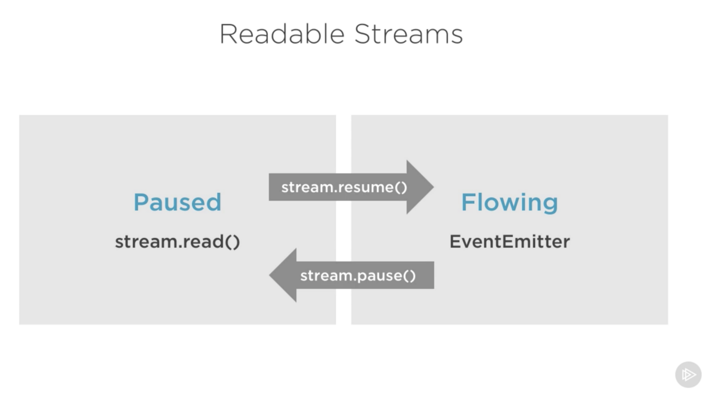

# nodejs에서의 스트림

- 스트림의 정의
  - 스트림 실제 예제
- nodejs에서의 스트림

## 스트림의 정의

- 일반적
  - **물리 디스크상의 파일, 장치들을 통일된 방식으로 다루기 위한 가상적 개념**
  - **데이터의 입력과 출력을 이어주는 매개체**
  - 데이터, 패킷, 비트 등의 일련의 연속성을 갖는 흐름
  - 멀티미디어 스트리밍 기술
    - 스트리밍 방식 데이터 수신과 동시에 재생
    - c.f) 다운로드 방식
  - 스트리밍 종류
    - RTP 스트림
    - MPEG 스트림
  - 스트리밍 관련 프로토콜
    - RTP(빠른 수송) / RTSP(수송 제어)
  - 멀티미디어 스트림 재생 플레이어
    - Windows media players
- 입출력 장치
  - 입력과 출력을 이어주는 매개체
    - 키보드의 키를 눌렀을 때, 화면에 그 누른 것이 출력되는 것은 입출력을 추상화 시켜서 중간자 역할을 함
    - 프린터, 마우스, 네트워크, 메모리 등등 많은 입출력장치에서 쓰임
    - 사용자는 하드웨어의 복잡한 처리를 신경쓰지 않고 그저 데이터를 스트림으로 읽어들이거나 스트림으로 내보내면 끝
- nodejs
  - 배열이나 문자열같은 데이터 컬렉션
  - 한 번에 모든 데이터를 얻는게 아님
  - 엄청나게 큰 데이터를 다룰 때, 외부 소스로부터 데이터를 한번에 한 덩어리(chunk)씩 가져올때 유효
  - 코드 조합도 가능(리눅스 파이핑)

```js
const grep = ... // grep 출력을 위한 스트림
const wc = ... // wc 입력을 위한 스트림

grep.pipe(wc)
```

### 스트림 실제 예제

```js
const fs = require('fs');
const file = fs.createWriteStream('./big.file');

for(let i=0; i <= 5 * 1e6; i++) {
  file.write('Lorem ipsum dolar ...')
}

file.end();
```

- 백만줄의 쓰기 가능한 스트림을 통해서 `big.file`작성

```js
const fs = require('fs');
const server = require('http').createServer();

server.on('request', (req, res) => {
  fs.readFile('./big.file', (err, data) => {
    if (err) throw err;

    res.end(data);
  })
});

server.listen(8000);
```

- 위의 코드는 메모리에 `./big.file`의 내용을 모두 올려 놓기 때문에, 용량이 큰 파일에는 매우 비효율적이다.
- 그래서 `./big.file`을 제공할때 400MB를 상회하는 메모리가 사용된다.

```js
const fs = require('fs');
const server = require('http').createServer();

server.on('request', (req, res) => {
  const src = fs.createReadStream('./big.file');

  src.pipe(res);
});
```

- 클라이언트가 큰 파일을 요청했을 때, 한번에 한 청크씩 스트림으로 흘려 보냄
  - 파일의 모든것을 메모리에 버퍼로 잡지 않음
  - 메모리 사용은 35MB정도 까지만 증가

## nodejs에서의 스트림

- 읽기 가능한(readable) 스트림
  - 소비할 수 있는 데이터를 추상화한 것
  - `fs.createReadStream`
- 쓰기 가능한(writable) 스트림
  - 데이터를 기록할 수 있는 종착점을 추상화한 것
  - `fs.createWriteStream`
- 듀플렉스(duplex) 스트림
  - 읽기 쓰기 모두 가능한 스트림(TCP 소켓)
- 트랜스폼(transform) 스트림
  - 데이터를 읽거나 기록하는 사이에 그 데이터를 수정 / 변환할 수 있는 duplex 스트림
  - 데이터를 read스트림과 write스트림 사이에서 가공하는 스트림
  - 스트림을 통해서... 의 그 스트림

모든 스트림은 `EventEmitter`의 인스턴스. 데이터를 읽거나 쓸 때 사용할 이벤트를 방출(emit)합니다. 하지만, `pipe` 메서드를 이용하면 더 간단하게 스트림 데이터를 사용할 수 있습니다.

### pipe 메서드

```js
readableSrc.pipe(writableDest)
```

- 읽기 가능한 스트림의 출력과 쓰기 가능한 스트림의 입력을 파이프로 연결하였습니다.

```js
readableSrc
  .pipe(transformStream1)
  .pipe(transformStream2)
  .pipe(finalWritableDest)

a.pipe(b).pipe(c).pipe(d)

// 같은 코드
a.pipe(b)
b.pipe(c)
c.pipe(d)

// 리눅스
a | b | c | d
```

- `pipe`메서드는 체이닝할 수 있도록 목적지 스트림을 반환 합니다.
- `pipe`메서드와 이벤트를 동시에 사용하는 것은 지양해야 합니다.

### 스트림 이벤트

```js
readable.on('data', (chunk) => {
  writable.write(chunk);
});

readable.on('end', () => {
  writable.end();
});
```


- 이벤트를 이용해서 좀 더 커스텀하게 스트림을 사용
- 읽기 가능한 스트림에서 가장 중요한 이벤트는 다음과 같다
  - data이벤트
    - 스트림이 소비자에게 데이터 청크를 전송할 때 발생
  - end이벤트
    - 더 이상 소비할 데이터가 없을 떄 발생
- 쓰기 가능한 스트림에서 가장 중요한 이벤트는 다음과 같다
  - drain이벤트
    - 쓰기 가능한 스트림이 더 많은 데이터를 수신할 수 있다는 신호입니다.
  - finish이벤트
    - 모든 데이터가 시스템으로 플러시 될 때 생성된다.

### 읽기 가능한 스트림의 일시 정지 모드와 흐름 모드



- 읽기 가능한 스트림의 모드 종류
  - 일시 정지 모드(Pause, Pull)
  - 흐름 모드(Flowing, Push)
- 자동 스위칭 / 스동 스위칭 가능
- `pipe()`가 자동으로 관리해줌
