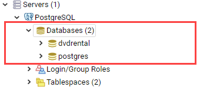
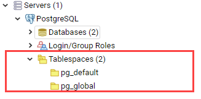
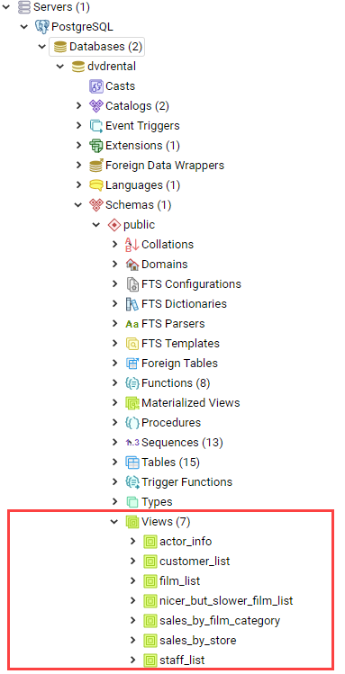
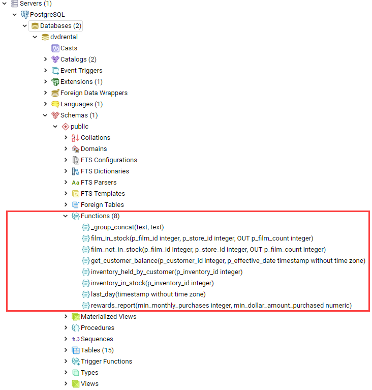
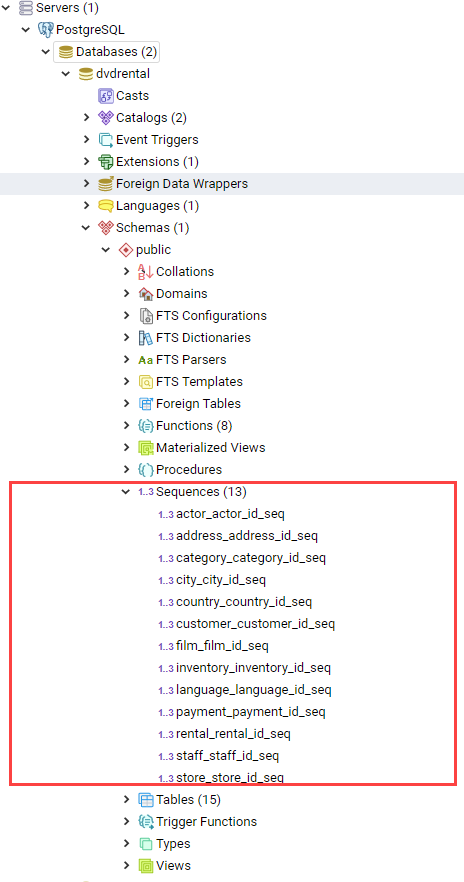
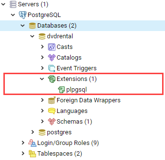
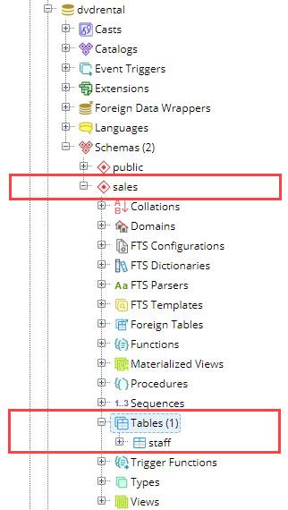

# PostgreSQL

- 의문
- PostgreSQL 개요
  - PostgreSQL Server & Database Objects
- Querying Data
- Joining Multiple Tables
- Performing Set Operation
- Grouping Data
- Subquery
- Common Table Expressions
- Modifying Data
- Transactions
- Managing Databases
- Managing Tables
- Managing Schemas

## 의문

- intro
  - *function과 view와 operators의 차이점?*

## PostgreSQL 개요

- MVCC(Multi-version concurrency control)
  - *누군가가 어떤 행을 편집하고 있을 때, 그 행을 읽는다면?*
- custom function 지원
- custom data types, index types, functional languages, custom plugin 지원(e.g optimizer)

### PostgreSQL Server & Database Objects

- Server service
  - 물리적 서버 안에 여러개의 PostgreSQL server를 갖을 수 있음
    - 서로 다른 포트
    - 서로 다른 데이터 저장장소



- Databases
  - tables, views, functions, indexes와 같은 서로 다른 오브젝트들의 컨테이너


- Tables
  - 데이터를 저장하는 곳
  - 하나의 데이터베이스는 여러개의 테이블을 갖고있음
  - 테이블 상속
    - 자식 테이블은 부모 테이블로부터 상속받을 수 있음
    - 자식 테이블에서 데이터를 질의 하면 부모 테이블로부터의 데이터가 나타남
- Schemas
  - 테이블과 데이터 베이스속 다른 오브젝트들의 논리적 컨테이너
  - 각 PostgreSQL 데이터베이스는 여러개의 스키마를 갖을 수 있음


- Tablespaces
  - PostgreSQL이 데이터를 저장하는 곳
  - 간단한 명령어를 사용하여 데이터를 다른 물리적 장소로 쉽게 이동할 수 있도록 함
    - `pg_default`
      - 유저 데이터를 저장하는 곳
    - `pg_global`
      - 시스템 데이터를 저장하는 곳



- Views
  - 데이터베이스에 저장된, 이름이 등록된 쿼리
  - updatable view를 제공



- Functions
  - 행의 집합의 스칼라값을 반환하는 재사용가능한 SQL code 블록



- Operators
  - symbolic한 함수들
  - 커스텀 오퍼레이터 정의를 할 수 있도록 도와줌
- Casts
  - 하나의 데이터 타입을 다른 데이터 타입으로 변환할 수 있게 도와줌
  - 변환을 수행할 수 있는 함수들에 의해서 서포트를 받음
  - custom cast를 만들어서 default casting을 오버라이딩 할 수 있음
- Sequence
  - serial column으로 정의된 auto-increment columns를 다루기 위해서 사용됨



- Extension
  - types, casts, indexes, functions를 하나의 유닛으로 감싸기 위해서 9.1버전부터 도입



## Querying Data

- Select
  - `select first_name || ' ' || last_name as full_name from customer;`
- Order By
  - `select first_name, last_name from customer order by first_name asc, last_name desc;`
- Select Distinct
  - `SELECT DISTINCT column_1, column_2 FROM table_name`
    - column1, column2가 중복이면 배제
- WHERE
  - Operator
    - `=, >, <, >=, <=, <> or !=, AND, OR`
    - `LIKE`
  - `SELECT first_name, last_name FROM customer WHERE first_name LIKE 'Ann%'`
  - `SELECT first_name, LENGTH(first_name) name_length FROM customer WHERE first_name LIKE 'A%' AND LENGTH(first_name) BETWEEN 3 AND 5 ORDER BY name_length;`
  - LIMIT
    - OFFSET이 너무 크면 비효율적이라서 좋지못함
    - `SELECT film_id, title, release_year FROM film ORDER BY film_id LIMIT 4 OFFSET 3`
  - FETCH
    - LIMIT이 SQL 스탠다드가 아니라서 PostgreSQL에서는 FETCH를 구현
    - `OFFSET start { ROW | ROWS } FETCH { FIRST | NEXT } [ row_count ] { ROW | ROWS } ONLY`
  - IN
    - OR을 계속해서 붙이는 것 보다 최적화 되어있음
    - NOT IN
      - 해당 값에 매칭하지 않는 값만 반환
    - `SELECT first_name, last_name FROM customer WHERE customer_id IN (SELECT ...)`
  - BETWEEN
    - 값의 범위를 매칭할 때 사용
  - LIKE(~~)
    - 특정 패턴에 합치하는 데이터를 찾을 때 사용
    - 패턴문자
      - `%`: 임의의 문자열의 시퀀스를 매칭할 때
      - `_`: 임의의 하나의 문자를 매칭할 때
    - ILIKE(~~*)
      - case-insensitive 매칭
    - NOT LIKE(!~~)
    - NOT ILIKE(!~~*)
  - IS NULL
    - NULL값의 매칭에 사용
    - 주의
      - `WHERE column = NULL;`해도 매칭안됨!(NULL = NULL 은 false임)
  - alias
    - `SELECT first_name || ' ' || last_name AS full_name FROM customer ORDER BY full_name`
    - table join할 때도 사용 가능

## Joining Multiple Tables


- JOIN
  - 종류
    - inner join
      - 두 테이블에 일치하는 키값에 대응하는 모든 행을 반환

```sql
SELECT
   customer.customer_id,
   customer.first_name customer_first_name,
   customer.last_name customer_last_name,
   customer.email,
   staff.first_name staff_first_name,
   staff.last_name staff_last_name,
   amount,
   payment_date
FROM
   customer
INNER JOIN payment ON payment.customer_id = customer.customer_id
INNER JOIN staff ON payment.staff_id = staff.staff_id;
```

- left join
  - 왼쪽 테이블의 모든 행을 반환하는데, 오른쪽 테이블과 동일한 키에 대응하는 값이 있는경우, 오른쪽 테이블의 칼럼에 대응하는 값을 추가하고, 오른쪽 테이블과 동일한 키에 대응하는 값이 없는 경우, 오른쪽 테이블의 칼럼에 대응하는 값은 NULL이 된다
- right join
- full outer join
  - 왼쪽 테이블 오른쪽 테이블의 모든 행을 반환하는데, 일단 inner join에 해당하는 행을 반환하고, 왼쪽 테이블의 특정 행이나 오른쪽 테이블의 특정 행이 key값 매칭이 되지 않는경우, 그냥 NULL로 값을 삽입하고 행을 반환.
- cross join
  - 두개 이상의 테이블에서 cartesian product을 행함
- natural join
  - 조인할 테이블들 안에서 같은 칼럼 이름에 기반하여 암묵적 조인을 생성
    - 같은 칼럼 이름을 key로 조인을 생성
  - *되도록이면 사용하지 말자*
- self-join
  - 같은 테이블 속의 한 칼럼의 행들의 값을 비교하는데에 유용
  - 예시

```sql
SELECT
    e.first_name || ' ' || e.last_name employee,
    m .first_name || ' ' || m .last_name manager
FROM
    employee e
INNER JOIN employee m ON m .employee_id = e.manager_id
ORDER BY
    manager;
-- employee 테이블을 두번 스캔하는데, 한 번은 employee로서, 다른 한 번은 manager로서 순회

SELECT
    f1.title,
    f2.title,
    f1. length
FROM
    film f1
INNER JOIN film f2 ON f1.film_id <> f2.film_id
AND f1. length = f2. length;
```

## Performing Set Operation

- union
  - 두개나 그 이상의 SELECT 문들을 하나의 결과 집합으로 결합
  - 조건
    - 두 쿼리는 반드시 같은 개수의 칼럼을 반환해야 함
    - 쿼리마다 각각에 대응하는 칼럼은 호환가능한 데이터 타입을 가져야 함
  - `UNION ALL`이 사용되지 않으면, `UNION` 연산자는 모든 중복된 행들을 제거
  - `SELECT * FROM sales2007q1 UNION ALL SELECT * FROM sales2007q2 ORDER BY name ASC, amount DESC;`
    - ORDER BY는 가장 마지막에 넣어야지 원하는 동작을 함
- intersect
  - 두개나 그 이상의 SELECT문들을 하나의 결과 집합으로 결합함
    - 여러 결과나 쿼리들에 의해서 반환된 공통적인 결과들을 반환
  - `SELECT emplyee_id FROM keys INTERSECT SELECT employee_id FROM hipos;`
- except
  - 첫 쿼리의 결과에서 except로 연결된 다른 쿼리들의 결과와 distinct한 행들만 반환

## Grouping Data

- group by
  - select 문으로부터 반환된 행들을 분리하여 그룹으로 만듬
  - 각 그룹에 대해서, aggregate function을 적용할 수 있음
    - `SUM(), COUNT()`
  - `FROM`, `WHERE`절 다음에 등장
  - `SELECT customer_id, SUM(amount) FROM payment GROUP BY customer_id ORDER BY SUM(amount) DESC;`
  - `SELECT customer_id, staff_id, SUM(amount) FROM payment GROUP BY staff_id, customer_id ORDER BY customer_id;`
  - having
    - 특정 조건을 만족하지 않는 그룹의 행들을 필터링하기 위해서 사용
    - WHERE가 GROUP BY 절이 적용되기 전에 각각의 행에 대해서 조건을 적용하는 반면, HAVING은 GROUP BY에 의해 그룹화된 행들에 대해서 필터링을 시행
      - `SELECT customer_id, SUM (amount) FROM payment GROUP BY customer_id HAVING SUM (amount) > 200;`
- grouping sets
  - 복수의 grouping하는 쿼리들을 전부 따로 실행하고 `UNION ALL`로 전부 연결하는 대신 사용하는 쿼리
  - `CUBE(c1,c2,c3) = GROUPING SETS((c1,c2,c3),(c1,c2),(c1,c3),(c2,c3),(c1),(c2),(c3),())`
  - `ROLLUP(c1,c2,c3) = GROUPING SETS((c1,c2,c3),(c1,c2),(c1),())`

```sql
SELECT
    brand,
    segment,
    SUM (quantity)
FROM
    sales
GROUP BY
    GROUPING SETS (
        (brand, segment),
        (brand),
        (segment),
        ()
    );

-- 위는 아래와 동치

SELECT
    brand,
    segment,
    SUM (quantity)
FROM
    sales
GROUP BY
    CUBE (brand, segment)

-- extract를 이용한

SELECT
    EXTRACT (YEAR FROM rental_date) y,
    EXTRACT (MONTH FROM rental_date) M,
    EXTRACT (DAY FROM rental_date) d,
    COUNT (rental_id)
FROM
    rental
GROUP BY
    ROLLUP (
        EXTRACT (YEAR FROM rental_date),
        EXTRACT (MONTH FROM rental_date),
        EXTRACT (DAY FROM rental_date)
    );
```

## Subquery

- Subquery
  - 다른 쿼리(`SELECT / INSERT / DELETE / UPDATE`)에 nested inside된 쿼리
  - 실행 순서
    - 1 서브 쿼리 실행
    - 2 결과를 받고, outer query로 결과를 전송
    - 3 outer query 실행
  - `ANY = IN`, `ALL`, `EXISTS` 키워드 뒤에 서브쿼리 삽입 가능
  - e.g)
    - `SELECT film_id, title, rental_rate FROM film WHERE rental_rate > ( SELECT AVG (rental_rate) FROM film );`
    - `SELECT film_id, title FROM film WHERE film_id IN ( SELECT inventory.film_id FROM rental INNER JOIN inventory ON inventory.inventory_id = rental.inventory_id WHERE return_date BETWEEN '2005-05-29' AND '2005-05-30' );`
    - `SELECT first_name, last_name FROM customer WHERE EXISTS ( SELECT 1 FROM payment WHERE payment.customer_id = customer.customer_id );`
    - `SELECT title FROM film WHERE length >= ANY( SELECT MAX( length ) FROM film INNER JOIN film_category USING(film_id) GROUP BY  category_id );`
    - `SELECT first_name, last_name FROM customer AS c WHERE EXISTS ( SELECT 1 FROM payment as P WHERE p.customer_id = c.customer_id AND amount > 11 ) ORDER BY first_name, last_name;`
      - subquery가 NULL을 반환하면 EXISTS는 TRUE이다

## Common Table Expressions

- CTE(Common Table Expressions)
  - 구조
    - `WITH cte_name (column_list) AS ( CTE_query_definition ) statement;`
  - 사용상 장점
    - 복잡한 쿼리의 가독성 향상
    - 재귀적 쿼리 생성
      - 계층적 데이터를 질의할 때 편리함
    - window function과 결합 가능
      - window function은 여러 행을 aggregate하는 것은 group by와 같으나 group by와는 다르게, 행이 삭제 되지 않음
      - 행은 그대로 남겨놓으면서 aggregate한 칼럼 추가
  - 예시

```sql
WITH cte_film AS (
  SELECT
    film_id,
    title,
    (CASE
      WHEN length < 30 THEN 'Short'
      WHEN length >= 30 AND length < 90 THEN 'Medium'
      WHEN length > 90 THEN 'Long'
    END) as length
  FROM
    film
)
SELECT film_id, title, length FROM cte_film WHERE length = 'Long' ORDER BY title;
```

- *recursive query*
  - recursive CTE를 의미
  - 계층이 있는 데이터를 참조할 때 유용

```sql
WITH RECURSIVE subordinates AS (
   SELECT
      employee_id,
      manager_id,
      full_name
   FROM
      employees
   WHERE
      employee_id = 2
   UNION
      SELECT
         e.employee_id,
         e.manager_id,
         e.full_name
      FROM
         employees e
      INNER JOIN subordinates s ON s.employee_id = e.manager_id
) SELECT
   *
FROM
   subordinates;
```

## Modifying Data

- insert
  - 행을 삽입. 다른 테이블에서 삽입할 수도 있음
  - `INSERT INTO link_tmp SELECT * FROM link WHERE last_update IS NOT NULL;`
    - 다른 테이블에서 데이터를 삽입
  - `INSERT INTO link (url, NAME, last_update) VALUES('http://www.postgresql.org','PostgreSQL',DEFAULT)  RETURNING id;`
    - postgre extension임
  - upsert(update or insert)
    - `INSERT INTO customers (name, email) VALUES ( 'Microsoft', 'hotline@microsoft.com' ) ON CONFLICT (name) DO UPDATE SET email = EXCLUDED.email || ';' || customers.email;`
      - do nothing도 가능
- update
  - 테이블 속의 칼럼의 값을 변화 시킬 수 있음
  - `UPDATE link SET description = 'Learn PostgreSQL fast and easy', rel = 'follow' WHERE ID = 1 RETURNING id, description, rel;`
  - update join
    - 다른 테이블의 값을 이용해서 update를 할 수 있음
    - `UPDATE product SET net_price = price - price * discount FROM product_segment WHERE product.segment_id = product_segment.id;`
- delete
  - 행을 지울 수 있음
  - `USING`키워드를 사용해서 다른 테이블의 칼럼들을 참조하면서 삭제 조건을 부여할 수 있음
  - `DELETE FROM table USING another_table WHERE table.id = another_table.id AND ...` == `DELETE FROM table WHERE table.id = (SELECT id FROM another_table)`
  - `RETURNING`키워드를 사용해서 삭제 후, 결과 반응으로 받을 output을 정할 수 있다
    - `DELETE FROM link_tmp RETURNING *;`

## Transactions

- Transaction
  - 하나, 혹은 그 이상의 동작으로 구성된 single unit of work
  - 필요 성질(ACID)
    - atomic
      - 부분적으로 실행되다가 중단되지 않는 것을 보장
        - 더 이상 쪼갤 수 없다!(원자)
    - consistent
      - *트랜잭션이 실행을 성공적으로 완료하면 언제나 일관성 있는 데이터베이스 상태로 유지하는 것을 의미(???)*
    - isolated
      - 트랜잭션 수행 시 다른 트랜잭션의 연산 작업이 끼어들지 못하도록 보장(중간 데이터를 볼 수 없음)
      - 가장 유연성 있는 제약 조건(성능 이슈)
    - durable
      - 성공적으로 수행된 트랜잭션은 영원히 반영되어야 함
      - 트랜잭션은 로그로 남고, 가역적(로그가 저장되어야만 commit상태로 간주 가능)

```sql
BEGIN;

UPDATE accounts SET balance = balance - 1000 WHERE id = 1;
UPDATE accounts SET balance = balance + 1000 WHERE id = 2;
-- 다른 세션에서 account의 balance를 조회하면 balance가 갱신된 것이 반영되지 않음

COMMIT;
-- 다른 세션에서 account의 balance를 조회하면 balance가 갱신된 것이 반영

ROLLBACK;
-- 앞서 실행한 transaction을 원래 상태로 되돌림
```

## Managing Databases

- CREATE DATABASE

```sql
CREATE DATABASE db_name
  OWNER = role_name
  TEMPLATE = template -- 새 데이터베이스를 만들기 위한 템플릿(default: template1)
  ENCODING = encoding -- 문자 셋 인코딩을 특정함
  LC_COLLATE = collate -- 문자열의 소팅 순서(ORDER BY)에 영향을 끼침
  LC_CTYPE = ctype -- 새 db의 문자 분류를 특정(digit, lower, upper)
  TABLESPACE = tablespace_name -- 새 db의 tablespace 이름을 특정
  CONNECTION LIMIT = max_concurrent_connection -- 새 데이터베이스에 한번에 연결할 수 있는 커넥션의 최댓값(default: -1(무한대))
```

- ALTER DATABASE
  - `ALTER DATABASE testdb SET escape_string_warning TO off`
- Copy DATABASE
  - 동일 데이터 베이스 서버 내에서
    - `CREATE DATABASE targetDB WITH TEMPLATE sourceDB`
      - 대신 sourceDB의 connection이 없어야 함
  - 다른 데이터 베이스 서버 사이에서
    - source database를 파일로 dump하고 restore 가능
    - ① source database를 파일로 덤프
      - `pg_dump -U postgres -O sourcedb sourcedb.sql`
    - ② 덤프 파일을 원격 서버로 옮기기
    - ③ 원격 서버에 새 데이터베이스 만들기
    - ④ 원격 서버에서 덤프 파일을 restore하기
      - `psql -U postgres -d targetdb -f sourcedb.sql`
    - 서버 사이의 연결이 빠르고, 데이터 베이스가 크지 않은경우
      - `pg_dump -C -h local -U localuser sourcedb | psql -h remote -U remoteuser targetdb`
- 테이블, 데이터베이스, 인덱스, 테이블스페이스, 값 크기 구하기
  - 테이블 사이즈
    - `select pg_size_pretty(pg_relation_size('actor'));`
  - 테이블 스페이스 사이즈
    - `select pg_size_pretty(pg_tablespace_size('pg_default'))`

## Managing Tables

### Data types

- Boolean
  - 정의
    - true, false, null
  - 칼럼 값 자동변환
    - `1, yes, y, t, true` -> `true`
    - `0, no, n, false, f` -> `false`
- Character
  - `CHAR(n)`
    - 스페이스 패딩 된 고정 길이 문자
      - 칼럼에서 지정한 길이보다 짧게 값을 넣으면, 뒤를 스페이스로 채움
  - `VARCHAR(n)`
    - 가변길이의 문자열
    - n개의 문자까지 저장할 수 있음
    - 스페이스 패딩 없음
  - `TEXT`
    - 가변 길이의 문자열
    - 길이의 제한이 없음
- Numeric
  - Integer
    - `SMALLINT`
      - 2바이트, -32,768 ~ 32,767
    - `INT`
      - 4바이트, -2,147,483,648 ~ 2,147,483,647
    - `Serial`
      - INT와 같으나, 자동적으로 `SERIAL`칼럼에 값들을 생성하고 옮김(AUTO_INCREMENT와 유사)
  - Floating-point number
    - `float(n)`
      - 부동 소수점 숫자이며, 정확도가 적어도 n, 최대로 8바이트 이다.
    - `real, float8`
      - 4바이트 부동 소수점
    - `numeric, numeric(p,s)`
      - p digits with s number after the decimal point
- Temporal
  - DATE
    - dates
  - TIME
    - time of day
  - TIMESTAMP
    - date & time
  - TIMESTAMPTZ
    - timestamp & timezone
  - INTERVAL
    - 시간의 기간
- UUID
  - UUID 데이터 타입
  - SERIAL보다 보안상 안전
- Array
  - 문자열의 배열, 숫자의 배열등을 저장
  - e.g
    - days of the week
    - months of the year
- JSON
  - `JSON`
  - `JSONB`
    - JSON데이터를 바이너리 형식으로 저장
      - 가공이 빠름
      - 삽입이 느림
      - 인덱싱 지원
- hstore
  - key-value
- 특별 타입
  - box
    - 직사각형 박스
  - line
    - 점의 집합
  - point
    - 숫자의 기하학적 페어
  - lseg
    - *line segment?*
  - polygon
    - 닫힌 geometric
  - inet
    - IP4 주소
  - macaddr
    - MAC 주소

### Create table

```sql
CREATE TABLE account_role
(
  user_id integer NOT NULL,
  role_id integer NOT NULL,
  grant_date timestamp without time zone,
  PRIMARY KEY (user_id, role_id),
  CONSTRAINT account_role_role_id_fkey FOREIGN KEY (role_id)
      REFERENCES role (role_id) MATCH SIMPLE
      ON UPDATE NO ACTION ON DELETE NO ACTION,
  CONSTRAINT account_role_user_id_fkey FOREIGN KEY (user_id)
      REFERENCES account (user_id) MATCH SIMPLE
      ON UPDATE NO ACTION ON DELETE NO ACTION
);
```

- 칼럼 제약
  - `NOT NULL`
  - `UNIQUE`
    - NULL은 자체가 UNIQUE하므로 다수의 NULL값을 갖을 수 있음에 주의
      - SQL표준에서는 한개만 허용
  - `PRIMARY KEY`
    - NOT NULL & UNIQUE 제약
  - `CHECK`
    - 데이터를 삽입하거나 업데이트 할 때
      - e.g) 양수제약
  - `REFERENCE`
    - 다른 타이블에 있는 칼럼에 존재하는 칼럼의 값을 포함
- 테이블 제약
  - `UNIQUE (column_list)`
    - 지정한 칼럼의 값을 유니크하게 하는 제약
  - `PRIMARY KEY (column_list)`
    - 다수의 칼럼으로 구성되는 primary key를 정의
  - `CHECK (condition)`
    - inserting, updating 데이터를 할 때, 조건을 체크
  - `REFERENCES`
    - 다른 테이블 칼럼에 값이 반드시 들어있도록 칼럼을 제약
- `SELECT INTO`
  - `SELECT * INTO TABLE actor4 FROM actor WHERE first_name LIKE 'N%';`
    - actor 테이블에 있는 first_name이 N으로 시작하는 행들을 actor4 테이블을 새로 생성해서 복사
- `CREATE TABLE ~ AS`
  - `CREATE TABLE action_film AS SELECT * FROM film INNER JOIN film_category USING (film_id) WHERE category_id = 1;`
    - action film을 뒤의 select query의 데이터를 이용하여 제작
  - SELECT INTO 말고 이쪽이 더 바람직한 쿼리

### Auto-increment column with SERIAL

```sql
CREATE TABLE table_name(
  id SERIAL
);

-- 위와 아래는 동일함

CREATE SEQUENCE table_name_id_seq;

CREATE TABLE table_name (
  id integer NOT NULL DEFAULT nextval('table_name_id_seq')
);

ALTER SEQUENCE table_name_id_seq
OWNED BY table_name.id;
```

- sequence
  - sequence of integer를 생성하는 특별한 데이터베이스 오브젝트
  - 종류
    - `SMALLSERIAL`
      - 2바이트
    - `SERIAL`
      - 4바이트
    - `BIGSERIAL`
      - 8바이트
  - 주의
    - 칼럼에 대한 인덱스를 만들지는 않음(primary key 제약은 만듬)

```sql
CREATE TABLE fruits(
  id SERIAL PRIMARY KEY,
  name VARCHAR NOT NULL
);
```

### PostgreSQL Sequences

- sequence
  - ordered list of integers
  - 특정 스펙에 기반해서 정수의 수열을 생성하는 user-defined schema-bound object

```sql
CREATE TABLE order_details(
    order_id SERIAL,
    item_id INT NOT NULL,
    product_id INT NOT NULL,
    price DEC(10,2) NOT NULL,
    PRIMARY KEY(order_id, item_id)
);

CREATE SEQUENCE order_item_id
START 10 -- 10부터
INCREMENT 10 -- 10씩 증가
MINVALUE 10 -- 10이 최솟값
OWNED BY order_details.item_id; -- ordered_details의 item_id 칼럼이 삭제되면 이 sequence도 삭제
```

## Managing Schemas

### Schema

sales schema 속의 staff 테이블



- Schema
  - 개요
    - 데이터베이스 오브젝트들(테이블, 뷰, 인덱스, 데이터 타입, 함수, 연산자)을 포함하는 네임스페이스
    - 스키마의 오브젝트에 접근
      - `schema_name.object_name` or
      - search path를 설정
    - 하나의 데이터베이스는 여러개의 스키마를 갖을 수 있으나 하나의 스키마는 한개의 데이터베이스에만 속함
      - 서로 다른 스키마는 같은 이름의 다른 오브젝트를 갖을 수 있음
  - 용도
    - 데이터베이스 오브젝트를 조직화하는데에 사용
      - 테이블을 논리적인 그룹으로 나누어 관리하기 쉽게 함
    - 여러 유저가 서로를 방해하지 않고 하나의 데이터베이스를 사용할 수 있게 함
- `public` schema
  - 개요
    - 새 데이터베이스를 만들 때 마다 `public`스키마를 만듬
    - 어떠한 스키마 이름없이 오브젝트를 생성하더라도, PostgreSQL은 자동적으로 `public` 스키마로 자동적으로 넣어줌
      - `CREATE TABLE table_name(...); <=> CREATE TABLE public.table_name(...);`
  - schema search path
    - schema name 없이 테이블을 참조하는 경우, schema search path안에 있는 처음으로 매칭하는 테이블을 접근
    - search path에 있는 첫번째 스키마는 current schema
      - `SELECT current_schema()`
        - 보통은 public
      - `SHOW search_path;`
        - search path확인
        - `"$user", public`
          - `$user`는 첫번쨰 스키마로, 현재 유저와 같은 이름을 갖는 스키마를 말함
- Schemas and privileges
  - 개요
    - 유저들은 각 유저가 갖고 있는 스키마의 오브젝트에만 접근 가능
    - 권한을 주기 위해서는 유저에게 schema의 `USAGE` privilege를 주어야 함
      - `GTANT USAGE ON SCHEMA schema_name TO user_name;`
    - 유저에게 유저가 갖고 있지 않은 스키마에 오브젝트를 생성할 수 있게 하기 위하여 `CREATE`권한을 주어야 함
      - `GRANT CREATE ON SCHEMA schema_name TO user_name;`

### Create Schema

- create schema
  - currnet database에 새 schema를 생성
  - `CREATE SCHEMA [IF NOT EXISTS] schema_name;`

```sql
CREATE SCHEMA scm
    CREATE TABLE deliveries(
        id SERIAL NOT NULL,
        customer_id INT NOT NULL,
        ship_date DATE NOT NULL
    )
    CREATE VIEW delivery_due_list AS
        SELECT ID, ship_date
        FROM deliveries
        WHERE ship_date <= CURRENT_DATE;
```

### Alter Schema

- alter schema
  - `ALTER SCHEMA schema_name RENAME TO new_name;`
    - OWNER & CREATE privilege가 필요
  - `ALTER SCHEMA schema_name OWNER TO { new_owner | CURRENT_USER | SESSION_USER };`

### Drop Schema

- drop schema
  - 스키마와 스키마에 배속된 모든 오브젝트를 제거
  - `DROP SCHEMA [IF EXISTS] schema_name [ CASCADE | RESTRICT ]`
