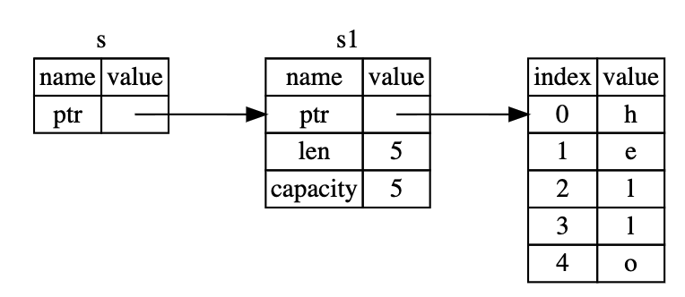

# 그 책

https://rinthel.github.io/rust-lang-book-ko/ch00-00-introduction.html

## 의문

- *링커가 뭐지?*

## 1. 시작하기

### 소개

- 컴파일러가 매우 강력하다
  - 동시성 버그를 비롯하여 찾기 어려운 버그를 가진 코드는 컴파일 거부
    - *어떻게 이게 가능한것일까?*
- 현대적 개발자 도구
  - Cargo
  - Rustfmt
    - 일관적인 코딩 스타일
  - Rust Language Server
    - IDE와 결합해서 자동완성, 인라인 에러 기능 제공
- 속도와 안정성을 둘다 소중히 여긴다
  - 속도
    - 프로그램의 속도
    - 생산성
  - 안정성
- 감상
  - 인간의 모든 실수를 미리 예상해서 막아주려는 노력의 흔적이 보임
    - 그런데 진짜 모든 것을 막아줄 수 있을까?
    - e.g) data race

### Cargo

- 개요
  - 러스트 빌드 시스템 및 패키지 매니저
  - c.f) crate
    - 코드의 패키지(라이브러리)
- 장점
  - OS를 위한 특정 명령이 없음
- 프로젝트 생성
  - `cargo new hello_cargo --bin`
- `cargo build`
  - `target/debug/hello_cargo`
    - 실행파일 생성
- `cargo run`
  - 실행
- `cargo check`
  - 코드가 컴파일되는지 빠르게 확인

## 3. 보편적인 프로그래밍 개념

### Shadowing

```rust
fn main() {
  let x = 5;

  // immutability is maintained
  let x = x + 1;

  let x = x * 2;

  println!("The value of x is: {}", x);
}
```

### 타입

- 스칼라 타입
  - integer
    - `i8, u8, i16, u16, i32(default), u32, i64, u64, isize, usize`
  - float
    - `f32, f64(default)`
    - *f32, f64의 차이? 정밀도?*
  - boolean
    - `true, false`
  - char
    - unicode scalar
- 복합 타입
  - tuple
    - `let tup: (i32, f64, u8) = (500, 6.4, 1)`
  - array
    - 같은 타입의 고정된 길이의 값들의 집합체

### 함수

- expression
  - literal, operation, block, function call, macro, if expression
    - 종결을 나타내는 세미콜론을 사용하지 않음
    - 함수는 암묵적으로 마지막 표현식 반환
- statement

### 제어문

- loop
- while
- for
  - collection반복

## 4. 소유권 이해하기

### 4.1 소유권이 뭔가요?

- 메모리 관리
  - gc
  - 프로그래머가 명시적으로 메모리 할당 / 해제
  - 컴파일 타임에 컴파일러가 체크할 규칙들로 구성된 소유권 시스템을 통해 관리
- 소유권
  - 정의
    - 힙 데이터를 관리하기 위한 러스트만의 고유한 메모리 관리 시스템
  - 규칙
    - 1 러스트의 각각의 값은 해당값의 owner라고 불리는 변수를 갖고 있음
    - 2 한번에 딱 하나의 owner만 존재할 수 있음
    - 3 owner가 스코프 밖을 벗어나는 때, 값은 버려짐

#### String 예제와 함께하는 소유권 이해

- 힙 메모리와 할당
  - 1 런타임에 운영체제로부터 메모리가 요청되어야 한다
  - 2 `String`의 사용이 끝났을 때 운영체제에게 메모리를 반납할 방법이 필요하다
    - 어려움
- RAII(Resource Acquisition Is Initialization)
  - 아이템의 수명주기의 끝나는 시점에 자원을 해제

Rust RAII의 예시

```rust
{
    let s = String::from("hello"); // s는 여기서부터 유효합니다

    // s를 가지고 뭔가 합니다
}                                  // 이 스코프는 끝났고, s는 더 이상
                                   // 유효하지 않습니다(drop 자동 호출)
```

- 변수와 (힙)데이터가 상호작용하는 방법: 이동(move)
  - 정의
    - 소유권의 이전
  - 특징
    - `(let s2 = s1)`
    - s1은 더이상 유효하지 않은 name
  - 이유
    - double free error를 피하기 위함
- 변수와 (힙)데이터가 상호작용하는 방법: 클론(clone)
  - 정의
    - 힙 데이터의 복사
  - 특징
    - 다른 언어에서의 deep copy
    - c.f) 기본적으로 스택에만 있는 데이터는, 컴파일 타임에 크기가 모두 확정되기 때문에 쉽게 복사가 됨
      - scalar 데이터 타입은 기본적으로 copy
      - scalar 데이터 타입으로만 구성된 tuple도 copy
  - 이유
    - 때로는 정말로 복사가 필요한 경우가 존재
- 소유권과 함수
  - 함수에게 변수를 argument로 넘겨주는 것은 move or copy임
    - scalar가 아닌경우 move
    - references, borrowing으로 해결

```rust
fn main() {
    let s = String::from("hello");  // s가 스코프 안으로 들어왔습니다.

    takes_ownership(s);             // s의 값이 함수 안으로 이동했습니다...
                                    // ... 그리고 이제 더이상 유효하지 않습니다.
    let x = 5;                      // x가 스코프 안으로 들어왔습니다.

    makes_copy(x);                  // x가 함수 안으로 이동했습니다만,
                                    // i32는 Copy가 되므로, x를 이후에 계속
                                    // 사용해도 됩니다.

} // 여기서 x는 스코프 밖으로 나가고, s도 그 후 나갑니다. 하지만 s는 이미 이동되었으므로,
  // 별다른 일이 발생하지 않습니다.

fn takes_ownership(some_string: String) { // some_string이 스코프 안으로 들어왔습니다.
    println!("{}", some_string);
} // 여기서 some_string이 스코프 밖으로 벗어났고 `drop`이 호출됩니다. 메모리는
  // 해제되었습니다.

fn makes_copy(some_integer: i32) { // some_integer이 스코프 안으로 들어왔습니다.
    println!("{}", some_integer);
} // 여기서 some_integer가 스코프 밖으로 벗어났습니다. 별다른 일은 발생하지 않습니다.
```

### 4.2 참조자(References)와 빌림(Borrowing)

```rust
fn main() {
    let s1 = String::from("hello");

    let len = calculate_length(&s1);

    println!("The length of '{}' is {}.", s1, len);
}

fn calculate_length(s: &String) -> usize { // s는 String의 참조자입니다
    s.len()
} // 여기서 s는 스코프 밖으로 벗어났습니다. 하지만 가리키고 있는 값에 대한 소유권이 없기
  // 때문에, 아무런 일도 발생하지 않습니다.

```

위 코드에 대한 References and borrowing 다이어그램 예시



- 참조자
  - 정의
    - 값은 참조하지만 소유하지는 않음
  - 특징
    - 참조하는 것은 데이터 변경 불가
- 가변 참조자
  - 특징
    - 참조하는 것을 변경하려면 가변 참조자(mutable references)로 만들어야 함
    - 특정한 스코프 내에 특정한 데이터에 대한 가변 참조자를 딱 하나만 만들 수 있음
      - compile time data race 방지
      - 그래서 여러개만들고 싶으면, 블록으로 가변참조자 여러개 만들면 됨
    - 불변 참조자가 있을때는 가변 참조자를 만들 수 없음
      - 단순히 read할때는 data race가 일어나지 않음
  - c.f) data race 조건
    - 두 개 이상의 포인터가 동시에 같은 데이터에 접근
    - 그 중 적어도 하나의 포인터가 데이터를 작성
    - 데이터에 접근하는데 동기화를 하는 어떠한 메커니즘도 없음
  - c.f) dangling references
    - 어떤 메모리를 가리키는 포인터를 보존하는 동안, 그 메모리를 해제함으로써 다른 개체에게 사용하도록 줘버렸을 지도 모를 메모리를 참조하고 있는 포인터
- 빌림
  - 정의
    - 함수의 파라미터로 참조자를 만드는 것

### 4.3 슬라이스

스트링 슬라이스 코드 예시

```rust
let s = String::from("hello world")

let hello = &s[0..5];
let world = &s[6..11];
```

위 코드에 대한 slice 다이어그램 예시


- 슬라이스
  - 정의
    - 컬렉션 전체가 아닌, 컬렉션의 연속된 일련의 요소들을 참조할 수 있게 함
- 주의
  - `String` type과 `&str` 타입은 엄연히 다름
