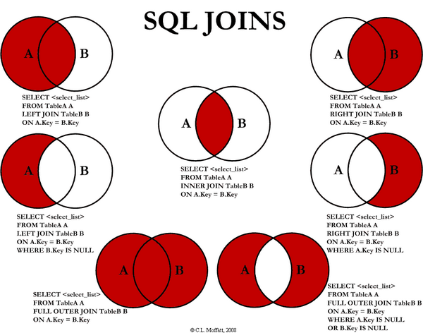

# SQL기초 강좌

- [하테나 데이터베이스 교과서](https://github.com/hatena/Hatena-Textbook/blob/master/database-programming.md)

- [宣言型プログラミング](https://ja.wikipedia.org/wiki/%E5%AE%A3%E8%A8%80%E5%9E%8B%E3%83%97%E3%83%AD%E3%82%B0%E3%83%A9%E3%83%9F%E3%83%B3%E3%82%B0)

SQL은 취득하는 집합의 성질을 선언 하는 것이며, 취득의 구체적인 방법은 기술 하지 않는다.（Declarative Programming）

## 데이터베이스를 사용하는 이유

- 데이터의 추상화
  - 데이터가 디스크 안에 어떤 식으로 저장되어있는지는 신경쓰지 않아도 된다.
- 병렬 엑세스 가능
  - 크랜젝션/록 기능이 있다.
  - 병렬 엑세스 애플리케이션이라도 이용할떄는 하나의 접속만 생각하면 된다.
- 크래시 복귀 기능(데이터 손실 방지)
  - 정전등에 의해서 서버가 죽는 경우가 있다.
  - 파일 시스템에 그대로 기록하는 경우, 파일 기록중에 정전이 나면 기록 내용이 도중까지로 잘리거나, 아에 파일 자체가 사라지는 경우 발생.

## 데이터베이스 종류

- 관계형 데이터베이스
  - MySQL / PostgreSQL / SQLite
- 칼럼 지향 데이터베이스
  - BigTable / Apache Cassandra / Apache HBase
- 문서 지향 데이터베이스
  - MongoDB / Apache CouchDB / Elasticsearch
- 그래프 데이터베이스
  - Neo4j
- KVS(Key Value Store)
  - Memcached / Redis / Riak

## 관계 모델

- 관계모델이란
  - 데이터를 관계로서 표현하여 다루는 모델
- 관계란
  - 속성을 갖는 터플의 집합을 나타낸다

```
R: (ID, 이름, 생일) = {
  (1, abc, 2007-08-31),
  (2, efg, 2007-12-27),
  ...
}
```

관계에는 다음과 같은 종류가 있다:

- 합(union)
- 차(difference)
- 곱집합(cartesian product)
- 선택(restriction): 일정한 조건을 만족하는 관계의 터플을 추출
- 사영(projection): 관계의 터플들을 필요한 열만 추출
- 결합(join): 두 관계에서 열이 같은 것을 나타내는 값을 붙이는 연산
- 분할(division): C2를 포함하는 C1열의 값의 조합중에서 C2열의 값을 제외한 것

## 기본적인 SQL

```sql
/* 테이블 만들기 */
CREATE TABLE album (
  id INTEGER NOT NULL AUTO_INCREMENT,
  artist_id INTEGER,
  name VARCHAR(128),
  released_on DATE
);

/* CRUD */
INSERT INTO artist (id, name, birthday) VALUES (5, 'abc', '2008-04-01');
INSERT INTO artist SET id = 5, name = 'abc', birthday = '2008-04-01';

SELECT birthday FROM artist WHERE name = 'abc';
SELECT * FROM artist WEHRE birthday < '2009-01-01' ORDER BY birthday DESC;

UPDATE artist SET birthday = '2008-07-18' WHERE name LIKE 'cde';

DELETE FROM artist WHERE id = 4;

/* SELECT문 파헤치기 */
/* 1. id가 4인 artist는? */
SELECT * FROM artist WHERE id = 4;

/* 2. name이 abc가 아닌 artist의 name은? */
SELECT name FROM artist WHERE name != 'abc';

/* 3. id가 1또는2또는4인 artist는? */
SELECT * FROM artist WHERE id IN (1, 2, 4);

/* 4. 가장 birthday가 최근인 artist는? */
SELECT * FROM artist ORDER BY birthday DESC LIMIT 1;

/* 5. 두번째로 birthday가 최근인 artist는? */
SELECT * FROM artist ORDER BY birthday DESC LIMIT 1 OFFSET 1;

/* 6. sex에 따른 artist의 수를 나타내라 */
SELECT sex, COUNT(*) AS artist_nums FROM artist GROUP BY sex;
```

## 테이블 Join의 종류



테이블의 Join은 다음과 같이 크게 나뉜다.

- Inner Join
- Outer Join
  - Left Join
  - Right Join

## 트랜젝션 처리

- 트랜젝션은 실패를 허용하지 않는 데이터 엑세스 군
- ACID특성을 갖는다.
  - 원자성(atomicity)：
  - 일관성(consistency)：
  - 독립성(isolation)：
  - 내구성(durability)：
- 은행의 송금 시스템
  - 절대로 에러가 나서는 안됨.

## 보다 좋은 스키마를 설계하기 위해서

### 칼럼의 데이터 타입

- 칼럼의 데이터 타입, 특히 숫자형은 범위를 벗어나지 않도록 조심할 것.
- 21억 레코드는 의외로 쉽게 넘어버린다.
- id는 `BIGINT UNSIGNED`로 하는게 안전.
  - 18446744073709551615(1844경)

### 제약

- 레코드에 반드시 의존하는 칼럼은 `NOT NULL`제약을 붙인다.
- 칼럼에 대응하는 값이 테이블 안에서 하나씩만 존재하면 `UNIQUE KEY`제약을 붙인다.

```sql
-- 보다 좋은 정의
CREATE TABLE artist (
  `id` BIGINT UNSIGNED NOT NULL AUTO_INCREMENT,
  `name` VARCHAR(32) NOT NULL,
  `birthday` DATE NOT NULL DEFAULT '0000-00-00',
  PRIMARY KEY (id),
  UNIQUE KEY (name)
);

CREATE TABLE album (
  `id` BIGINT UNSIGNED NOT NULL AUTO_INCREMENT,
  `artist_id` BIGINT UNSIGNED NOT NULL,
  `name` VARCHAR(128) NOT NULL,
  `released_on` DATE NOT NULL DEFAULT '0000-00-00',
  PRIMARY KEY (id),
  UNIQUE KEY (artist_id, name)
);
```

### PRIMARY KEY: 주 키

- 테이블 안에서 레코드를 한번에 식별할 수 있는 칼럼(임의)
  - 다른 레코드와 값이 같아서는 안된다(UNIQUE제약)
  - 값이 없어서는 안된다(NOT NULL제약)
- 테이블에 하나만 설정 가능하다
- 인덱스로 사용 가능하다
- id라는 이름을 갖는다

### 테이블 간의 관계

[이곳](https://github.com/hatena/Hatena-Textbook/blob/master/database-programming.md#%E3%83%86%E3%83%BC%E3%83%96%E3%83%AB%E9%96%93%E3%81%AE%E3%83%AA%E3%83%AC%E3%83%BC%E3%82%B7%E3%83%A7%E3%83%B3)을 직접 참고

- 일대일
- 일대다
- 다대다

```sql
CREATE TABLE album_artist_relation (
  `album_id` BIGINT UNSIGNED NOT NULL,
  `artist_id` BIGINT UNSIGNED NOT NULL,

  PRINARY KEY (album_id, artist_id)
);
```

## 성능

- 데이터베이스는 웹 서비스에 있어서 병목(bottle neck)이 되기 싶다.
- 실패하면 서비스가 다운 되는 경우가 있음
- 조심해야 한다

### 데이터베이스가 병목이 되는 이유

- RDBMS는 스케일하기 어렵다
  - 복수의 서버 사이에 일관성과 가용성을 담보하는 것을 의식해야 하기 때문에 데이터를 분산하기 힘들다
  - CAP정리
    - 일관성(Consistency): 모든 노드가 같은 순간에 같은 데이터를 볼 수 있다.
    - 가용성(Availability): 모든 요청이 성공 또는 실패 결과를 반환할 수 있다.
    - 분할내성(Partition tolerance): 메시지 전달이 실패하거나 시스템 일부가 망가져도 시스템이 계속 동작할 수 있다.
    - 위의 세 조건을 모두 만족하는 분산 컴퓨터 시스템은 존재하지 않는다.
- 애플리케이션 서버는 스케일하기 쉽다.
  - 그래서 하드웨어 리소스를 필요로 하는 처리는 애플리케이션 서버에서 하는 편이 좋다.

### 추측보다 계측

- 감으로 대처해서는 안된다.
  - 무의미하게 복잡하게 될 뿐
- 문제가 일어났을 때에는 계측하여, 병목을 부수자.
- `EXPLAIN`문을 사용한다.

```sql
EXPLAIN SELECT album.name
FROM album LEFT JOIN artist ON album.artist_id = artist.id
WHERE artist.name = "abc";
```

### 성능 대책

- 쿼리 수에 민감하게 반응하라
  - 하나의 쿼리로 해결할 수 있는 곳은 하나의 쿼리로
    - **루프 안에서 쿼리를 던지는 경우** 는 피해야 한다.
- 불필요한 쿼리는 던지지 않는다
- 늦어지기 쉬운 쿼리를 조심한다
  - 인덱스를 사용하지 않는 경우
  - 아무때나 JOIN
  - 아무때나 서브쿼리

### 인덱스

- 칼럼의 조합에 맞춰 인덱스를 작성할 수 있다.
- 인덱스에는 `B-tree`가 사용된다
- 계산량
  - 인덱스가 없음: `O(n)`
  - 인덱스가 존재: `O(logn)`
- 단점
  - 갱신 / 삭제에 오버헤드가 존재
  - 일반적인 애플리케이션에서는 Read수 > 갱신수 이므로 그닥 문제가 되지 않는다.

[참고: 왜 모든 컬럼에 인덱스를 걸면 안되는가?](http://hashcode.co.kr/questions/1551/%EC%99%9C-db-%ED%85%8C%EC%9D%B4%EB%B8%94%EC%9D%98-%EB%AA%A8%EB%93%A0-%EC%BB%AC%EB%9F%BC%EC%97%90-%EC%9D%B8%EB%8D%B1%EC%8A%A4%EB%A5%BC-%EA%B1%B8%EB%A9%B4-%EC%95%88%EB%90%98%EB%82%98%EC%9A%94)

### 다뤄지지 않은 부분

- 서브 쿼리
- DISTINCT
- UNION구
- 외부키(Foreign Key)제약
- TRIGGER
- DBMS유저 관리와 권한

## TIP

### 1. SQL에서는 단따옴표로 둘러싸이지 않는 경우, property(column)으로 인식한다.

```sql
-- SQL에서는 단따옴표로 둘러싸이지 않는 경우, property(column)으로 인식한다.
-- 좋지 못한 예
INSERT INTO artist (name, birthday) VALUES (kim, 2012-11-03);

-- 좋은 예
INSERT INTO artist (name, birthday) VALUES ('kim', '2012-11-03');
```

### 2. 파일에 쓰여진 SQL을 읽어서 실행하기

```sh
cat db/schema.sql | mysql -unobody -pnobody intern_diary_$USER
```
