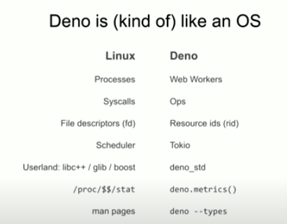
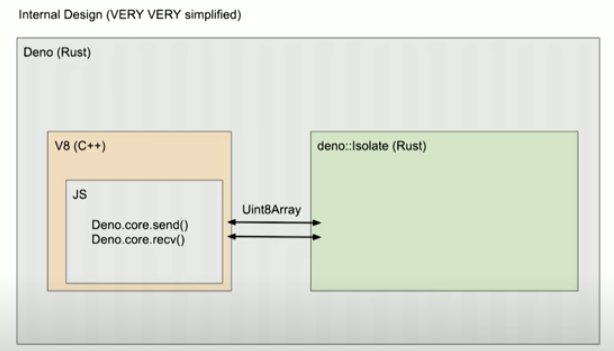
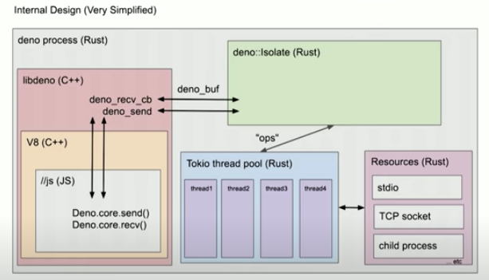

# Deno

- 의문
- 개요
- Why?
- Deno
  - Runtime hands-on
  - Architecture
  - deno_std(Standard Modules)
  - Performance

## 의문

- *array buffer*

## 개요

- 정의
  - JS와 TS를 실행하기 위한 command-line runtime
- 구성
  - V8
    - compiler
      - parser
      - lexer
    - interpreter
      - frame stack
      - JIT
      - ...
  - Rust
  - Tokio(event loop)
  - TypeScript compiler

## Why?

- 배경
  - JS는 많이 발전해왔다
    - Promises / Async / Await
    - ES Modules
    - Typed Arrays
- Node의 문제
  - 중앙 배포 형식의 잘못 디자인된 모듈 시스템
    - e.g) npm 근데, npm은 webby하지 않음(web은 decentralized 적인 성향)
  - 서포트가 필요한 많은 Legacy API들
  - 보안
  - (물론 위의 문제는 Python, Ruby도 갖고있음)
- 라이언 달의 생각
  - fun / productive system for scripting이 가능한 dynamic language platform을 만들고 싶음

## Deno

- Node의 문제 해결
  - **`ES modules`이 하나이며 유일한 모듈 시스템**
    - HTTP URL이 서드파티 코드를 가져오는데에 사용됨
    - Deno 자체가 resource를 가져올 수 있으므로, 자체가 패키지 매니저
  - **default로 안전함**
    - disk, network 자원에 접근하기 위해서 user의 permission이 반드시 필요함
  - browser compatibility까지 고려
    - global Deno object를 사용하지 않는 JS로 작성된 Deno program은 변경 없이 모던 브라우저에서 사용 가능함

### Runtime hands-on

- Deno 네임스페이스에 웬만하게 필요한건 (e.g) 노드의 `fs`모듈 등) 다 들어있음
- 브라우저환경에 잘 호환되도록 만들었음
  - `location.href` vs `import.meta.url` 등
- Deno의 모듈 시스템은 go의 그것과 닮았다

### Architecture

Deno와 OS의 metaphor

Deno architecture1(Over simplified)

Deno architecture2(Over simplified)

- 아키텍처
  - All things should be Ops
  - All things should be sending typed array

### deno_std(Standard Modules)

- Deno core는 가능한한 작게 함
  - 대신 퀄리티는 높게 유지
- 특징
  - dependency hell 문제를 부분적으로 해결함
    - 외부 의존성을 갖지 않게 함으로써

### Performance

- I/O 퍼포먼스가 느림
