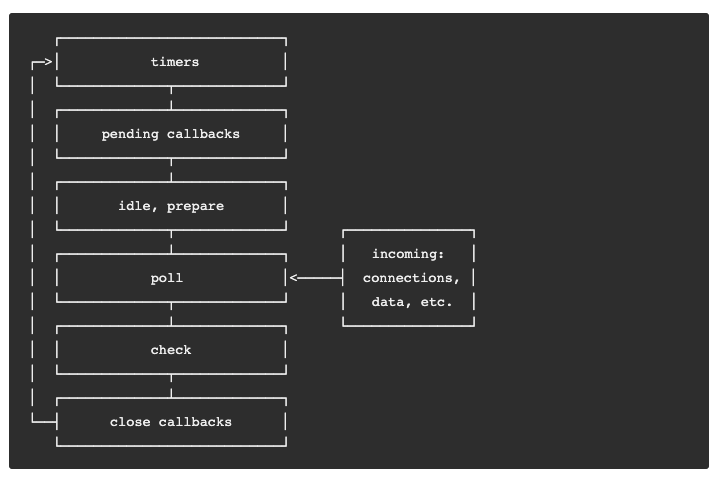

# Event loop

- 의문
- 개요
- Event loop 설명
- Event loop 관련 주의 사항

## 의문

- Node.js, 자바스크립트 엔진, 이벤트 루프의 관계?
  - Node.js
    - 이벤트 루프가 동작하도록 함
  - 이벤트 루프(`uv__loop`)
    - kernel에 일을 던져줘서 non-blocking I/O operation을 할 수 있도록 해줌
    - v8 엔진을 사용해서 자바스크립트 코드 실행

## 개요

- Node.js 플랫폼이 kernel에 일감을 던져줘서 non-blocking I/O operation을 할 수 있도록 하게 해주는 것
  - JavaScript가 싱글스레드임에도 non-blocking으로 하게 해줌
  - 현대 커널들은 multi-threaded
    - 백그라운드에서 실행하고 끝나면 Node.js에 알려줘서 callback을 poll queue에 추가함

## Event loop 설명

Nodejs event loop overview diagram(each box is a phase of the event loop)



- Node.js가 시작
  - event loop를 initialize
  - async API call이나 schedule timer나 `process.nextTick()`과 같은 것을 호출하는 input script를 처리하고, event loop처리를 시작함
  - c.f) libuv는 무슨 일을 하는가?
    - **Node.js의 event loop와 비동기 동작을 구현할 때 사용되는 C라이브러리**
- Event loop의 구조
  - 개요
    - phase로 이루어져 있음
      - 각 phase는 callback들의 queue를 갖음
    - event loop의 각각의 실행 사이에, node.js는 기다리는 비동기 I/O or timer가 있는지 체크하고, 아무것도 없다면 깔끔하게 shut down
      - *이벤트 루프가 shut down된다는 것은, 결국, 프로그램이 종료된다는 것을 의미하는가? 아니면, 프로그램은 종료가 안되었는데, 그냥 아무것도 실행을 안할경우에 이벤트 루프가 잠깐 종료가 된다는것인가?*
        - 전자가 맞는거 같긴한데.. (왜냐하면 코드의 실행도 이벤트루프에서 싱글스레드로 이루어지기 때문)
  - phase
    - 동작
      - event loop가 특정 phase로 진입
      - 해당 phase specific한 동작 수행
      - 해당 phase의 callback들을 queue가 비워질때까지 or 최대개수의 callback이 실행될때까지 수행
      - 다음 phase로 이동
    - 종류
      - timers
        - `setTimeout()`, `setInterval()`로 스케줄링된 콜백을 실행
      - pending callbacks
        - *next loop iteration으로 연기된* I/O callbacks을 실행
          - *정확히 무슨의미?*
      - idle, prepare
        - *내부적으로만 사용*
      - poll
        - 새 I/O 이벤트를 가져오고, I/O 관련 callback들을 실행
          - 거의 모든 callbacks을 실행함(close callback, timer 로 등록된 callback, `setImmediate()`)
      - check
        - `setImmediate()`의 callback이 실행
      - close callbacks
        - `socket.on('close', ...)`와 같은 close callback

### Timers phase

- 개요
  - timer는 callback이 실행될 수 있는, threshold를 설정하는 것
    - 정확한 시간이 아님
    - OS scheduling이나 다른 callback이 이것의 실행을 지연시킬 수 있음
    - 기술적으로는 poll phase가 timer가 언제 실행될지 제어

코드 예시

```js
const fs = require('fs');

function someAsyncOperation(callback) {
  // Assume this takes 95ms to complete
  fs.readFile('/path/to/file', callback);
}

const timeoutScheduled = Date.now();

setTimeout(() => {
  const delay = Date.now() - timeoutScheduled;

  console.log(`${delay}ms have passed since I was scheduled`);
}, 100);

// do someAsyncOperation which takes 95 ms to complete
someAsyncOperation(() => {
  const startCallback = Date.now();

  // do something that will take 10ms...
  while (Date.now() - startCallback < 10) {
    // do nothing
  }
});
```

- 코드 해설
  - event loop가 poll phase에 진입
    - 처음에는 `fs.readFile()`의 동작이 끝나지 않았으므로, 빈 큐만 존재
    - 가장 빠른 timer의 threshold가 도달할 때까지 기다림(100ms)
  - 95ms가 경과
    - `fs.readFile()`이 file읽기가 끝나고, 그것의 10ms짜리 콜백이 poll queue에 추가
    - 위의 콜백 실행
  - 105ms가 경과(콜백 실행 후)
    - poll queue에 아무것도 존재하지 않음
    - event loop는 가장 빠른 timer의 threshold가 도달했음을 알고, timers phase에 가서 timer의 콜백을 실행
    - 따라서 105ms에 timer의 콜백이 실행됨
  - c.f) poll phase가 event loop를 잠식하는것 방지
    - libuv에 hard maximum polling event제한이 존재

### Pending callbacks phase

- 개요
  - TCP 에러와 같은 시스템 동작 콜백을 실행하는 phase
- 예시
  - TCP소켓이 connect를 시도할 때, `ECONNREFUSED`를 받으면, 몇몇 *nix 시스템은 에러를 리포팅하기위해서 대기함
  - 이는 pending callbacks phase에 큐잉됨

### Poll phase

- 개요
  - 1 I/O를 위해서 얼마나 오래 block해야하는지, polling해야하는지 계산
  - 2 poll queue에 있는 이벤트 처리
- 동작
  - timer schedule이 없는 경우
    - poll queue가 비어있지 않은 경우
      - event loop가 해당 큐를 iterate하면서 callback을 동기적으로 실행
      - 큐안에 있는것 전부 or maximum hard limit개수만큼
    - poll queue가 비어있는 경우
      - `setImmediate()`가 스케쥴링 되어있는 경우
        - check phase로 진행해서 스케쥴링된 스크립트 실행
      - `setImmediate()`가 스케쥴링 되어있지 않은 경우
        - callback이 queue에 추가될 때 까지 대기하고, 즉각 실행
  - poll queue가 다 비어지면, timer를 체크해서, time threshold가 도달했는지 확인하고, 준비된 callback은 event loop가 timers phase로 진행하여 콜백을 실행

### Check phase

- 개요
  - poll phase가 끝난 다음에 즉시 callback을 실행하도록 함
  - poll phase가 idle이 되고, `setImmediate()`로 큐잉된 콜백이 있으면, event loop은 대기하지 않고 check phase로 진행

### Close callbacks phase

- 개요
  - 소켓이나 handle이 갑자기 close되는 경우, 'close'이벤트가 이 phase에 발생되며, 그렇지 않은 경우에 `process.nextTick()`으로 발생됨

## Event loop 관련 주의 사항

### `setImmediate()` vs `setTimeout()`

- `setImmediate()`
  - current poll phase가 끝나면 콜백을 실행하도록 함
  - I/O cycle에서(poll phase) 스케쥴링 되는경우, 현재 얼마나 많은 타이머가 존재하던지 간에, 독립적으로 해당 타이머 콜백 이전에 실행됨
- `setTimeout()`
  - minimum threshold in ms가 지나면 콜백을 실행하도록 함

예시코드1

```js
setTimeout(() => {
  console.log('timeout');
}, 0);

setImmediate(() => {
  console.log('immediate');
});
```

- *main 모듈에서 코드가 실행되는 경우, 타이머의 실행은 non-deterministic*
  - *이건 왜 그러지?*

예시코드2

```js
// timeout_vs_immediate.js
const fs = require('fs');

fs.readFile(__filename, () => {
  setTimeout(() => {
    console.log('timeout');
  }, 0);
  setImmediate(() => {
    console.log('immediate');
  });
});
```

- I/O cycle에서 두 코드가 실행되는 경우, poll phase에서 실행되고, setImmediate의 콜백등록으로 인하여, 바로 그다음 phase인 check phase로 진행됨

### `process.nextTick()`

- 개요
  - **event loop에서 기술적으로 다루지 않음**
  - 현재 어떤 phase인지 상관없이 `nextTickQueue`가 현재의 operation이 끝나고 나서 처리됨
  - `process.nextTick()`에 등록된 콜백들은 event loop이 *진행하기 전에* 전부 해결됨
    - *진행하기 전이라는 것은 정확히 언제?*
    - 이는 recursive `process.nextTick()`콜을 할 경우, event loop가 poll phase에 도달하지 못하게 막음

왜 `process.nextTick()`이 허용되는가의 예시 코드

```js
// 예시1
function apiCall(arg, callback) {
  if (typeof arg !== 'string') {
    return process.nextTick(
      callback,
      new TypeError('argument should be string')
    )
  }
}

// 예시2
const server = net.createServer();
server.on('connection', (conn) => { });

server.listen(8080);
// listen은 내부적으로 process.nextTick()을 사용하여 바인딩하기 때문에, 다음 listening에 관련된 콜백도 등록
server.on('listening', () => { });

// 예시3
const EventEmitter = require('events');
const util = require('util');

function MyEmitter() {
  EventEmitter.call(this);

  // use nextTick to emit the event once a handler is assigned
  // 'event' 이벤트 핸들러가 등록되고 나서, emit됨
  process.nextTick(() => {
    this.emit('event');
  });
}
util.inherits(MyEmitter, EventEmitter);

const myEmitter = new MyEmitter();
myEmitter.on('event', () => {
  console.log('an event occurred!');
});
```

- 왜 `process.nextTick()`이 허용되는가?
  - 디자인 철학으로, API가 async여야만 해야하는 경우
    - e.g)
      - 예시1 나머지 유저의 코드가 실행되고 나서, 그리고 event loop이 진행하기 전에, error를 callback으로 넘겨주기 위함
      - 예시2 'listening'컬백을 `nextTick()`에 큐잉해두고, 일단 런타임에 실행중인 코드를 먼저 다 실행시켜서, 유저가 event handler를 등록할 수 있도록 함

### `process.nextTick()` vs `setImmediate()`

- 비교
  - `process.nextTick()`
    - 해당 콜백 함수가 같은 페이즈에서 현재 실행되고 있는 자바스크립트 태스크가 끝나마자마 즉시 실행됨
  - `setImmediate()`
    - 해당 콜백 함수가 이벤트루프의 다음 tick이나 다음 iteration에서 실행됨
  - 주의
    - 따라서 이름이 바뀌어야 함
      - 그런데, 이건 이미 존재하는 많은 소프트웨어의 변경을 가져오므로, 바뀌지 않을것임
    - 기본적으로 개발자는 `setImmediate()`를 사용하는것을 권장
      - 더 사고하기 쉬움
