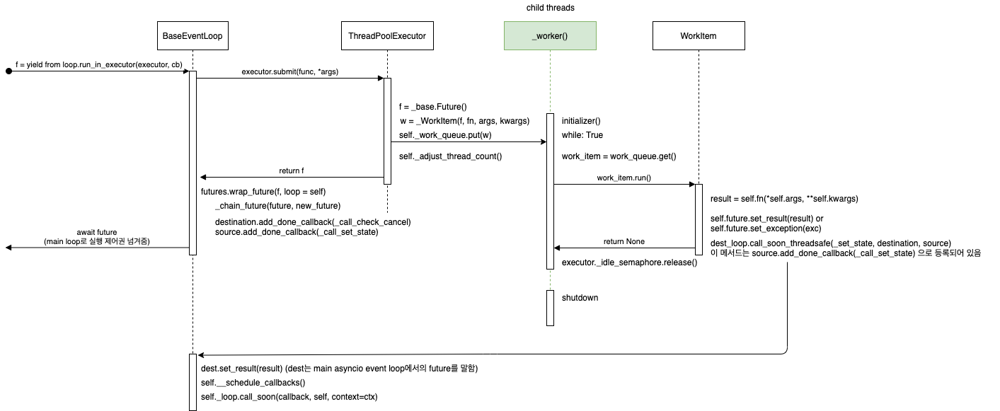

# AsyncIO in Python

- 참고
- 의문
- 부록0. python의 asyncio.futures.Future vs concurrent.futures.Future
- 부록1. python의 asyncio.futures.Future vs asyncio.tasks.Task
- 부록2. `asyncio.run(coro)`
- 부록3. `asyncio.loop.run_in_executor(fn)`
- The asyncio Package and async/await
- Async IO Design Patterns
- AsyncIO's Roots in Generators
- AsyncIO in Context

## 참고

- https://docs.python.org/ko/3/library/asyncio-task.html

## 의문

## 부록0. python의 asyncio.futures.Future vs concurrent.futures.Future

### `asyncio.futures.Future`

- 개요
  - Event loop와 상호작용하며, threading을 사용하여 future computation과 value를 분리하는 경우에 사용되는 Future
    - *`multiprocessing`은 사용하지 않는것일까?*
- 특징
  - 자신의 event loop를 지정 `self._loop = loop`
  - `loop.create_future`로 event loop에서 직접 future를 생성하는 경우가 많음
  - thread-safe이 아님
  - `add_done_callback()`으로 등록된 callback은 event loop의 `call_soon()`을 통해서 호출됨
  - `self.set_result()`
    - `self.__schedule_callbacks()` 호출
    - `self._loop.call_soon(callback, self, context=ctx)` 으로 event loop의 ready queue에 등록
      - **`concurrent.futures.Future`와 다르게 자신이 직접 모든 콜백함수를 실행하지 않음**

### `concurrent.futures.Future`

- 개요
  - Thread를 사용하여 future computation과 value를 분리하는 경우에 사용되는 Future
- 특징
  - `threading.Condition`을 사용하여, thread-safe 임을 보장
    - 모든 method는 `with self._condition` 으로 시작함
  - `self.set_result()`
    - `self._result = result`
    - 모든 waiter에게 자기자신을 notification으로 보냄
    - `self._invoke_callback()`
      - 자기자신이(promise를 행하는 스레드가(child thread)) 모든 콜백함수를 실행

### 서로 다른 future type의 chaining

- `asyncio.futures.wrap_future`
  - `concurrent.futures.Future`와 `asyncio.futures.Future`를 체이닝함
  - e.g)
    - `concurrent.futures.Future`의 result가 set이 되면, 해당 result값을 `asyncio.futures.Future에` set_result로 전달
      - `call_soon_threadsafe()`메서드를 호출
    - 위의 반대도 가능

## 부록1. python의 asyncio.futures.Future vs asyncio.tasks.Task

### `asyncio.futures.Future` vs `asyncio.tasks.Task`

- `asyncio.tasks.Task`
  - Future로 래핑된 coroutine
- `asyncio.futures.Future`

## 부록2. `asyncio.run(coro)`

`asyncio.run()`의 sequence diagram


- *실제로 Future의 computation부분의 코드가 궁금하긴 함*

## 부록3. `asyncio.loop.run_in_executor(fn)`

`asyncio.loop.run_in_executor()`의 sequence diagram



- Threadpool Executor를 이용한 concurrent programming
  - aiofiles가 이를 통해서 구현되어 있음
  - coroutine이 직접적으로 사용되지 않았으므로, `Task`오브젝트는 생성되지 않음

## The asyncio Package and async/await

### The async/await Syntax and Native Coroutines

- async IO의 기저에는 coroutine이 핵심

코드 예시1

```py
import asyncio

async def count(i):
    print("One")
    await asyncio.sleep(1)
    print("Two")

async def main():
    await asyncio.gather(count(), count(), count())

if __name__ == "__main__":
    import time
    s = time.perf_counter()
    asyncio.run(main())
    elapsed = time.perf_counter() - s
    print(f"{__file__} executed in {elapsed:0.2f} seconds.")

# output
# One
# One
# One
# Two
# Two
# Two
# countasync.py executed in 1.01 seconds.
```

- 코드 해설
  - single event loop(coordinator)가 존재하여, Talking to each of the calls to `count()` 를 함
  - task가 `await`와 만나게 되면, 함수는 실행 흐름을 event loop에게 yield 하고, event loop는 다른 일을 행함

코드 예시2(??? 는 맞는지 아닌지 모르는 부분)

```py
import asyncio

async def count(i):
    print(i)
    await asyncio.sleep(i)
    print(i)

async def main():
    # 4. asyncio.gather() 실행으로 count(1), count(2), count(3)의 태스크를 메인루프에 등록 후 일단 main의 실행 흐름을 yield
    # 8. event loop는 그 다음 태스크로 등록된 count(1) 코루틴을 실행. asyncio.sleep에서 event loop로 실행 흐름 yield
    # 9. event loop(??)는 count(1) 로부터 yield 된 실행 흐름을 받아, 다음 태스크인 count(2)코루틴을 실행. asyncio.sleep에서 event loop로 실행 흐름 yield
    # 10. event loop는 count(2) 로부터 yield 된 실행 흐름을 받아, 다음 태스크인 count(3)코루틴을 실행. asyncio.sleep에서 event loop로 실행 흐름 yield
    # 11. event loop는 (태스크 큐에 존재하는??) count(1)에서 asyncio.sleep(1)이 끝난 뒤에(?? 애초에 끝났다는 것을 어떻게 알지? - 이벤트루프가 현재 시간을 가져올 수 있는 메서드를 갖고 있음), 실행 흐름을 다시 count(1) 코루틴으로 넘겨줌
    # 13. event loop는 (태스크 큐에 존재하는??) count(2)에서 asyncio.sleep(2)이 끝난 뒤에, 실행 흐름을 다시 count(2) 코루틴으로 넘겨줌
    # 14. event loop는 (태스크 큐에 존재하는??) count(3)에서 asyncio.sleep(3)이 끝난 뒤에, 실행 흐름을 다시 count(3) 코루틴으로 넘겨줌
    await asyncio.gather(count(1), count(2), count(3))

async def main2():
    # 6. print 실행
    print('main2 start')
    # 7. asyncio.sleep로 sleep 가 끝난후 코루틴의 다음 실행 상태를 태스크 등록(??) 후 event loop로 실행 흐름 yield
    await asyncio.sleep(2)
    print('main2 end')

async def main_of_main():
    # 2. event loop는 main(), main1() 코루틴을 태스크를 이벤트루프에 등록
    # 3. event loop는 현재 태스크에 가장 먼저 존재하는 main() 태스크를 실행
    # 5. event loop는 그 다음 실행해야 할 태스크인 main2() 코루틴을 실행
    # 12. event loop는 main2의 asyncio.sleep(2)가 끝난 뒤에 main2() coroutine으로 실행 흐름 넘겨줌. 실행이 끝나면 event loop으로 실행 흐름 다시 넘겨줌
    # 15. event loop는 현재 task queue에 아무 원소도 존재하지 않은것을 인지
    await asyncio.gather(main(), main2())

if __name__ == "__main__":
    import time
    s = time.perf_counter()
    # 1. event loop 생성 및 main_of_main() coroutine 실행
    # 16. event loop 제거 및 asyncio.run이후 코드의 순차적 실행
    asyncio.run(main_of_main())
    # main2 start
    # 1
    # 2
    # 3
    # 1
    # main2 end
    # 2
    # 3
    elapsed = time.perf_counter() - s
    print(f"{__file__} executed in {elapsed:0.2f} seconds.")
```

- 의문
  - `asyncio.sleep`가 끝나고 나서 event loop는 어떻게 끝났다는 것을 알고 실행 흐름을 넘겨줄 수 있는가?

### The Rules of Async IO

- syntax
  - `async`
    - `async def`
      - 의미
        - native coroutine 혹은 asynchronous generator를 의미
      - 사용법
        - `await`, `return`, `yield` 전부 사용 가능(optional)
          - `async def noop(): pass` 역시 valid
          - `yield from`은 syntax error
        - return, await를 내부에서 사용하면, coroutine 함수를 생성하게 되고, `await`를 사용하여 결과를 받아와야 함
        - yield를 사용하면 asynchronous generator를 생성하게 되고, `async for`를 사용하여 iterate할 수 있게 됨
    - `async with`, `async for`
      - 식 역시 valid
  - `await`
    - 의미
      - 실행 흐름의 컨트롤을 event loop로 넘겨줌
        - caller coroutine이 아니라?
          - event loop로 넘겨주는 것이고, event loop는 task queue를 보고 task가 존재하면 그 태스크로 실행 흐름을 넘겨줄 뿐
      - 만약 `await f()` 식을 `g()` 스코프에서 봄 == `g()`의 실행을 `f()`의 결과가 반환될 때 까지 await함
        - 그러면서 실행 흐름의 컨트롤을 event loop로 넘겨줌
    - `await f()`
      - f는 awaitable이어야 함
        - 종류
          - coroutine, task, future
        - `__await__()`을 정의한 오브젝트

## Async IO Design Patterns

- Chaining Coroutines
  - coroutine속에서 coroutine을 `await` 하는 경우
- Using Queue
  - 시나리오
    - 많은 서로 관련 없는 Producer들이 item을 queue에 넣음
    - Comsumer의 그룹은 queue로부터 아이템을 가져와서 processing함

Using Queue 예시

```py
import asyncio
import itertools as it
import os
import random
import time

async def makeitem(size: int = 5) -> str:
    return os.urandom(size).hex()

async def randsleep(a: int = 1, b: int = 5, caller=None) -> None:
    i = random.randint(0, 10)
    if caller:
        print(f'{caller} sleeping for {i} seconds')
    await asyncio.sleep(i)

async def produce(name: int, q: asyncio.Queue) -> None:
    n = random.randint(0, 10)
    for _ in it.repeat(None, n):
        print(f'bef {name}')
        i = await makeitem()
        print(f'after {name}')
        t = time.perf_counter()
        await q.put((i, t))
        print(f'Producer {name} added <{i}> to queue.')

async def consume(name: int, q: asyncio.Queue) -> None:
    while True:
        await randsleep(caller=f'Consumer {name}')
        i, t = await q.get()
        now = time.perf_counter()
        print(
            f'Consumer {name} got element <{i}>'
            f' in {now-t:0.5f} seconds'
        )
        q.task_done()

async def main(nprod: int, ncon: int):
    q = asyncio.Queue()
    producers = [asyncio.create_task(produce(n, q)) for n in range(nprod)]
    # consumers = [asyncio.create_task(consume(n, q)) for n in range(ncon)]
    for n in range(1):
        asyncio.create_task(consume(n, q))
    await asyncio.gather(*producers)
    await q.join() # implicitly awaits consumers, too
    # for c in consumers:
    #     c.cancel()

if __name__ == '__main__':
    import argparse
    random.seed(444)
    parser = argparse.ArgumentParser()
    parser.add_argument('-p', '--nprod', type=int, default=5)
    parser.add_argument('-c', '--ncon', type=int, default=10)
    ns = parser.parse_args()
    start = time.perf_counter()
    asyncio.run(main(**ns.__dict__))
    elapsed = time.perf_counter() - start
    print(f'Program completed in {elapsed:0.5f} seconds.')

# python3 async_queue.py -p 2 -c 5
#
# bef 0
# after 0
# Producer 0 added <71c8fc6c28> to queue.
# bef 0
# after 0
# Producer 0 added <e8815a575e> to queue.
# bef 0
# after 0
# Producer 0 added <8f8612aae1> to queue.
# bef 0
# after 0
# Producer 0 added <7c244edd31> to queue.
# bef 1
# after 1
# Producer 1 added <74c1dbbda8> to queue.
# bef 1
# after 1
# Producer 1 added <971b874ac1> to queue.
# bef 1
# after 1
# Producer 1 added <8d2d0ad0e2> to queue.
# bef 1
# after 1
# Producer 1 added <c2165b038b> to queue.
# Consumer 0 sleeping for 0 seconds
# Consumer 0 got element <71c8fc6c28> in 0.00071 seconds
# Consumer 0 sleeping for 4 seconds
# Consumer 0 got element <e8815a575e> in 4.00863 seconds
# Consumer 0 sleeping for 7 seconds
# Consumer 0 got element <8f8612aae1> in 11.01602 seconds
# Consumer 0 sleeping for 4 seconds
# Consumer 0 got element <7c244edd31> in 15.02276 seconds
# Consumer 0 sleeping for 4 seconds
# Consumer 0 got element <74c1dbbda8> in 19.02715 seconds
# Consumer 0 sleeping for 8 seconds
# Consumer 0 got element <971b874ac1> in 27.03263 seconds
# Consumer 0 sleeping for 10 seconds
# Consumer 0 got element <8d2d0ad0e2> in 37.03482 seconds
# Consumer 0 sleeping for 7 seconds
# Consumer 0 got element <c2165b038b> in 44.04057 seconds
# Consumer 0 sleeping for 8 seconds
# Program completed in 44.09003 seconds.
```

## AsyncIO's Roots in Generators

- coroutine을 단순히 실행하면, awaitable coroutine object를 반환
- **`await`은 `yield from`와 더 유사함**
  - `yield from x()` == `for i in x(): yield i`
  - 이전의 generator-based coroutine은 `yield from`을 사용해서 coroutine result를 기다림
- generator의 특징
  - stop 후에 언제든 다시 시작할 수 있음
- `await`은 break point로서, 일시적으로 정지시키고, 프로그램이 나중에 실행될 수 있도록 함

### Other Features: async for and async generators + comprehensions

- `async for`
  - asynchronous iterator를 iterate 하기 위한 키워드
  - asynchronous iterator의 목적은 asynchronous code를 각 스테이지에서 이터레이션을 하면서 호출할 수 있도록 하기 위함
  - container를 iterate할 때, IO bound 작업을 포함하는 경우에도 iterate하기 위한 키워드
- `async with`
  - asynchronous enter, exit
    - `def __aenter__(self)`
    - `def __aexit__(self)`

`async for`, Async Generators + Comprehensions의 예시

```py
import asyncio

# asynchronous generator
async def mygen(u: int = 10):
    i = 0
    while i < u:
        print(u)
        yield 2 ** i
        i += 1
        await asyncio.sleep(0.1) # event loop로 실행 제어권을 넘김

async def main():
    g = [i async for i in mygen(10)] # 동기적으로 실행됨
    f = [j async for j in mygen(20) if not (j // 3 % 5)]
    return g, f

g, f = asyncio.run(main())
print(g)
print(f)
```

- `async for`, `async with`는 coroutine의 실행 제어권을 eventloop로 넘기는 속성을 지키기 위해서만 필요함

### The Event Loop and `asyncio.run()`

- event loop
  - 개요
    - coroutine들을 감시하는 `while True`문이며, 무엇이 idle인지, 어떤 코루틴이 실행 가능한지를 확인
    - 어떤 코루틴이 사용가능하게 되면, 그러한 idle coroutine에게 실행 흐름을 넘겨줄 수 있음
- `asyncio.run()`
  - 개요
    - event loop를 가져오고, 태스크가 끝날 때 까지 실행되며, event loop를 closing함

`get_event_loop()`를 사용한 asyncio

```py
loop = asyncio.get_event_loop()
try:
    loop.run_until_complete(main())
finally:
    loop.close()
```

- `asyncio.get_event_loop()`
  - 개요
    - 튜닝을 제대로 할 것이 아니면, `asyncio.run()`으로 충분함
- 우리가 알아야 할 중요한 것들
  - #1 코루틴은 event loop와 엮여야지만 여러 동작을 수행할 수 있음
  - #2 기본 설정으로, async IO event loop는 싱글 스레드의 싱글코어에서 동작함
    - 물론, multiprocessing을 사용해서 여러 프로세스에서 event loop를 돌릴수도 있음
  - #3 Event loop들은 pluggable함
    - 자신만의 event loop를 만들어서 태스크를 동작 시킬 수 있음
    - 실제로 asyncio 패키지 자체도, event loop의 구현을 두가지로 함
      - selector
      - proactor

### Web crawling 예제

Python web crawling 예제

```py
#!/usr/bin/env python3
# areq.py

"""Asynchronously get links embedded in multiple pages' HMTL."""

import asyncio
import logging
import re
import sys
from typing import IO
import urllib.error
import urllib.parse

import aiofiles
import aiohttp
from aiohttp import ClientSession

logging.basicConfig(
    format="%(asctime)s %(levelname)s:%(name)s: %(message)s",
    level=logging.DEBUG,
    datefmt="%H:%M:%S",
    stream=sys.stderr,
)
logger = logging.getLogger("areq")
logging.getLogger("chardet.charsetprober").disabled = True

HREF_RE = re.compile(r'href="(.*?)"')

async def fetch_html(url: str, session: ClientSession, **kwargs) -> str:
    """GET request wrapper to fetch page HTML.

    kwargs are passed to `session.request()`.
    """

    resp = await session.request(method="GET", url=url, **kwargs)
    resp.raise_for_status()
    logger.info("Got response [%s] for URL: %s", resp.status, url)
    html = await resp.text()
    return html

async def parse(url: str, session: ClientSession, **kwargs) -> set:
    """Find HREFs in the HTML of `url`."""
    found = set()
    try:
        html = await fetch_html(url=url, session=session, **kwargs)
    except (
        aiohttp.ClientError,
        aiohttp.http_exceptions.HttpProcessingError,
    ) as e:
        logger.error(
            "aiohttp exception for %s [%s]: %s",
            url,
            getattr(e, "status", None),
            getattr(e, "message", None),
        )
        return found
    except Exception as e:
        logger.exception(
            "Non-aiohttp exception occured:  %s", getattr(e, "__dict__", {})
        )
        return found
    else:
        for link in HREF_RE.findall(html):
            try:
                abslink = urllib.parse.urljoin(url, link)
            except (urllib.error.URLError, ValueError):
                logger.exception("Error parsing URL: %s", link)
                pass
            else:
                found.add(abslink)
        logger.info("Found %d links for %s", len(found), url)
        return found

async def write_one(file: IO, url: str, **kwargs) -> None:
    """Write the found HREFs from `url` to `file`."""
    res = await parse(url=url, **kwargs)
    if not res:
        return None
    async with aiofiles.open(file, "a") as f:
        for p in res:
            await f.write(f"{url}\t{p}\n")
        logger.info("Wrote results for source URL: %s", url)

async def bulk_crawl_and_write(file: IO, urls: set, **kwargs) -> None:
    """Crawl & write concurrently to `file` for multiple `urls`."""
    async with ClientSession() as session:
        tasks = []
        for url in urls:
            tasks.append(
                write_one(file=file, url=url, session=session, **kwargs)
            )
        await asyncio.gather(*tasks)

if __name__ == "__main__":
    import pathlib
    import sys

    assert sys.version_info >= (3, 7), "Script requires Python 3.7+."
    here = pathlib.Path(__file__).parent

    with open(here.joinpath("urls.txt")) as infile:
        urls = set(map(str.strip, infile))

    outpath = here.joinpath("foundurls.txt")
    with open(outpath, "w") as outfile:
        outfile.write("source_url\tparsed_url\n")

    asyncio.run(bulk_crawl_and_write(file=outpath, urls=urls))
```

## AsyncIO in Context

### When and Why Is Async IO the Right Choice?

- IO-bound 태스크가 많을 경우
  - Network IO
  - Peer-to-peer, multi-user network(group chatroom)
  - Read/Write operation ∧ worry less about holding a lock
