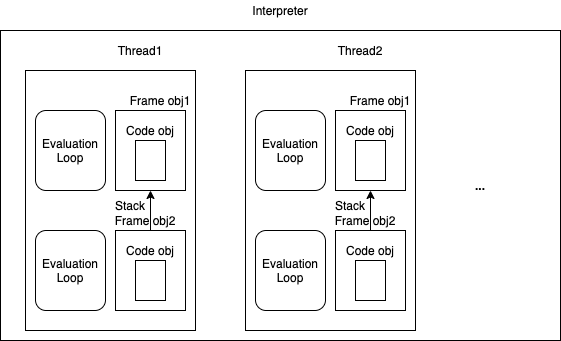

# Eveluation Loop

- 의문
- 0. 부록: python gil scheduling
- 개요

## 의문

- 파이썬의 스레딩 같은 경우에는, evaluation loop이 interpreter process에서 1개만 동작하고, 각 스레드가 lock으로 evaluation loop 자원을 점유하도록 하여, 자신이 실행해야 할 코드 오브젝트를 실행 하는 것인가?
  - 그렇기 때문에 결국에는 한번에 하나의 스레드의 instruction밖에 실행하지 못하는 것인가?
  - I/O bound 연산의 경우에는 CPU bound 동작이 없으므로 득을 볼 수 있는 것인가?
  - **아니다. 각 스레드마다 evaluation loop이 존재한다. 다만, GIL로 락이 걸려있을 뿐**

## 0. 부록: python gil scheduling

Python GIL scheduling 예시 코드

```py
import threading
from types import SimpleNamespace

DEFAULT_INTERVAL = 0.05
gil_mutex = threading.RLock()
gil_condition = threading.Condition(lock=gil_mutex)
switch_condition = threading.Condition()

# dictionary-like object that supports dot (attribute) syntax
gil = SimpleNamespace(
    drop_request=False,
    locked=True,
    switch_number=0,
    last_holder=None,
    eval_breaker=True
)


def drop_gil(thread_id):
    if not gil.locked:
        raise Exception("GIL is not locked")

    gil_mutex.acquire()

    gil.last_holder = thread_id
    gil.locked = False

    # Signals that the GIL is now available for acquiring to the first awaiting thread
    gil_condition.notify()

    gil_mutex.release()

    # force switching
    # Lock current thread so it will not immediately reacquire the GIL
    # this ensures that another GIL-awaiting thread have a chance to get scheduled

    if gil.drop_request:
        switch_condition.acquire()
        if gil.last_holder == thread_id:
            gil.drop_request = False
            switch_condition.wait()

        switch_condition.release()


def take_gil(thread_id):
    gil_mutex.acquire()

    while gil.locked:
        saved_switchnum = gil.switch_number

        # Release the lock and wait for a signal from a GIL holding thread,
        # set drop_request=True if the wait is timed out

        timed_out = not gil_condition.wait(timeout=DEFAULT_INTERVAL)

        # 일정 timed_out이 지난 뒤에, gil을 다시 획득하려 함
        if timed_out and gil.locked and gil.switch_number == saved_switchnum:
            gil.drop_request = True

    # lock for force switching
    switch_condition.acquire()

    # Now we hold the GIL
    gil.locked = True

    if gil.last_holder != thread_id:
        gil.last_holder = thread_id
        gil.switch_number += 1

    # force switching, send signal to drop_gil
    switch_condition.notify()
    switch_condition.release()

    if gil.drop_request:
        # block gil switching
        gil.drop_request = False

    gil_mutex.release()

def execution_loop(target_function, thread_id):
    # Compile Python function down to bytecode and execute it in the while loop

    bytecode = compile(target_function)

    while True:

        # **drop_request indicates that one or more threads are awaiting for the GIL**
        if gil.drop_request:
            # release the gil from the current thread
            drop_gil(thread_id)

            # immediately request the GIL for the current thread
            # at this point the thread will be waiting for GIL and suspended until the function return
            take_gil(thread_id)

        # bytecode execution logic, executes one instruction at a time
        instruction = bytecode.next_instruction()
        if instruction is not None:
            execute_opcode(instruction)
        else:
            return
```

- 각 thread는 자신만의 evaluation loop를 가짐
  - 그렇지 않으면 굳이 lock을 할 필요가 없을듯
- 스레드가 새로 생성되면 `take_gil()` 메서드 실행
- GIL을 특정 thread가 가져감(take_gil)
- evaluation loop는 해당 thread의 thread state에서 frame오브젝트를 가져옴
- frame오브젝트는 code object를 가져옴
- evaluation loop는 해당 code object를 실행
- 동작이 끝나고, 기존에 gil을 기다리는 스레드가 존재하면(`gil.drop_request = True`) `drop_gil` 메서드 실행
- 의문
  - 위의 psudo code에서 gil에 의한 lock은 evaluation loop의 어디에서 일어나는지?
    - `take_gil()`함수에서 무한 루프를 돌게 되어있음
  - *새로운 스레드가 spawn되면 `take_gil()`이 동작한다고 했는데, 여기서 일단 `gil_mutex.acquire()`를 한 뒤에, `gil.drop_request = True`로 설정하고, 계속해서 무한루프를 돌고, `drop_gil()`에서 `gil.locked = False`가 될 때까지 반복하는데, 그 전에 `drop_gil()`에서도 `gil_mutex.acquire()`를 호출하는데, 그럼 데드락이 발생하는 것 아닌가?*
    - `gil_condition.wait()`이 자신의 **lock을 release하면서** timeout까지 기다리거나, `notify()`메서드가 다른 lock을 acquire한 곳에서 호출되기 까지 기다림.
    - 스레드가 여러개인 경우, `take_gil()` 각 함수들은 `take_gil()`의 코드 중 `timed_out = not gil_condition.wait(timeout=DEFAULT_INTERVAL)`에서 블로킹 되고 있고, condition에 `wait()` 순서를 데이터로 관리 (FIFO) 하고 있고, `gil`을 소유하고 있는 thread는 `drop_gil()`에서 가장 먼저 `wait()`하고 있던 thread의 `wait()`을 풀어주고, (`gil_condition.notify(), gil_mutex.release()`) 자신도 `take_gil()`에서 순서를 기다림
  - *`GIL`은 priority나 waiting 타임을 상황에 따라서 변경하는 로직이 존재하는가?*

참고: 파이썬 condition

```py
import time
import threading

condition = threading.Condition()

def t1():
    print('t1')
    print('t1 condition acquiring')
    condition.acquire()
    print('t1 condition acquired')
    print('t1 condition waiting')
    condition.wait()
    print('t1 condition waited')

def t2():
    print('t2')
    print('t2 condition acquiring')
    condition.acquire()
    print('t2 condition acquired')
    print('t2 condition waiting')
    condition.wait()
    print('t2 condition waited')

    while True:
        pass

def t3():
    print('t3')
    print('t3 condition acquiring')
    condition.acquire()
    print('t3 condition acquired')
    print('t3 condition notifing')
    condition.notify()
    print('t3 condition notified')
    print('t3 condition releasing')
    condition.release()
    print('t3 condition released')

    while True:
        pass

f1 = threading.Thread(target=t1)
f2 = threading.Thread(target=t2)
f3 = threading.Thread(target=t3)

f1.start()
time.sleep(1)
f2.start()
time.sleep(1)
f3.start()

# t1
# t1 condition acquiring
# t1 condition acquired
# t1 condition waiting
# t2
# t2 condition acquiring
# t2 condition acquired
# t2 condition waiting
# t3
# t3 condition acquiring
# t3 condition acquired
# t3 condition notifing
# t3 condition notified
# t3 condition releasing
# t3 condition released
# t1 condition waited
```

## 개요

- Code objects
  - 개요
    - 오브젝트 s.t AST로부터 파싱된 bytecode형태의 discrete 연산의 리스트를 포함
    - code object는 input이 있어야 실행이 가능
      - input은 local, global 변수의 형태로 받아들여짐(Value Stack에서 다뤄짐)
    - **결국 컴파일러는 코드 오브젝트를 생성하는 역할이고, 그것을 실제로 실행하고 state를 다루는 것은 interpreter의 역할**
  - 생성되는 장소
    - `.pyc` file
    - compiler
- evaluation loop
  - 개요
    - `Stack Frame` 기반 시스템에 의하여 bytecode instruction을 실행
      - bytecode instruction == code object 인지?
      - code object를 frame object로 변환

example of stack frame

```
Traceback (most recent call last):
  File "example_stack.py", line 8, in <module> <--- Frame
    function1()
  File "example_stack.py", line 5, in function1 <--- Frame
    function2()
  File "example_stack.py", line 2, in function2 <--- Frame
    raise RuntimeError
RuntimeError
```

- stack frame
  - 개요
    - 함수 사이에 변수가 반환되는 것과 함수들이 호출되는 것을 가능하게 하는 데이터 타입
      - arguments, local variables, global variables, 을 포함한 상태 정보를 갖음
  - 특징
    - 다양한 runtime에서 사용되는 데이터 타입
    - 모든 함수 호출시에 생성되며, 순서대로 stacked됨
    - *evaluation loop는 각 frame마다 동작하기 시작하는 듯?*

큰 그림


Interpreter thread frame code object



*interpreter & evaluation loop & thread의 관계를 한눈에 보면 좋겠다.*

*각 스레드마다 하나의 evaluation loop가 존재하는 것인지? 그렇다면 gil이 없으면 한번에 여러 개의 evaluation loop를 돌릴 수 있다는 얘기인데?*

- 중요 개념
  - interpreter는 evaluation loop의 컨테이너
  - interpreter는 적어도 하나의 스레드를 갖음
    - 각 스레드는 thread state를 갖음
  - evaluation loop은 code object를 받아서 frame object의 시리즈로 변환함
    - frame object는 스레드와 link 되어야 함
    - frame stack에서 frame object가 실행 됨
    - 변수는 value stack에서 참조됨
  - *다수의 파이썬 스레드가 동작하는 경우, 각 thread 이벤트루프에 code object를 어떻게 보내줄 수 있는가?*
- Thread State
  - 개요
    - 스레드의 상태를 나타내는 자료구조
    - 30개 이상의 속성을 갖고 있음
  - Type
    - ID
    - linked-list s.t 다른 thread state들을 갖는
    - interpreter state s.t 해당 스레드가 생성된
    - currently executing frame
    - current recursion depth
    - exception currently being handled
    - async exception currently being handled
    - stack of exceptions
      - e.g) raise within an exception block
    - GIL counter
    - async generator counters
    - ...
- Constructing Frame Objects
  - Frame Object
    - 개요
      - **code object안에 있는 명령을 실행하기에 필요한 런타임 데이터를 포함하는 오브젝트**
        - local variables, global variables, builtin modules 등으로 이루어져 있음
        - **code object는 이미 컴파일 타임에 결정된 것들**
    - Type
      - `f_back`
        - Pointer to the previous in the stack, or NULL if first frame
      - `f_code`
        - Code Object to be executed
        - `f_code.co_code`
          - 함수의 바이트코드 바이너리
        - `f_code.co_consts`
          - 함수 내에서 사용된 상수들
        - `f_code.co_varnames`
          - 함수에서 사용된 지역변수 이름들
        - `f_code.co_names`
          - 함수내에서 사용된 전역변수 이름들
      - `f_builtins`
      - `f_globals`
      - `f_locals`
      - `f_valuestack`
        - Pointer to last local
      - `f_stacktop`
      - `f_trace`
      - `f_trace_lines`
      - `f_trace_-`
      - `opcodes`
      - `f_gen`
      - `f_lasti`
        - last instruction
      - `f_lineno`
      - `f_iblock`
      - `f_executing`
      - `f_blockstack`
      - `f_localsplus`

### Frame Object Initialization API

관련 코드는 `Python/clinic/ceval.c`에 존재함

- `PyEval_EvalCode()`
  - 개요
    - code object를 평가하기 위한 entry point
- `_PyEval_EvalCode()`
  - 개요
    - interpreter loop과 frame object의 행위에 대한 내용이 담겨있음
      - CPython 인터프리터 디자인 원칙이 담겨있음
- `_PyFrame_New_NoTrack(tstate, co, globals, locals)`
  - 개요
    - 프레임 오브젝트를 새로 생성함

```c
# Python/clinic/ceval.c

PyObject *
_PyEval_EvalCode(PyThreadState *tstate,
           PyObject *_co, PyObject *globals, PyObject *locals,
           PyObject *const *args, Py_ssize_t argcount,
           PyObject *const *kwnames, PyObject *const *kwargs,
           Py_ssize_t kwcount, int kwstep,
           PyObject *const *defs, Py_ssize_t defcount,
           PyObject *kwdefs, PyObject *closure,
           PyObject *name, PyObject *qualname)
{
  /* Create the frame */
  PyFrameObject *f = _PyFrame_New_NoTrack(tstate, co, globals, locals);
  if (f == NULL) {
      return NULL;
  }
  PyObject **fastlocals = f->f_localsplus;
  PyObject **freevars = f->f_localsplus + co->co_nlocals;

  ...

  retval = _PyEval_EvalFrame(tstate, f, 0);
}

static inline PyObject*
_PyEval_EvalFrame(PyThreadState *tstate, PyFrameObject *f, int throwflag)
{
    return tstate->interp->eval_frame(tstate, f, throwflag);
}

// 위의 interp->eval_frame(tstate, f, throwflag) 의 호출은
// 아래의 _PyEval_EvalFrameDefault() 메서드의 호출과 같음

PyObject* _Py_HOT_FUNCTION
_PyEval_EvalFrameDefault(PyThreadState *tstate, PyFrameObject *f, int throwflag)
{
  /* Start of code */

  /* push frame */
  if (_Py_EnterRecursiveCall(tstate, "")) {
      return NULL;
  }

  tstate->frame = f;

  co = f->f_code;
  names = co->co_names;
  consts = co->co_consts;
  fastlocals = f->f_localsplus;
  freevars = f->f_localsplus + co->co_nlocals;

  first_instr = (_Py_CODEUNIT *) PyBytes_AS_STRING(co->co_code);

  next_instr = first_instr;
  if (f->f_lasti >= 0) {
      assert(f->f_lasti % sizeof(_Py_CODEUNIT) == 0);
      next_instr += f->f_lasti / sizeof(_Py_CODEUNIT) + 1;
  }
  stack_pointer = f->f_valuestack + f->f_stackdepth;
  /* Set f->f_stackdepth to -1.
   * Update when returning or calling trace function.
     Having f_stackdepth <= 0 ensures that invalid
     values are not visible to the cycle GC.
     We choose -1 rather than 0 to assist debugging.
   */
  f->f_stackdepth = -1;
  f->f_state = FRAME_EXECUTING;

main_loop:
    for (;;) {
    // if (eval_frame_handle_pending(tstate) != 0) {
    //     goto error;
    // }
    // eval_frame_handle_pending
    /* GIL drop request */
    if (_Py_atomic_load_relaxed(&ceval2->gil_drop_request)) {
        /* Give another thread a chance */
        if (_PyThreadState_Swap(&runtime->gilstate, NULL) != tstate) {
            Py_FatalError("tstate mix-up");
        }
        drop_gil(ceval, ceval2, tstate);

        /* Other threads may run now */

        take_gil(tstate);

    fast_next_opcode:
        f->f_lasti = INSTR_OFFSET();

        if (PyDTrace_LINE_ENABLED())
            maybe_dtrace_line(f, &instr_lb, &instr_ub, &instr_prev);

        /* line-by-line tracing support */

        if (_Py_TracingPossible(ceval2) &&
            tstate->c_tracefunc != NULL && !tstate->tracing) {
            int err;
            /* see maybe_call_line_trace
               for expository comments */
            f->f_stackdepth = stack_pointer-f->f_valuestack;

            err = maybe_call_line_trace(tstate->c_tracefunc,
                                        tstate->c_traceobj,
                                        tstate, f,
                                        &instr_lb, &instr_ub, &instr_prev);
            /* Reload possibly changed frame fields */
            JUMPTO(f->f_lasti);
            stack_pointer = f->f_valuestack+f->f_stackdepth;
            f->f_stackdepth = -1;
            if (err)
                /* trace function raised an exception */
                goto error;
        }

        /* Extract opcode and argument */

        NEXTOPARG();
    dispatch_opcode:
        switch (opcode) {
          /* BEWARE!
             It is essential that any operation that fails must goto error
             and that all operation that succeed call [FAST_]DISPATCH() ! */

          case TARGET(NOP): {
              FAST_DISPATCH();
          }

          case TARGET(LOAD_FAST): {
              PyObject *value = GETLOCAL(oparg);
              if (value == NULL) {
                  format_exc_check_arg(tstate, PyExc_UnboundLocalError,
                                       UNBOUNDLOCAL_ERROR_MSG,
                                       PyTuple_GetItem(co->co_varnames, oparg));
                  goto error;
              }
              Py_INCREF(value);
              PUSH(value);
              FAST_DISPATCH();
          }

          case TARGET(LOAD_CONST): {
              PREDICTED(LOAD_CONST);
              PyObject *value = GETITEM(consts, oparg);
              Py_INCREF(value);
              PUSH(value);
              FAST_DISPATCH();
          }

          case TARGET(STORE_FAST): {
              PREDICTED(STORE_FAST);
              PyObject *value = POP();
              SETLOCAL(oparg, value);
              FAST_DISPATCH();
          }

          case TARGET(POP_TOP): {
              PyObject *value = POP();
              Py_DECREF(value);
              FAST_DISPATCH();
          }

          case TARGET(RETURN_VALUE): {
              retval = POP();
              assert(f->f_iblock == 0);
              assert(EMPTY());
              f->f_state = FRAME_RETURNED;
              f->f_stackdepth = 0;
              goto exiting;
          }

          ...
        }
exiting:
    if (tstate->use_tracing) {
        if (tstate->c_tracefunc) {
            if (call_trace_protected(tstate->c_tracefunc, tstate->c_traceobj,
                                     tstate, f, PyTrace_RETURN, retval)) {
                Py_CLEAR(retval);
            }
        }
        if (tstate->c_profilefunc) {
            if (call_trace_protected(tstate->c_profilefunc, tstate->c_profileobj,
                                     tstate, f, PyTrace_RETURN, retval)) {
                Py_CLEAR(retval);
            }
        }
    }

    /* pop frame */
exit_eval_frame:
    if (PyDTrace_FUNCTION_RETURN_ENABLED())
        dtrace_function_return(f);
    _Py_LeaveRecursiveCall(tstate);
    tstate->frame = f->f_back;

    return _Py_CheckFunctionResult(tstate, NULL, retval, __func__);
}

// call.c

PyObject*
_Py_CheckFunctionResult(PyThreadState *tstate, PyObject *callable,
                        PyObject *result, const char *where)
{
    assert((callable != NULL) ^ (where != NULL));

    if (result == NULL) {
        if (!_PyErr_Occurred(tstate)) {
            if (callable)
                _PyErr_Format(tstate, PyExc_SystemError,
                              "%R returned NULL without setting an error",
                              callable);
            else
                _PyErr_Format(tstate, PyExc_SystemError,
                              "%s returned NULL without setting an error",
                              where);
#ifdef Py_DEBUG
            /* Ensure that the bug is caught in debug mode.
               Py_FatalError() logs the SystemError exception raised above. */
            Py_FatalError("a function returned NULL without setting an error");
#endif
            return NULL;
        }
    }
    else {
        if (_PyErr_Occurred(tstate)) {
            Py_DECREF(result);

            if (callable) {
                _PyErr_FormatFromCauseTstate(
                    tstate, PyExc_SystemError,
                    "%R returned a result with an error set", callable);
            }
            else {
                _PyErr_FormatFromCauseTstate(
                    tstate, PyExc_SystemError,
                    "%s returned a result with an error set", where);
            }
#ifdef Py_DEBUG
            /* Ensure that the bug is caught in debug mode.
               Py_FatalError() logs the SystemError exception raised above. */
            Py_FatalError("a function returned a result with an error set");
#endif
            return NULL;
        }
    }
    return result;
}

...

error:
    /* Log traceback info. */
    PyTraceBack_Here(f);

    if (tstate->c_tracefunc != NULL) {
        /* Make sure state is set to FRAME_EXECUTING for tracing */
        f->f_state = FRAME_UNWINDING;
        call_exc_trace(tstate->c_tracefunc, tstate->c_traceobj,
                       tstate, f);
    }
```

TARGET(LOAD_FAST) 함수의 에러시의 메시지와 대응 및 value stack

```py
import dis

def coco():
    print('hi')

x = 2
def test_func():
    print(x)
    x = 1

dis.dis(test_func)

# test_func()
#
# 8           0 LOAD_GLOBAL              0 (print)
#             2 LOAD_FAST                0 (x)
#             4 CALL_FUNCTION            1
#             6 POP_TOP

# 9           8 LOAD_CONST               1 (1)
#            10 STORE_FAST               0 (x)
#            12 LOAD_CONST               0 (None)
#            14 RETURN_VALUE
# Traceback (most recent call last):
# File "dis_test.py", line 15, in <module>
#   test_func()
# File "dis_test.py", line 8, in test_func
#  print(x)
# UnboundLocalError: local variable 'x' referenced before assignment
```

- CPython 일부 함수 설명
  - `Py_INCREF(value)`
    - value object의 reference count를 1 증가시킴
  - `PUSH(value)`
    - value object를 value stack에 push함
  - `NEXTOPARG()`
    - next instruction을 `word`라는 변수에 할당
    - `opcode`, `oparg` 라는 변수에 각각 opcode와 oparg를 할당
    - `next_instr++`
  - `FAST_DISPATCH()`
    - fast_next_opcode 로 넘어감
