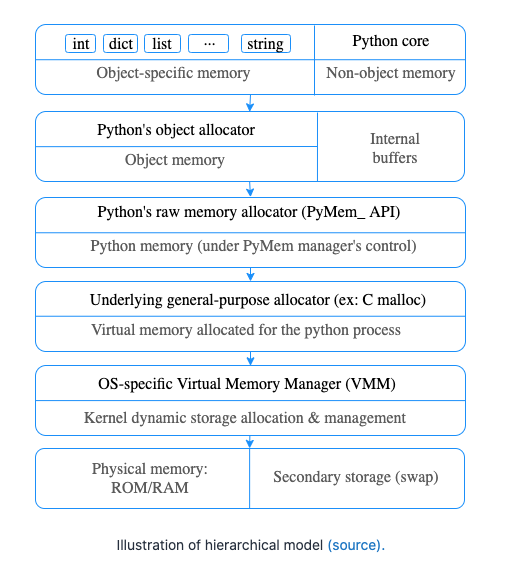
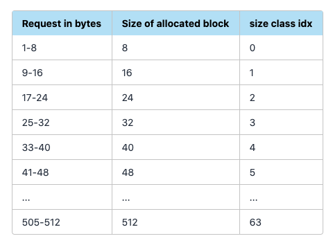
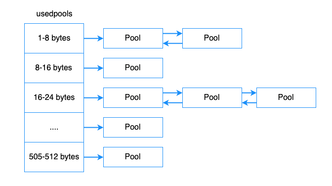
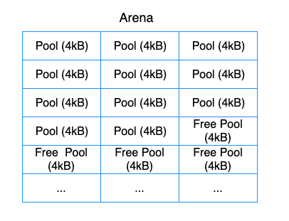
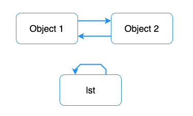

# Memory Management

- 의문
- 개요
- 참고1: 
  - Memory management
- 참고2: 
- Memory Allocation in C
  - Static: Static Memory Allocation in C
  - Stack: Automatic Memory Allocation in C
  - Heap: Dynamic Memory Allocation in C
- Design of the Python Memory Management System
  - Allocation Domains
  - Memory Allocators

## 의문

## 개요

- memory, CPU 는 서로 뗄레야 뗄 수 없는 관계
  - 프로그래밍 언어에서도 computer memory관리는 매우 중요함
- cpython은 C로 작성되어있기 떄문에, C가 어떻게 메모리 관리를 하는지 파악해야 함
- Python memory managing
  - **reference counting**
  - **garbage collection**
- CPython이 어떻게 OS에 메모리를 할당하는지
  - 어떻게 object memory가 할당되고 free되는지
  - 어떻게 Cpython이 memory leak에 대처하는지

## 참고1: Python memory management

Python Memory hierarchical model



- **Python의 모든 entity는 object**
  - 수많은 small memory allocation이 필요함
  - 메모리 연산의 퍼포먼스가 좋아야 함
  - fragmentation를 줄여야 함
  - `PyMalloc`이라는 특별한 memory manager가 존재

### Memory management

#### Large object

- standard C allocator

#### Small object(< 512 bytes) allocation

*python의 bignum은 어떻게 구현되는 것일까?*

Block



- Block
  - 정의
    - 특정 사이즈의 메모리 덩어리
      - 8 ~ 512 bytes
      - 8의 배수
  - 특징
    - 정해진 사이즈의 오직 하나의 파이썬 오브젝트만 가질 수 있음

Pool header structure

```c
struct pool_header {
    union { block *_padding;
            uint count; } ref;          /* number of allocated blocks    */
    block *freeblock;                   /* pool's free list head         */
    struct pool_header *nextpool;       /* next pool of this size class  */
    struct pool_header *prevpool;       /* previous pool       ""        */
    uint arenaindex;                    /* index into arenas of base adr */
    uint szidx;                         /* block size class index        */
    uint nextoffset;                    /* bytes to virgin block         */
    uint maxnextoffset;                 /* largest valid nextoffset      */
};
```

Used pool diagram



- Pool
  - 정의
    - 같은 사이즈의 블록들의 집합
  - 특징
    - 풀의 사이즈는 memory page의 크기와 같음
      - e.g) 4KB
    - 같은 사이즈의 블록들의 집합이기 때문에, memory fragment를 방지할 수 있음
      - 같은 크기의 새 오브젝트를 할당할 때, 그냥 이 공간을 쓰면 됨
    - 같은 사이즈의 블록들의 pool끼리는 doubly linked list로 이어져 있음
    - `ref.count`
      - 사용된 블록의 개수
    - pool이 처음 initializing될 때, freeblock에 모든 블록을 할당하지 않음
      - 낮은 어드레스의 처음 두개의 블록만 설정하여, 첫번쨰 블록을 반환
        - 이러한 전략은 모든 level(arena, pool, block)에서 동일함
        - lazy allocation
          - 진짜 필요할 때에만 할당해서 사용
          - 퍼포먼스 최적화 / 메모리 할당 최적화
    - pool의 상태가 used
      - => allocation이 가능한 block이 존재함을 암
      - 그럼에도 불구하고, `pool->freeblock`이 free list의 마지막을 가리킨다면, 아직 상위 주소 블록을 사용하지 않았다는 것을 의미함
      - `pool->nextoffset`이 아직 접근하지 않은 상위 레벨의 블록에 대한 address offset
      - `nextoffset > maxnextoffset` <=> 모든 블록이 적어도 한번은 access되었음
    - `usedpools`
      - class에 의해서 그룹회된 pool들의 포인터를 저장
  - state
    - used
      - 부분적으로 사용됨
    - full
      - 모든 블록이 할당됨
    - empty
      - 모든 블록이 전부 사용가능
    - *이러한 state는 어떻게 파악되는 것인지? 그냥 nextoffset과 maxnextoffset과의 관계로 알게 되는것인지?*
  - 참고
    - pool, block은 메모리에 직접 할당되는 것이 아니라, arena로부터 할당받은 공간을 사용하는 것

Arena



Arena object structure

```c
struct arena_object {
  uintptr_t address;
  block* pool_address;
  uint nfreepools;
  uint ntotalpools;
  struct pool_header* freepools;
  struct arena_object* nextarena;
  struct arena_object* prevarena;
};
```

- Arena
  - 정의
    - 64개의 pool(pool은 4KB)에 대해서 메모리를 제공하는, 256kB의 힙에 존재하는 메모리 덩어리
  - 특징
    - doubly linked list구조
    - `freepools`필드는 사용 가능한 풀들의 linked list
    - 단순히 메모리가 더 필요하면 계속 요구함

#### Memory deallocation

- Small object manager가 memory를 OS로 되돌리는 경우가 아주 가끔 존재
  - 한 arena에 존재하는 모든 pool이 비어있을 때
    - e.g) 짧은 시간동안에 temporary object들을 사용하는 경우
- long-running python process
  - 위의 특성 때문에 unused memory를 잡아먹을 수 있음
    - memory leak이 아님

## 참고2: Garbage collection in Python

- Python GC 종류
  - **Reference counting GC(necessary)**
    - main
    - reference cycle문제를 해결하지 못함
  - **Generational GC(optional)**
    - reference cycle문제를 다루기 위함

### Reference counting

- Reference count가 증가하는 예시
  - assignment operator
  - **argument passing**
  - **appending an object to a list(object's rerefence count will be increased)**
- 동작
  - reference counting field가 0이되면, python 자체에서 memory deallocation function을 호출
    - 여기서 recursive하게 이 오브젝트가 다른 오브젝트의 reference를 포함하면, 그 object의 reference count도 줄여나감
      - *이게 빠르게 가능하려면, 어떤 오브젝트가 어떤 오브젝트를 참조하는지 알아야 하는거 아닌가? 그래프 자료구조?*
- 장단점
  - 장점
    - 오브젝트가 필요 없어지면 바로 제거 가능
  - 단점
    - circular references
    - thread locking
    - overhead
      - memory
      - performance
    - GIL
    - 다른 현대의 좋은 GC 알고리즘이 존재
- 글로벌 변수
  - 파이썬의 프로세스가 끝날 때 까지 계속 살아있음
    - reference count가 0이되지 않음
      - 모든 global변수는 dictionary안에서 저장됨
      - `globals()`함수로 가져올 수 있음
- `del`
  - global, local variable을 임의적으로 삭제 가능

```py
import sys

foo = []

# 2 references, 1 from the foo var and 1 from getrefcount
print(sys.getrefcount(foo))


def bar(a):
    # 4 references
    # from the foo var, function argument, getrefcount and Python's function stack
    print(sys.getrefcount(a))


bar(foo)
# 2 references, the function scope is destroyed
print(sys.getrefcount(foo))
```

- 로컬 변수
  - block scope에서 python interpreter가 나감 => local variables와 그것의 reference를 부숨(name을 부숨)
  - block에 변수가 존재하면, python interpreter는 그것이 사용된다고 인식
  - 메모리에서 제거하기 위해서는
    - 새 값을 변수에 할당
    - code block에서 벗어나기

### Generational garbage collector

Circular reference



Circular reference example

```py
class PyObject(ctypes.Structure):
    _fields_ = [("refcnt", ctypes.c_long)]


gc.disable()  # Disable generational gc

lst = []
lst.append(lst)

# Store address of the list
lst_address = id(lst)

# Destroy the lst reference
del lst

object_1 = {}
object_2 = {}
object_1['obj2'] = object_2
object_2['obj1'] = object_1

obj_address = id(object_1)

# Destroy references
del object_1, object_2

# Uncomment if you want to manually run garbage collection process
# gc.collect()

# Check the reference count
print(PyObject.from_address(obj_address).refcnt) # 1
print(PyObject.from_address(lst_address).refcnt) # 1
```

- 문제
  - `del` statement로 object에 대한 reference를 지움(reference count 1삭감)
  - python code에서 더이상 접근할 수 없음
  - 하지만 memory에 상주
    - reference count가 아직 1임
- 해결
  - python 1.5에서 cycle-detecting algorithm이 소개
  - generational GC trigger(GC가 언제 동작할지 타이밍 잡기)
    - 주기적으로 동작
    - 오버헤드 줄이기 위하여 휴리스틱이 많이 도입
      - generation 도입
        - container object를 3개의 generation으로 분류
        - 모든 새 object는 첫번째 generation으로 편입
        - 첫 generation에서 몇번의 gc round에서 살아남으면 다음 generation으로 보냄
        - 자손 generation이 더 자주 회수됨
          - 새로 만들어진 오브젝트는 일찍 죽음
      - counter, threshold가 존재
        - `counter = object allocations - deallocations (마지막 collection 이후)`
        - 새 container object를 aloocation할 때마다, CPython은 첫 generation counter가 threshold를 넘는지 확인
          - 넘으면, collection process를 진행
        - 두개 이상의 threshold를 넘는 generation이 있는 경우에는, GC는 더 오래된 generation을 collect함
          - 더 오래된 generation이 젊은 generation의 오브젝트가 젊은 generation의 오브젝트를 collecting할 수 있기 때문
    - threshold value
      - `(700, 10, 10)`
        - `gc.get_threshold()`함수로 get, set가능
- Performance tips
  - graph관련 데이터 구조를 다룰떄 cycle이 발생하기 쉬움
  - `weakref`모듈의 사용
    - `weakref.ref`는 reference count를 증가시키지 않고, 해당 오브젝트가 파괴되면 `None`반환
  - GC를 수동 조작
    - `gc.disable()`, `gc.collect()`

## Memory Allocation in C

- 개요
  - OS로 부터 사용할 수 있는 메모리를 할당 받아야 함
- 종류
  - Static: Static memory allocation
    - 컴파일 타임에 메모리 필요량이 계산되고, 실행될 때 할당됨
  - Stack: Automatic memory allocation
    - 프레임에 들어가면 call stack 안에 scope(e.g function)에 대하여 필요한 메모리가 할당되고, frame이 제거되면 할당이 풀림
      - stack frame?
  - Heap: Dynamic memory allocation
    - 메모리는 요청되고, memory API 호출에 의하여 런타임에 할당됨

### Static: Static Memory Allocation in C

```c
// sizeof(int): 4bytes(32bits)
static int number = 0;

// sizeof(int) * 10
static int numbers[10] = {0, 1, 2, ..., 9};
```

- C compiler는 static / global 변수의 메모리 필요량을 compile time에 미리 계산함
- C compiler는 메모리 할당을 위해서 system call을 사용
  - OS and low-level function to Kernel 에 의존

### Stack: Automatic Memory Allocation in C

```c
#include <stdio.h>

// statically allocated
static const double five_ninths = 5.0/9.0;

double celsius(double fahrenheit) {
  // stack
  double c = (farenheit - 32) * five_ninths;
  return c;
}

int main() {
  // stack
  double f = 100;
  printf("%f F is %f Cn", f, celsius(f));
  return 0;
}
```

- 참고) `const` vs `static const`
  - `const`
    - 상수이나, 해당 file scope바깥에서 사용 가능
  - `static const`
    - 상수이나, 해당 file scope바깥에서 사용 불가능

### Heap: Dynamic Memory Allocation in C

- 개요
  - user-input 같은 경우에는 compile-time에 결정되지 않는데, 이럴땐 Run-time에 메모리를 할당해줘야 함
  - C memory 할당 API를 사용
    - OS의 heap을 사용

```c
#include <stdio.h>
#include <stdlib.h>

static const double five_ninths = 5.0/9.0;

double celsius(double fahrenheit) {
  double c = (fahrenheit - 32) * five_ninths;
  return c;
}

int main(int argc, char** argv) {
  if (argc != 2) {
    return -1;
  }

  int number = atoi(argv[1]);
  double* c_values = (double*)calloc(number, sizeof(double));
  double* f_values = (double*)calloc(number, sizeof(double));
  for (int i = 0 ; i < number ; i++ ) {
    f_values[i] = (i + 10) * 10.0;
    c_values[i] = celsius((double)f_values[i]);
  }
  for (int i = 0 ; i < number ; i++ ) {
    printf("%f F is %f Cn", f_values[i], c_values[i]);
  }
  free(c_values);
  free(f_values);

  return 0;
}
```

## Design of the Python Memory Management System

- 개요
  - CPython은 C 기반으로 만들어졌기 때문에, static, stack, heap 메모리 할당의 제약을 받음
- Python 언어의 디자인에 의한 메모리 할당 문제
  - Python은 동적 타입 언어
    - 컴파일 타임에 변수의 크기를 계산하지 않음
  - 대부분의 파이썬의 코어 타입은 dynamically sized됨
    - e.g)
      - list, dict, int, ...
  - 파이썬의 이름은 다른 타입으로 재사용 가능함
- 위의 문제 해결 방법
  - **heap에 매우 의존적이나, GC와 reference counting 알고리즘을 사용한 자동 freeing 알고리즘을 더함**
  - **파이썬 개발자가 메모리 할당을 명시적으로 하는 대신, 파이썬 오브젝트 메모리가 단일, 통합된 API를 사용해서 할당됨**
  - 모든 CPython standard library와 core modules(C로 작성됨)이 이 API를 사용함

### Allocation Domains

- Cpython의 세가지 dynamic memory allocation domains
  - Raw Domain
    - system heap으로 부터의 할당에 사용
    - large or non-object related 메모리 할당에 사용
  - Object Domain
    - Python Object-related 메모리 할당에 사용
  - PyMem Domain
    - legacy API 목적으로 사용되기 위함(`PYMEM_DOMAIN_OBJ`와 같음)
- 각 도메인이 구현하는 함수들의 인터페이스
  - `_Alloc(size_t size)`
    - `size`의 메모리 할당하고 해당 포인터 반환
  - `_Calloc(size_t nelem, size_t elsize)`
    - size의 메모리 할당
  - `_Realloc(void *ptr, size_t new_size)`
    - 새 size로 메모리를 재할당
  - `_Free(void *ptr)`
    - `ptr`의 메모리를 free시켜줌

### Memory Allocators

- Raw memory domain
  - `malloc`
- PyMem and Object Memory domains
  - `pymalloc`
    - default CPython으로 컴파일됨
      - recompile할 때, `WITH_PYMALLOC = 0`으로 제거 가능
