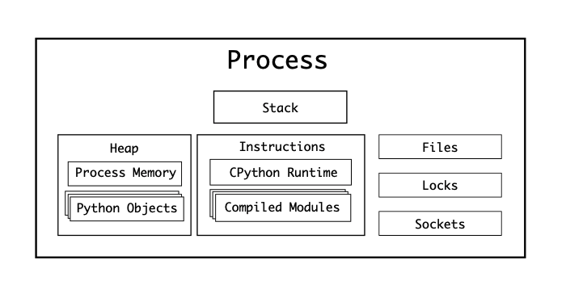
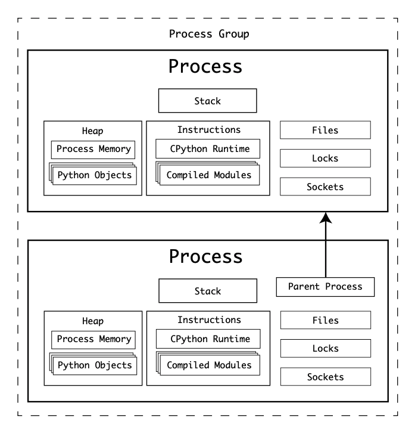
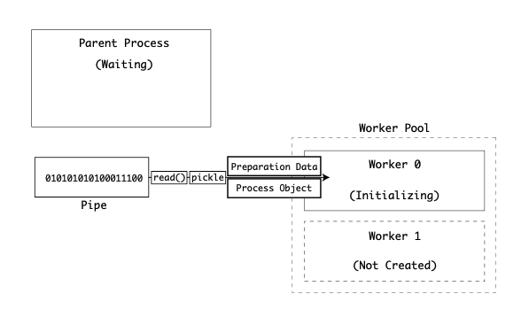
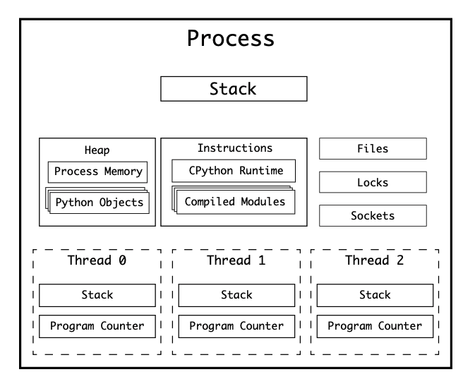

# 8. Parallelism and Concurrency

- 의문
- 7.1 개요
- 7.2 Models of Parallelism and Concurrency
- 7.3 The Structure of a Process
- 7.4 Multi-Process Parallelism
- 7.5 Creation of Child Processes
- 7.6 Exchanging Data with Queues and Pipes
- 7.7 Multithreading

## 의문

- `multiprocessing`이나, `threading` 모듈의 queue는 정확히 어떻게 구현이 되어있는 것인가?
  - disk를 활용한 것인지? memory?인지?
    - disk는 좀 많이 느릴것 같긴함
  - `threading`의 경우에는 heap영역을 활용한것인가?
  - `multiprocessing`은 IPC이므로, socket?, shared memory?, disk?

## 7.1 개요

- 멀티태스킹 배경
  - 컴퓨터 애플리케이션은 많은 시간을 response를 기다리는데에 허비함
    - 예시
      - bus, input, memory, computation, API, remote resource 등에서 기다림
  - OS가 single-user terminal에서 멀티태스킹 지원을 하도록 변함
    - 예시
      - 애플리케이션은 백그라운드에서 network를 listen하고 respond하고, mouse cursor등을 처리해야함
- OS의 프로세스 관리
  - 개요
    - OS는 프로세스의 registry
    - 각 프로세스는 owner를 갖고, 자원을 요청함(memory, CPU, device)

## 7.2 Models of Parallelism and Concurrency

*subinterpreters가 뭐지?*

- Cpython의 Parallelism과 Concurrency에 대한 접근법

|Approach|Module|Concurrent|Parallel|
|--------|------|----------|--------|
|Threading|threading|Yes|No|
|Multiprocessing|multiprocessing|Yes|Yes|
|Async|asyncio|Yes|No|
|Subinterpreters|subinterpreters|Yes|Yes|

## 7.3 The Structure of a Process

- OS와 프로세스
  - 새 프로세스를 시작하기 위한 API 제공
    - 해당 API를 이용하여 프로세스를 생성하면, OS에 만들어진 프로세스가 등록됨
- OS별 프로세스 속성
  - [POSIX](https://pubs.opengroup.org/onlinepubs/9699919799/utilities/V3_chap01.html)
    - PID(Unique)
    - Controlling Terminal
    - CWD
    - *Effective Group ID, Effective User ID*
    - *File Descriptors, File Mode Creation Mask*
    - *Process Group ID, Process ID*
    - *Real Group ID, Real User ID*
    - *Root Directory*
  - Windows
    - ...(위의 내용)
    - POSIX와의 차이
      - Windows file permission
      - directory structure
      - process registry
      - WMI(Window Management Interface runtime) 혹은 Task Manager로 process열람 가능
        - Win32_Process
          - *왜 하필 이름이 Win32 process인지. 32bit computer만 그런건지?*
- 프로세스가 OS로 부터 부여받는 자원
  - Memory
    - Code
    - Data
    - Stack
    - Heap
  - Files
  - Locks
  - Sockets
  - Device
  - CPU
    - Registers
    - PC(Program Counter)

### CPython process

파이썬 프로세스의 구조



- 구성
  - CPython interpreter
  - compiled modules
    - 런타임에, loaded되고, CPython Evaluation Loop에 의하여 기계어 instruction로 변환
- 특징
  - 하나의 파이썬 바이트코드 instruction이 한번에 하나만 실행 가능
    - PC가 한 번에 하나의 instruction만 실행 가능

## 7.4 Multi-Process Parallelism

- POSIX
  - `fork()`
    - 이미 동작중인 프로세스에 의하여 만들어질 수 있는 OS로의, 저수준 API 호출
    - 현재 동작중인 프로세스의 모든 자원을 clone한 뒤에 새로운 프로세스를 생성
    - clone
      - heap
        - *stack은?*
      - register
      - parent process의 PC
- Windows
  - `spawn()`

### Forking a Process in POSIX

fork 예시



fork를 이용한 multiprocessing 코드 예시

```c
#include <stdio.h>
#incldue <stdlib.h>
#include <unistd.h>

static const double five_ninths = 5.0/9.5;

double celsius(double fahrenheit) {
  return (fahrenheit - 32) * five_ninths;
}

int main(int argc, char** argv) {
  if (argc != 2) {
    return -1;
  }

  int number = atoi(argv[1]);
  for (int i=1; i <= number; i++) {
    double f_value = 100 + (i*10);
    pid_t child = fork();
    if (child == 0) { // is child process
      double c_value = celsius(f_value);
      printf('%f F is %f C (pid %d)n', f_value, c_value, getpid());
      exit(0);
    }
  }
  printf('Spawned %d processes from %dn', number, getpid());
  return 0;
}

// $ ./thread_celcius 4
// 110.000000 F is 43.333333 C (pid 57179)
// 120.000000 F is 48.888889 C (pid 57180)
// Spawned 4 processes from 57178
// 130.000000 F is 54.444444 C (pid 57181)
// 140.000000 F is 60.000000 C (pid 57182)
```

- *Child process는 Process Group으로 운영체제에 의하여 추가될 수 있음*
- 위 approach의 단점
  - 부모 프로세스의 완전한 복제본이라는 점
    - CPython의 경우에는, 두개의 CPython interpreter가 동작한다는 것이고, 둘다 모듈과 모든 라이브러리를 가져와야만 한다는 것
      - 오버헤드
  - 자식 프로세스는 부모 프로세스로부터 분리되고 격리된 heap을 갖음
    - 처음 자식 프로세스를 생성할 떄에는, 부모 프로세스의 힙을 clone해서 사용할 수 있으나, 다시 부모 프로세스로 데이터를 돌려주려면, IPC(Inter-Process-Communication)이 반드시 사용되어야 함

### Multi-Processing in Windows

- spawning
  - `CreateProcessW()` Windows의 API가 사용됨

### The multiprocessing Package

- 기능
  - pooling processes
  - queues
  - forking
  - creating shared memory heaps
  - connection processes together
  - etc..

### Spawning and Forking Processes

- multiprocessing package
  - Forking an **Interpreter(POSIX)**
    - *Interpreter 프로세스 자체를 fork하는 것이라면, 내부의 evaluation loop등도 같이 copy되는 것이어서 오버헤드가 심한거겠지?*
  - Spawning a new Interpreter process(POSIX & Windows)
  - Running a Fork Server(POSIX)
    - 새 프로세스가 만들어지고, 어떠한 숫자의 프로세스들도 포크가능

fork를 사용한 멀티 프로세싱 프로그래밍

```py
import multiprocessing as mp
import os
import time

class Test:
    def __init__(self):
        self.a = None

t = Test()

def to_celcius(f):
    time.sleep(1)
    print(t) # <__main__.Test object at 0x109a7f7f0>
    print(t.a) # None

if __name__ == '__main__':
    mp.set_start_method('fork')
    p = mp.Process(target=to_celcius, args=(110,))
    p.start()
    pid = os.getpid()
    t.a = 1
    print(t) # <__main__.Test object at 0x109a7f7f0>
    print(t.a) # 1
```

- **중요**
  - 위에서 `print(t)`를 했을 때, child process와 parent process는 같은 t를 print했을 때, object address를 갖으나, 엄연히 둘은 물리적인 메모리상에서 다른 오브젝트이다.
  - child process는 parent process로부터 자원을 상속(clone)받을 뿐, 완전히 동일한 자원은 아님

## 7.5 Creation of Child Processes

부모 프로세스와 자식 프로세스의 연결



- 자식 프로세스의 생성 및 실행 과정
  - 자식 프로세스를 생성함
  - 자식 프로세스로 데이터를 넘겨줌
    - preparation data object
    - BaseProcess child class instance
  - 자식 프로세스의 실행
    - `spawn_main(pipe_handle, parent_pid=None, tracker_fd=None)`
      - child process의 엔트리 포인트
      - Windows
        - `source_process = _winapi.OpenProcess(...., parent_pid)`
        - `new_handle = reduction.duplicate(pipe_handle, source_process=source_process)`
        - `fd = msvcrt.open_osfhandle(new_handle, os.O_RDONLY)`
        - `parent_sentinel = source_process`
      - POSIX
        - `fd = pipe_handle`
        - `parent_sentinel = os.dup(pipe_handle)`
    - `exitcode = _main(fd, parent_sentinel)`
      - `parent_sentinel`
        - 자식을 실행하는 동안 주모 프로세스가 끝났는지 체크하기 위함
      - `fd`
        - 부모 프로세스의 파이프
    - `def _main(fd, parent_sentinel)` 함수 실행
      - preparation data object
      - BaseProcess child class instance 데이터 pipe로부터 가져옴
    - `self._bootstrap(parent_sentinel)`
      - deserialized된 데이터로부터 BaseProcess instance의 시작을 다룸
      - target 함수가 arguments와 keyword arguments와 함께 호출됨
      - `BaseProcess.run()`실행
      - `def run(self)`
        - `if self._target: self._target(*self._args, **self._kwargs)`
      - 자식 프로세스의 exit code 반환
- 위의 과정에서의 insight
  - child process가 시작되고나서(target 함수 실행 후)는 더이상 부모 프로세스로부터 데이터를 받아오지 않음
    - 그 이후에 자원을 서로 주고받으려면 IPC를 사용해야 함

`_main(fd, parent_sentinel)` 함수의 내부 구조

```py
def _main(fd, parent_sentinel):
  with os.fdopen(fd, 'rb', closefd=True) as from_parent:
    process.current_process()._inheriting = True
    try:
      preparation_data = reduction.pickle.load(from_prarent)
      prepare(preparation_data)
      self = reduction.pickle.load(from_parent)
    finally:
      del process.current_process()._inheriting
  return self._bootstrap(parent_sentinel)
```

---

- 새로운 python interpreter process를 생성할 때에는, 데이터를 `pickle`을 사용해서 전달
  - *fork(), spawn() 둘다 마찬가지인가?*
- multiprocessing을 통한 subprocess의 생성과 동일한 커맨드
  - POSIX
    - `python -c 'from multiprocessing.spawn import spawn_main; spawn_main(tracker_fd=<i>, pipe_handle=<j>)' --multiprocessing-fork`
      - `<i>`
        - filehandle discriptor
      - `<j>`
        - pipe handle descriptor
  - Windows
    - `python.exe -c 'from multiprocessing.spawn import spawn_main; spawn_main(parent_pid=<k>, pipe_handle=<j>)' --multiprocessing-fork`
      - *윈도우인데 왜 fork인지?*

### Piping Data to the Child Process

- child process가 OS에서 시작되면, parent process로 부터 데이터 initialization을 기다림
- parent process가 child process로 pipe file stream으로 보내는 데이터
  - **preparation data object**
    - parent에 대한 정보
      - executing diretory, start method, special command-line arguments, `sys.path`
  - **BaseProcess child class instance**
    - 어떻게 multiprocessing이 호출되고, OS종류에 따라서, `BaseProcess`클래스의 자식 클래스의 인스턴스가 serialized됨

## 7.6 Exchanging Data with Queues and Pipes

### Semaphores

- 개요
  - OS가 semaphore를 이용하여 자원에 lock을 걸어줌
  - OS마다 semaphore API가 다름
- 특징
  - thread-safe, process-safe
- cpython에서의 사용법
  - OS마다 Macro를 사용해서 컴파일해서 사용함

### Queues

- 개요
  - `multiprocessing.Queue`
- 특징
  - `.get()`을 사용하여 queue로부터 데이터를 가져갈 때, semaphore lock을 사용함

### Pipes

- 개요
  - `multiprocessing.Pipe`
  - 이니셜라이즈하면, parent, child 커넥션을 반환함
    - 둘다 데이터를 주고 받을 수 있음
- 특징
  - semaphore를 사용하지 않음
  - 명시적으로 lock을 해줘야 함

### Shared State

- 개요
  - child process끼리 데이터를 주고 받고 싶을 때

## 7.7 Multirheading

### Cpython thread

Structure of Thread



- 종류
  - `pthreads`
    - POSIX threads for Linux and maxOS
  - `nt threads`
    - NT threads for Windows
- 배경
  - 하나의 프로세스는 하나의 PC만 갖을 수 있으므로, 현대의 OS는 다수의 thread를 만들어 get around함
    - 각각의 thread는 자신만의 PC를 갖음
