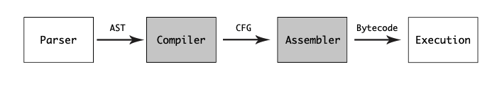
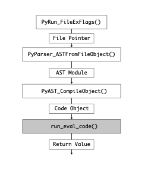
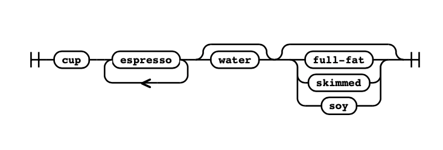
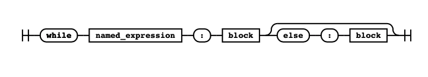

# Introduction

CPython from code to execution1



CPython from code to execution2



- 의문
- CPython
- CPython의 구성
  - 폴더 구성
- The Python Language and Grammar
  - CPython Compiler가 C로 작성된 이유
  - Python Language Specification

## 의문

## Cpython

- 개요
  - Cplatform과 OS 사이의 복잡도를 추상화 시켜줌
    - 예시
      - threading straightforward
      - cross-platform
      - takes memory management in C and make it simple
    - 추상화에 한계가 존재

## CPython의 구성

- The language specification
- The compiler
- The standard library modules
- The core types
- The test suite

### 폴더 구성

- Lib
  - Standard Library modules written in Python
- Modules
  - Standard library modules written in C
- Python
  - CPython 인터프리터 소스 코드

**CPython source code는 65% Python과 24% C?!**

## The Python Language and Grammar

- compiler
  - 개요
    - 하나의 언어를 다른 언어로 변형시키는 것
    - source & target 언어의 grammatical structures를 알아야 함
  - 종류
    - 컴파일 결과물
      - machine code로 컴파일
        - C, Go, C++ and Pascal
      - 중간 언어(byte code)로 컴파일
        - vm에서 실행 가능하도록 함
        - Java, .NET CLR
    - 컴파일러 작성하기 위한 언어
      - Self-hosted compilers
        - 자신(언어)이 작성하는 컴파일러
          - *bootstraping* 이라는 과정에 의하여 done 됨
          - golang이 대표적
            - Go 컴파일러를 C로 작성한 뒤에, Go가 컴파일 가능해지면, 다시 Go로 컴파일러 작성
          - pypy
      - Source-to-source compilers
        - 컴파일러가 이미 존재하는 다른 언어로 작성된 컴파일러
          - Jython 등
- Python의 특징
  - Python interpreter의 역할
    - 한번에 Python 소스 코드를 변환시킴 ∧ 실행함
  - CPython runtime
    - 처음 실행할 때, 코드를 컴파일 함
  - Python 코드는 bytecode로 컴파일 되어서, `.pyc`파일을 생성
    - 코드 변경 없이 또 실행하면 `.pyc`를 이용해서 빠르게 실행 가능

### CPython Compiler가 C로 작성된 이유

- CPython standard library 자체는 퓨어 파이썬으로 작성된 경우도 많음
- 이유
  - C언어의 이점을 많이 얻어가기 위함

### Python Language Specification

Example of railroad diagram



- specification
  - 정의
    - 모든 Python interpreter에 의해서 사용되는 파이썬 **언어의 정의**
  - 특징
    - 사람이 읽을 수 있는 버전, 기계가 읽을 수 있는 버전이 따로 존재
    - human-readable
      - `Doc/reference` 에 존재
    - machine-readable
      - `Grammar/python.gram`
        - Parsing Expression Grammar(PEG) specification을 사용
- PEG specification
  - `*`
    - 반복(0번 가능)
  - `+`
    - 적어도 하나 이상 반복
  - `[]`
    - optional parts
  - `|`
    - or
  - `()`
    - grouping
  - 예시
    - coffee: 'cup' ('espresso')+ \['water'\] \[milk\]
    - milk: 'full-fat' | 'skimmed' | 'soy'

while statement example

```
while_stmt[stmt_ty]:
    | 'while' a=named_expression ':' b=block c=[else_block] { _Py_While(a, b, c, EXTRA) }

else_block[asdl_seq*]: 'else' ':' b=block { b }
```

while railroad diagram


