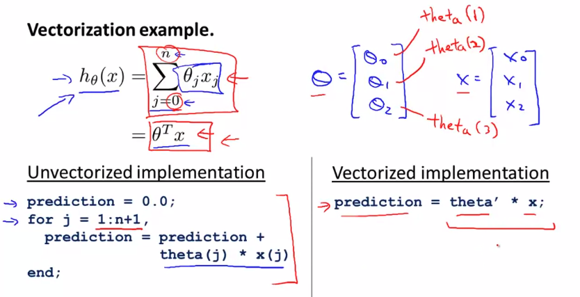

# Octave tutorial

## 의문

## Moving Data Around

```octave
A = [1 2; 3 4; 5 6]

size(A) # (3 2)
size(A, 1) # 3
size(A, 2) # 2

length(A) # 3 (longer dimension)

pwd, cd

load('featuresS.dat')

who, whos # variables in current scope
clear # delete variables from scope

save  hello.mat

A(3,2) # 6
A(2,:) # 3 4
A(:,2) # 2 ; 4 ; 6
A([1 3],:) # 1 2 ; 5 6
A(:,2) = [10; 11; 12] # 1 10 ; 3 11 ; 5 12
A = [A, [100; 101; 102]] # 1 10 100 ; 3 11 101 ; 5 12 102
A(:) # = 1 ; 3 ; 5 ; 10 ; 11 ; 12 ; 100 ; 101 ; 102

A = [1 2; 3 4; 5 6]
B = [11 12; 13 14; 15 16]
C = [A B]
C = [A;B] # 1 2; 3 4; 5 6; 11 12; 13 14; 15 16;
```

## Computing on Data

```octave
A = [1 2; 3 4; 5 6]
B = [11 12; 13 14; 15 16]
C = [1 1; 2 2]

A * B # 행렬 곱셈
A .* B # element-wise multiplication
A .^ 2 # element-wise ...

v = [1; 2; 3]
log(v)
exp(v)
abs(v)
-v

v + ones(length(v),1) # 2; 3; 4
v + 1 # 2; 3; 4

A = [1 2; 3 4; 5 6]
A' # 1 3 5; 2 4 6

a = [1 15 2 0.5]

max(a) # 15
a < 3 # 1 0 1 1
find(a < 3) # 1 3 4

A = [8 1 6; 3 5 7; 4 9 2]

[r,c] = find(A >= 7) # r = 1;3;2 c = 1;2;3

sum(a) # 18.5
prod(a) # 15
floor(a) # 1 15 2 0
ceil(a) # 1 15 2 1

rand(3) # random 3x3 matrix
max(rand(3), rand(3)) # element-wise maximum value choice

max(A, [], 1) # per-column maximum 8 9 7
max(A, [], 2) # per-row maximum 8; 7; 9
max(A) # 8 9 7
max(max(A)) # 9
max(A(:)) # 9

A = magic(9)
sum(A,1) # column-wise sum 369 369 369 ... 369
sum(A,2) # row-wise sum 369; 369; 369; ... 369
pinv(A) # invert matrix of A
```

## Plotting Data

```octave
plot(domain, function)
hold on # graph overlapping
xlabel('time')
ylabel('value')
legend('sin', 'cos')
title('my plot')
print -dpng 'myplot.png'
close

figure(1); plot(t, y1);
figure(2); ploy(t, y2);

subplot(1,2,1);
plot(t, y1);
subplot(1,2,2);
plot(t, y2);
axis([0.5 1 -1 1]) # help axis
clf;

A = magic(5)
imagesc(A), colorbar, colormap gray;
```

## Control Statements: for, while, if statement

```octave
v = zeros(10,1)

for i=1:10,
  v(i) = 2^i;
end;

i = 1;
while 1 <= 5,
  v(i) = 100;
  i = i+1;
end;

if i == 6,
  break
end

function y = squareThisNumber(x)

y = x^2;

addpath('path') # similar to PYTHONPATH

function [y1, y2] = squareAndCubeThisNumber(x)

y1 = x^2
y2 = x^3

function J = costFunctionJ(X, y, theta)

m = size(X,1)
predictions = X*theta
sqrErrors = (predictions-y).^2

J = 1/(2*m) * sum(sqrErrors);
```

## Vectorization

Vectorization



Gradient descent

```octave
theta = theta - (alpha/m) * (X' * (X*theta-y));
```
