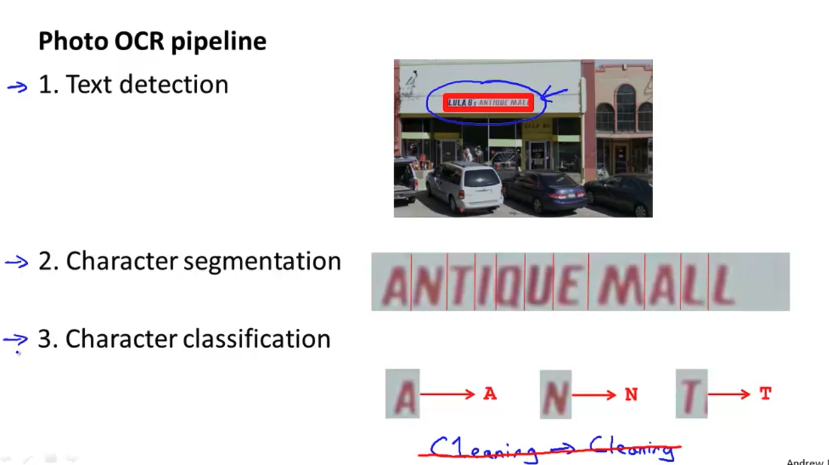
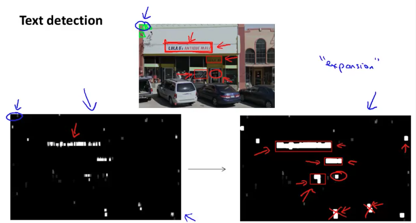
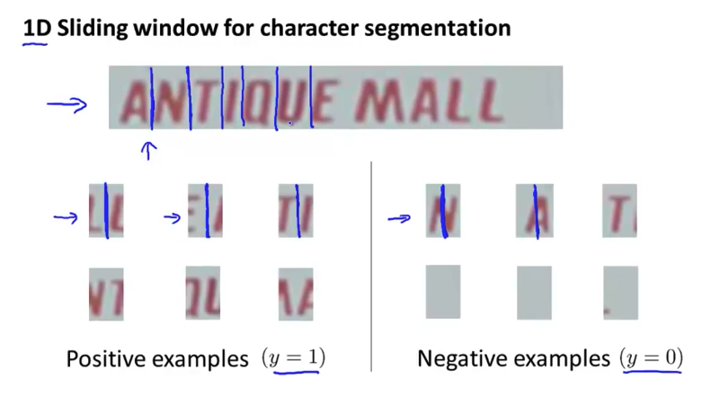
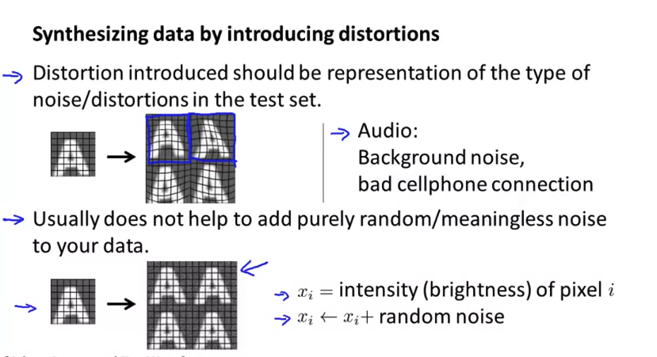
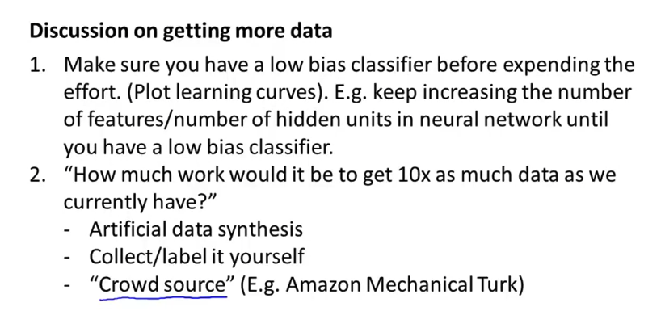
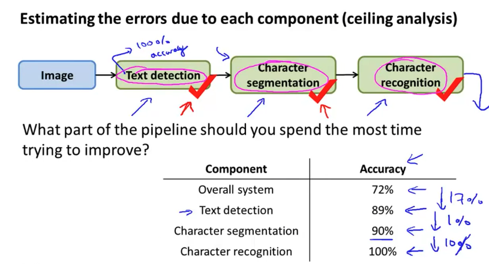
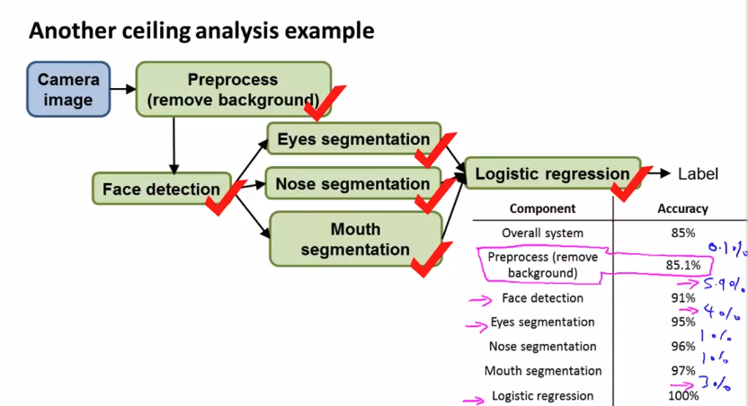

# Application Example: Photo OCR

- 의문
- Photo OCR
  - Problem Description and Pipeline
  - Details
  - Getting Lots of Data and Artificial Data
  - Ceiling Analysis: What Part of the Pipeline to Work on Next

## 의문

## Photo OCR

- Photo OCR(Optical Character Recognition)

### Problem Description and Pipeline

Photo OCR pipeline example

- Photo OCR pipeline(machine learning pipeline)
  - Text detection
  - Character segmentation
  - Character classification
  - Correction
- 참고
  - 큰 머신러닝 프로젝트의 경우, 각 과정마다 다수의 엔지니어들이 포진해서 담당하는 경우가 많음

### Details

#### Text detection

- 사용 예시
  - Text detection, pedestrian detection
- Sliding Windows
  - 직사각형을 각 크기마다
  - 크기에 대해서 stride만큼 띄엄띄엄 지나가면서 pedestrian인지 확인
    - 확인할때는 처음 정한 사이즈로 resize해서
- 특징
  - 많은 heuristic을 사용

#### Character segmentation

Character segmentation example

#### Character classification

- 전에 배운대로 하면 된다

### Getting Lots of Data and Artificial Data

**지금보다 10배의 데이터를 모으기 위해서는 어떤 노력을 얼마나 기울여야 하는가?**

Getting lots of data: Artifical synthesis

Discussion on getting more data

- **Artificial data synthesis**
  - 개요
    - 데이터를 아에 새로 생성하는 방법
      - 예시
        - photo OCR의 경우, 특정 폰트에서 문자를 가져오고 random background에 붙여넣어서 데이터를 생성
    - 데이터를 기존 데이터에서 여러 데이터를 생성하는 방법
      - distortions
        - 예시
          - speech recongnition에서 다양한 소리를 합성(Original + noise)
            - 푸리에 변환?
          - 이미지에 노이즈 추가
      - affine transformation

### Ceiling Analysis: What Part of the Pipeline to Work on Next

Ceiling analysis example: OCR

Ceiling analysis example: Face recognition

- 배경
  - **머신러닝 시스템을 제작할 때 가장 중요한 고려 요소는 개발자의 시간!**
- 개요
  - machine learning pipeline에서 어느 부분에 시간을 가장 할애해야하는가? 에 대답하기 위한 분석
  - 파이프 라인 각 부분이 100% 잘 동작한다고 가정했을 때, 전체 성능의 gain이 어느정도 나타나는지 파악
