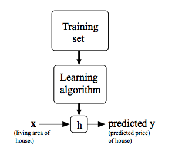
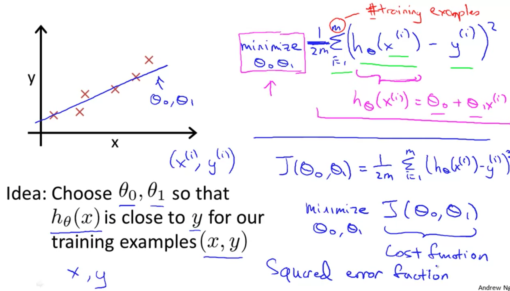
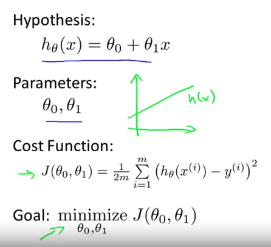
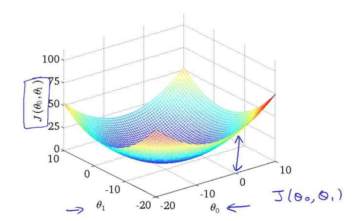
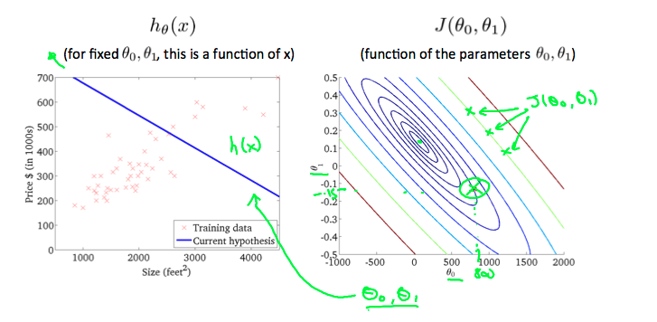
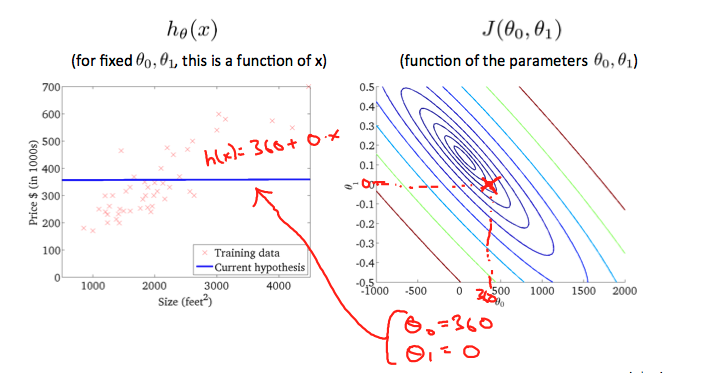
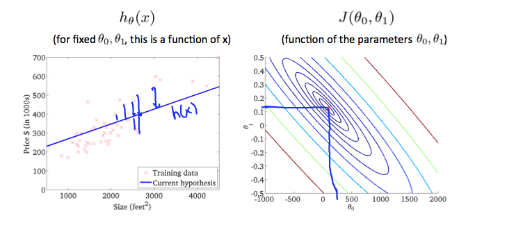

# Linear Regression

- 의문
- Linear Regression with One Variable
- Parameter Learning

## 의문

## Linear Regression with One Variable

### Model representation

supervised learning

- supervised learning
  - training set으로 `h: X -> Y`를 학습시킴
  - `h(x)`를 y의 값에 해당하는 좋은 predictor로 만듬
    - h는 hypothesis라고 불림
    - good hypothesis
      - 데이터를 잘 예측하는 함수
      - 검증은 cost(loss) function으로
  - y의 타입
    - 연속적인 값
      - regression
    - 인산적인 값
      - classification

### Cost Function

Cost(Loss) function

- 정의
  - 사진이나 하나 혹은 그 이상의 변수의 값들을 실수에 매칭시켜, 해당 이벤트에 대한 cost로 나타내는 함수
    - 최적화 문제에서는 loss function을 최소화 하려고 함
- 활용
  - 트레이닝 데이터 셋에 대하여 손실 함수의 값을 최소로 하는 파라미터 찾기
    - `J(θ0, θ1)`의 값을 최소화 하는 `θ1,θ2`찾기
  - Linear regression
    - Squared error function, Mean squared error
      - `J(θ0, θ1) = 1/2m sigma_{i=1}^{m}((hθ(xi) - yi)^2)`
        - `1/2`는 gradient descent계산을 하기 쉽게 만들어주기 위함

### Cost Function

contour plots

Our Mission

- our mission
  - **cost function으로부터 optimized hypothesis function을 구해보자**

cost function graph

cost function and contour plots

좋지 못한 parameter `θ1,θ2`의 경우, cost function의 contour plot1

좋지 못한 parameter `θ1,θ2`의 경우, cost function의 contour plot2

그럭저럭 괜찮은 parameter `θ1,θ2`의 경우, cost function의 contour plot

## Parameter Learning
