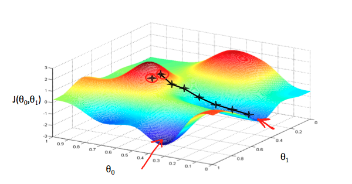
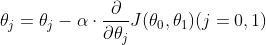
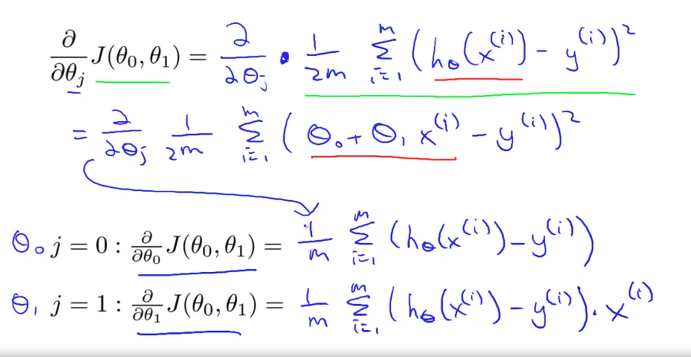

# Linear Regression

- 의문
- Linear Regression with One Variable
  - Model representation
  - Cost Function1
  - Cost Function2
- Parameter Learning
  - Gradient Descent
  - Gradient Descent For Linear Regression

## 의문

- supervised 러닝이란 결국, hypothesis function을 cost function과 데이터셋을 기반으로 찾아내는 것인가?
- Gradient Descent중에 local minimum에서 못빠져나오면 어떡하나?
- Gradient Descent는 언제나 local minimum에 도달할 수 있는가?

## Linear Regression with One Variable

- training dataset으로 hypothesis function을 찾기
  - cost function을 도출
  - training dataset에 대하여, cost function을 최소로 하는 파라미터 찾기
- hypothesis function으로 regression

### Model representation

supervised learning

- supervised learning
  - training set으로 `h: X -> Y`를 학습시킴
  - `h(x)`를 y의 값에 해당하는 좋은 predictor로 만듬
    - h는 hypothesis라고 불림
    - good hypothesis
      - 데이터를 잘 예측하는 함수
      - 검증은 cost(loss) function으로
  - y의 타입
    - 연속적인 값
      - regression
    - 이산적인 값
      - classification
- 첨언
  - **Training set이 매우 중요함**
    - 논문으로 model과 알고리즘이 있어도, data가 존재하지 않거나, 잘 정제되지 않으면 의미가 없음

### Cost Function1

Cost(Loss) function

- 정의
  - 사진이나 하나 혹은 그 이상의 변수의 값들을 실수에 매칭시켜, 해당 이벤트에 대한 cost로 나타내는 함수
    - 최적화 문제에서는 loss function을 최소화 하려고 함
- 활용
  - 트레이닝 데이터 셋에 대하여 손실 함수의 값을 최소로 하는 파라미터 찾기
    - `J(θ0, θ1)`의 값을 최소화 하는 `θ1,θ2`찾기
  - Linear regression
    - Squared error function, Mean squared error
      - `J(θ0, θ1) = 1/2m sigma_{i=1}^{m}((hθ(xi) - yi)^2)`
        - `1/2`는 gradient descent계산을 하기 쉽게 만들어주기 위함

### Cost Function2

contour plots

Our Mission

- our mission
  - **cost function으로부터 optimized hypothesis function을 구해보자**

cost function graph

cost function and contour plots

좋지 못한 parameter `θ1,θ2`의 경우, cost function의 contour plot1

좋지 못한 parameter `θ1,θ2`의 경우, cost function의 contour plot2

그럭저럭 괜찮은 parameter `θ1,θ2`의 경우, cost function의 contour plot

## Parameter Learning

### Gradient Descent

Gradient Descent visualization

Gradient Descent algorithm

- 개요
  - `min J(θ0, ..., θn)을 가능하게 하는 θ0, ..., θn 구하기`
- 파라미터 설명
  - `α`
    - learning rate

### Gradient Descent For Linear Regression

Gradient Descent differential equation

- cost function of linear regression
  - convex function(bow-shape function)
    - global optima만 존재
- **Batch Gradient Descent**
  - Batch
    - gradient descent의 각 스텝이 모든 training example을 사용하는 것

Linear regression말고 다른 수학적인 방식으로 global minimum을 구하는 방법도 존재
