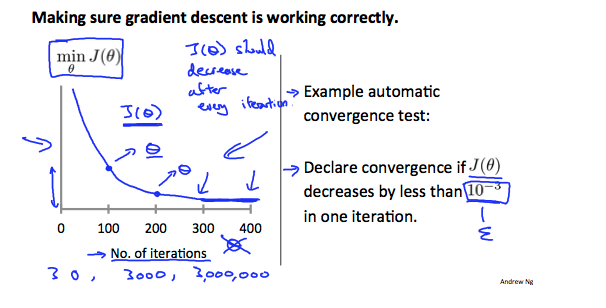
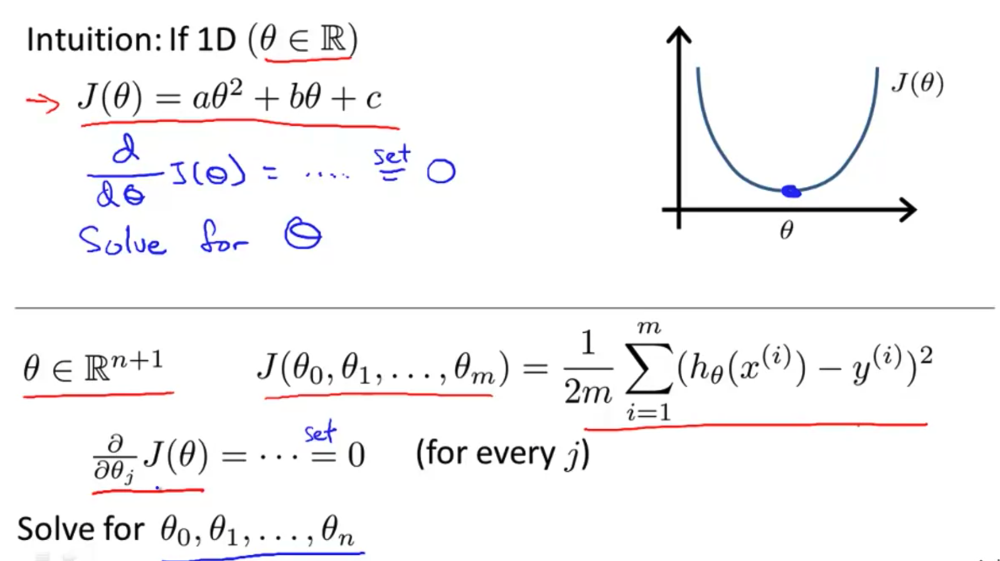
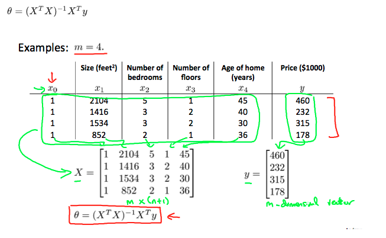

# Linear Regression with multiple variables

- 의문
- Multivariate Linear Regression
- Computing Parameters Analytically

## 의문

- *We can speed up gradient descent by having each of our input values in roughly the same range. This is because θ will descend quickly on small ranges and slowly on large ranges*
  - 어째서?!

## Multivariate Linear Regression

- notation
  - `xj(i)`
    - i번째 훈련 데이터의 피쳐의 j의 값
  - `x(i)`
    - i번째 훈련 데이터의 input
  - `m`
    - 훈련 데이터셋의 개수
  - `n`
    - 피쳐의 개수
- hypothesis function
  - `hθ(x) = θ0 + θ1x1 + θ2x2 + ... + θnxn`
  - `= θtx`

### Gradient Descent for multiple variables

Gradient Descent for multiple variables1

Gradient Descent for multiple variables2

- Gradient descent speed up
  - 개요
    - features이 유사한 scale이 되도록 하여, gradient descent가 보다 빠르게 진행될 수 있도록 함
      - *normalizing이랑 비슷한 개념?*
      - `-1 ≤ xi ≤ 1`에 가까운 것이 바람직
        - *왜지?*
      - cost function을 각 차원별로 적당히 펴주기 위함
  - 방법
    - Feature scaling
      - 개요
        - 인풋값을 range로 나눔
    - Mean normalization
      - 개요
        - feature들의 평균을 거의 0으로 만듬
        - `xn = (xn - mun)/sn`
          - `sn = standard deviation or max - min`

Gradient descent and cost function

Check gradient descent is working correctly

- Gradient descent tips
  - gradient descent debugging
    - `충분히 작은 α일 때, J(θ)는 gradient descent가 진행되면서 계속 감소해야함`
      - *수학적으로 어떻게 증명할 수 있는가?*
      - cost-iteration 그래프를 그려보자
    - 그렇지 않은 경우는, α값을 줄여보자
  - alpha selection
    - `..., 0.001, x3 x3 x3 ...`
      - 와 같은 식으로 알파값을 찾기

### Features and Polynomial Regression

- feature combination이 가능
  - size = front x depth
- linear regression 뿐 아니라, polynomial regression도 가능
  - polynomial의 경우, feature scaling을 반드시 시행하기

Polynomial regression example1

Polynomial regression example2

*오버피팅 문제는 어떡하지?*

## Computing Parameters Analytically

### Normal Equation

Normal equation intuition

Normal equation example

- 개요
  - θ를 analytically 구하는 방식
  - https://m.blog.naver.com/sw4r/221250858967
    - 참고

### Gradient Descent vs Normal Equation

- Gradient Descent
  - α를 설정해야 함
  - iteration이 많음
  - n이 충분히 클때 잘 동작함(`n≥10,000`)
    - `O(kn^2)`
- Normal Equation
  - α를 설정하지 않아도 됨
  - iteration하지 않아도 됨
  - n이 크면 `(tX・X)^-1`계산이 느려짐
    - `O(n^3)`

### Normal Equation Noninvertibility

- 개요
  - `tX・X`가 non-invertible이면?
    - non-invertible의 주된 이유
      - redundant features
        - feature사이에 linearly depdendent한 관계가 있는 feature가 있는지 살펴봐야 함
        - Column Reduced Echelonform으로 생각해보면 linearly depdendent하면 절대 안됨
          - zero-column의 등장
      - feature가 너무 많은 경우(`m≤n`)
        - 몇몇 feature를 지우거나, regularization을 행해야 함
