# Logistic Regression & Regularization

- 의문
- Logistic Regression
  - Classification and Representation
  - Logistic Regression Model
  - Multiclass Classification
- Regularization
  - Solving the Problem of Overfitting

## 의문

- *logistics regression에서 어차피 우리가 하고 싶은 것은 discrete하게 classify하는 것인데, cost function을 최소화 시키는게 의미가 있는가?*
  - 분류만 잘하면 되는거 아닌가?

## Logistic Regression

- Hypothesis function
  - 식
    - `h_θ: X -> R, h_θ(x) = g(tθ・X) (g is sigmoid function)`
  - 개요
    - 결과값은 해당 데이터가 어떤 class로 분류되는지 확률을 나타냄
- Cost function
  - 식
    - `J(θ) = 1/m sigma_{i=1}^{m} Cost(h_θ(x(i), y(i)))`
  - 개요
    - 결과값은 hypothesis function이 과거의 데이터에 얼마나 잘 fit하는가를 나타냄
    - 결국에는 좋은 hypothesis function을 만들기 위한 기준
- Cost function의 global minimum을 찾기 위한 optimization 알고리즘
  - gradient descent
  - nogradient descent
    - conjugate gradient
    - BFGS
    - L-BFGS

Hypothesis function of classification problems

- logistic regression
  - 개요
    - **classification 알고리즘**

### Classification and Representation

#### Hypothesis function on logistics regression

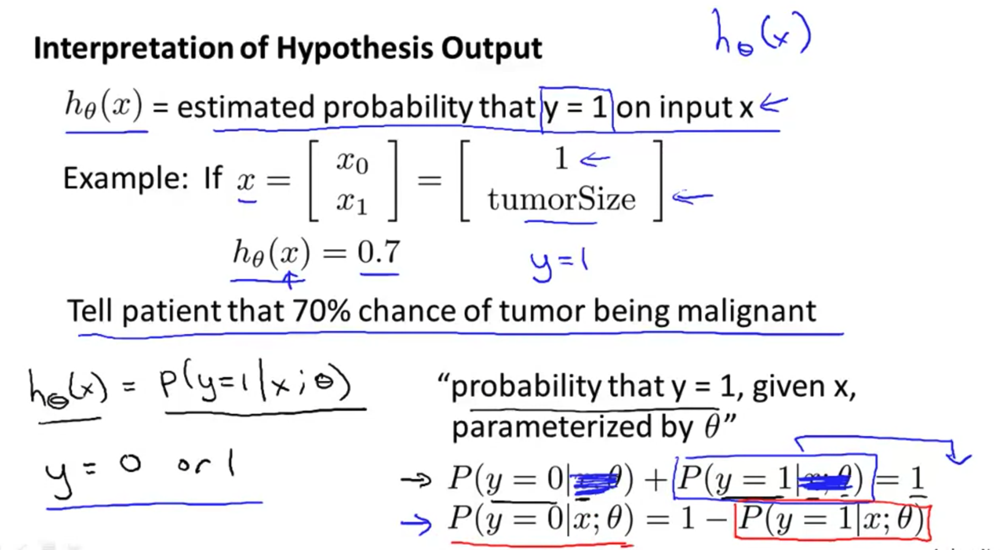

- logistics regression hypothesis function
  - 개요
    - `h_θ = g(tθ・x) (단, g(z) = 1/(1+e^(-z)))`
    - 값의 결과는 probability
- logistic(sigmoid) function
  - 개요
    - `g: R -> (0,1), g(x) = 1/(1+e^(-x))`

#### Dicision boundary

Decision boundary 유도하기 위한 과정

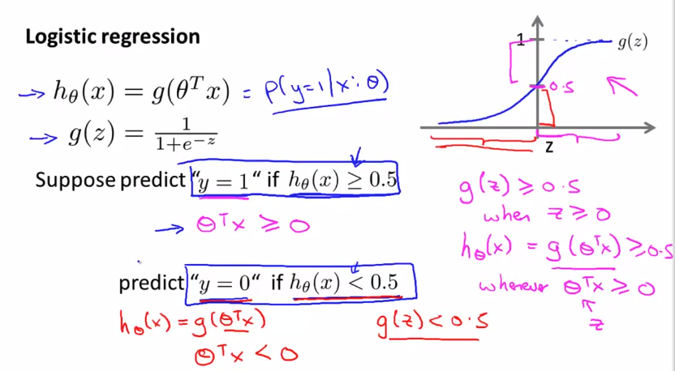

Linear Decision boundary

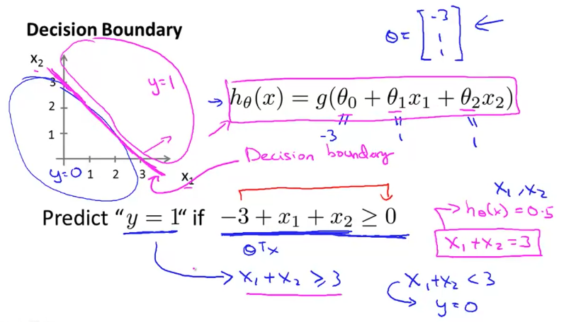

Non-linear decision boundaries

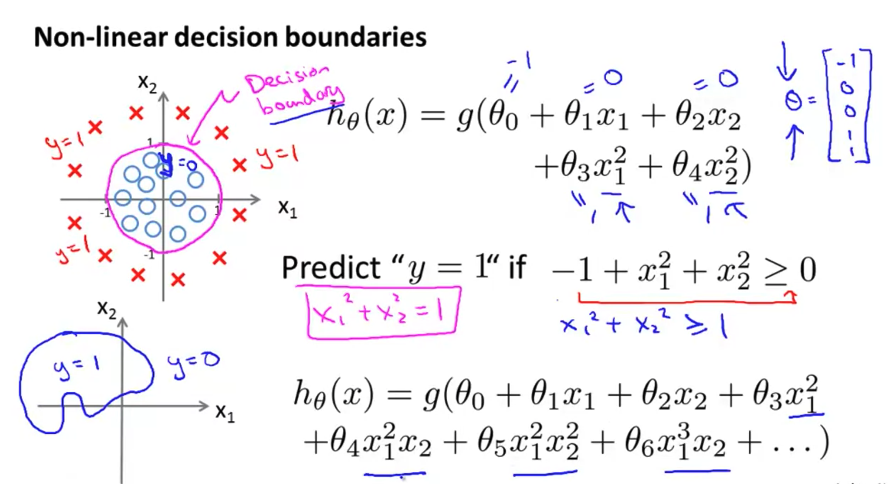

- 개요
  - sigmoid function에서 x가 0보다 크거나 같을 경우에, 0.5 이상이 되므로, 결국, `tθ・x ≥ 0`인 경우에 1이 되는데, `tθ・x = 0`을 만족하는 `x1, ..., xn`에 대한 함수를 dicision boundary라고 함
    - The decision boundary is the line that separates the area where y = 0 and where y = 1. It is created by our hypothesis function.
  - classification을 결정하는 값의 경계를 나타내는 함수

### Logistic Regression Model

#### Cost Function

Convex function

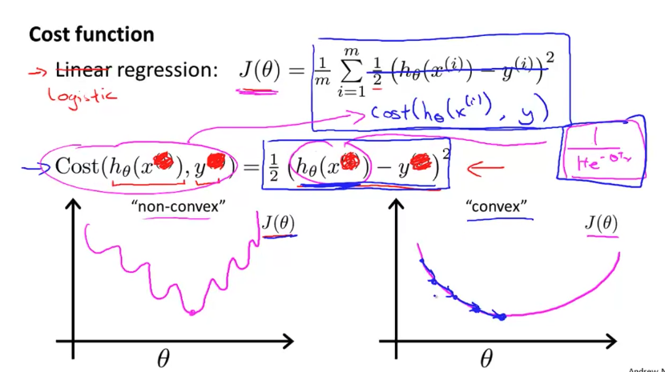

Cost function1

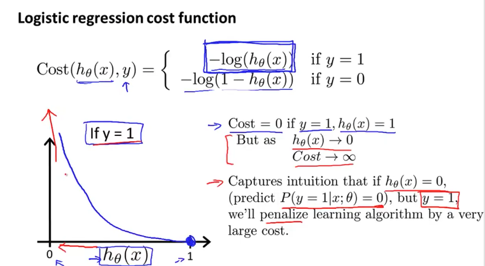

Cost function2

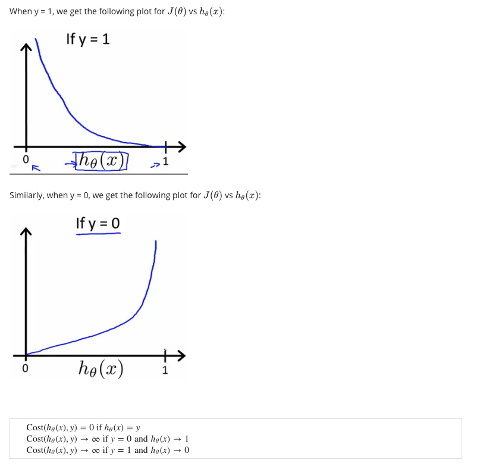

- convex
  - cost function이 convex function이어야지, global optima를 찾을 수 있음
    - *그런데, multivariate linear regression같은 경우도 convex아니지 않은가?*
  - 따라서, logistic regression에서의 hypothesis function을 convex하게 만들 필요가 존재
- 개요
  - `cost(h_θ(x), y)`
    - `= -log(h_θ(x)) if y=1`
    - `= -log(1-h_θ(x)) if y=0`
    - cost함수의 값은 오차의 정도를 나타냄

#### Simplified Cost Function and Gradient Descent

Logistic regression cost function

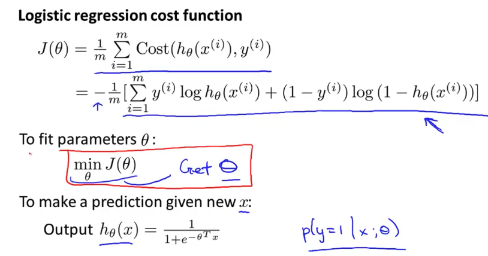

Gradient descent of logistics regression

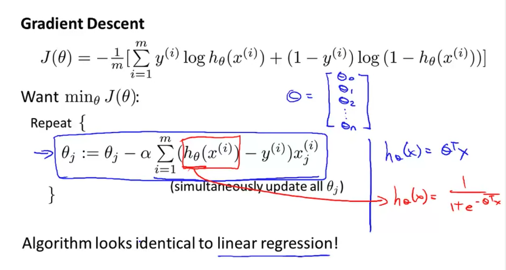

- simplified cost function
  - `J(θ) = 1/m sigma_{i=1}^{m}(Cost(h_θ(x), y))`
    - `Cost(h_θ(x), y) = -ylog(h_θ(x)) - (1-y)log(1-h_θ(x))`
      - *maximum likelyhood estimation(statistics)*

#### Advanced Optimization

- Optimization algorithm
  - Gradient descent
  - NoGradient descent
    - 종류
      - Conjugate gradient
      - BFGS
      - L-BFGS
    - 장점
      - alpha를 명시적으로 고를 필요가 없음
      - gradient descent보다 빠른 경우가 있음
        - large ML 문제일 경우 유효
    - 단점
      - 더 복잡함
        - 구현하기가 엄청 힘드므로 그냥 라이브러리를 사용하면 됨

```octave
options = optimset('gradobj', 'on', 'MaxIter', '100');

initialTheta = zeros(2,1);

function [jVal, gradient] = costFunction(theta)
  jVal = code to compute J(θ)

  gradient(1) = code to compute dJ(θ)/dθ0
  gradient(2) = code to compute dJ(θ)/dθ1
  gradient(3) = code to compute dJ(θ)/dθ2

[optTheta, functionVal, exitFlag] = fminunc(@costFUnction, initialTheta, options);
```

### Multiclass Classification

#### One vs all

Multiclass classification1

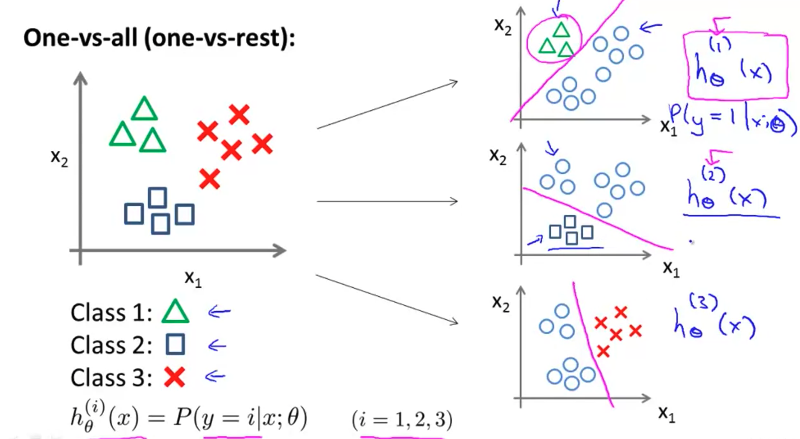

Multiclass classification2

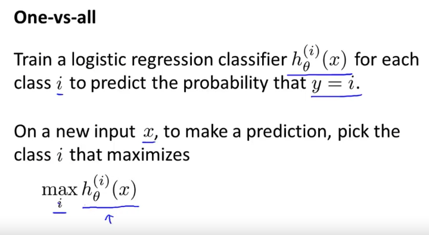

- hypothesis function의 결과값은 확률
- 해당 확률이 최댓값인 클래스를 선정하면 됨

## Regularization

### Solving the Problem of Overfitting
