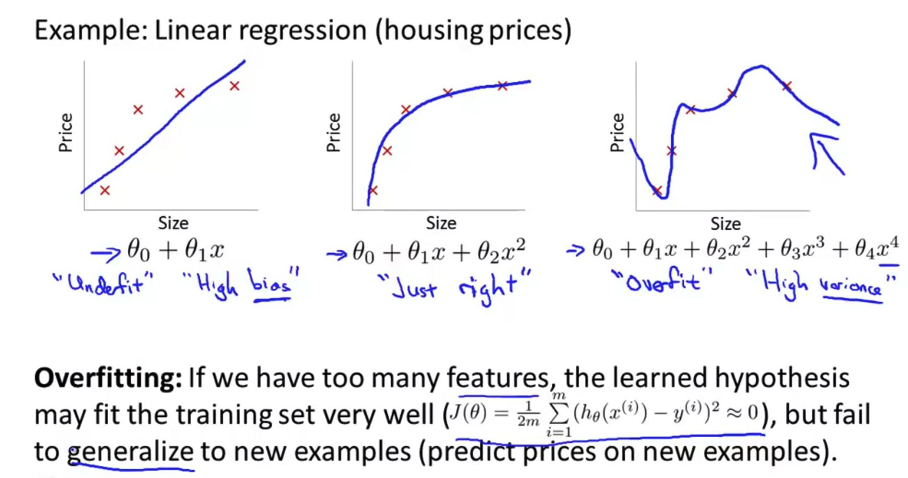
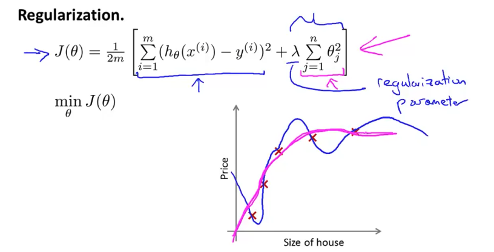
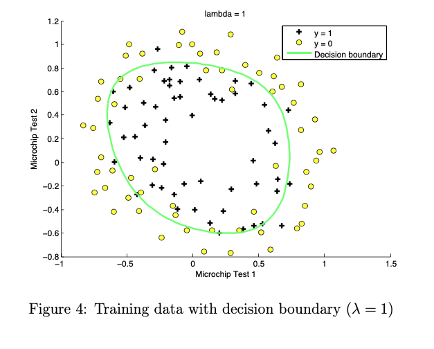
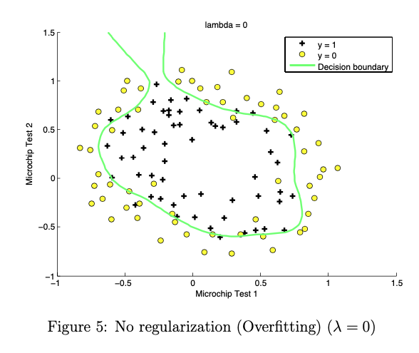
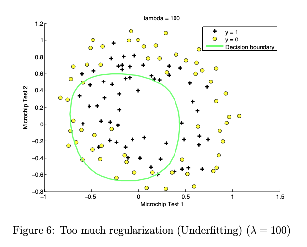

# Logistic Regression & Regularization

- 의문
- Logistic Regression
  - Classification and Representation
  - Logistic Regression Model
  - Multiclass Classification
- Regularization
  - Solving the Problem of Overfitting

## 의문

- *logistics regression에서 어차피 우리가 하고 싶은 것은 discrete하게 classify하는 것인데, cost function을 최소화 시키는게 의미가 있는가?*
  - 분류만 잘하면 되는거 아닌가?

## Logistic Regression

- Hypothesis function(logistic regression에셔의)
  - 식
    - `h_θ: X -> (0,1), h_θ(x) = g(tθ・X) (g is sigmoid function)`
  - 개요
    - 결과값은 해당 데이터가 어떤 class로 분류되는지 확률을 나타냄
  - c.f)
    - regression 문제에서 hypothesis function의 결과값은 예측값 자체를 나타냄(확률이 아님)
- Cost function
  - 식
    - `J(θ) = 1/m sigma_{i=1}^{m} Cost(h_θ(x(i), y(i)))`
  - 개요
    - 결과값은 hypothesis function이 과거의 데이터에 얼마나 잘 fit하는가를 나타냄
    - 결국에는 좋은 hypothesis function을 만들기 위한 기준
- Cost function의 global minimum을 찾기 위한 optimization 알고리즘
  - gradient descent
  - nogradient descent
    - conjugate gradient
    - BFGS
    - L-BFGS

Hypothesis function of classification problems

- logistic regression
  - 개요
    - **classification 알고리즘**

### Classification and Representation

#### Hypothesis function on logistics regression


- logistics regression hypothesis function
  - 개요
    - `h_θ = g(tθ・x) (단, g(z) = 1/(1+e^(-z)))`
    - 값의 결과는 probability
- logistic(sigmoid) function
  - 개요
    - `g: R -> (0,1), g(x) = 1/(1+e^(-x))`

#### Dicision boundary

Decision boundary 유도하기 위한 과정


Linear Decision boundary


Non-linear decision boundaries


- 개요
  - sigmoid function에서 x가 0보다 크거나 같을 경우에, 0.5 이상이 되므로, 결국, `tθ・x ≥ 0`인 경우에 1이 되는데, `tθ・x = 0`을 만족하는 `x1, ..., xn`에 대한 함수를 dicision boundary라고 함
    - The decision boundary is the line that separates the area where y = 0 and where y = 1. It is created by our hypothesis function.
  - classification을 결정하는 값의 경계를 나타내는 함수

### Logistic Regression Model

#### Cost Function

Convex function


Cost function1


Cost function2


- convex
  - cost function이 convex function이어야지, global optima를 찾을 수 있음
    - *그런데, multivariate linear regression같은 경우도 convex아니지 않은가?*
  - 따라서, logistic regression에서의 hypothesis function을 convex하게 만들 필요가 존재
- 개요
  - `cost(h_θ(x), y)`
    - `= -log(h_θ(x)) if y=1`
    - `= -log(1-h_θ(x)) if y=0`
    - cost함수의 값은 오차의 정도를 나타냄

#### Simplified Cost Function and Gradient Descent

Logistic regression cost function


Gradient descent of logistics regression


- simplified cost function
  - `J(θ) = 1/m sigma_{i=1}^{m}(Cost(h_θ(x), y))`
    - `Cost(h_θ(x), y) = -ylog(h_θ(x)) - (1-y)log(1-h_θ(x))`
      - *maximum likelyhood estimation(statistics)*

#### Advanced Optimization

- Optimization algorithm
  - Gradient descent
  - NoGradient descent
    - 종류
      - Conjugate gradient
      - BFGS
      - L-BFGS
    - 장점
      - alpha를 명시적으로 고를 필요가 없음
      - gradient descent보다 빠른 경우가 있음
        - large ML 문제일 경우 유효
    - 단점
      - 더 복잡함
        - 구현하기가 엄청 힘드므로 그냥 라이브러리를 사용하면 됨

```octave
options = optimset('gradobj', 'on', 'MaxIter', '100');

initialTheta = zeros(2,1);

function [jVal, gradient] = costFunction(theta)
  jVal = code to compute J(θ)

  gradient(1) = code to compute dJ(θ)/dθ0
  gradient(2) = code to compute dJ(θ)/dθ1
  gradient(3) = code to compute dJ(θ)/dθ2

[optTheta, functionVal, exitFlag] = fminunc(@costFUnction, initialTheta, options);
```

### Multiclass Classification

#### One vs all

Multiclass classification1


Multiclass classification2


- hypothesis function의 결과값은 확률
- 해당 확률이 최댓값인 클래스를 선정하면 됨

## Regularization

### Solving the Problem of Overfitting

Underfitting vs Just right vs Overfitting - Linear Regression



- Underfitting(high bias)
  - 개요
    - 트레이닝 데이터에 모델이 맞지 않음
    - high bias
      - 강한 선입견(pre-conception)즉 강한 bias를 갖고 있음을 의미
        - e.g) 모든데이터를 선형적으로 끼워맞추려 함
- Overfitting(high variance)
  - 개요
    - 트레이닝 데이터에는 모델이 잘 맞음(`J(θ) ~~ 0`) but 새 예시에 대해서는 일반화에 실패
    - feature가 너무 많은경우
    - high variance
      - 트레이닝 데이터에 과하게 맞추려 하다보니, 너무 변동성이 커짐을 말함

#### Overfitting 대처

*애초에 어떻게 overfitting인지 파악할 수 있는지?*

- Overfitting 방지
  - Feature 제거
    - Manual
    - Automatic
      - model selection algorithm
  - Regularization
    - 개요
      - 모든 feature를 살려두지만, 특정 feature의 magnitude/`θj`의 값을 줄임
    - 특징
      - `y`를 예측하는데에 있어서, 많은 feature가 존재하고 각각이 조금씩 관련이 있을때

#### Cost Function

Regularization



- 개요
  - *파라미터의 값이 작은 경우, `θ1, θ2, θ3, ..., θn` 더 간단한 hypothesis이며, overfitting이 될 가능성이 적어짐*
    - *수학적으로 증명 가능한가?*
- regularized cost function
  - 식
    - `J(θ) = 1/2m (sigma_{i=1}^{m}(hθ(x(i)) - y(i))^2 + λ・sigma_{j=1}^{n}(θj^2))`
      - *왜 θj의 제곱을 곱하는 것일까?*
  - `λ`
    - regularization parameter
    - 개요
      - 트레이닝 데이터를 잘 피팅시켜주기 위함
      - 파라미터를 작게 해주기 하기 위함
        - 오버피팅 방지
    - `λ`가 너무 큰 경우
      - `θ1, θ2, θ3, ..., θn ~~ 0`이 되므로, underfitting이 됨
    - 의문
      - *애초에 이 친구는 어떻게 정해주는가? 노가다?*

#### Regularized Linear Regression

- cost function
  - `J(θ) = 1/2m (sigma_{i=1}^{m}(hθ(x(i)) - y(i))^2 + λ・sigma_{j=1}^{n}(θj^2))`
- gradient descent
  - `θ :=`
    - `θ - α・1/m・tX・(Xθ - y) (θ0)`
    - `θ(1 - α・λ/m) - α・1/m・tX・(Xθ - y) (else)`
      - *`α・λ/m > 1`인 경우는 어떻게 되는가?*
      - **θj를 구하는 경우 크로네커델타를 사용하면 식을 굳이 둘로 케이스를 나눌 필요가 없어보인다.**
    - 일원화
      - `θ := (I - α・λ/m・I에서맨위row가zero-row)θ - α/m・tX(Xθ-y) (g는 sigmoid function)`
- normal equation
  - `θ = (tX・X+λ(I-(1 0 ... ; 0 ... ; ...)))^-1・tX・y`
    - *`λ>0 => (tX・X+λ(I-(1 0 ... ; 0 ... ; ...)))는 반드시 invertible`*
      - 왜지?

#### Regularized Logistic Regression

- cost function
  - `J(θ) = 1/m (sigma_{i=1}^{m}(Cost(hθ(x(i)), y(i)))) + 1/2m λ・sigma_{j=1}^{n}(θj^2)`
- gradient descent
  - `θ :=`
    - `θ - α・1/m・tX・(g(Xθ) - y) (j=0)`
    - `θ(1 - α・λ/m) - α・1/m・tX・(g(Xθ) - y) (else)`
  - 일원화
    - `θ := (I - α・λ/m・I에서맨위row가zero-row) - α/m・tX(g(Xθ)-y) (g는 sigmoid function)`

#### Regularization Examples

Fit



Overfitting



Underfitting


