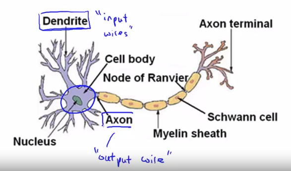

# Neural Networks: Representation

- 의문
- Motivations
  - Non-linear classification
  - Neurons and the Brain
- Neural Networks
- Applications

## 의문

## Motivations

- Non-linear classification
  - 문제
    - feature의 개수가 너무 많아지고, classification을 한번에 여러개를 해야하는 경우가 생김
      - 계산량이 너무 많아짐
        - 이미지 인식이 힘듬
- Neurons and the Brain
  - "one learning algorithm hypothesis"
    - Auditory Cortex에 시각을 연결하면 볼 수 있게 됨
    - transfer learning이 가능한 이유?

## Neural Networks

### Model Representation1

Neuron in the brain

## Applications
