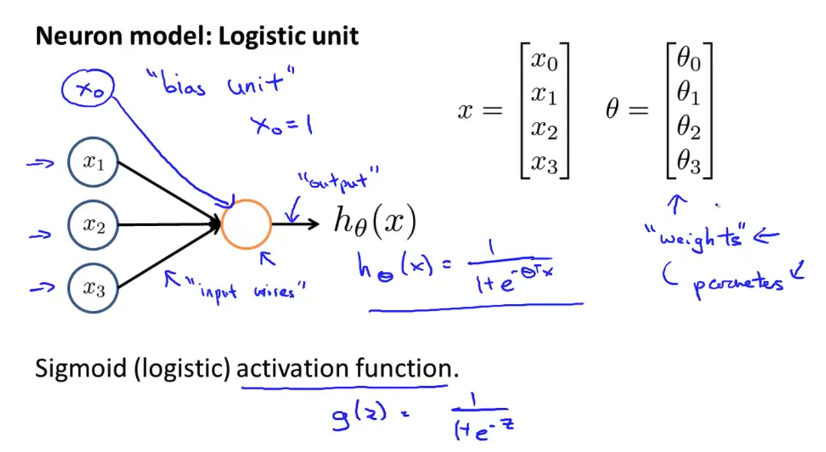
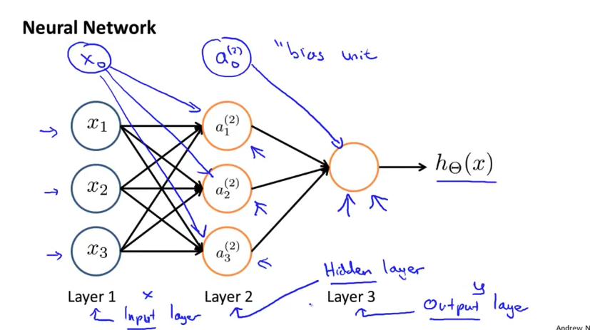
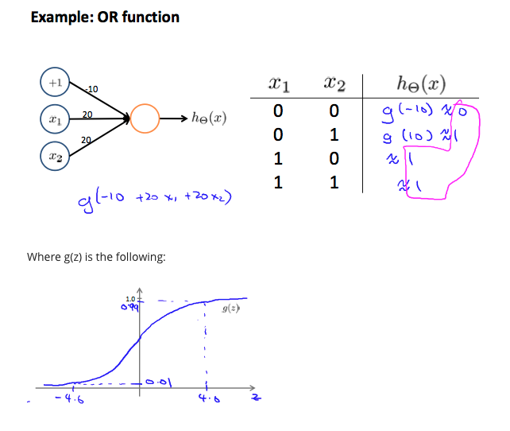
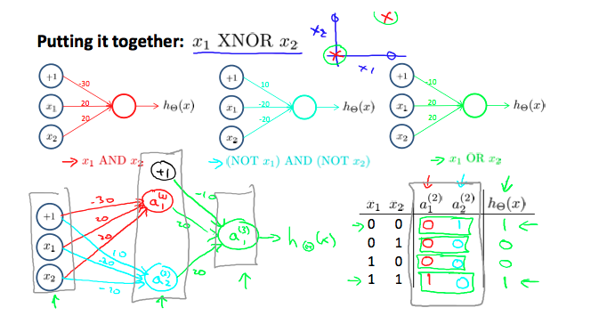
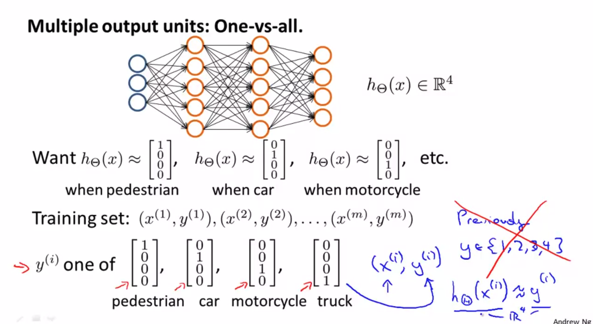

# Neural Networks: Representation

- 의문
- Motivations
  - Non-linear classification
  - Neurons and the Brain
- Neural Networks
- Applications

## 의문

## Motivations

- Non-linear classification
  - 문제
    - feature의 개수가 너무 많아지고, classification을 한번에 여러개를 해야하는 경우가 생김
      - 계산량이 너무 많아짐
        - 이미지 인식이 힘듬
- Neurons and the Brain
  - "one learning algorithm hypothesis"
    - Auditory Cortex에 시각을 연결하면 볼 수 있게 됨
    - transfer learning이 가능한 이유?

## Neural Networks

### Model Representation1

Neuron in the brain

Neuron model1

Neuron model2

- 용어
  - bias unit
    - *왜 bias unit이라 불리는가? 왜 필요한가?*
  - activation function
  - weights
    - `θ`
  - layers
    - input layer
    - hidden layers
    - output layer
  - activation of unit i in layer j
    - `a_{i}^{j}`
  - j에서 j+1레이어로 매핑하는 함수를 제어하는 웨이트의 행렬
    - `θ^(j)`
- 참고
  - Neuron model2에서의 `θ_{ij}`(ij)의 결정
    - 일반 행렬 표기와 싱크를 맞추기 위함(i행j열)
  - `g(θ^(j)x)`
    - j와 j+1레이어 사이의 뉴럴네트워크의 행렬표현

## Applications

### Examples and Intuitions1

Logical OR function

Logical Negation function

Logical XNOR function

### Multiclass Classification

