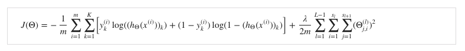
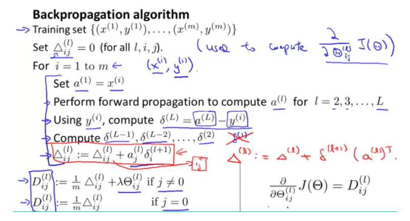
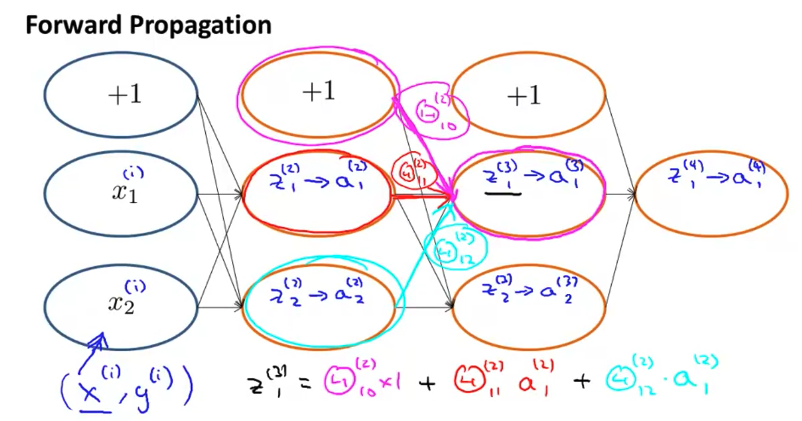
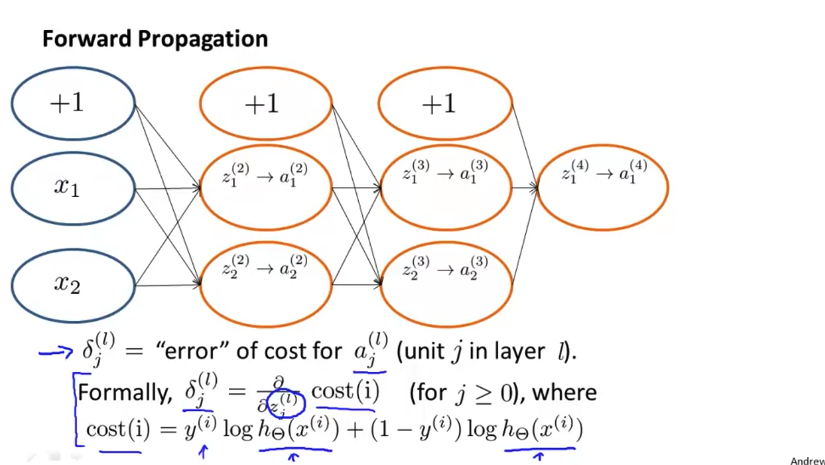
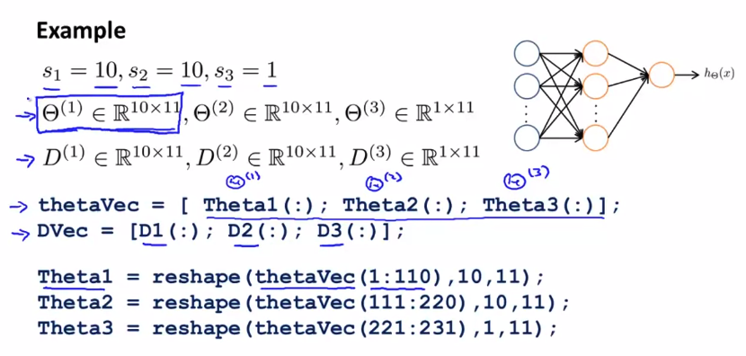
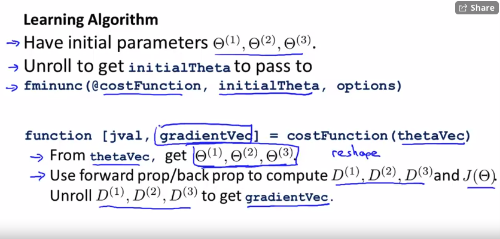
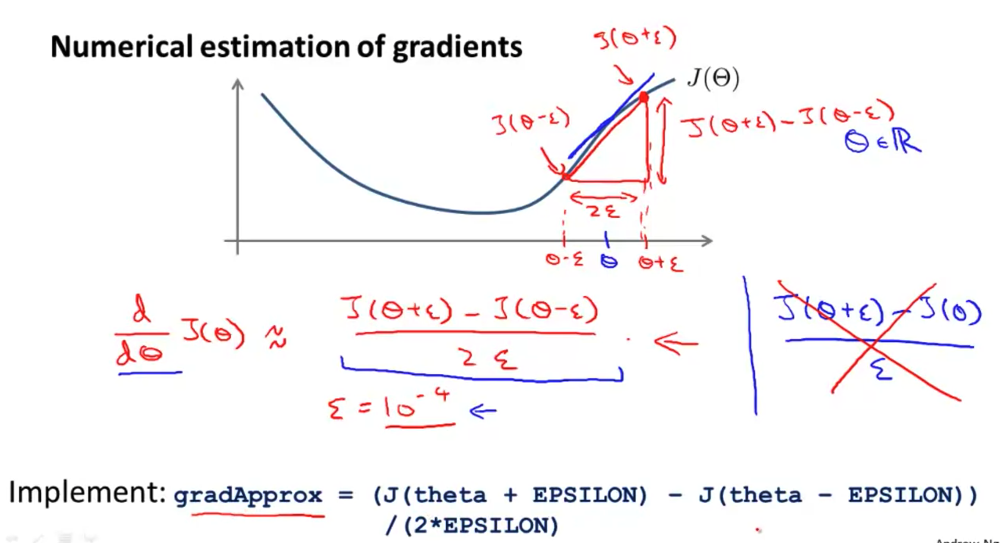
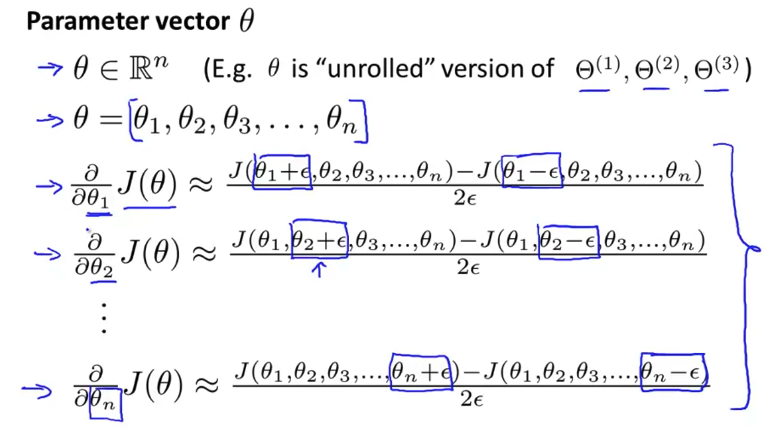

# Neural Networks: Learning

- 의문
- Cost Function and Backpropagation
- Backpropagation in Practice
- Application of Neural Networks

## 의문

## Cost Function and Backpropagation

### Cost function

Neural Networks Cost Function(Generalization of logistic regression)



### Backpropagation Algorithm

Back propagation algorithm



- error of node j in layer l
  - `δ_j^l`
  - `δ^3 = t(θ^3)δ^4 .* g'(z^3)`
    - 이전 layer의 output을 input으로 대응하는 레이어3의 미분값
  - 참고
    - **에러를 구할 때에는, `dg(WX)/dX`, 즉 이전 layer의 output vector로 미분. 그리고 그 값에다가 현재 레이어의 다음 레이어들의 error를 곱하면 됨**
      - backpropagation을 하기 위해서
      - 이게 맞는 것인지?
    - **특정 weight에 대한 미분값을 구할 때에는, `dg(WX)/dW`를 구하고 현재 레이어의 다음 레이어들의 error를 곱하면 됨**
      - 이게 맞는것인지?

### Backpropagation Intuition

Forward propagation



Back propagation intuition1



- *위 그림에서, 왜, `δ_2^2 = θ_{12}^2 δ_1^3 + θ_{22}^2 δ_2^3`와 같이 activation함수는 고려되지 않은 것인가? 시그모이드 함수를 적용하면, chain rule을 적용할 때, 이처럼 되지 않을것같은데..*
  - activation함수로 ReLU를 적용한것인가? ...
    - 아니고, 식이 잘못된 것임

## Backpropagation in Practice

### Unrolliing Parameters(octave implementation)

Octave에서의 Unrolling parameters의 예시



Octave에서의 Learning algorithm의 구성



- unroll
  - 개요
    - Octave의 `fminunc`를 사용하기 위해서, matrix를 vector로 변환
  - 대상
    - `θ`(weights), `D`(gradients)

### Gradient Checking

Numerical estimation of gradients(intuition)



Numerical estimation of gradients(on weights)



Octave implementation

```octave
for i = 1:n,
  thetaPlus = theta;
  thetaPlus(i) = thetaPlus(i) + EPSILON;
  thetaMinus = theta;
  thetaMinus(i) = thetaMinus(i) - EPSILON;
  gradApprox(i) = (J(thetaPlus)-J(ThetaMinus))/(2*EPSILON);
end;

/* and check gradApprox ~~ Dvec(from backpropagation) */
```

- 참고
  - Backpropagation이 numerical estimation보다 훨씬 빠르므로, 무조건 Backpropagation으로 학습시켜야 함

### Random Initialization

- 개요
  - 모든 웨이트를 0으로 두면 학습이 잘 되지 않는 문제가 생김
    - *같은 레이어에 있는 웨이트들이 다 같은 값을 갖게 됨*
- 해결 방법
  - `theta`를 `[-ε, ε]`사이의 임의의 값으로 설정
  - octave
    - `Theta1 = rand(10, 11) * (2*INIT_EPSILON) - INIT_EPSILON`

### Putting It Together

- Training a neural network
  - ① Pick a network architecture
    - Input units의 개수
    - Output units의 개수
    - Hidden layer의 각 레이어 별 unit개수(유닛 개수는 같게)
  - ② Training a Neural Network
    - Randomly initialize the weights
    - *Implement forward propagation to get `h_θ(x(i)) for any x(i)`*
      - forward propagation이 정확히 무엇을 하는 것인지?
    - Implement the cost function
    - Implement backpropagation
    - Use gradient checking
      - then disable that
    - Use gradient descent or built-in optimization function
- 참고
  - 언제나 cost function을 global minimum으로 최적화 할 수는 없으나, 성능이 꽤 좋다

## Application of Neural Networks
