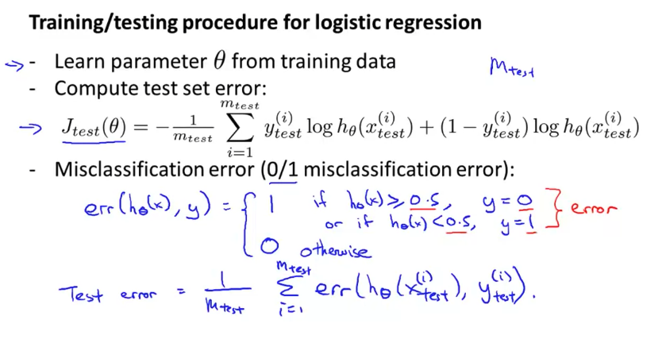
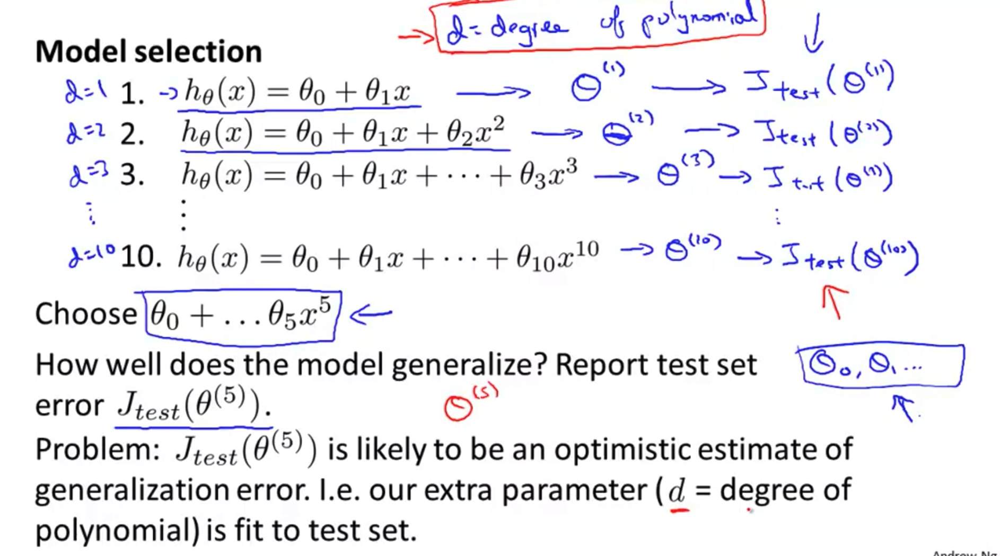
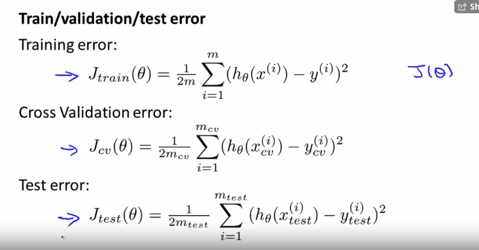

# Advice for applying machine learning & machine learning system design

- 의문
- Advice for applying machine learning
  - Evaluating a Learning Algorithm
  - Bias vs Variance
- Machine learning system design
  - Building a Spam Classifier
  - Handling Skewed Data
  - Using Large Data Sets

## 의문

## Advice for applying machine learning

### Evaluating a Learning Algorithm

- 문제
  - housing price를 예측하기 위하여, regularized linear regression을 구현했는데, hypothesis가 test set에서 예측이 매우 크게 벗어나는 현상이 발생하면, 우리는 무엇을 해야하는가?
- 우리가 취할 수 있는 선택지
  - 트레이닝 데이터셋을 늘린다
  - 피쳐의 수를 줄인다
  - 피쳐의 수를 늘린다
  - polynomial 피쳐를 추가한다
  - λ를 감소 시킨다
  - λ를 증가 시킨다

### Evaluating a Hypothesis

Training/testing procedure for logistic regression

- 데이터의 분리
  - training set(70%)
    - Parameter learning에 사용
  - test set(30%)
    - Test set error를 구해서 학습된 모델이 얼마나 잘 맞는지 확인
      - regression의 경우
        - `Jtest(θ) = 1/2m sigma_{i=1}^{m}(hθ(x(i))-y(i))^2`를 구함
      - classification의 경우
        - Misclassification error를 구함
          - `err(hθ(x),y)`
            - `1 (if (hθ(x)≥0.5 and y=0) or (hθ(x)<0.5 and y=1))`
            - `0 (else)`
          - `Test Error = 1/m sigma_{i=1}^{m}(err(hθ(x(i)), y(i)))`

### Model Selection and Train/Validation/Test Sets

Model selection

- 위의 내용 부연 설명
  - training set으로 θ를 각각 degree에 따라서 학습시킴
  - test set으로 각 학습시킨 모델의 성능을 degree에 따라서 비교
    - 근데 그냥 여기서 `Jtest(θ(5))`를 가지고 일반적인 성능이 좋다 나쁘다를 따질 수 없음
    - `Jtest(θ(5))`가 optimistic estimate of generalization error일 수 있기 때문
      - `d = polynomial의 degree`가 test set에 피팅되어있다고 봄(**다른 degree의 모델을 이겼다는 사실이 추가되니까**)

Train/Validation/Test error expressions

- Training set(60%)
  - 파라미터 학습에 사용
- Validation set(20%)
  - 모델 끼리의 cross validation에 사용 등
- Test set(20%)
  - hypothesis의 일반적인 성능 측정에 사용

### Bias vs Variance

## Machine learning system design

### Building a Spam Classifier

### Handling Skewed Data

### Using Large Data Sets
