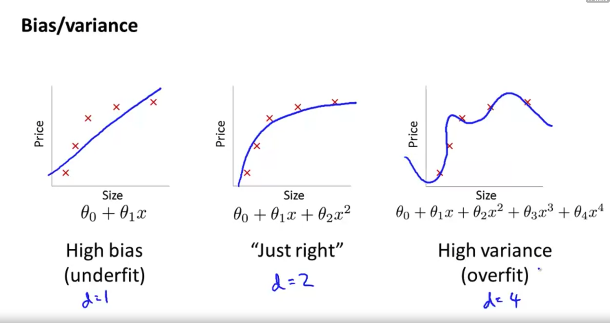
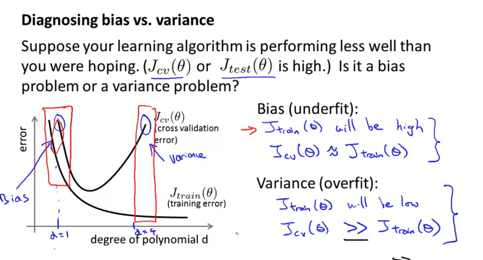
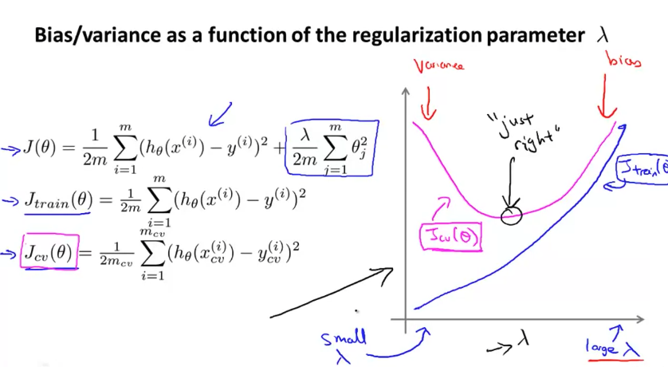
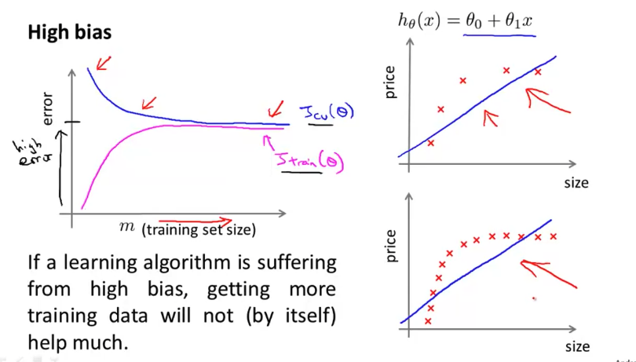
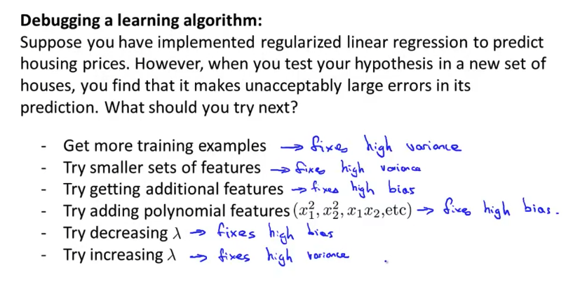
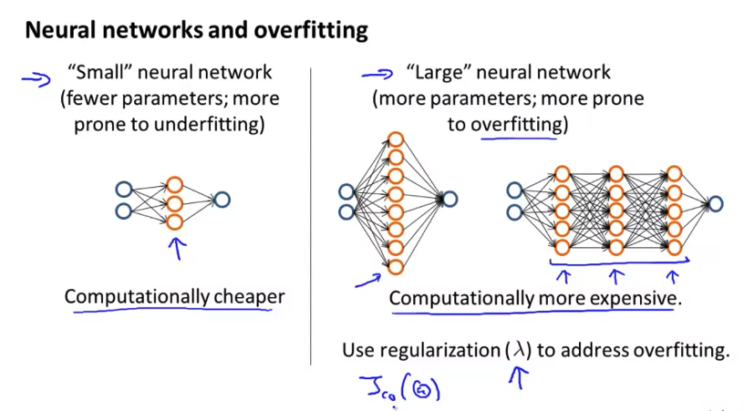
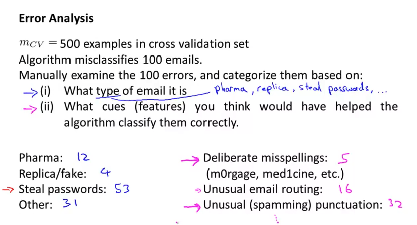
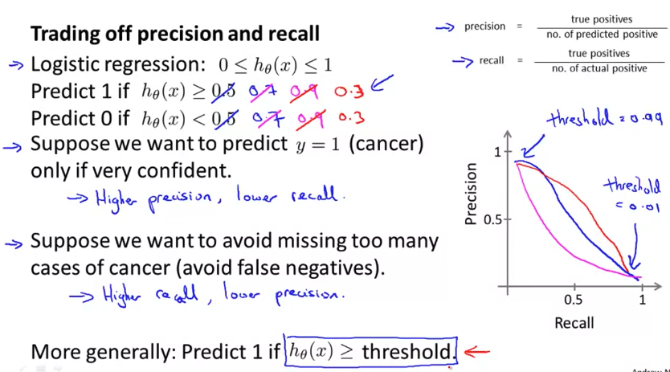

# Advice for applying machine learning & machine learning system design

- 의문
- Advice for applying machine learning
  - Evaluating a Learning Algorithm
  - Bias vs Variance
- Machine learning system design
  - Building a Spam Classifier
  - Handling Skewed Data
  - Using Large Data Sets

## 의문

## Advice for applying machine learning

- **머신러닝으로 문제해결할 시 Recommended approach**
  - 1 간단한 일고리즘으로 빠르게 구현하고, cross-validation data로 test해보기
  - 2 learning curve를 그려서 더 많은 데이터 혹은 더 많은 피쳐 등이 도움이 될지 확인
    - premature optimization을 방지
  - 3 Error analysis를 해보기
    - 직접, algorithm이 에러를 낸 케이스를 확인해서, 에러에서 규칙성을 찾아보기
    - error는 수치로 나타낼 수 있도록
  - c.f) skewed data를 다루는 경우 고려할 모델 성능 지표
    - precision
    - recall
    - F1-score
  - c.f) 또 다른 모델 성능 지표
    - sensitivity(recall)
      - 질병이 있는 사람을 양성으로 검출하는 능력
    - specificity
      - 질병이 없는 사람을 음성으로 검출하는 능력
    - AUROC
    - PPV(precision)
    - NPV
      - negative라고 판정한 것중에 진짜 negative
- **모델의 검증 및 평가**
  - 모델의 검증 및 평가
    - training set
      - model의 parameter를 학습시키기 위한 데이터
    - validation set
      - 여러가지 모델 중에서 가장 성능이 좋은것을 픽하기 위한 데이터
      - 모델에 대한 여러 가설을 탐색하는 도중에 좋은 가설을 선택할 때 도움을 주기 위한 데이터
    - test set
      - 최종 선택된 모델이 충분히 일반화 되어있는지 판단하기 위한 데이터
  - Learning Curve
    - x축이 training set size, y축이 error인 그래프
    - `Jtrain(θ), Jcv(θ)`를 그려서 모델이 fit, high bias, high variance중 어느쪽인지 확인
  - Learning Curve로 부터 얻은 결과로 부터 필요한 행위를 한다
    - overfitting 해결
    - underfitting 해결

### Evaluating a Learning Algorithm

- 문제
  - housing price를 예측하기 위하여, regularized linear regression을 구현했는데, hypothesis가 test set에서 예측이 매우 크게 벗어나는 현상이 발생하면, 우리는 무엇을 해야하는가?
- 우리가 취할 수 있는 선택지
  - 트레이닝 데이터셋을 늘린다
  - 피쳐의 수를 줄인다
  - 피쳐의 수를 늘린다
  - polynomial 피쳐를 추가한다
  - λ를 감소 시킨다
  - λ를 증가 시킨다

### Evaluating a Hypothesis

Training/testing procedure for logistic regression

- 데이터의 분리
  - training set(70%)
    - Parameter learning에 사용
  - test set(30%)
    - Test set error를 구해서 학습된 모델이 얼마나 잘 맞는지 확인
      - regression의 경우
        - `Jtest(θ) = 1/2m sigma_{i=1}^{m}(hθ(x(i))-y(i))^2`를 구함
      - classification의 경우
        - Misclassification error를 구함
          - `err(hθ(x),y)`
            - `1 (if (hθ(x)≥0.5 and y=0) or (hθ(x)<0.5 and y=1))`
            - `0 (else)`
          - `Test Error = 1/m sigma_{i=1}^{m}(err(hθ(x(i)), y(i)))`

### Model Selection and Train/Validation/Test Sets

Model selection

- 위의 내용 부연 설명
  - training set으로 θ를 각각 degree에 따라서 학습시킴
  - test set으로 각 학습시킨 모델의 성능을 degree에 따라서 비교
    - 근데 그냥 여기서 `Jtest(θ(5))`를 가지고 일반적인 성능이 좋다 나쁘다를 따질 수 없음
    - `Jtest(θ(5))`가 optimistic estMimate of generalization error일 수 있기 때문
      - `d = polynomial의 degree`가 test set에 피팅되어있다고 봄(**다른 degree의 모델을 이겼다는 사실이 추가되니까**)

Train/Validation/Test error expressions

- Training set(60%)
  - 파라미터 학습에 사용
- Validation set(20%)
  - 모델 끼리의 cross validation에 사용 등
- Test set(20%)
  - hypothesis의 일반적인 성능 측정에 사용

### Bias vs Variance

bias vs variance

diagnosing high bias vs high variance

- Diagnosing Bias vs Variance

Regularization and Bias/Variance

- Regularization and Bias/Variance
  - 개요
    - Regularization이 Bias와 Variance에 미치는 영향은?
  - d와 λ의 선정 방법(일반적인 여러 파라미터)
    - `λ=0`, `λ=0.01` 에서 `λ=10`까지 `λ:=λ*2`로 늘려나감 list of λ를 생성
    - 서로 다른 degree 또는 다른 변수를 가지고 모델을 생성
    - 각 λ를 iterate하면서, θ학습
    - 얻어진 θ를 바탕으로 cross validation error를 구함
      - **대신 이때의 Jcv(θ)는 regularization term을 고려하지 않아야 함**
    - cross validation error가 가장 낮은 조합을 선택
    - 선택된 조합으로 `Jtest(θ)`에 적용하여, generalization이 충분히 잘 되었는지 확인

### Learning Curve

Learning curve of high biased model

Learning curve of high variance model

- 개요
  - x축이 training set size, y축이 error
  - 현재의 모델이 high variance인지, high biased인지 판단할 수 있도록 도와주는 커브
    - 항상 그려보자!
- 케이스 분석
  - high bias
    - 모델 자체가 bias가 높을경우에, training data set이 많다고 하더라도 별 도움이 되지 않음
  - high variance
    - 모델 자체가 variance가 높을경우는, training data set이 많아지면 도움이 될 가능성이 있음

### Deciding What to Do Next Revisited

- 문제
  - 새로 만든모델이 Large error를 내는 경우 어떻게 할 것인가?
- 해결
  - 1 high variance문제인지, high bias문제인지 확인
  - 2 각각의 문제에 맞는 전략 시행

Neural Network and Overfitting

- NN의 경우, 하나의 hidden layer로 시작한 뒤에, 다수의 hidden layers로 넘어가서 cross validation set으로 검증해보면 좋음

## Machine learning system design

### Building a Spam Classifier

Spam classifier: Problem

- 스팸 메일 분류기
  - `x = features of email`
    - spam에서 가장 활발히 사용되는 n개의 단어들을 추출
      - 등장하면 1 등장하지 않으면 0
      - discount, discounts는 같은 단어로 취급할것인가?
      - misspelling을 어떻게 다룰 것인지?
        - m0rtgage, med1cine
    - email header로부터의 피쳐 추출
  - `y = spam(1 or 0)`
  - 우선순위를 세워서 작업을 하는것이 중요!

Error analysis example

- Error Analysis
  - 위의 스팸의 예시의 경우 stemming이 도움이 될지 안될지 모름. 직접 해봐야 함
    - Cross validation error
  - Upper vs lower case 이 도움이 될지 안될지 모름. 직접 해봐야 함
  - **중요한 것은 새로운 개선을 시도할 경우, 반드시 수치로 나타내서 비교할 수 있도록 해야 함**

### Handling Skewed Data

- 예시
  - Cancer classification을 하는 경우, logistic regression model `hθ(x)`를 학습시켰는데, test set에서 1%의 에러가 나옴
  - 그런데 원래 0.5%만 암을 갖고 있는 환자였다면
    - **skewed classes**
  - `hθ(x)=0`으로 두면, 에러가 더 적은 마술이 일어남

Precision과 recall 사이의 tradeoff

- Precision/Recall
  - 일반적으로 `y=1`이 rare class를 나타냄
  - precision
    - `tp/predict_positive = tp/(tp+fp)`
  - recall
    - `tp/actual_positive = tp/(tp+fn)`
  - f1 score
    - `2*(PR/P+R)`
    - *정확히 무슨 의미를 가지는가? 왜 조화평균을 사용하는가?*

### Using Large Data Sets

- Data for machine learning
  - It's not who has the best algorithm that wins. It's who has the most data.
- Large data rationale
  - Given the input x, can a human expert confidently predict y?
    - yes: For breakfast I ate ___ eggs.
    - no: Predict housing price from only size and no other features
  - Use a learning algorithm with many parameters
