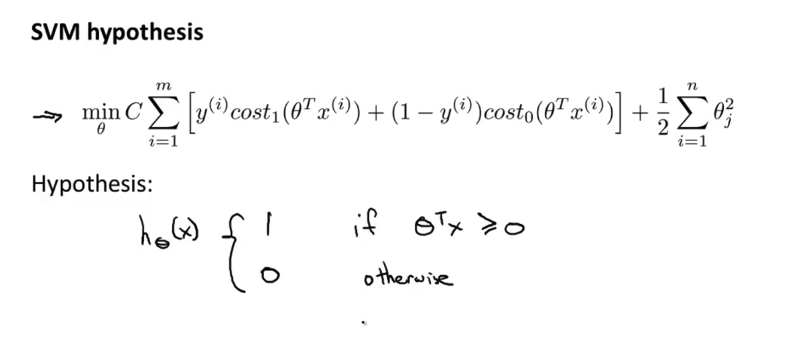
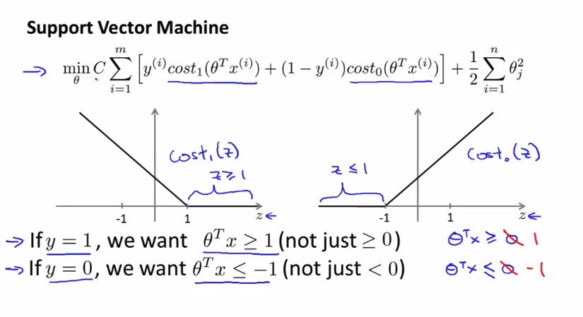
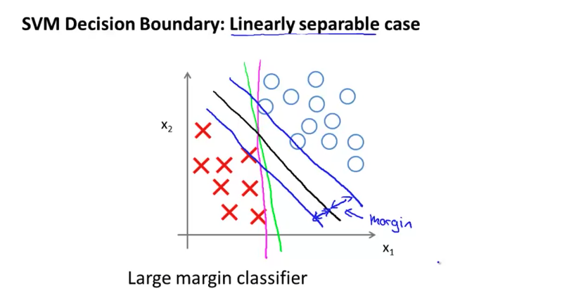
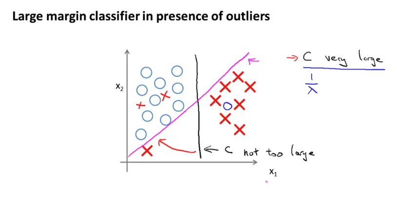
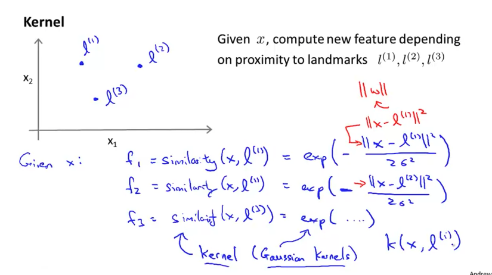
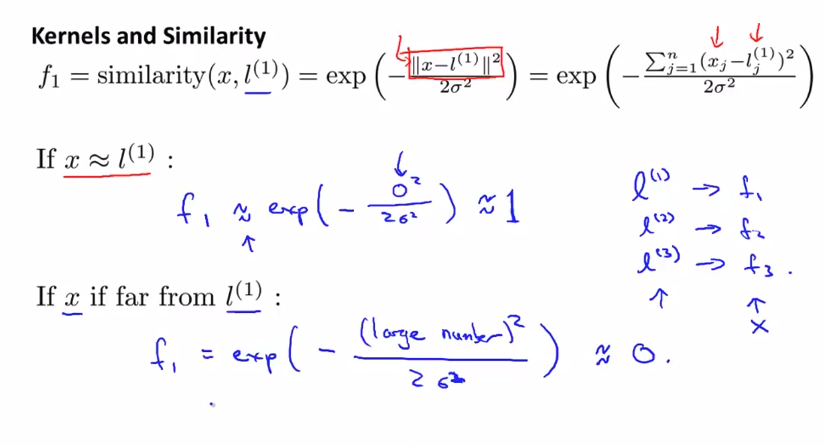
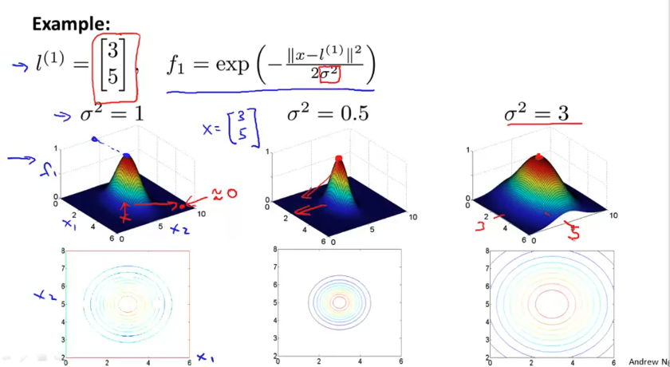
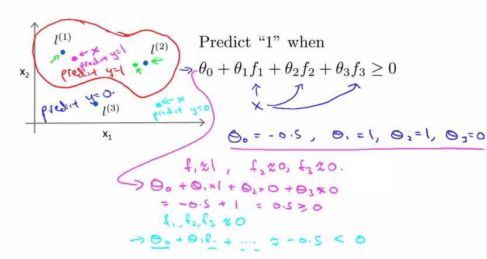
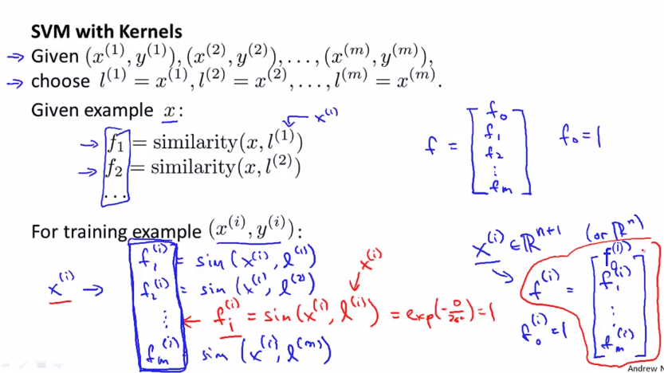
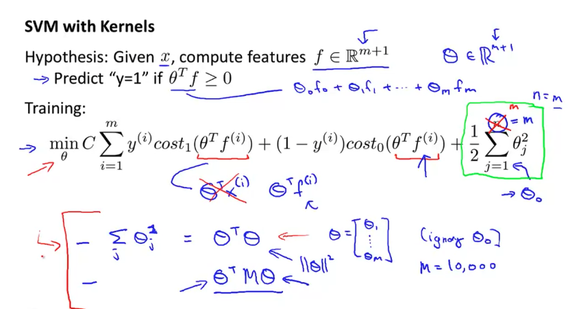

# Support Vector Machine

- 의문
- Large Margin Classification
- Kernels
- SVMs in Practice

## 의문

## Large Margin Classification

SVM cost function and hypothesis

### Large Margin Intuition

SVM Intuition1

SVM Intuition2: Large Margin

SVM Intuition2: When C is too large and not too large

- Large Margin
  - 개요
    - classify할 때, 가능한한 큰 margin으로 classification을 행하려고 함
- C
  - `1/λ`와 비슷한 역할을 함

### Mathematics Behind Large Margin Classification

## Kernels

- SVM을 complex nonlinear classifier로 adapting하기 위한 기술

### Kernels1

Kernel이란

Kernel과 similarity

similarity function의 그래프와 이해

랜드마크와 hypothesis function, 및 decision boundary의 관계

- kernel(gaussian kernel) function
  - 개요
    - SVM의 similarity function을 말함
    - `fi = similarity(x, li) = exp(-(||x-li||^2/(2σ^2)))`
  - landmark l1, l2, l3들이 새로운 피쳐인 f1, f2, f3을 결정함

### Kernels2

SVM with kernels and example

SVM Hypothesis and Cost function with kernels

- 문제
  - landmark를 어디에 두어야 하는가?
- 간단한 답
  - training셋의 위치에 그냥 두면 됨
    - `(x1,y1), ..., (xm,ym)`에 대해서, `l1=x1, ..., lm=xm`으로 두자
    - `f1 = similari`
- 의문
  - Q) SVM의 커널과 landmark 아이디어를 왜 다른 알고리즘에서는 차용하지 않는가?
    - A) 다른 알고리즘에서는 계산에 필요한 시간복잡도가 너무 큼. 최적화가 잘 안됨
- SVM parameters
  - `C`
    - large `C`: ~~ large `1/λ` => small `λ` => higher variance
      - **그냥 C가 커짐 => regularization term의 영향력이 상대적으로 작아짐 => higher variance로 이해해도 될듯**
    - small `C`: ~~ small `1/λ` => large `λ` => higher bias
  - `σ`
    - large `σ` => fi vary more smoothly => higher bias
    - small `σ` => fi vary less smoothly => higher variance

## SVMs in Practice
