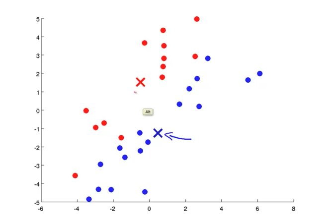
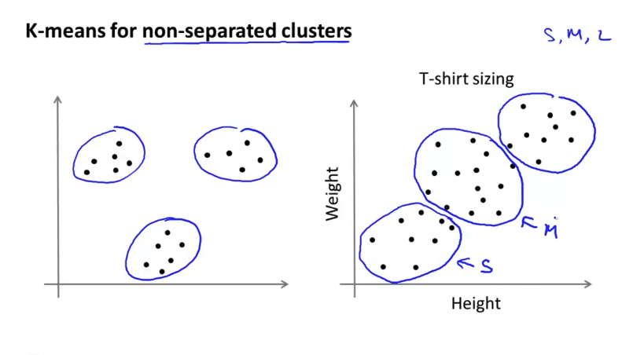
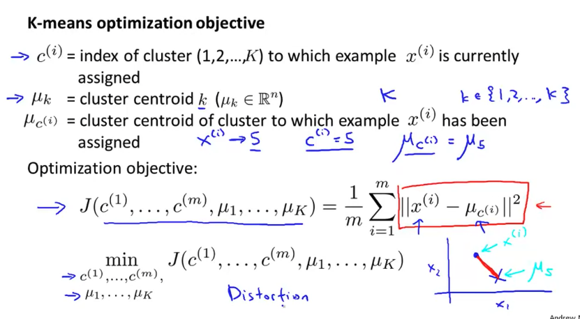
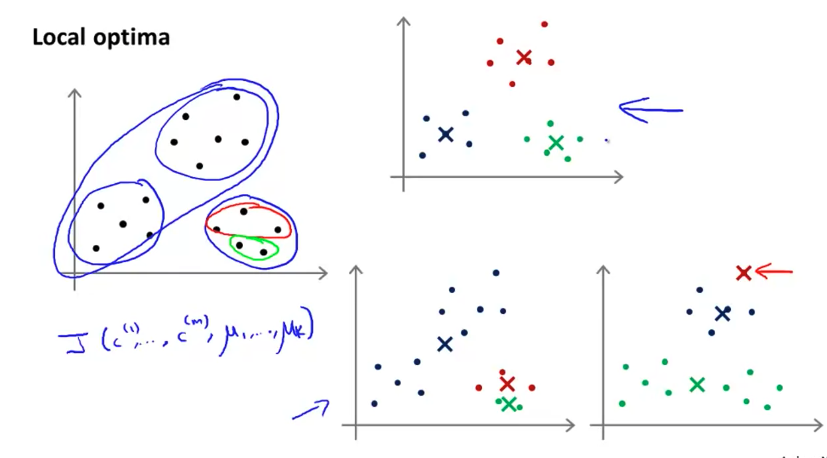
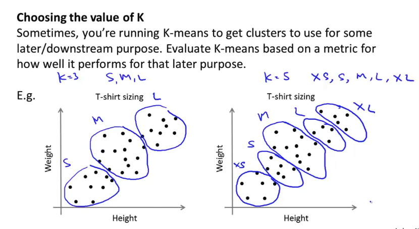

# K-Means Algorithm

- 의문
- Clustering
- Principal Component Analysis
- Applying PCA

## 의문

## Clustering

### K-means Algorithm

#### K-means cluster visualization

#### K-means cluster application

- input
  - K(number of clusters)
  - training set `{x(1), ..., x(m)}`
    - `x(i)∈R^n`
- algorithm
  - K cluster centroid `mu(1), ..., mu(k) ∈ R^n`를 random initialize
  - 다음을 반복
    - cluster assignment step
      - `c(i) := index of cluster centroid closest to x(i)`
    - move centroid step
      - `k=1 to K, mu(k) := average(mean) of points assigned to cluster k`
      - 만약 `mu(i)`에 아무런 closest x가 존재하지 않으면, 해당 centroid는 삭제시키는 것이 일반적임
- 활용
  - T-shirt S,M,L 사이즈 정하기(non-separated clusters)

### Optimization Objective

K-means optimization objective

- *왜, 위의 J함수가 탄생하는가?*
  - K-means알고리즘에서, cluster assignment step 경우, `mu1, ..., muk`가 고정된 상태에서 `c1, c2, c3, ..., cm`을 정하여 cost function을 최소화 하는 것을 나타냄
  - K-means알고리즘에서, move centroid step의 경우, `mu1, ..., muk`에 대해서 cost function을 최소화 하는 것을 나타냄

### Random initialization

Random initialization local optima problem

- random initialization
  - `K < m`
  - K training example을 랜덤하게 선택
  - `mu1, ..., muk`를 K example과 동등하게 세팅
- multiple random initialization
  - 개요
    - local optima문제를 해결
    - k가 2-10 정도로 작으면 매우 효과적
      - k가 매우 크면 큰 효과를 못볼 수 있음

### Choosing the number of clusters

Choosing the number of clusters

- K 선택 방법
  - Elbow method
    - 항상 이 방법을 적용 가능하지는 않음
  - **애초에 왜 K-means clustering을 행하려고 하는가?**
    - 결국 human insight

## Principal Component Analysis

## Applying PCA
