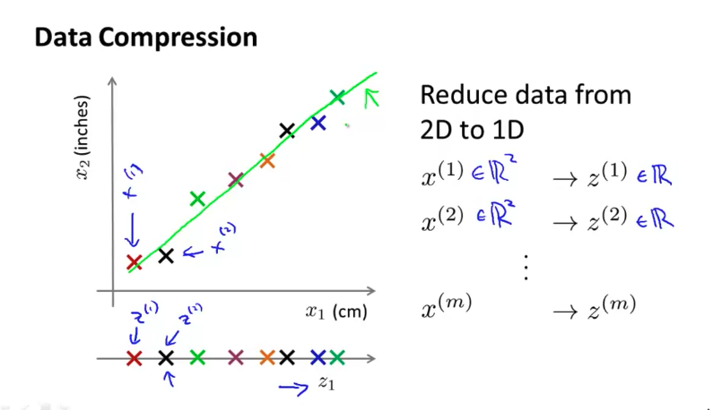

# K-Means Algorithm

- 의문
- Clustering
- Principal Component Analysis
- Applying PCA

## 의문

## Clustering

Clustering의 응용

### K-means Algorithm

#### K-means cluster visualization

#### K-means cluster application

- input
  - K(number of clusters)
  - training set `{x(1), ..., x(m)}`
    - `x(i)∈R^n`
- algorithm
  - K cluster centroid `mu(1), ..., mu(k) ∈ R^n`를 random initialize
  - 다음을 반복
    - cluster assignment step
      - `c(i) := index of cluster centroid closest to x(i)`
    - move centroid step
      - `k=1 to K, mu(k) := average(mean) of points assigned to cluster k`
      - 만약 `mu(i)`에 아무런 closest x가 존재하지 않으면, 해당 centroid는 삭제시키는 것이 일반적임
- 활용
  - T-shirt S,M,L 사이즈 정하기(non-separated clusters)

### Optimization Objective

K-means optimization objective

- *왜, 위의 J함수가 탄생하는가?*
  - K-means알고리즘에서, cluster assignment step 경우, `mu1, ..., muk`가 고정된 상태에서 `c1, c2, c3, ..., cm`을 정하여 cost function을 최소화 하는 것을 나타냄
  - K-means알고리즘에서, move centroid step의 경우, `mu1, ..., muk`에 대해서 cost function을 최소화 하는 것을 나타냄

### Random initialization

Random initialization local optima problem

- random initialization
  - `K < m`
  - K training example을 랜덤하게 선택
  - `mu1, ..., muk`를 K example과 동등하게 세팅
- multiple random initialization
  - 개요
    - local optima문제를 해결
    - k가 2-10 정도로 작으면 매우 효과적
      - k가 매우 크면 큰 효과를 못볼 수 있음

### Choosing the number of clusters

Choosing the number of clusters

- K 선택 방법
  - Elbow method
    - 항상 이 방법을 적용 가능하지는 않음
  - **애초에 왜 K-means clustering을 행하려고 하는가?**
    - 결국 human insight

## Principal Component Analysis

#### Dimensionality reduction 2D to 1D

#### Dimensionality reduction 3D to 2D

- Motivation1: Data Compression
- Motivation2: Visualization
  - feature가 매우 많을 경우, 전체 feature를 반영하는, 새로운 적은 feature를 생성

### Principal Component Analysis Problem Formulation

#### PCA

#### Linear regression vs PCA

- PCA
  - 개요
    - 차원감소를 squared projection error를 최소화 하는 식으로 행함
- PCA vs Linear regression
  - PCA
    - 모든 축을 동일하게 생각
    - 차원 축소 전의 점의 위치에서 변환후 기저에 가장 가까운 점을 차원 축호 후의 점의 위치로 두는 것이 바람직
      - 따라서, 수직인 점으로 근사하는게 옳음
  - Linear regression
    - y축에 대한 오차를 구함

### Principal Component Analysis Algorithm

#### PCA algorithm1

#### PCA algorithm summary

## Applying PCA

### Reconstruction from Compressed Representation

#### PCA Reconstruction

- reconstruction
  - `z = tU_reduce・x`
  - `x_approx = U_reduce・z`
    - reconstruction
    - *근데 이것이 왜 성립하는지?*

### Choosing the Number of Principal Components

*variance retain이란?*

#### How to choose k

#### How to choose k - algorithm and octave

- 알고리즘
  - `k=1`
  - 다음을 계속 반복
    - PCA 시도
    - U_reduce, z(1), ..., z(m), x(1)_approx, ..., x(m)_approx 계산
    - `(1/m sigma_{i=1}^{m}(||x(i) - x(i)_approx||^2)) / (1/m sigma_{i=1}^{m}(||x(i)||^2)) ≤ 0.01`을 만족하면 해당 k선택, 아니면 `k+=1`
  - octave에서는 더 간단히 계산 가능
    - `[U, S, V] = svd(Sigma)`

### Advice for Applying

- Compression
  - Supervised learning speedup
    - 주의
      - overfitting 방지로는 사용하지 마라
        - regularization을 사용하라
      - 처음부터 PCA쓰기 전에 일단 그냥 그대로 돌려보라
        - 그 다음에 잘 되지 않는 경우 PCA시도하라
  - data store
- Visualization
  - k=2, k=3

#### Compression

- 개요
  - 트레이닝셋의 파라미터값을 기준으로 PCA를 진행하여 모델의 파라미터의 차원을 낮춤
  - 차원을 낮춘 트레이닝 데이터셋과 모델로 학습
  - 차원을 낮춘 validation 데이터셋과 test 데이터셋으로 검증 / 평가
    - 여기서 차원을 낮출 때에는, training set기준으로 낮춰야 함

#### Visualization
