# Anomaly detection and Recommender Systems

- 의문
- Anomaly Detection
  - Density estimation
  - Building an Anomaly Detection System
  - Multivariate Gaussian Distribution
- Recommender Systems
  - Predicting Movie Ratings
  - Collaborative Filtering
  - Low Rank Matrix Factorization

## 의문

## Anomaly Detection

### Density Estimation

Anomaly detection example1

Anomaly detection example2

- (probability)Density estimation
  - 개요
    - 어떠한 제품의 다양한 feature들의 확률분포가 Gaussian distribution이라고 가정하고, 각각의 feature가 독립적일 경우
      - `p(x) = p(x1; mu1, σ1^2)・p(x2; mu2, σ2^2)・・・・p(xn; mun, σn^2) = πp(xj; muj, σj^2)`
        - *단순히 gaussian distribution에서 x값을 대입해서 그것들을 곱하는것? 아니면 넓이를 곱하는것? 연속 확률 분포에서는 2D의 겨우, gaussian distribution의 선에 대한 질량이 확률값이 되는 것이 아닌가?*

### Building an Anomaly Detection System

#### algorithm evaluation

Developing and Evaluating an Anomaly Detection System

- 데이터 나누기
  - 전체 데이터
    - good: 10000(`y=1`)
    - flawed: 20(`y=0`)
  - training set(60%)
    - good: 6000
    - 전부 good example
  - validation set(20%)
    - good: 2000
    - flawed: 10
  - test set(20%)
    - good: 2000
    - flawed: 10
- 학습
  - training set으로 `p(x)`를 피팅함
  - `y =`
    - `1 if p(x) < ε (anomaly)`
    - `0 if p(x) ≥ ε (normal)`
- evaluation metric(skewed data)
  - Precision/Recall
  - F1-score
- cross validation set을 이용하여 ε을 선택하자

#### **Anomaly Detection vs Supervised Learning**

- 의문
  - 레이블링 되는 데이터가 있으면 그냥 supervised learning쓰면 되는거 아닌가?
- Anomaly detection
  - 상대적으로 매우 적은 positive examples, 상대적으로 매우 많은 negative examples
  - Anomaly의 타입이 매우 다양한 경우
    - algorithm이 positive example로 부터 anomaly가 어떻게 생긴것인지 학습하기 힘든 경우
  - 미래에 나타날 수 있는 anomaly들이 과거의 예시와는 완전히 다를 수 있는 경우
  - e.g)
    - Fraud detection
    - Manufacturing
      - aircraft engines
    - Monitoring machines in a data center
    - *자살자의 징조 파악?*
- Supervised learning
  - 많은 posivie, negative examples
  - 충분한 positive example이 존재하여, 알고리즘이 positive example이 어떻게 생겼는지를 알고, 미래의 positive example이 training set과 유사할 것으로 생각되는 경우
  - e.g)
    - Email spam classification
    - Weather prediction
    - Cancer classification

#### Choosing What Features to Use

- 특정 피쳐의 분포가 gaussian이 아닌경우
  - transformation
    - `xi <- log(xi)`로 변환
    - `xi <- log(xi+c)`
    - `xi <- sqrt(xi)`
    - ...

Anomaly detection error analysis

- Error analysis for anomaly detection
  - 일반적인 문제로는, `p(x)`가 특정 변수 하나로는 anomaly를 구분하기 쉽지 않은 경우 새 변수를 찾음
  - anomaly시에 일반적으로 매우 크거나 작은 값이 나오는 피쳐를 선택
    - 기존의 피쳐를 조합하는 형식으로도 가능

### Multivariate Gaussian Distribution

Multivariate Gaussian Distribution1

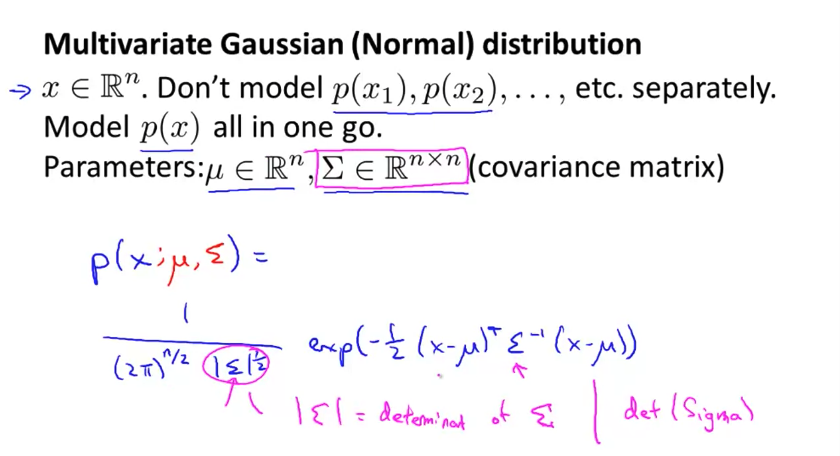

Multivariate Gaussian Distribution2

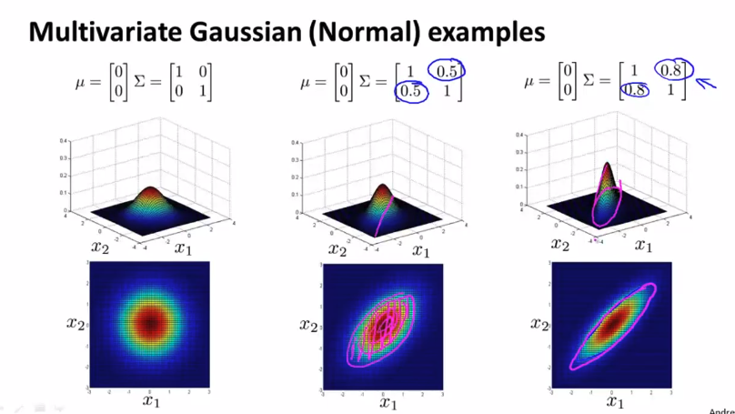

Multivariate Gaussian Distribution3

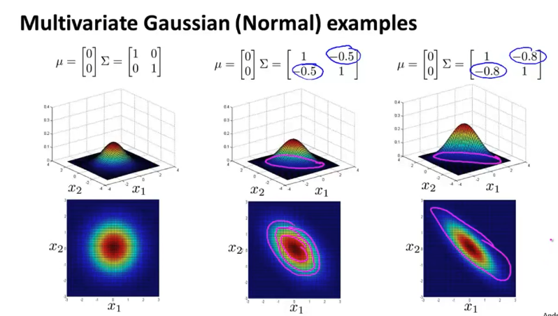

Multivariate Gaussian Distribution4

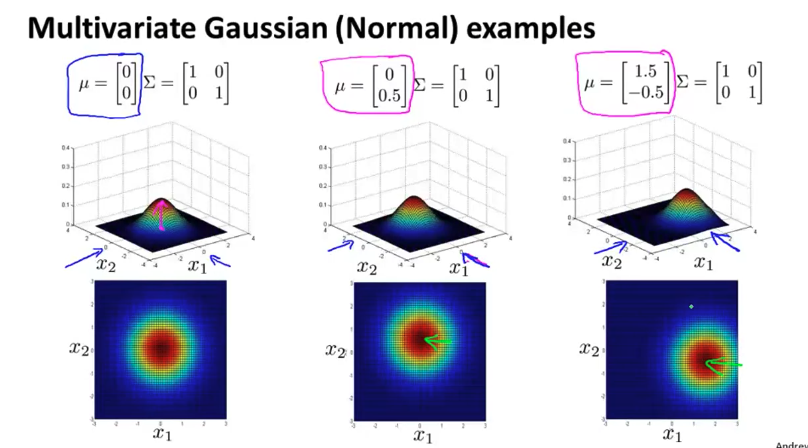

#### Anomaly Detection using the Multivariate Gaussian Distribution

Multivariate Gaussian Gaussian distribution

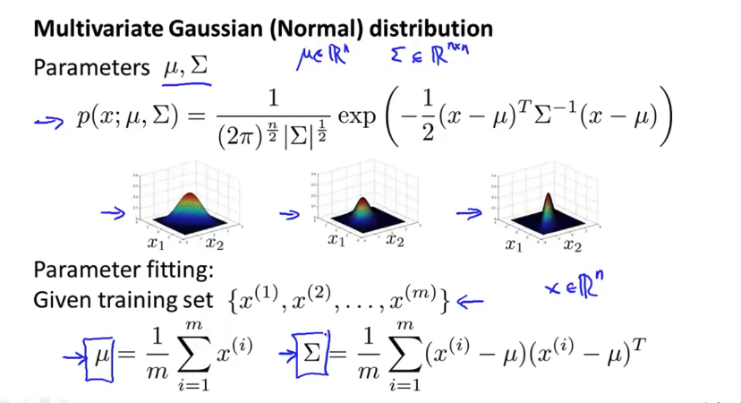

Anomaly detection with the multivariate Gaussian

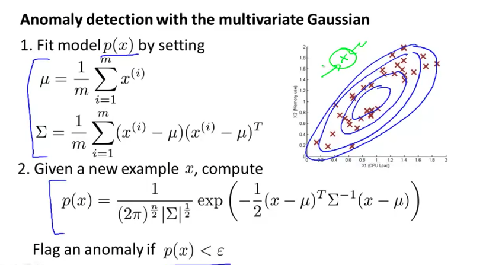

Anomaly detection with the multivariate Gaussian Relationship to original model

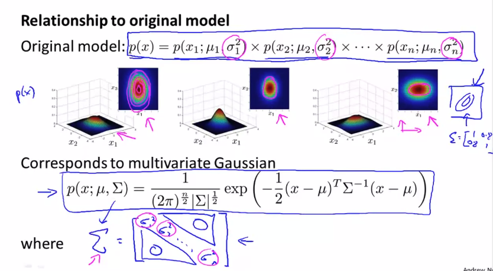

- Original model은 Multivariate Gaussian Distribution의 special case

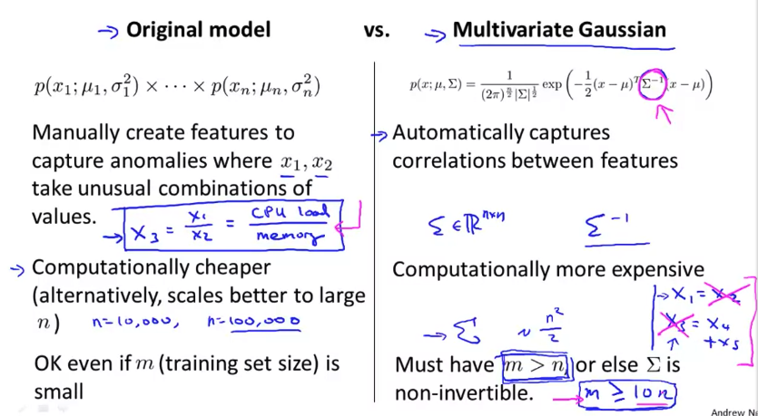

- Original model vs Multivariate Gaussian

## Recommender Systems

### Predicting Movie Ratings

#### Content Based Recommendations

영화 별점 예측 예시

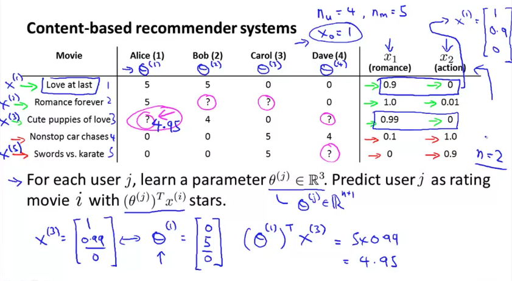

- 문제 정의
  - `r(i,j) = 1 (user j가 movie i를 레이팅 한 경우)`
  - `y(i,j) = user j가 movie i를 레이팅 했을경우의, 점수`
  - `θ(j) = user j에 대한 parameter vector`
  - `x(i) = movie i에 대한 feature vector`
  - `h_θ(x) = tθ(j)・(x(i)) = user j, movie i에 대해서 predicted rating`
  - `m(j) = user j에 의하여 rated된 movie의 개수`

Recommendation system optimization objective

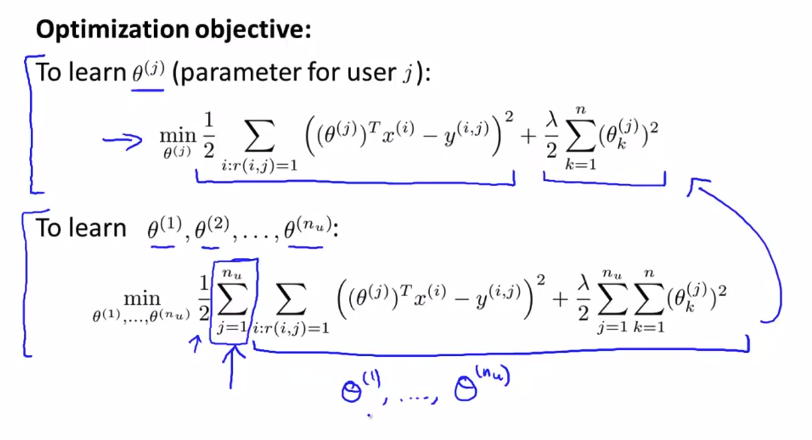

Recommendation system optimization gradient descent

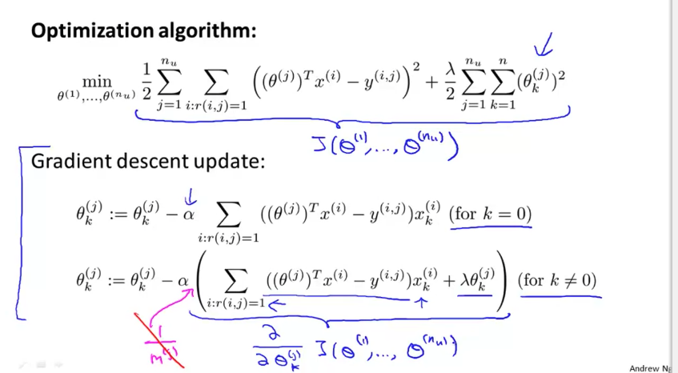

### Collaborative Filtering

#### Collaborative Filtering

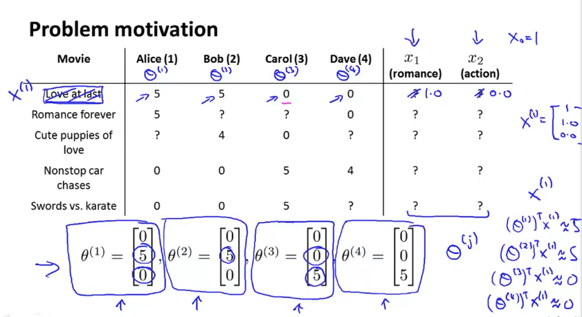

- feature 추론 알고리즘
  - 개요
    - feature를 모르나, 대신, parameter를 아는 경우 feature를 추정

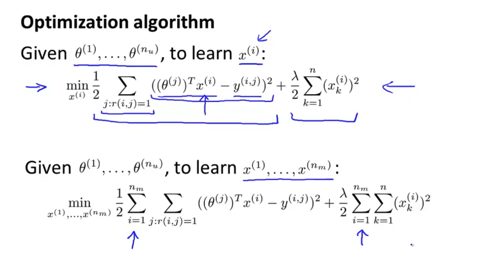

- **collaborative filtering algorithm**
  - 개요
    - rating데이터와 대상 feature를 이용하여 개개 유저의 선호 파라미터 최적화
    - 개개 유저의 선호 파라미터를 이용하여 대상 feature의 최적화
    - 위의 두 최적화를 반복하여 보다 정밀한 recommendation system을 만든다
  - 절차
    - 1 `처음에는 유저 선호 파라미터를 랜덤하게 initialize`
    - 2 `rating 데이터 x(1), ..., x(nm)으로 부터 유저 선호 파라미터(θ)를 최적화`
    - 3 `θ(1), ..., θ(nu)`로 부터 `x(1), ..., x(nm)`을 estimate
    - 위의 2,3 반복해서 최적화

#### Collaborative Filtering Algorithm

Collaborative Filtering Optimization Objective

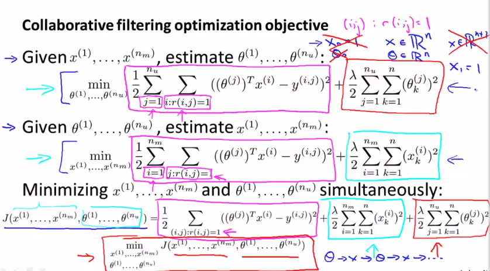

Collaborative Filtering Algorithm

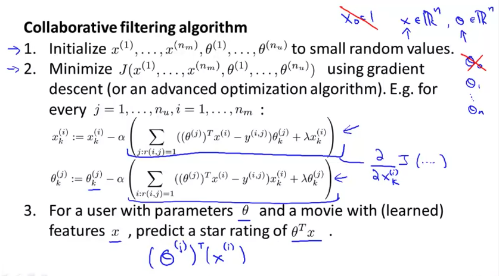

- 주의
  - θ0을 굳이 만들 필요가 없음
    - 왜냐하면, x, θ를 둘다 학습시킬 것이기 때문

### Low Rank Matrix Factorization

#### Vectorization: Low Rank Matrix Factorization

#### Implementational Detail: Mean Normalization
