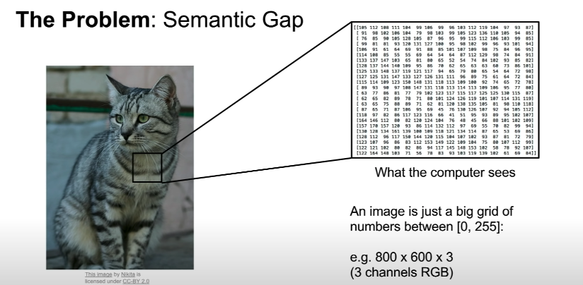
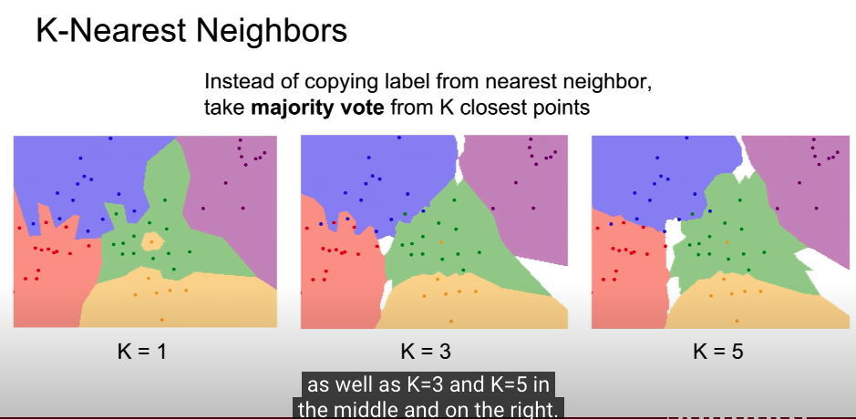
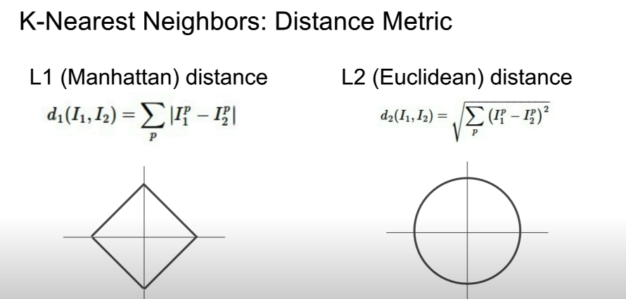
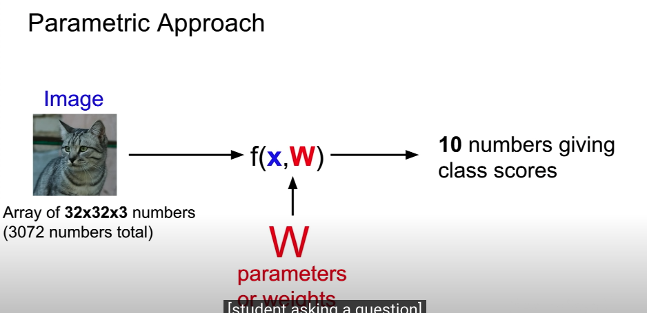
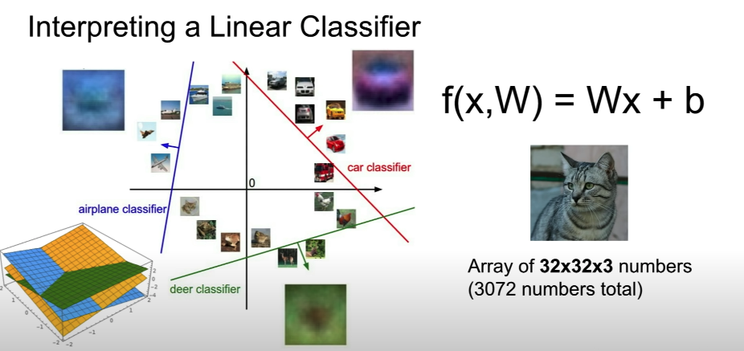

# Lecture2: Image Classification

- 의문

## 의문

## Image Classification

Problem of image classification

- 개요
  - Core task in Computer Vision
- 문제
  - semantic gap
    - 주어진 사진이 강아지인지, 고양이인지 알 수 없음
    - challenge
      - viewpoint variation
      - illumination
      - deformation
      - occulusion
      - background clutter
      - intraclass variation

### Algorithm-Driven Approach

- 시도했으나 잘 동작하지 않음
- 모든 오브젝트에 대해서 이런식으로 classification하기 힘듬

### Data-Driven Approach

K-nearest Neighbors

K-nearest Neighbors: Distance Metric

- 개요
  - 방데한 데이터를 기반으로 모델을 train하고, 그 모델로 predict함
- 방식
  - Nearest Neighbor
  - Linear classifier

#### Nearest Neighbor

- 구조
  - train
    - 모든 데이터와 레이블을 기억
  - predict
    - input image와 가장 유사한 training image의 label을 출력
- 유사도
  - `L1 distance`
    - manhattan distance
      - coordinate dependency
  - `L2 distance`
    - euclidean distance
  - ...
- Hyperparameters
  - 개요
    - 학습이 아니라, 직접 세팅되는 알고리즘에 대한 선택
      - problem-dependent
      - 모든 가능성을 실행해보고 직접 잘 맞는지 확인해야 함
  - 예시
    - k-nn에서
      - k
      - distance
  - dataset
    - training
    - validation
    - test
- 단점
  - 테스트 할 때 매우 느림
  - distance metrics on pixel이 informative하지 않음
  - curse of dimensionality
    - k-nn의 기본전제는, point들이 dense해야 한다는것
    - 그런데, high dimensional space에서는 전체 point의 개수가 지수적으로 증가하므로, point의 분포가 충분히 dense 하지 않을 경우가 생김
      - 사실상 neighbor point가 제대로 군집되어있지 않은 경우가 발생할 수 있음(서로 다른 레이블 point가 멀리 떨어져있어도 우연히 같은 neighbor이 될 확률 증가)
  - 이미지 분류에는 잘 사용되지 않음

#### Linear Classifier

Overview of Linear Classifier

Linear Classifier Intuition

- 개요
  - Parametric Approach
    - **knn은 parameter가 존재하지 않았음(?!)**
- 단점
  - training 데이터를 하나의 template으로 수렴시켜버림
