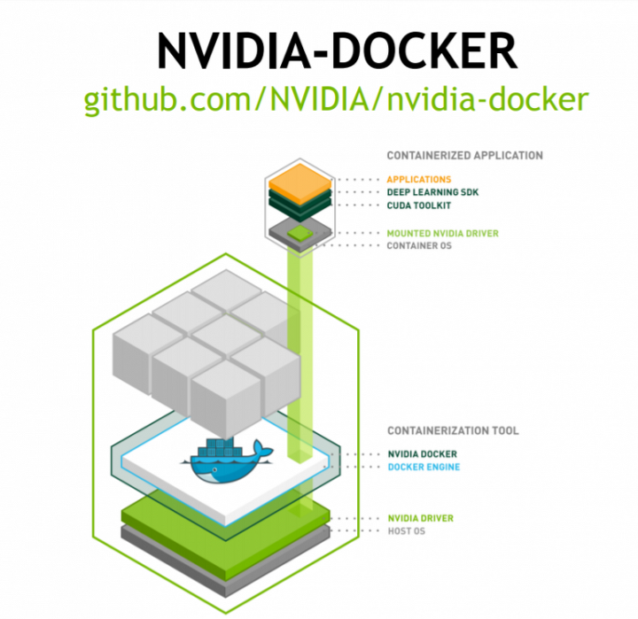
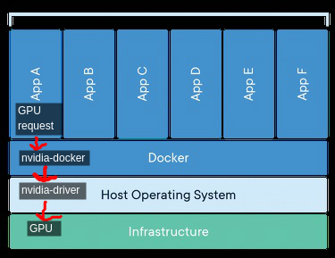

# Docker및 개발환경

- 의문
- nvidia container toolkit
  - nvidia-docker

## 의문

## nvidia container toolkit

overview

- 정의
  - 유저가 GPU accelerated container를 만들고 실행할 수 있도록 하는 툴킷
    - container runtime library
    - NVIDIA GPU를 활용할 수 있도록 컨테이너들을 자동적으로 configure하는 유틸리티들을 포함
- 동기
  - GPU containerization의 장점
  - 배경
    - NVIDIA GPU는 특별한 하드웨어를 사용하고, NVIDIA driver를 설치해야만 하므로, Docker와 같은 컨테이너엔진이 native하게 서포트해주지 않음
    - 기존 해결 방법
      - NVIDIA driver를 container안에 재설치하고, 컨테이너를 시작할 때, NVIDIA GPU에 해당하는 character devices를 넘겨줌
      - 단점
        - 호스트 드라이버와 완전히 동일하게 컨테이너 안에서 설치해야 함
        - 이미지 공유가 안됨
    - 현재 해결 방법
      - NVIDIA container toolkit
        - 컨테이너는 host NVIDIA driver의 버전에 의존하지 않음
- 특징
  - Docker이외에도 다양한 컨테이너 엔진을 서포트
    - LXC, Podman, ...
  - container가 nvidia-driver를 이용할 수 있게 해주는 툴킷이므로, nvidia-driver가 미리 깔려있어야 함
    - 그런데 nvidia-driver만 깔려 있으면 됨

### nvidia-docker

nvidia-docker visualization1

nvidia-docker visualization2

- 개요
  - docker container에서 실행되는 응용프로그램은 host OS와 분리되어 있으므로, 컨테이너 내에서 gpu를 사용할 수 없음
  - 컨테이너 내부에서 host gpu(driver)를 이용하기 위해서는, host gpu driver와 컨테이너를 연동시켜주는 driver가 필요하고, 그것이 nvidia-docker
    - nvidia-toolkit의 subset
