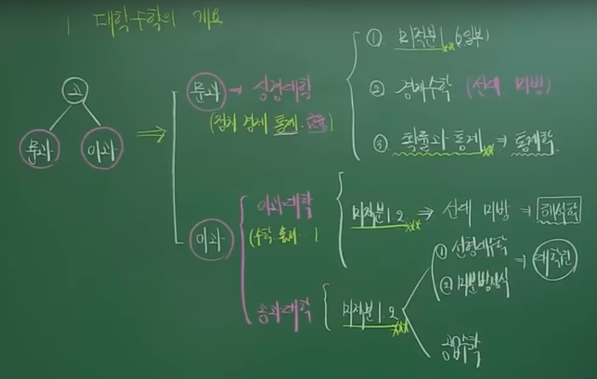

# 수학

## TODO

- [ ] 고등수학 복습
  - **기본적으로 고등수학 복습은 교과서로**
  - 자신만의 시간을 정해서 그 시간안에 개념을 완성하자
  - 마크다운 수식 넣는 법 숙지하기
  - [ ] 수학
  - [ ] 수학1
  - [ ] 수학2
  - [ ] 미적분
  - [ ] 확률과 통계
  - [ ] 기하
- [ ] 대학 수학
  - [ ] 미분적분학
  - [ ] 선형대수학
  - [ ] 공업수학

## 목표

- 수학적 사고력의 배양
  - 문제를 수학적으로 분석하는 능력 함양
- 논리적 사고력의 배양
  - 마음이 불편하지 않도록 논리적으로 설명 가능하도록
- 타 학문 습득의 지렛대로 활용
  - 수학은 많은 학문의 기초를 구성.
  - 특히 모델링을 수식으로 표현가능 하도록

## 공부법

- 매일 하자
- 포모도로 공부법 적용 하루에 적어도 2텀 정도
