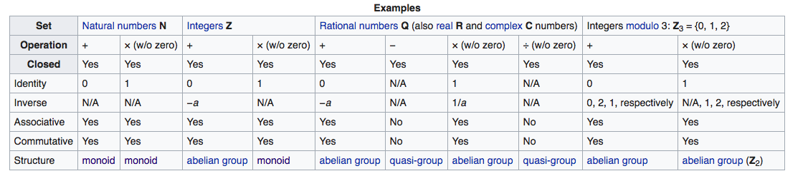

# 대(代)수학

## 정의

- 수학적 기호들과 이러한 수학적 기호들의 조작의 법칙에 대한 연구
- 산수(arithmetic)에서는 주어진 구체적인 숫자들만 가지고 연산을 할 수 있으나, 대수학에서는 알려지지 않거나, 많은 값을 갖는 경우를 간결하게 기호를 이용해서 표현할 수 있음
- 응용
  - 기초대수학은 어디에서나 쓰임
  - 공식을 작성하는 방법을 제공
  - 등식을 풀기 위해서 기존의 방법(모든 것을 단어로 표현하는 것)보다 훨씬 효율적인 방법 제공
- 범위
  - 기초적인 등식 풀이 부터, groups, rings, fields에 대한 개념까지 확장
  - 추상적인 부분은 추상대수학이라고 불림
- 예시
  - `x + 2 = 5`
    - x가 어떤 값을 갖는지 알지못해도 사용할 수 있음
  - `E = mc^2`
    - E, m은 변수들, c는 상수

## 수학으로서의 갈래

- 처음 시작은 산수의 계산과 유사하게(숫자를 나타내는 기호의 사용으로)
  - 16세기 이전까지는 수학은 오직 산수와 기하로만 이루어져 있었음
  - 16, 17세기로 들어와서 본격적으로 대수학이 처음으로 출현함
  - 추상 대수학은 19세기에 개발됨
- 현재 교육
  - 등식의 해를 찾는 것으로 도입 시작
  - 그 뒤에 보다 일반적인 질문들을 다룸
    - 해당 등식은 해가 존재하는가?
    - 얼마나 많은 해를 해당 등식은 갖는가?
    - 해의 특성에 대해서 무엇을 알 수 있는가?
  - 위의 질문들은 비 숫자적인 것들로 개념을 확장시켜줌
    - 순열 조합
    - 벡터
    - 행렬
    - 다항식
  - 이러한 비 숫자적인 것들은 groups, rings, fields와 같은 대수적 구조들로 추상화 되어짐

## 종류

### 기초 대수학

- 정의
  - 대수학의 가장 기초적인 형태
    - 산수지식을 배운 뒤에 기초 대수학을 공부
  - 기호를 사용한 수학
- 기호를 사용한 수학의 장점
  - 산술적 법칙의 일반적인 표현을 가능하게 함
    - `a + b = b + a`
  - 알려지지 않은 숫자를 참조할 수 있도록 함
    - `3x + 1 = 10`
  - 함수적인 관계를 표현할 수 있도록 함
    - `f(x) = 3x - 10`
- 다항식(polynomials)
  - 유한개의 0이 아닌 항들의 합인 식이며, 각각의 항은 상수와 유한한 숫자의 변수들의 임의의 차승으로 곱으로 구성됨
    - `x^2 + 2x - 3`
      - x변수 하나의 다항식
- polynomial expression
  - 덧셈과 곱셈의 교환법칙, 결합법칙, 분배법칙을 이용해서 다항식으로 다시 쓰여질 수 있는 식
    - `(x-1)(x+3)`
- 다항함수(polynomial function)
  - 다항식으로 정의된 함수
    - `f(x) = x^2 + 2 -3 = (x-1)(x+3)`
- 대수학의 중요한 관련 문제
  - 다항식의 인수분해
    - 어떠한 다항식을 인수분해 되지 않는 다항식의 곱으로 나타내는 것
    - 식의 근을 찾기 위해서 사용
  - 두 다항식의 최대공약수 구하기

### 추상 대수학

- 정의
  - 기초 대수학과 숫자의 연산을 보다 일반적인 개념으로 확장
- 기초적인 개념
  - 집합(sets)
    - 집합의 특성에 의해서 선택된 모든 개체들의 모임
    - 예시
      - 유사한 타입의 숫자들(실수, 유리수, 무리수)의 집합
      - 모든 2차 다항식의 집합(ax^2 + bx + c)
      - 평면위의 모든 2차 벡터들
  - 이진 연산(binary operations)
    - 해당 연산이 정의된 집합이 반드시 존재해야 함
    - 행렬, 벡터, 다항식의 연산들(+, -, x, /)역시 이진 연산에 포함
    - 클로저
      - 집합 S의 두 원소 a, b에 대해서, a * b는 집합 S의 또 다른 원소일 때, 이러한 조건을 클로저(closure, 닫혀있음)라고 한다.
  - 항등원(identity elements)
    - 일반적인 이진 연산 *에 대해서, 항등원 e는 다음을 반드시 만족 시켜야 함. `a * e = a and e * a = a`그리고 이 항등원은 유일해야 함
    - 항등원이 존재하지 않는 경우
      - 자연수의 집합의 경우 덧셈의 항등원이 존재하지 않음
  - 역원(inverse elements)
    - `a * a^-1 = e and a^-1 * a = e`를 만족하는 집합의 원소
  - 결합법칙(associativity)
    - 추상 연산에 있어서 숫자들의 grouping이 그 결과에 영향을 주지 않는 것을 말함
    - `(2 * 3) * 4 = 2 * (3 * 4)` 인 경우
    - 이진연산에서는 + 나 * 이 해당되나, - 나 / 는 해당되지 않는경우가 많음
  - 교환법칙(commutativity)
    - 추상 연산에 있어서 숫자의 계산 순사는 결과에 영향을 미치지 않을 경우를 말함
    - `a * b = b * a`
    - 행렬의 곱셈 등에는 성립하지 않음

#### 군(group)

*왜 이런 기준으로 군과 monoid같은 그룹을 나눈 것일까?*

- 정의
  - 위의 개념들을 결합하면 수학에서 가장 중요한 군이라는 구조가 나옴
  - 집합 S와 이진 연산 *의 조합과 다음과 같은 특성으로 정의됨
    - 항등원 e가 존재함
    - 모든 집합 S의 원소에 대해서 역원이 존재함
    - 연산은 결합법칙이 성립함
  - 위의 조건에다가 * 연산의 교환법칙 까지 성립하면 그 군은 abelian이라고 불림
  - 예시
    - 정수들의 집합은 덧셈 연산에 있어서 군이다.
    - 0이 없는 실수의 집합과 곱셈은 군을 이룸
    - 정수들이 집합은 곱셈 연산에 있어서 군을 이루지 **않음**
      - 역원이 정수가 아니기 때문
- 군 이론
  - 유한 단순 군들의 분류(30개의 기본적인 타입)
  - semi-group
    - 집합, 닫힌 이진 연산, 결합법칙 성립
    - 항등원 존재하지 않음
  - monoid
    - semi-group이고, 항등원은 존재하나, 역원이 존재하지 않음
    - *함수형 프로그래밍 개념(?!)*
  - quasi-group
    - 어떠한 집합 내의 다른 요소도 독자적인 left-multiplication이나 right-multiplication을 통해 변화시킬 수 있음
    - 이진 연산이 결합 법칙을 만족시키지 않음
  - **모든 군은 monoid 이며 모든 monoid는 semi-group 이다.**

#### 환과 필드(Rings and fields)

- 서로다른 숫자들의 타입의 행위를 설명하기 위해서, 그러한 두개의 연산자를 갖는 구조들을 연구되어야 함
- 환
  - 두개의 이진 연산 + 와 x 를 갖고, × 는 + 에 대하여 분배법칙이 성립함.
  - + 연산자에 대해서는 abelian 군을 이룸.
  - x 연산자에 대해서는 결합법칙은 성립하나 항등원 혹은 역원이 반드시 존재할 필요는 없으므로, divison은 필요하지 않음
  - 예시
    - 정수의 집합(integral domain)
- 필드
  - 환 + 0을 제외한 모든 원소가 x연산에서 abelian group임
  - 예시
    - 실수의 집합
