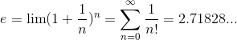

# 자연상수 e

## e의 공식

## e와 복리

- 1원의 돈을 1년동안 빌려주는데, 1년후 이자를 100%로 쳐준다
  - 1 + 1
- 1원의 돈을 1년동안 빌려주는데, 매 1일 후 이자가 복리로 늘어나는데 그 값이 100/365%로 쳐준다.
  - (1 + 1/365)^365
- 1원의 돈을 1년동안 빌려주는데, 매 n의 시간이 지난 후 이자가 복리로 늘어나면 1년뒤에 얻게 되는돈
  - (1 + 1/n)^n
