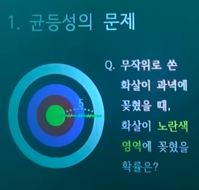
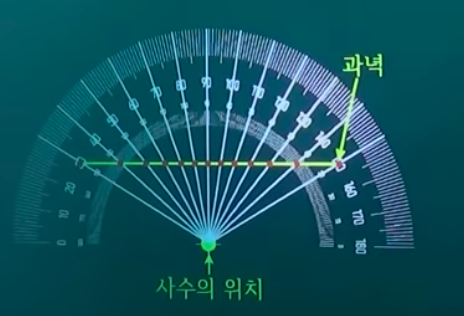
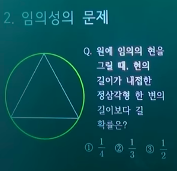
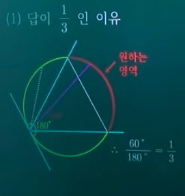
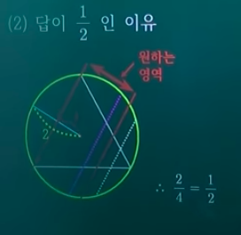

# 공리적 확률의 등장

- 의문
- 균등성의 문제
- 임의성의 문제

## 1. 균등성의 문제

- 사수의 문제
  - 사수가 과녁에 대해서, 발사각의 각마다 그 발사각으로 발사할 확률을 일정하게 해서 발사했을 경우 위의 문제의 해답은?
    - 답은 알 수 없음
      - 균등성
- 문제
  - 사수의 발사 위치에 따라서 각 과녁 area에 화살이 꽂힐 확률이 달라짐
    - 사수의 위치가 과녁과 가까워 질 수록 가운데에 꽂힐 확률이 증가
    - 확률은 현실 세계의 문제를 다루기 위해서 등장한 개념이므로, 결코 이를 간과할 수 없음

## 2. 임의성의 문제

- 베르트랑의 역설
  - 답은 모든 선택지가 될 수 있음
  - 답이 1/3인 이유
    - 두 점을 잡는 문제로 환원
  - 답이 1/2인 이유
    - 현을 고정한 문제로 환원
    - 원하는 영역/지름 길이
  - *답이 1/4인 이유*
    - 점을 잡는 문제로 환원
      - 어떠한 점을 잡으면 그 점을 현의 중점으로 갖는 현은 원 위에서 유일하므로 점을 잡는 문제로 환원 가능
    - 과제
      - 위의 과녁문제에서 임의의 점이란, 암묵적으로, 균등성이 보장된 점들 가운데에서 무작위로 하나를 택한다는 의미가 내포
      - 이 문제에서, 균등성이 보장된 임의의 선이란? 그것을 어떻게 구현할 것인지?
      - 임의의 면에 대해서는?
      - 임의의 입체도형에 대해서는?

**균등성과 임의성은 밀접한 관련이 있음**

## 3. 공리적 확률의 등장

- 공리적 확률
  - 개요
    - 콜모고로프
    - 확률론 + 해석학
      - 측도 개념 도입
    - 공리적 집합론의 등장과 비슷한 느낌
    - 확률론을 응용수학의 한 분야에서 순수 수학의 분야로 끌어옴
