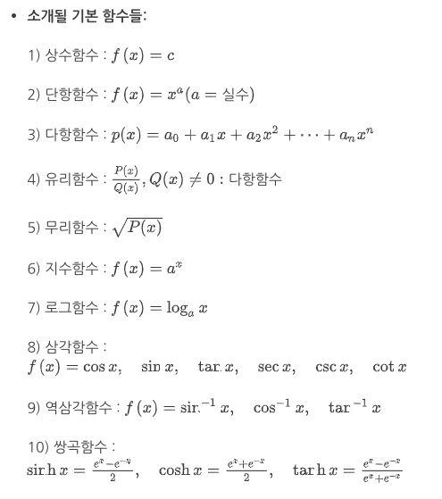

# 집합과 함수

## 용어 정리

- 집합
  - 수학적 적용이 가능한 명확한 조건을 충족하는 개체들의 모임
- 함수
  - 집합 간 원소들의 대응 규칙
- 함수의 종류
  - 예시
    - 상수함수
    - 항등함수
    - 단사함수
    - 전사함수
- 합성함수
  - 두 함수의 합성으로 정의된 새로운 함수
- 역함수
  - 주어진 함수의 역 방향 규칙으로 정의된 새로운 함수

## 기본 함수들

## 집합

- 집합
  - 수학적 적용이 가능한 명확한 조건을 충족하는 개체들의 모임
  - 집합의 예시
    - `A={x | 2 < x < 5, x: 자연수}`
    - `N, Q, P, R`
    - `R^2 = { (x, y) | x, y : 실수 }`
  - 집합이 아닌 것의 예시
    - `B={x | x: 키가 큰 사람}`
  - 공집합
    -
- 개구간
  - `(a, b) = { x, x는 실수집합의 원소 | a < x < b }`
  - `[a, b] = { x, x는 실수집합의 원소 | a <= x <= b }`
  - `[a, 무한대) = { x, x는 실수집합의 원소 | a <= x }`
