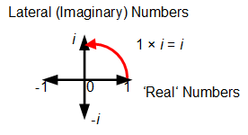

# 수학 용어의 중요성

- 올바른 용어의 중요성
- 본질과는 다소 거리가 있는 수학 용어들의 예
- 보다 바람직한 용어를 사용한다면

## 올바른 용어의 중요성

실생활에서 우리에게 용어는 정말 중요한 의미를 갖는다. 예를들어 우리가 곤충을 관한 이야기를 할 때, 나비라는 용어와 나방이라는 용어를 사용할 경우, 우리는 나비와 나방이 서로 비슷하지만 다르다는 것을 분명히 의식할 수 있다. 또한 나비와 나방의 각각의 특징을 한순간에 파악할 수 있다. 이처럼 사회 속에서의 용어는 어떠한 사상(事象)의 본질을 효과적으로 전달하는데에 훌륭한 도구가 된다. 이는, 학문의 세계에서도 예외가 아니다.

## 본질과는 다소 거리가 있는 수학 용어들의 예

하지만 수학의 세계에서는 용어가 되려 해당 용어의 본질을 파악하기 힘들게 만드는 경우가 존재하는데, 이는 다음과 같다.

- 기하학 vs geometry
- 삼각함수 vs 원함수(회전함수)
- 허수 vs lateral number

### 기하학 vs geometry

우리 말로 기하학은 영어로 geometry를 뜻한다. 기하학의 어원은 중국의 geometry에 대한 음차 한자를 그대로 한글로 음독한 것이다. 따라서 기하학이라는 말 자체는 geometry와 전혀 상관이 없다.

이와는 대조적으로 geometry는 그 단어의 합성을 살펴보면 geo + metry 로, 이는 토양 + 측정 에 해당한다. 즉, 토양을 측정하기 위한 학문이라는 것이다.

### 삼각함수 vs 원함수

우리가 아는 삼각함수라는 말은 한국의 교육과정과도 깊게 연관되어서, 삼각형의 삼각비로부터 파생된 이론처럼 느껴진다. 하지만 이는 사실이 아니다. 왜냐하면, 삼각형의 삼각비는 기본적으로 각이 90도를 넘거나 같을 때에는 분석할 수 없기 때문이다(이미 해당 각외의 나머지각이 90도). 이에 반하여 삼각함수에서는 1 ~ 90도 까지의 각 뿐 아니라 180도, 540도, -3도 등 다양한 각의 값을 취할 수 있다. 이는 삼각함수가 본래 이름에서 추측되는 삼각형과의 관계보다도 **단위 원** 과의 관계가 깊다는 것을 알 수 있다.

실제로 [삼각함수 - 위키피디아](https://en.wikipedia.org/wiki/Trigonometric_functions) 를 보면 삼각함수가 trigonometric function 뿐 아니라 circular function 으로도 불린다는 것을 알 수 있다.

여기에 사족을 더하자면 sin함수는 단위원 둘레 위의 한 점에 대해서 y축에 대한 변화를 기술하는 함수이고, cos함수는 단위원 둘레 위의 한 점에 대해서 x축에 대한 변화를 기술하는 함수이다.

### 허수 vs lateral number

허수는 영어로 번역하면 imaginary number로, 허구의 수 라는 의미이다. 이는 실수와 대비되는 개념임을 알 수 있다. 하지만, 허수라는 말 자체는 지나치게 추상적이다. 대신 가우스가 주장했던 lateral number가 보다 우리가 "허수"라고 부르는 수에 더 본질적인 의미에 가깝다고 볼 수 있다.

lateral의 뜻은 "측면의"이다. 즉, 측면의 수라는건데, 이는 어떠한 복소수에 i를 곱하면 x축을 실수축, y축을 허수축으로 두었을 경우 해당 수를 반시계방향으로 90도만큼 회전하는 것으로 되기 때문이다. i를 두번 곱하면 inverse, 즉 원래 방향인 direct로 부터 반대방향으로 되는 것이다. 따라서 이를 가우스는 lateral number라고 불렀다.

## 보다 바람직한 용어를 사용한다면

위의 예시를 다시 한 번 생각해보자. 만약 우리가 기하학 대신에 geometry에 대응하는 용어가 있다면 보다 측량에 관한 배경을 생각했을 것이고, 삼각함수 대신에 원함수라는 표현을 사용했다면, 우리는 삼각형이 아닌 원에 집중을 했을 것이며, 허수 대신에 lateral number라는 말을 사용했다면, 추상적인 허구의 수 라는 생각보다는 실제하는 lateral한 성질을 갖는 수라는 느낌을 갖게 되었을 것이다.

이처럼 상대적으로 본질에 가까운 용어를 사용하는 것이 사람들의 해당 용어에 대한 오해를 줄여줄 것이며, 사람들의 사고를 보다 본질에 가깝게 이끌 수 있다. 따라서 어떠한 상황에서도(예를들어 프로그래밍에서 변수의 명을 정하는 상황 등) 용어를 정하는 것에는 만전을 기울어야 할 것이다.
