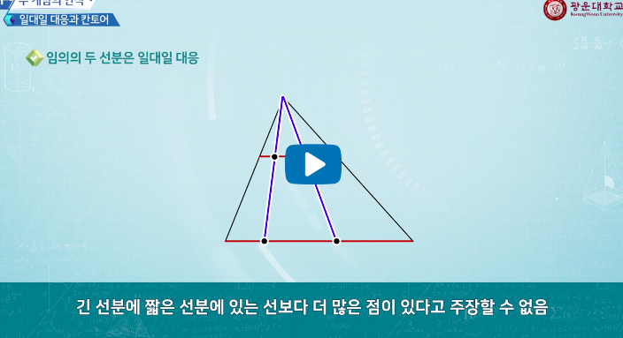

# 수의 기원

## 수 개념의 인식

옛 사람들은 어떻게 수 개념을 인식했는가

물건의 개수와 많고 적음을 어떻게 생각했는가

### **일대일 대응**

수와 셈의 개념을 탄생시킨 아주 중요한 개념

- 일대일 대응으로 수 개념 획득, 표현
  - 조약돌 - 양
  - 코코넛 - 막대기
  - 나이 - 목의 놋쇠 목걸이
  - 수를 세는 방법도, 표기하는 방법도 없었음

#### 몸을 이용한 수 표현

- 손가락 수
- 손가락, 귀, 눈, ... 그러한 것들을 가리키면서 수를 표현

#### 함수

- 함수
  - **두 집합사이의 대응**
- Function
  - 17세기의 수학자 라이프니츠가 처음 사용
  - 라틴말로 접선, 접선영, 법선 등을 가리키는 용어로 쓰임
- 함수를 지칭하는 다른 말
  - 확률 변수(random variable)
    - 어느 시행에서 표본 공간의 각 원소에 하나의 실수 값을 대응시키는 함수
  - 변환(transformation)
    - 선형 변환도 특별한 함수
    - 시각적 변환은 결국, 집합의 대응관계를 의미
  - 사상(map)
    - 함수

#### 일대일 대응과 칸토어

> 전체는 부분보다 크다는 유클리드의 공리는 유한집합 에서나 성립하는 것이지, 무한집합에서는 성립하지 않는다.

- 일대일 대응의 개념을 끝없는 모음(무한집합)에 적용
- 초한수(transfinite number) 이론 전개
  - 무한대에도 크기관계존재
- 자연수 전체의 모음 N과 제곱수 전체의 모음 S는 일대일 대응
- 힐베르트의 호텔

#### 칸토어

> 수학의 본질은 그 자유로움에 있다.

- ㅠㅠ..

## 기수법의 기원

### 기수법이란

- 수를 기록하는 방법
- 수 개념을 뼈, 돌에 긁어서 파악한 개수를 나타내는 것
