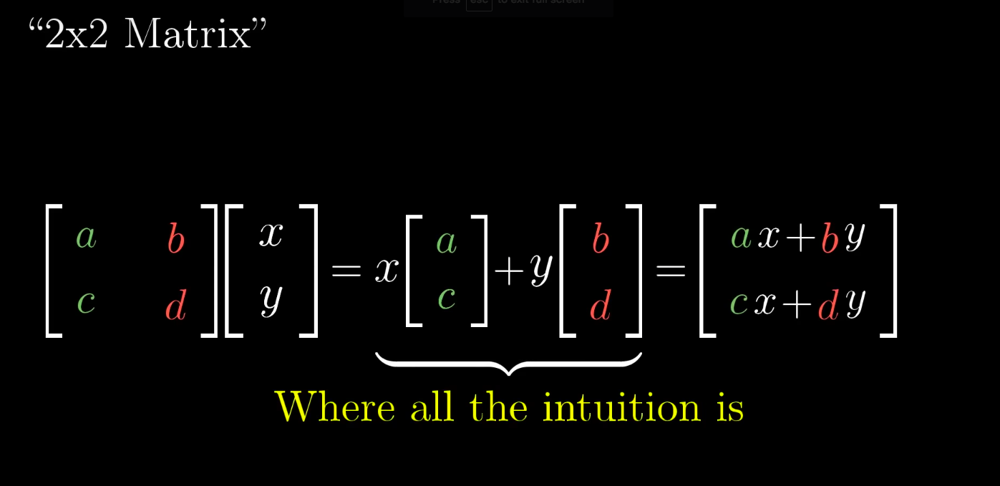
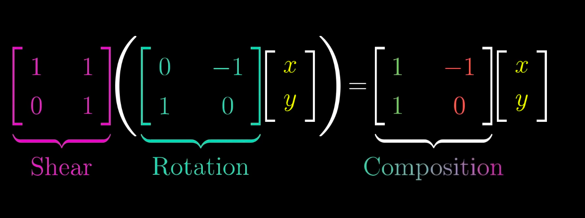

# 선형대수

선형대수(linear algebra)는 덧셈과 곱셈의 연산 후에 나타나는 변화와 구조에 더 많은 초점을 두고 있다. 선형대수는 행렬이론이나 벡터공간이론 등을 활용해 선형방정식의 해를 구하는 것을 핵심적으로 하고 있다. 즉, 행렬은 주어진 선형시스템 내에서 현상을 보다 효과적으로 표현 가능하도록 해주며, 벡터(vector)는 제한된 공간 안에서의 선형사상을 표현하는데 유용하게 사용된다. 여기에서 선형(線型)이란 자연과 사회에서 나타나는 현상들을 선형사상(linear map)으로 표현하고 이해하고자 하는 하나의 패러다임이다.

## 좋은 자료

- [3Blue1Brown - Essence of linear algebra](https://www.youtube.com/watch?v=fNk_zzaMoSs&list=PLZHQObOWTQDPD3MizzM2xVFitgF8hE_ab)

## Essence of linear algebra 정리

### 1. Vectors, what even are they?

- 벡터
  - 근본적인 선형대수의 구성조각
  - 크기(길이)와 방향을 가짐(숫자쌍)
    - 꼬리(원점)에서 시작한 벡터가 끝에 어떻게 다다를지를 알려줌
- 벡터에 대한 관점
  - 물리학
    - 공간을 가리키는 화살표
  - 컴퓨터 과학
    - 순서가 있는 숫자 리스트
  - 수학
    - 벡터의 합과 스칼라와의 곱셈과 같은 연산들 만족하면 추상적으로 전부 벡터라고 할 수 있음
      - ADT와 비슷한 느낌
  - 선형대수에서는 기본적으로는 원점에 꼬리를 둔 화살표라고 생각하자
- **벡터의 중심 연산(선형대수의 모든 주제는 이 두 중심 연산으로 귀결)**
  - 벡터합
  - 스칼라와의 곱
    - 스케일링

### 2. Linear combinations, span, and basis vectors

- 벡터를 바라보는 새로운 관점
  - 기존 관점
    - 크기와 방향을 갖는 화살표
    - 순서가 있는 숫자의 리스트
  - 새로운 관점
    - 각각의 좌표를 스칼라로 생각함
      - i-hat: x축의 단위벡터, 오른쪽 방향의 길이가 1인 벡터
      - j-hat: y축의 단위벡터, 위쪽 방향의 길이가 1인 벡터
    - 예시
      - (3, -2)
      - 3i + -2j
- 위의 i-hat, j-hat 둘을 xy좌표계(coordinate system)의 basis(기저)라고 함
- 기저를 바꾸면 완전히 새로운 좌표계가 탄생함
  - 수치로 벡터들을 표현할 때, 우리는 암묵적으로 특정 기저 벡터들을 선택한 상태임
- 선형 조합(linear combinations)
  - 두 벡터를 스케일링 하고 더하는 것
  - 선형 조합의 결과
    - xy평면의 모든 벡터를 나타낼 수 있음
    - 벡터의 끝이 원점을 통과하는 직선 위로 제한 됨
    - 벡터가 원점으로 고정됨
- 벡터의 확장 공간(span)
  - **오로지 두 가지 기본 연산(벡터 합 / 스케일링)을 가지고 도달 가능한 벡터들의 집합은 어떠한가?**
  - xy평면에서 주어진 두 벡터 쌍의 조합으로 나타날 수 있는 결과 벡터들의 집합
    - xy평면의 모든 벡터를 나타낼 수 있음
    - 벡터의 끝이 원점을 통과하는 직선 위로 제한 됨
    - 벡터가 원점으로 고정됨
  - 예시
    - 3차원 공간에서 서로 다른 방향을 가리키는 두 벡터의 span은 어떻게 될 것인가?
      - 3차원 상의 평면
    - 3차원 공간에서 서로 다른 방향을 가리키는 세 벡터의 span은 어떻게 될 것인가?
      - 마지막 벡터가 기존 두 벡터의 span 평면에 놓이지 않는 경우
        - 새로운 방향을 가리키게 되므로, 3차원 상의 공간을 나타냄
      - 마지막 벡터가 기존 두 벡터의 span 평면에 놓이는 경우
        - 선형 조합의 결과역시 기존의 span 평면에 놓이게 되므로, 기존 span 평면에 갇힘
      - 기존의 두 벡터의 span이 직선인 경우
        - 마지막 벡터가 해당 직선 span에 갇히는 경우
          - 해당 직선 span에 갇힘
        - 마지막 벡터가 해당 직선 span에 갇히지 않는 경우
          - span 평면을 생성
- 선형 종속(linear dependent)
  - span의 축소 없이 하나 이상의 벡터를 제외시켜도 되는 경우 그러한 벡터의 집합을 선형 종속이라고 함 == 벡터들 중 하나가 다른 벡터들의 선형조합으로 표현 가능한 경우
- 선형 독립(linear independent)
  - 각각의 벡터가 기존 span에 또 다른 차원을 추가해주는 게 가능한 경우, 그러한 벡터의 집합을 선형 독립적이라고 함
- 기저(basis)
  - full space를 span하는 선형 독립적인 벡터들의 집합
    - **Question: 이 정의는 왜 맞는 말인가?**

### 3. Linear transformations and matrices

Unfortunately, no one can be told what the Matrix is. You have to see it for yourself. - Morpheus

- 선형 변환(linear transformation)
  - 선형대수에서는 특수한 형태의 변환으로만 제한
  - **선형 변환**
  - 변환
    - 근본적으로 함수의 다른 말
    - 입력을 받고 결과물을 반환하는 그 무엇
    - **특정 벡터를 입력받아 다른 벡터를 반환하는 변환**
  - 왜 "변환"인가
    - 입력 - 출력 관계를 시각화하는 특정 방법을 암시
    - 벡터 함수를 이해하는 가장 좋은 방법은 움직임으로 이해하는 것
- 변환의 선형성
  - 모든 선들은 변환 이후에도 휘지 않고 직선이어야 함
  - 원점은 변환 이후에도 원점을 유지해야 함
    - 선형변환이라면 격자 라인들이 변형 이후에도 여전히 **평행** 하고 **동일한 간격** 으로 있어야 함
- 변환을 어떻게 수학적으로 표현하는 법
  - 기저벡터 (i-hat, j-hat)이 어떻게 변화하는지만 알면 됨
  - 예시
    - (-1, 2) = `-1i + 2j`
    - 위의 선형조합은 변환후에도 유지됨. 그래서, 기저 벡터의 변화(`i, j`)만 반영하면 됨
  - 2차원의 선형 변환은 4개의 숫자로 설명 가능
    - 2 x 2 행렬
    - **이 행렬이 변환을 설명하는 언어를 제공**
  - 선형 변환
    - 어떤 벡터든 기저 벡터의 선형 조합으로 표현이 가능
    - 선형 변환은 위의 선형 조합을 유지하므로, 기저 벡터의 변환만 생각해서 기존의 선형 조합을 계산
    - 변환된 벡터의 결과가 나옴
  - 만일, i-hat, j-hat의 변형의 결과가 선형 종속이면, 2차원 공간을 수축(squish)시켜, 두 벡터가 놓여있는 선으로 만듬(1차원 span)

형렬은 공간의 어떤 변환으로 생각

### 4. Matrix multiplication as composition

- 선형변환을 하고 또 선형변환을 하는 경우
  - 예시
    - 회전변환 후 shear
  - 기저를 이용한 선형변환의 구성을 기술 가능
    - 이는 연속적인 변환의 process를 무시하고 연속적인 변환의 결과만 나타냄
- 행렬의 곱
  - **한 선형 변환을 적용하고 나서 다른 선형 변환을 적용한 것과 같음**
  - 연속적인 선형 변환은 오른쪽에서 왼쪽으로 읽어나가야 함
    - 함수의 합성에서 유래
- 예제
  - 두 행렬을 곱하는 순서는 중요한가?
    - 행렬의 곱을 선형 변환을 적용하고 나서 다른 선형 변환을 적용한 것과 같다고 생각하면 알기 쉬움
  - 행렬곱의 결합법칙 증명
    - `(AB)C = A(BC)`
      - 왼쪽: C변환을 적용한 뒤에, B변환, A변환을 적용
      - 오른쪽: C변환을 적용한 뒤에, B변환, A변환을 적용
      - 다를게 없음

**행렬의 곱이 벡터에 대해서 한 선형 변환을 적용하고 나서 다른 선형 변환을 적용한 것과 같다고 의식하자**

### 5. Three-dimensional linear transformations

### 6. The determinant
