# 1 행렬과 행렬식

- 의문
- 행렬
  - 용어정리
  - 행렬의 연산
- 연립일차방정식
  - 행렬의 표현
  - 가우스 조던 소거법
  - 역행렬 이용
- 행렬식
  - 행렬식이란?
  - 역행렬
  - 크래머 공식
- 연습문제

> 직접 손으로 구해보면서 계산의 심오함을 느껴보자. 증명도 해보자 `det(AE) = det(A) * det(E)`

## 의문

- *역행렬을 구할 때, `A * adj(A) = det(A) * In`이 되는데, `det(A)`는 이해가 되나, 우변 행렬의 주대각성분이 아닌 나머지 성분들이 왜 값이 0이 되는가? 증명*

## 1. 행렬

대수 구조 -> 행렬
대수 구조에 대한 연산 -> 행렬의 연산

### 1.1 용어정리

- 성분(component, entry)
  - 행렬 안에 배열된 구성원(=항=원소)
  - `Aij`
- 행(row)
  - 행렬의 가로줄
- 열(column)
  - 행렬의 세로줄
- m x n 행렬(m by n 행렬)
  - m개의 행과 n개의 열로 이루어진 행렬
  - `(aij)mxn`
- 주대각선
  - 행렬의 왼쪽 위에서 오른쪽 아래를 가르는 선
- 대각성분
  - 주대각선에 걸치는, 행과 열의 지표수가 같은 성분
  - `(i,i)`성분
    - c.f) 대각행렬
- 영행렬
  - 모든 성분이 0인 행렬
- 전치행렬(Transposed matrix)
  - `(aij)`에 대하여 `(aji)`
- 대칭행렬(Symmetric matrix)
  - `A = A^T`인 `A`
- 정사각행렬(Square matrix)
  - 행, 열의 개수가 같은 행렬
- 단위행렬(Identity matrix)
  - 모든 대각성분이 1이고, 그 외의 성분은 0인 정사각행렬
  - `Inxn` or `In`

### 1.2 행렬의 연산

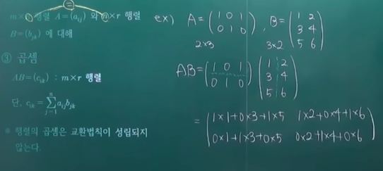

- mxn 행렬 `A=(aij), B=(bij)`에 대해
  - 덧셈과 뺄셈
    - `A+B = (aij + bij)`
  - 상수배
    - 상수 c에 대해 `cA=(c*aij)`
  - 곱셈
    - m x n 행렬 `A=(aij)`와 n x r 행렬 `B=(bjk)`에 대해
    - `AB=(cik)` : m x r 행렬
      - 단 `cjk = sigma(aij)(bjk)`
    - 행렬의 곱셈은 교환법칙이 성립되지 않는다.
    - 행렬의 곱
      - 합성함수와 마찬가지
        - `f(x,y) = (ax+by, cx+dy), g(x,y) = (px+qy, rx+sy)`
        - `=> f・g = ((ap+br)x+(aq+bs)y, (cp+dr)x+(cq+ds)y)`

## 2. 연립일차방정식

행렬이 처음 등장한 계기

### 2.1 행렬의 표현

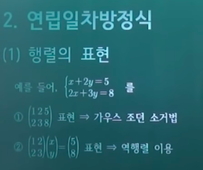

- 위의 연립 일차 방정식의 표현
  - 가우스 조던 소거법
    - 첨가행렬
  - 역행렬 이용
    - 계수행렬, 상수행렬

### 2.2 가우스 조던 소거법(연립 일차방정식의 해 구하기1)

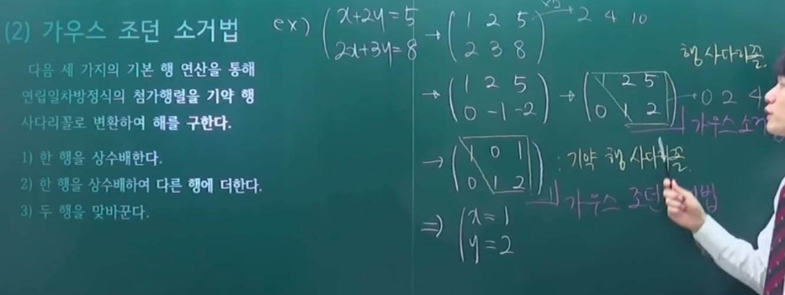

- 개요
  - 다음 세 가지의 기본 행 연산을 통해 연립일차방정식의 첨가행렬을 기약 행 사다리꼴로 변환하여 행을 구함
- 원칙
  - 보다 간단한 행렬로 변환
    - 성분들을 0으로 많이 만들어줌
  - 처음 주어진 연립일차방정식의 해와 연산결과의 해와 같아야 함
- 기본 행 연산
  - 한 행을 상수배한다.
  - 한 행을 상수배하여 다른 행에 더한다.
  - 두 행을 맞바꾼다.
- 가우스 소거법
  - 행 사다리꼴을 만드는 절차
    - 주 대각 성분을 모두 1로 만들어주고, 주 대각 성분 아랫 부분을 0으로 만든 행렬
- 가우스 조던 소거법
  - 기약 행사다리꼴을 만드는 절차
    - 주 대각 성분을 모두 1로 만들어주고, 나머지 마지막 열의 성분들을 제외한 모든 성분이 0인 행렬
    - 해가 무수히 많아서 공통변수가 존재하게 되면, 공통 변수를 t로 매개변수로 두고 나머지 변수의 값을 정해줌
      - 부정형(무수히 많은 해)
- 장점
  - 컴퓨터 알고리즘에서 유용하게 활용
  - 다항식 보간법, 역행렬 구하는데에도 활용

### 2.3 역행렬 이용(연립 일차방정식의 해 구하기2)

- 개요
  - 연립일차방정식 `AX=B`에서 A의 역행렬 A^-1가 존재하면, `X=A^-1B`이다.

## 3. 행렬식

역행렬의 조사

### 3.1 행렬식이란?

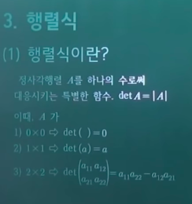

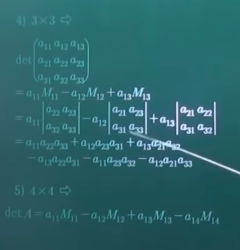

- 개요
  - 정사각행렬 A를 하나의 소러써 대응시키는 특별한 함수, `det(A) = |A|`
    - 이때 A가
      - 0 x 0 => `det() = 0`
      - 1 x 1 => `det(a) = a`
      - 2 x 2 => `ad-bc`
- 역사
  - 행렬의 존재 전부터 존재하던 개념
  - 행렬식의 정확한 개념은 대칭군이라는 개념을 알아야 함
- 계산법
  - 용어
    - `Mij`
      - i행 j열을 제외한 나머지 행렬의 행렬식
    - `Cij`
      - `(-1)^(i+j) * Mij`
  - 계산하기 편한 행이나 열을 기준으로 1자로 `aij * Cij` 값을 더해주면 됨
    - 최종 전개식을 만드는 방법이 다양함
  - 아래 그림 참고
  - 사루스 법칙(전개)

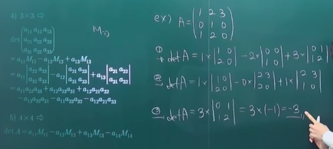

### 3.2 역행렬

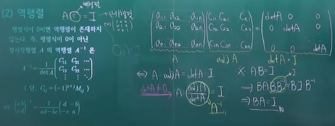

- 개요
  - 행렬식이 0이면 역행렬이 존재하지 않는다. 행렬식이 0이 아닌 정사각 행렬 `A`의 역행렬 `A^-1`은 위의 그림 참고
- 구하는 방법
  - 행렬식
  - 수반행렬(adjoint matrix)

### 3.3 크래머 공식

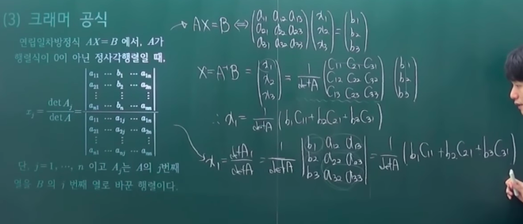

- 개요
  - 행렬 X의 특정 성분을 알고 싶은 경우에, 역행렬을 전부 구해서 구하는 법이 아닌, 특정 성분만 구하는 방법

### 3.4 기본행렬과 `det(A^-1) = 1/det(A)`의 증명

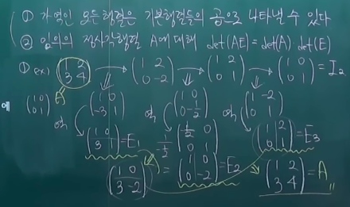

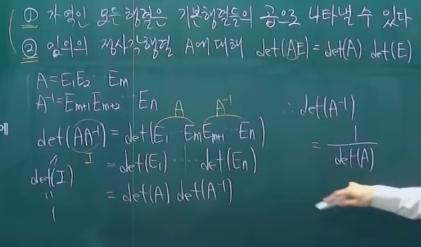

- 기본행렬 E
  - 단위행렬에 기본행연산을 1번만 실행한 행렬
- 정리
  - 가역인(역행열이 존재하는) 모든 행렬은 기본행렬들의 곱으로 나타낼 수 있다.
  - 임의의 정사각행렬 A에 대해 `det(AE) = det(A) * det(E)`
    - E는 기본행렬

## 연습문제

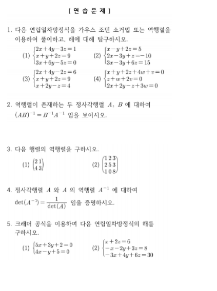
