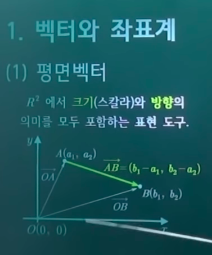
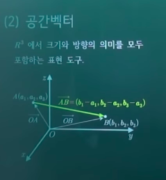
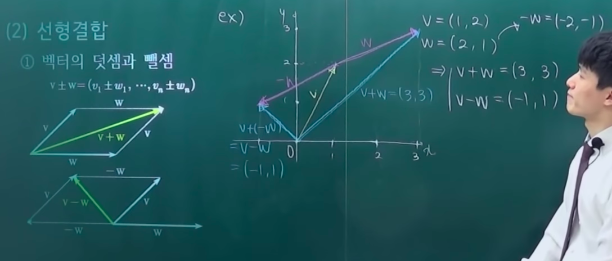
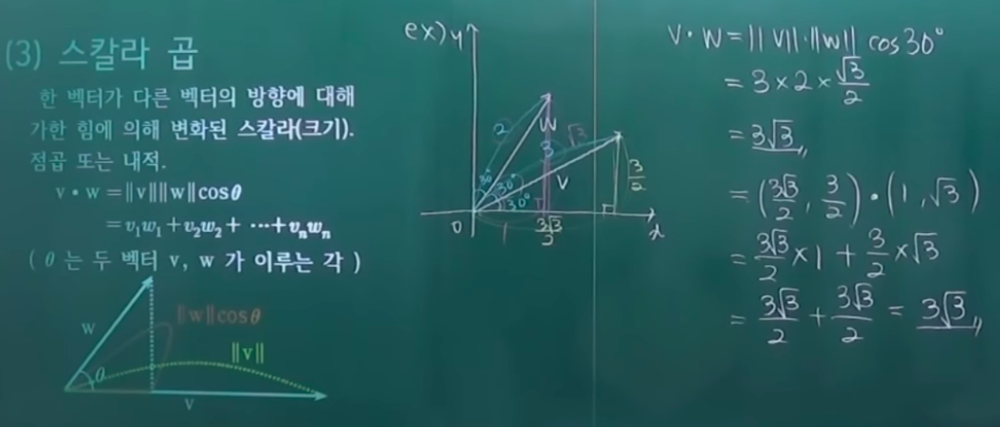
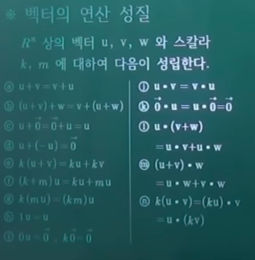
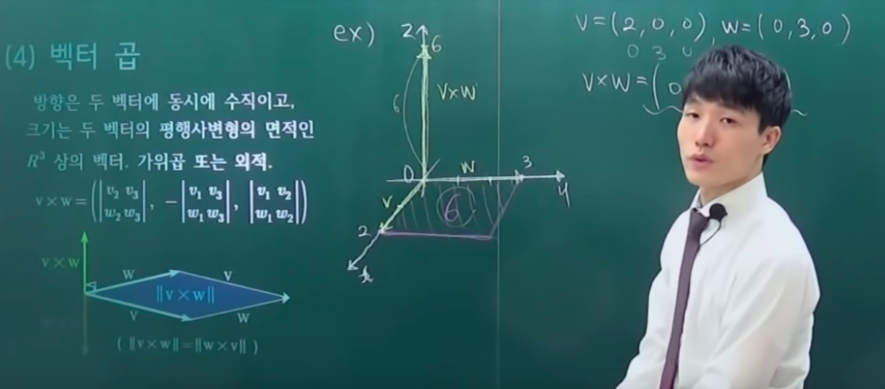
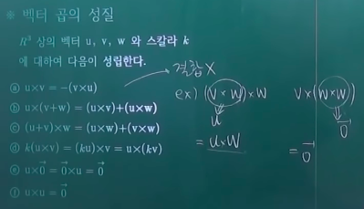
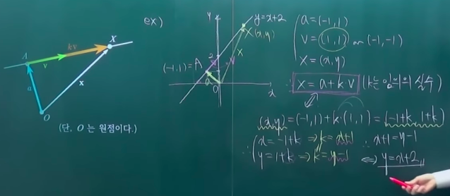
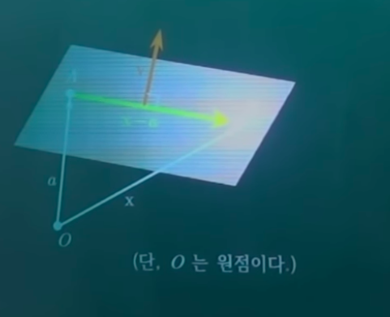
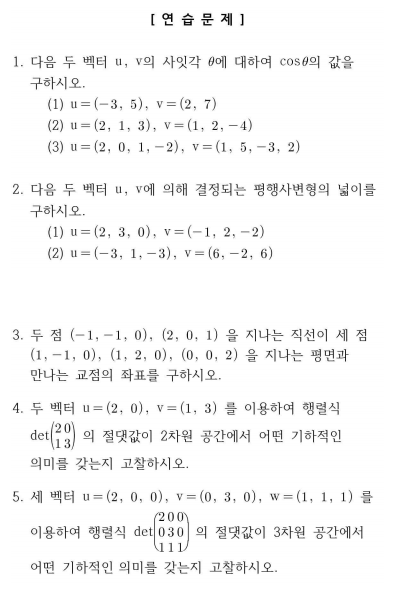

# 2. 물리적 벡터

- 의문
- 벡터와 좌표계
  - 평면벡터
  - 공간벡터
  - n차원 벡터
- 벡터의 연산
  - 노름
  - 선형결합
  - 스칼라 곱
  - 벡터 곱
- 벡터의 응용
  - 직선의 표현
  - 평면의 표현
- 연습문제

## 의문

- 구체적으로 벡터의 정의는?
  - 물리학적 벡터
    - 크기와 방향을 갖는 표현도구
  - 수학적 벡터
    - 벡터 공간(특정 조건을 만족하는 집합)의 원소
      - 벡터 공간도 수학적 정의가 있음
      - 집합인데, 수 집합은 아니고, 수집합과 관계는 잘 정의되어 있는 집합이고 그 원소가 벡터
    - 정의 방식이 컴퓨터 공학의 Abstract Data Type과 유사
      - e.g
        - stack은 pop, front, push, size 등의 연산이 있는 데이터 타입을 말함
- *벡터의 가위곱이 ||v x w|| = v와 w사이의 평행사변형의 넓이 가 되는 이유*

## 1. 벡터와 좌표계

원래는 물체의 속도라는 개념을 다루기 위해서 나온 개념

### 1-1 평면벡터

- 개요
  - `R^2`에서 **크기(스칼라)** 와 **방향** 의 의미를 모두 포함하는 표현 도구
  - 표현
    - 순서쌍으로 표현하나, 일반적인 점이 아님을 명확히 해야 함
      - `(x의 변화량, y의 변화량)`

### 1-2 공간벡터

- 개요
  - `R^3`에서 **크기** 와 **방향** 의 의미를 모두 포함하는 표현 도구
  - 표현
    - `(x의 변화량, y의 변화량, z의 변화량)`

### 1-3 n차원 벡터

- 개요
  - `R^n` 상의 벡터 `v=(v1, v2, ..., vn)`
    - `AB = (b1-a1, b2-a2, ..., bn-an)`
- 영벡터
  - `0 = 0 = (0, 0, ..., 0)`
- 두 벡터 v(v1, ..., vn), w(w1, ..., wn)가 같다의 정의(동치관계의 정의)
  - `v = w <=> v1 = w1, v2 = w2, ..., vn = wn`

## 2. 벡터의 연산

### 2-1 노름(크기 - norm)

- 노름
  - 벡터의 크기(또는 길이) 라고도 함
    - `||v|| = root(v1^2 + v2^2 + ... + vn^2)`
  - 하지만 n차원 공간으로 확장이 되면 길이라고 하기에는 애매해지며, 그래서 노름이라고 함
- 단위벡터
  - 노름이 1인 벡터
  - 정규화
    - 단위벡터를 만들어주는 방법
    - `v / ||v|| = v^`
- 표준단위벡터
  - 단위벡터 집합에 포함됨
  - `e1 = (1, 0, ..., 0)`
  - `e2 = (0, 1, ..., 0)`
  - `v = (v1, v2, ..., vn)`
    - `= v1e1 + v2e2 + ... + vnen`

### 2-2 선형결합(linear combination)

- 선형결합
  - 벡터의 덧셈과 뺄셈
    - `v ± w = (v1 ± w1, ..., vn ± wn)`
- 선형
  - 의미
    - 연산의 결과가 충분히 예측가능한 연산
  - 조언
    - 너무 직선의 외형적인 특징에 사고가 함몰되지 않았으면 함
- 벡터의 실수배
  - `kv = (kv1, kv2, ..., kvn)`
- 선형(일차)결합
  - `R^n`의 벡터 `w`가 임의의 실수 `k1, k2, ..., kr`에 대하여 `w =  k1v1 + k2v2 + ... + krvr` 의 형태로 쓰여지면, `w`를 `v1, ..., vr`의 선형(일차)결합이라 한다.
    - 계수(coefficient)
      - 위의 식의 `k1, k2, ..., kr`

### 2-3 스칼라 곱(곱셈의 결과로서 스칼라를 얻어냄)

- 스칼라 곱(dot(inner) product)
  - 개요
    - 한 벡터가 다른 벡터의 방향에 대해 가한 힘(?)에 의해 변화된 스칼라(크기)
      - 점곱 또는 내적 이라 불림
    - `v・w = ||v|| ||w|| cosθ = v1w1 + v2w2 + ... + vnwn`
      - θ는 두 벡터 v, w가 이루는 각
      - 제2코사인 법칙으로 증명 가능
  - 성질
    - 닫혀있지 않음

---

- 벡터의 연산 성질
  - `R^n`상의 벡터 `u, v, w`와 스칼라 `k, m`에 대하여 다음이 성립
    - 스칼라곱의 결합법칙은 논의가 무의미하기 때문에 나와있지 않음

### 2-4 벡터 곱(곱셈의 결과로서 벡터를 얻어냄)

- 벡터 곱
  - 개요
    - 방향은 두 벡터에 동시에 수직이고, 크기는 두 벡터의 평행사변형의 면적인 `R^3`상의 벡터, 가위곱 또는 외적(이 명칭은 지양하자 - 텐서곱이 외적에 적절함)
      - **R^3 에서만 정의**
    - 방향은 앙페르의 오른손 법칙을 이용하면 됨
      - 원래 오른손 법칙이 벡터 곱에서 나옴
  - 성질
    - 닫혀있음
    - `R^3` 상의 벡터 `u, v, w`와 스칼라 `k`에 대하여 다음이 성립한다.
      - 결합법칙 성립하지 않음

## 3. 벡터의 응용

### 3-1 직선의 표현

- 직선의 표현
  - `R^2` 또는 `R^3` 에서 위치벡터(원점을 시점으로 하는 벡터)가 a인 점 A 를 지나며 방향벡터(직선이 늘어나는 방향을 지시하는 벡터)가 v인 직선상의 임의의 점 X의 위치벡터 x는 `x = a + kv`를 만족한다.(k는 임의의 실수)
    - 4차원공간 부터는 직선 이라는 개념도 애매해짐
  - 방향벡터는 그 수치 자체가 중요한것이 아니므로(어차피 k배 할 것이기 때문에) 약분이 가능
    - 방향벡터는 변화량의 상대적 크기만 중요(기울기)

### 3-2 평면의 표현

- 평면의 표현
  - `R^3`에서 위치벡터가 a인 점 A 를 지나며 법선벡터(평면에 수직인 벡터)가 v인 평면상의 임의의 점 `X`의 위치벡터 `x`는 `(x-a)・v = 0`을 만족한다.
    - 평면의 법선벡터는 평면상의 서로 다른 두 직선의 방향 벡터들의 벡터 곱으로써 구하면 용이

## 연습문제

